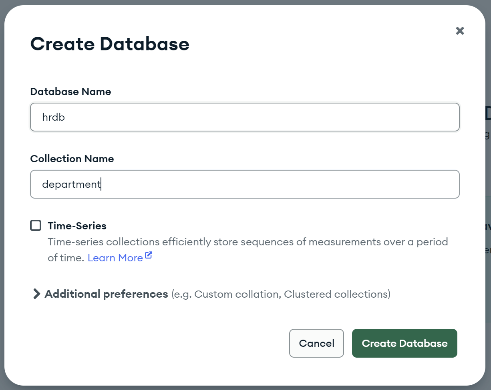
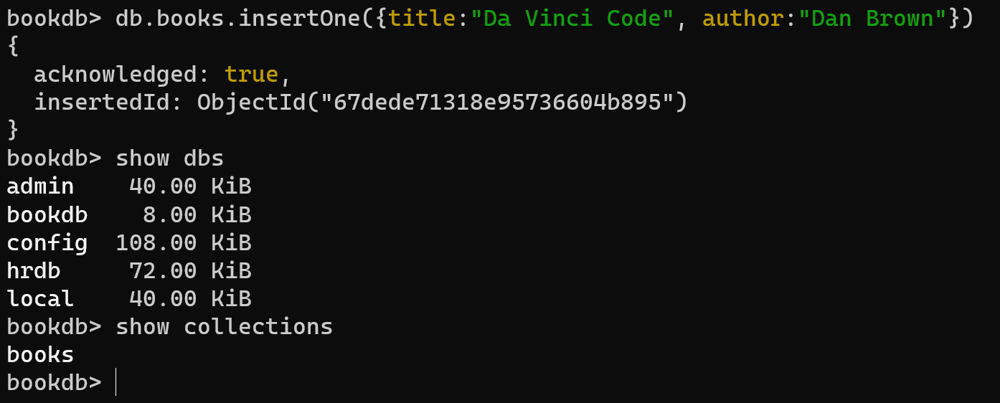

## GETTING STARTED WITH DATABASE

## Understanding Data
### Data in Applications

- Data in applications refers to the information the application utilizes to function
correctly.
- In an e-commerce backend application, examples of data include users,
products, cart items, and orders.
- Applications like Facebook, Twitter, and WhatsApp also handle various types
of data, such as user data, posts, comments, pictures, videos, etc.

### Importance of Data Management
- Data is the main asset of any application, and without it, the application is
rendered useless.
- Currently, the application uses in-memory storage, leading to data loss upon
server restarts.
- To avoid data loss, a persistent storage solution is required.

### Need for Persistent Storage
1. Persistent storage ensures that data remains intact even after the server
restarts.
2. Persistent storage prevents data loss and maintains the application's
functionality and usability.
3. File systems can provide persistent storage but may need to be more efficient
for handling complex data operations.
4. Persistent storage stands as a foundational pillar in data management,
guaranteeing the preservation of data integrity even in the face of server
restarts or system failures. This resilient storage approach is pivotal in
averting data loss, ensuring uninterrupted application functionality, and
sustaining the usability of vital information.

### Challenges with File Systems
- While file systems offer persistent storage, they are not optimised for data
manipulation operations.
- Managing data with file systems can become difficult for applications with
large amounts of data (e.g., Facebook, Google, LinkedIn).

### Introduction to Databases
- Databases are tools that provide persistent storage and enable efficient data
manipulation operations.
- A database allows users to effectively create, read, update, and delete data
(CRUD operations).
- Retrieving data from databases efficiently is crucial for populating user profiles
or timelines.

### Significance of Databases
- Applications like Facebook heavily rely on databases as their primary tool for
managing and storing data.
- Losing user data for such companies would mean losing their entire wealth
and value.

## Understanding Databases
A database is a software tool that stores and manages data for applications.
Applications communicate with databases to store, retrieve, and perform operations
on data. Different types of databases exist, depending on the nature of the
application's data.

### Relational Databases
1. Relational databases store data in tabular format (rows and columns), similar
to spreadsheets.
2. Data is structured with a defined schema, specifying the columns and their
data types.
3. Primary keys (unique identifiers) and foreign keys establish relationships
between tables.
4. Relationships allow data from different tables to be linked and related to each
other.
5. Relational databases are suited for applications with structured and
predictable data.

### NoSQL Databases
1. NoSQL databases are schemaless, allowing flexibility in storing unstructured
or unpredictable data.
2. Data is stored in JSON-like format, allowing nested structures within
documents.
4. NoSQL databases are ideal for applications with varying and unpredictable
data attributes.
4. They offer more straightforward and efficient data retrieval, especially for
nested data.

### Differences between Relational and NoSQL Databases

### Popular Database Types
- Popular relational databases include MySQL, PostgreSQL, and SQL Server.
- Popular NoSQL databases include MongoDB, DynamoDB, and CosDB.
- Cloud platforms like AWS and Azure also offer databases as a service.

#### Characteristics that make each of these databases popular choices.
Popular relational databases like MySQL, PostgreSQL, and SQL Server are favored
for their structured data model, ACID compliance, and strong consistency, making
them ideal for applications requiring strict data integrity.

In contrast, MongoDB, DynamoDB, and CosDB are prominent NoSQL databases
celebrated for their flexibility, scalability, and ability to handle unstructured or
semi-structured data efficiently, catering to modern applications' diverse data
requirements.

Cloud platforms such as AWS and Azure further provide managed database
services, streamlining deployment and management tasks for various database
systems.

## Installing MongoDB and MongoDB Compass
1. MongoDB Installation on macOS:
    - MongoDB is a popular NoSQL database we are going to learn in depth.
    - To install MongoDB on macOS, visit the official MongoDB website. [Link](https://www.mongodb.com/docs/manual/tutorial/install-mongodb-on-os-x/)
    - MongoDB offers both a paid enterprise version and a free community
version.
    - The community version is suitable for learning purposes, and it can be
installed using Homebrew.

2. Steps to Install MongoDB Community Edition:
    - MongoDB may need Xcode and command line tools to be installed, so execute the prerequisite command if necessary
    

    - Ensure Homebrew is installed, a package manager for macOS. [Link](https://brew.sh/#install)
    - Tap MongoDB Homebrew to download the official formula for MongoDB.
    

    - Update Homebrew and existing formulas.
    - Install MongoDB Community Edition (version 6.0 or any desired version).
    - MongoDB will start running, and you can verify the installation using the "mongo version" command.

3. Installing MongoDB Compass:
    - MongoDB Compass is a UI tool for MongoDB management provided by
MongoDB.
    - Download MongoDB Compass from the official website and install it. [Link](https://www.mongodb.com/docs/compass/current/install/)
    - Once installed, open MongoDB Compass to connect to the MongoDB
database.
    - MongoDB Compass allows you to visualise the data stored in the database
and perform various operations.

4. MongoDB Compass UI:
    - MongoDB Compass provides a GUI to interact with MongoDB databases.
    - After connecting to the MongoDB database, you can view existing databases.
    - By default, there are three prebuilt databases: admin, config, and local.
    - Users can create their databases, store documents, and manage collections.
    

## Documents and Collection in MongoDB
### MongoDB Data Structure
- In MongoDB, data is organized in collections and documents.
- A collection is similar to a table in a relational database.
- Each collection contains multiple documents, which are equivalent to rows in
a table.
- Documents are stored in JSON format, providing flexibility in data structure.

### Creating a Database and Collection
- MongoDB Compass allows the visual management of databases and
collections.
- To create a new database, click on the plus button (+) and enter the database
name (e.g., "HRDB").

- Inside the database, a collection can be created (e.g., "department").

- Collections can store multiple documents with various attributes.

### Inserting Documents
- Documents are inserted manually using the "Insert Document" option

- MongoDB automatically assigns a unique ID to each document.

- Documents can have attributes, and their structure can vary across
documents.
- MongoDB provides flexibility to store attributes specific to individual
documents.

### Nested JSON Documents
- MongoDB allows the creation of nested JSON documents.
- For example, a document can contain a nested object with subattributes.
    
    
- This flexibility is suitable for applications requiring varying data structures.

### CRUD Operations:
- CRUD stands for Create, Read, Update, and Delete operations.
- These operations are essential for interacting with the database.
- While MongoDB Compass provides a user-friendly UI for CRUD operations,
developers need to learn MongoDB commands for programmatic interactions.

### Performing CRUD Operations Using Commands
- Understanding MongoDB commands is crucial for Node.js applications to
interact with MongoDB databases programmatically.

### Application of MongoDB in RealWorld Scenarios
- Real-world applications often use a combination of databases, including both
relational and NoSQL databases.
- Each database type serves specific purposes based on the application's
needs.
- MongoDB's flexibility makes it suitable for applications where data structures
may vary unpredictably.

## Documents CRUD in MongoDB
Performing CRUD operations using MongoDB commands for programmatic
interactions. The MongoSH shell command line tool will be used to execute
MongoDB commands.

### Connecting to MongoDB
- The `mongosh` command is executed from the MongoDB installation directory
(user/local/bin on macOS, Program Files on Windows).
- MongoSH connects to the MongoDB server and displays version details.

### Creating a Database and Collection
- The command `use <database_name>` creates a new database or switches to
an existing one (e.g., "use bookDB").
- Newly created databases take time to be visible; they require collections or
documents to be present.

### Inserting Documents
- The "insertOne" command inserts a single document into a collection.
- Documents are represented as JSON objects.
- MongoDB automatically generates the unique "_id" field and is globally
unique.

- Multiple documents can be inserted using the "insertMany" command with an
array of JSON objects.

- MongoDB compass view:

### Viewing Documents
- The "find" command returns all documents in a collection.

- To find specific documents based on conditions, use "find" with a query (e.g.,
"find({ year: 1951 })").

- "findOne" returns only one matching document, while "find" returns all
matching documents [Note: An additional copy of the same book has been inserted into the 'books' collection, i.e. {title: 'The Catcher in the Rye', author: 'J.D. Salinger', year: 1951}]

### Update Operations
- Update operations can be performed using "updateOne" and "updateMany"
commands.
- The "updateOne" function takes a filter to find the document and an update to
specify the attributes to modify.

- The "updateMany" function updates multiple documents based on the
provided filter.

### Delete Operations
- Delete operations can be performed using "deleteOne" and "deleteMany"
commands.
- The "deleteOne" function deletes a single document based on the provided
filter.

- The "deleteMany" function deletes multiple documents based on the filter

## Summarising it
Let’s summarise what we have learned in this module:
- Introduction to MongoDB, a NoSQL database, its key features, and
how it differs from traditional relational databases.
- Step-by-step guide on installing MongoDB on macOS and Windows
and setting up MongoDB Compass, a UI tool for visualisation.
- Understanding MongoDB's data structure, with documents representing
records and collections acting as tables in a relational database.
- Creating a database and collections in MongoDB using MongoDB
Compass and learning about the database hierarchy.
- Adding data to MongoDB collections using the UI tool MongoDB
Compass and learning about document insertion.
- Performing CRUD operations in MongoDB using the UI tool,
understanding filtering and finding documents based on conditions.
- Learning about MongoDB operators, such as limit and other conditional
operators for querying data.
- Performing update and delete operations on MongoDB documents.
- Further exploration of CRUD operations with MongoDB commands,
understanding update and delete operations in depth.

### Some Additional Resources:
[NoSQL vs. SQL Databases](https://www.mongodb.com/resources/basics/databases/nosql-explained/nosql-vs-sql)

[MongoDB CRUD Operations](https://www.mongodb.com/resources/products/fundamentals/crud)