## MONGODB WITH NODEJS PART-I

## MongoDB Driver


The MongoDB driver is a crucial link between your Node.js application and the
MongoDB database.

### Installation of MongoDB Driver
- It provides programming tools and interfaces that empower your application to
interact with MongoDB seamlessly.
- Install MongoDB driver by running the command: `npm i mongodb`


### Implementing MongoDB with NodeJS
Create a 'config' directory to establish a separation of configurations in our
project. Within this directory, create a 'mongodb.js' file to facilitate the
connection to MongoDB:


1. Import MongoClient:
```javascript 
import { MongoClient } from 'mongodb';
```
2. Define Connection URL:
```javascript
const url = 'mongodb://localhost:27017/mydb';
```
- localhost:27017: The hostname and port number of the MongoDB server.
mydb : The name of the specific database you want to connect to.
3. Connection to MongoDB:
- Use the connect method of the MongoClient instance to establish a
connection to the MongoDB server
```javascript
import {MongoClient} from 'mongodb';

const url = "mongodb://localhost:27017/ecomDB";

const connectToMongoDB = () =>{
    MongoClient.connect(url)
    .then(client=>{
        console.log("MongoDB is connected")
    })
    .catch(err=>{
        console.log(err);
    })
}

export default connectToMongoDB;
```
- We have used .connect( ) method of MongoClient that returns a promise and
then we have exported the connecToMongoDB function.

4. Import the above function in server.js
```javascript
import express from "express";
import connectToMongoDB from "./config/mongodb.js";

const server = express();

// 8. Start server
const PORT = 3000;
server.listen(PORT, () => {
  console.log(`Server running at http://localhost:${PORT}`); // Log server start
  connectToMongoDB();
});
```

### Troubleshooting MongoDB Connection Issues with 'localhost'
If you're experiencing problems connecting to your MongoDB database using the
following connection string:
```javascript 
const url = "mongodb://localhost:27017/ecomDB";
```
It's worth noting that this error will not be faced if your PC uses IPv6. However, if
your PC is using IPv4 and the alias name "localhost" isn't assigned to the address
"127.0.0.1".

To resolve this issue, consider directly specifying the address in the connection string
like this:
```javascript
const url = "mongodb://127.0.0.1:27017/ecomDB";
```
This adjustment can help ensure a smoother connection experience.

## User Operations with MongoDB

### 1. Updated 'mongodb.js' file
#### Before Changes:
```javascript
import {MongoClient} from 'mongodb';
const url = "mongodb://localhost:27017/ecomDB";
const connectToMongoDB = () =>{
    MongoClient.connect(url)
    .then(client=>{
        console.log("MongoDB is connected")
    })
    .catch(err=>{
        console.log(err);
    })
}
export default connectToMongoDB;
```
#### After Changes:
```javascript
import { MongoClient } from "mongodb";
const url = "mongodb://localhost:27017/ecomDB";

let client;
export const connectToMongoDB = () => {
  MongoClient.connect(url)
    .then((clientInstance) => {
      client = clientInstance;
      console.log("MongoDB is connected");
    })
    .catch((err) => {
      console.log(err);
    });
};

export const getDB = () => {
  return client.db();
};
```
- Added let client;: Stores the MongoDB client instance for reuse.
- Updated .then() callback: Assigns clientInstance to client before logging the connection message.
- Introduced getDB() function: Returns the database instance using client.db(), enabling access to the database elsewhere in the code.

### 2. Updated 'user.model.js' file
#### Before Changes:
```javascript
export class UserModel {
  constructor(id, name, email, password, type) {
    this.id = id;
    this.name = name;
    this.email = email;
    this.password = password;
    this.type = type;
  }

  static signUp(name, email, password, type) {
    const newUser = new UserModel(
      users.length + 1,
      name,
      email,
      password,
      type
    );
    users.push(newUser);
    return newUser;
  }
  // More code...
}
```
#### After Changes:
```javascript
import { getDB } from "../../../config/mongodb.js";
import { ApplicationError } from "../../error-handler/applicationError.js";

export class UserModel {
  constructor(name, email, password, type) {
    this.name = name;
    this.email = email;
    this.password = password;
    this.type = type;
  }

  static async signUp(name, email, password, type) {
    try {
      const db = getDB(); // 1. Get the database
      const collection = db.collection("users");  // 2. Get the collection
      const newUser = new UserModel(name, email, password, type);
      await collection.insertOne(newUser);  // 3.Insert the document
      return newUser;
    } catch (err) {
      throw new ApplicationError("Something went wrong", 503);
    }
  }
  // More code...
}
```
- Removed id from the constructor: MongoDB automatically generates _id.
- Made signUp() asynchronous: Added async to handle database operations properly.
- Removed manual ID generation: MongoDB automatically assigns a unique _id.
- Replaced in-memory array with MongoDB: Instead of storing users in a local array, it now fetches the database using getDB() and accesses the "users" collection.
- Stored user in MongoDB: Used collection.insertOne(newUser) to save the user persistently.
- Added error handling: Wrapped the code in a try-catch block to catch database errors and return a meaningful ApplicationError.

### 3. Updated 'user.controller.js' file
#### Before Changes:
```javascript
 signUp(req, res) {
    const { name, email, password, type } = req.body;
    const user = UserModel.signUp(name, email, password, type);
    res.status(201).send(user);
}
```

#### After Changes:
```javascript
async signUp(req, res) {
    const { name, email, password, type } = req.body;
    const user = await UserModel.signUp(name, email, password, type);
    res.status(201).send(user);
}
```
- Made signUp() asynchronous: Added await to handle the async database operation properly.
- Ensured proper user creation: Now waits for UserModel.signUp() to complete before sending a response.


### 4. Updated in 'server.js' file
#### Before Changes:
```javascript
import connectToMongoDB from "./config/mongodb.js";
```
#### After Changes:
```javascript
import {connectToMongoDB} from "./config/mongodb.js";
```
Changed from default import to named import because connectToMongoDB is now exported using export const instead of export default

### 5. Testing in Postman 


## Repository Pattern


The repository pattern is a software design concept that promotes the separation of
concerns and enhances the maintainability and scalability of applications by
providing an organised approach to interact with data sources, such as databases

### Benefits of Repository Pattern
1. Abstraction: It abstracts data source details, providing a consistent interface
for data operations across diverse storage mechanisms.
2. Modularity: Repositories encapsulate data logic, enabling modular and
reusable code components.
3. Maintenance: Changes to data source or structure are localised within
repositories, simplifying maintenance efforts.
4. Testing: Repositories facilitate isolated unit testing by allowing mock
implementations.
5. Caching: Data caching can be implemented within repositories for improved
performance.
6. Query Logic: Complex queries and filtering logic are centralised in
repositories.
7. Database Agnosticism: The pattern enables flexibility in switching between
different data sources.
8. Security: Repositories can enhance security through parameterised queries
and validation.

### The Use Case of the Repository Pattern
Scenario: Online Bookstore Management System
Explanation:
In this example, we'll use the mongodb package to interact with MongoDB. The
repository pattern will help us separate the data access logic from the business logic.

#### MongoDB Connection:
```javascript
//databaseConnection.js
import { MongoClient } from "mongodb";
const url = "mongodb://localhost:27017";
const dbName = "bookstore";

let client;
async function connect() {
  client = new MongoClient(url);
  await client.connect();
  console.log("Connected to MongoDB");
}

function getDatabase() {
  return client.db(dbName);
}

export { connect, getDatabase };
```

#### Book Repository:
```javascript
import { ObjectId } from 'mongodb';
import { getDatabase } from './databaseConnection';

class BookRepository {
    async getAll() {
        const db = getDatabase();
        return await db.collection('books').find().toArray();
    }

    async getById(bookId) {
        const db = getDatabase();
        return await db.collection('books').findOne({ _id: ObjectId(bookId) });
    }

    async create(bookData) {
        const db = getDatabase();
        const result = await db.collection('books').insertOne(bookData);
        return result.ops[0];
    }

    async update(bookId, bookData) {
        const db = getDatabase();
        return await db.collection('books').findOneAndUpdate(
            { _id: ObjectId(bookId) },
            { $set: bookData },
            { returnDocument: "after" } 
            /*
            ❌ { returnOriginal: false } is deprecated in MongoDB 4+.
            ✅ Fix: Use { returnDocument: "after" } instead:
            */
        );
    }
    
    async delete(bookId) {
        const db = getDatabase();
        await db.collection('books').deleteOne({ _id: ObjectID(bookId)});
    }
}

export default BookRepository;
```

#### Usage:
Here's what we're going to do:
1. Connect to the Database: We'll start by establishing a connection to the MongoDB
database using the connect function.
2. Create Books: We'll utilise the BookRepository to create two book entries: "The
Great Gatsby" by F. Scott Fitzgerald and "To Kill a Mockingbird" by Harper Lee.
3. Retrieve All Books: We'll fetch and display all the books stored in the collection
using the getAll method.
4. Update a Book Title: We'll demonstrate updating a book's title using the update
method after fetching it by its ID.
5. Delete a Book: We'll delete one of the books from the collection using the delete
method.

```javascript
import { connect } from './databaseConnection';
import BookRepository from './bookRepository';

(async () => {
    try {
        await connect();
        const bookRepo = new BookRepository();

        // Create books
        const book1 = await bookRepo.create({
            title: 'The Great Gatsby',
            author: 'F. Scott Fitzgerald',
        });

        const book2 = await bookRepo.create({
            title: 'To Kill a Mockingbird',
            author: 'Harper Lee',
        });

        console.log('Books created:', book1, book2);

        // Fetch all books
        const allBooks = await bookRepo.getAll();
        console.log('All books:', allBooks);

        // Update a book
        const bookToUpdate = await bookRepo.getById(book1._id);
        if (bookToUpdate) {
            bookToUpdate.title = 'Updated Title';
            const updatedBook = await bookRepo.update(bookToUpdate._id, bookToUpdate);
            console.log('Updated book:', updatedBook);
        }

        // Delete a book
        await bookRepo.delete(book2._id);
        console.log('Book deleted:', book2._id);

    } catch (error) {
        console.error('Error:', error);
    } finally {
        if (client) {
            client.close();
            console.log('Disconnected from MongoDB');
        }
    }
})();
```
In this example, we're using the mongodb package to interact directly with
MongoDB. The databaseConnection.js file handles the database connection, and the
BookRepository class encapsulates the data access logic. This implementation
adheres to the repository pattern and separates data access from business logic.


## User Repository 
### 1. Create 'user.repository.js' file
```javascript
import { getDB } from "../../../config/mongodb.js";
import { ApplicationError } from "../../error-handler/applicationError.js";

class UserRepository {
  constructor() {
    this.collection = "users";
  }
  async signUp(newUser) {
    try {
      const db = getDB(); // 1. Get the database
      const collection = db.collection(this.collection); // 2. Get the collection
      await collection.insertOne(newUser); // 3.Insert the document
      return newUser;
    } catch (err) {
      console.log(err);
      throw new ApplicationError("Something went wrong", 500);
    }
  }

 async signIn(email, password) {
    try {
      const db = getDB(); // 1. Get the database
      const collection = db.collection(this.collection); // 2. Get the collection
      return await collection.findOne({ email, password }); // 3. Find the document
    } catch (err) {
      console.log(err);
      throw new ApplicationError("Something went wrong", 500);
    }
  }
}

export default UserRepository;
```

The UserRepository class handles user authentication operations using MongoDB.
1. signUp(newUser)
    - Connects to the database (getDB()).
    - Inserts the newUser object into the "users" collection.
    - Returns the newly created user.
    - If an error occurs, it throws an ApplicationError with a 500 status code.
2. signIn(email, password)
    - Connects to the database (getDB()).
    - Searches for a user with the given email and password in the "users" collection.
    - Returns the user object if found, otherwise returns null.
    - If an error occurs, it throws an ApplicationError with a 500 status code.

### 2. Updated 'user.model.js' file

#### Before Changes:
```javascript
import { getDB } from "../../../config/mongodb.js";
import { ApplicationError } from "../../error-handler/applicationError.js";

export class UserModel {
  constructor(name, email, password, type) {
    this.name = name;
    this.email = email;
    this.password = password;
    this.type = type;
  }

  static async signUp(name, email, password, type) {
    try {
      const db = getDB(); // 1. Get the database
      const collection = db.collection("users");  // 2. Get the collection
      const newUser = new UserModel(name, email, password, type);
      await collection.insertOne(newUser);  // 3.Insert the document
      return newUser;
    } catch (err) {
      throw new ApplicationError("Something went wrong", 503);
    }
  }

  static signIn(email, password) {
    const user = users.find((u) => u.email == email && u.password == password);
    return user;
  }

  static getAll() {
    return users;
  }
}
```

#### After Changes:
```javascript
export class UserModel {
  constructor(name, email, password, type) {
    this.name = name;
    this.email = email;
    this.password = password;
    this.type = type;
  }
}
```
#### Key Changes
1. Removed signUp and signIn Methods from UserModel:
    - Previously, UserModel had a signUp method that interacted with the database (MongoDB).
    - The signIn method was also present in UserModel, which searched for a user in a static array.
    - In the updated code, both methods have been removed from UserModel.

2. UserModel Now Only Contains the Constructor:
    - The updated version defines only the user schema (constructor) without any methods.
    - It no longer interacts with the database, making it a pure data model.


3. Removed getAll Method:
    - The getAll method, which retrieved static user data, has been removed.
    - Now, all user-related queries are likely handled in UserRepository.

#### Why These Changes?
1. ✔ Separation of Concerns – Now, database interaction is handled separately (possibly in UserRepository).
2. ✔ Cleaner Model – UserModel now only represents a user object rather than handling database operations.
3. ✔ More Scalable – The updated design allows flexibility in managing user-related operations separately.

### 3. Updated 'user.controller.js' file

#### Before Change:
```javascript
import { UserModel } from "./user.model.js";
import jwt from "jsonwebtoken";

export default class UserController {
  async signUp(req, res) {
    const { name, email, password, type } = req.body;
    const user = await UserModel.signUp(name, email, password, type);
    res.status(201).send(user);
  }

  signIn(req, res) {
    const result = UserModel.signIn(req.body.email, req.body.password);
    if (!result) {
      return res.status(400).send("Invalid Credentials !");
    } else {
      //1. Create token
      const token = jwt.sign(
        { userID: result.id, email: result.email },
        "N6BUpqT7VL8cI7VbzLHaaS9txwGJWZMR",
        {
          expiresIn: "1h",
        }
      );
      //2. Send token.
      return res.status(200).send(token);
      //return res.send("Login Successful !");
    }
  }
}
```

After Changes:
```javascript
import { UserModel } from "./user.model.js";
import jwt from "jsonwebtoken";
import UserRepository from "./user.repository.js";

export default class UserController {
  constructor() {
    this.userRepository = new UserRepository();
  }

  async signUp(req, res) {
    const { name, email, password, type } = req.body;
    const user = new UserModel(name, email, password, type);
    await this.userRepository.signUp(user);
    res.status(201).send(user);
  }

  async signIn(req, res, next) {
    try {
      const result = await this.userRepository.signIn(
        req.body.email,
        req.body.password
      );
      if (!result) {
        return res.status(400).send("Invalid Credentials !");
      } else {
        //1. Create token
        const token = jwt.sign(
          { userID: result.id, email: result.email }, // Payload data
          "N6BUpqT7VL8cI7VbzLHaaS9txwGJWZMR", // Secret key for signing
          {
            expiresIn: "1h", // Token expiry set to 1 hour
          }
        );
        //2. Send token.
        return res.status(200).send(token);
        //return res.send("Login Successful !");
      }
    } catch (err) {
      console.log(err);
      return res.status(500).send("Something went wrong");
    }
  }
}
```
#### Key Changes
1. Introduced UserRepository for Database Interaction:
    - Instead of directly using UserModel, the controller now interacts with UserRepository for user-related database operations.
    - A userRepository instance is created in the constructor.

2. Updated signUp Method:
    - Previously, UserModel.signUp() was called directly.
    - Now, a new instance of UserModel is created and passed to this.userRepository.signUp(user).

3. Modified signIn Method:
    - Previously, UserModel.signIn() was used for authentication.
    - Now, it awaits this.userRepository.signIn(email, password), making the function asynchronous.
    - Added a try-catch block for better error handling, returning "Something went wrong" if an error occurs.

### 4. Update 'user.routes.js' file
#### Before Changes:
```javascript
userRouter.post("/signup", userController.signUp); // User registration  
userRouter.post("/signin", userController.signIn); // User login  
```
Here, userController.signUp and userController.signIn are passed directly as route handlers. However, this can cause issues with the this keyword inside class methods.

#### Problem with Direct Method Reference
  - When we pass userController.signUp directly, the function loses the context of the class (this binding).
  - Inside signUp(), this.userRepository might become undefined because the method is not executed in the correct context of UserController.

#### After Changes:
```javascript
userRouter.post("/signup", (req, res) => {
  userController.signUp(req, res);
}); // User registration
userRouter.post("/signin", (req, res) => {
  userController.signIn(req, res); 
}); // User login
```
By wrapping the method inside an arrow function:
- This preserves the context of this, ensuring that this.userRepository remains accessible inside signUp() and signIn().
- Now, the functions execute correctly without losing their class context.

#### Key Takeaways
1. ✔ Prevents loss of this context inside class methods.
2. ✔ Ensures that userController methods work properly.
3. ✔ Better flexibility for adding extra logic in the future (e.g., logging, validation, error handling).

## Hashing Passwords
- Hashing passwords is a crucial practice in security to protect sensitive user
credentials.
- It involves converting plain-text passwords into irreversible and unique strings
of characters using cryptographic algorithms.
- This transformation ensures that attackers cannot easily decipher the original
passwords even if a database breach occurs.
### Working with bcrypt
1. Bcrypt is a widely used password-hashing algorithm that enhances security by
transforming passwords into irreversible hash values.
2. Bcrypt is favoured for its key features: salting and multiple rounds of hashing.
Salting involves adding a random value (salt) to each password before
hashing, preventing attackers from using precomputed hash tables (rainbow
tables) to crack passwords.
3. To install it, run the command: `npm i bcrypt`

### Basic usage
- After installing it, we have to import it
```javascript
import bcrypt from 'bcrypt';
```
- The hashPassword function asynchronously generates a secure hash from a
plain-text password and returns the hash. It utilises the bcrypt.genSalt and
bcrypt.hash functions.
```javascript
async function hashPassword(plainPassword) {
  const saltRounds = 12;
  const salt = await bcrypt.genSalt(saltRounds);
  const hash = await bcrypt.hash(plainPassword, salt);
  return hash;
}
```
The greater the amount of salt, the more intricate the complexity becomes, so
it should be kept at a minimum.

- Now we can compare two passwords using .compare method.
```javascript
async function authenticateUser(plainPassword, storedHash) {
  const passwordsMatch = await bcrypt.compare(plainPassword, storedHash);
  return passwordsMatch; // Returns true if passwords match
}
```

## Hashing User's Password 
### 1. Updated 'user.repository.js' file
#### Before Change:
```javascript
async signIn(email, password) {
    try {
      const db = getDB(); // 1. Get the database
      const collection = db.collection("users"); // 2. Get the collection
      return await collection.findOne({ email, password }); // 3. Find the document
    } catch (err) {
      console.log(err);
      throw new ApplicationError("Something went wrong", 500);
    }
  }
```

#### After Change:
```javascript
 async findByEmail(email) {
    try {
      const db = getDB(); // 1. Get the database
      const collection = db.collection("users"); // 2. Get the collection
      return await collection.findOne({ email }); // 3. Find the document
    } catch (err) {
      console.log(err);
      throw new ApplicationError("Something went wrong", 500);
    }
  }
```
Changes in the Code:
1. Removed signIn(email, password) method:
    - Previously, this method searched for a user based on both email and password.
    - This approach is not secure because it directly queries the database with the password, which should ideally be hashed and verified separately.
2. Added findByEmail(email) method:
    - This method now searches for a user only by email, without checking the password.
    - It allows for a more secure authentication flow, where password validation can be handled separately (e.g., using bcrypt for hashing and comparison).
    - This change improves security and aligns with best practices in authentication.

### 2. Updated 'user.controller.js' file
#### Before Changes:
```javascript
async signUp(req, res) {
    const { name, email, password, type } = req.body;
    const user = new UserModel(name, email, password, type);
    await this.userRepository.signUp(user);
    res.status(201).send(user);
  }

  async signIn(req, res, next) {
    try {
      const result = await this.userRepository.signIn(
        req.body.email,
        req.body.password
      );
      if (!result) {
        return res.status(400).send("Invalid Credentials !");
      } else {
        //1. Create token
        const token = jwt.sign(
          { userID: result.id, email: result.email }, // Payload data
          "N6BUpqT7VL8cI7VbzLHaaS9txwGJWZMR", // Secret key for signing
          {
            expiresIn: "1h", // Token expiry set to 1 hour
          }
        );
        //2. Send token.
        return res.status(200).send(token);
        //return res.send("Login Successful !");
      }
    } catch (err) {
      console.log(err);
      return res.status(500).send("Something went wrong");
    }
  }
```

#### After Changes:
```javascript
 async signUp(req, res) {
    const { name, email, password, type } = req.body;
    const hashedPassword = await bcrypt.hash(password, 12);
    const user = new UserModel(name, email, hashedPassword, type);
    await this.userRepository.signUp(user);
    res.status(201).send(user);
  }

  async signIn(req, res, next) {
    try {
      // 1. Find user by email
      const user = await this.userRepository.findByEmail(req.body.email);
      if (!user) {
        return res.status(400).send("Invalid Credentials !");
      } else {
        // 2. Compare password with hashed password
        const result = await bcrypt.compare(req.body.password, user.password);
        if (result) {
          // 3. Create token
          const token = jwt.sign(
            { userID: user._id, email: user.email }, // Payload data
            "N6BUpqT7VL8cI7VbzLHaaS9txwGJWZMR", // Secret key for signing
            {
              expiresIn: "1h", // Token expiry set to 1 hour
            }
          );
          // 4. Send token.
          return res.status(200).send(token);
        } else {
          return res.status(400).send("Invalid Credentials !");
        }
      }
    } catch (err) {
      console.log(err);
      return res.status(500).send("Something went wrong");
    }
  }
```

1. Password Hashing in signUp Method:
    - Previously, passwords were stored in plain text, making them vulnerable if the database was compromised.
    - Now, bcrypt.hash(password, 12) is used to encrypt the password before storing it in the database.The number 12 represents the salt rounds, adding randomness to the hash for stronger security.
    - Now, passwords are securely hashed using bcrypt before storing them, adding an extra layer of protection
2. Secure Password Verification in signIn Method:
    - Instead of querying both email and password directly, the system first retrieves the user by email.
    - Then, bcrypt.compare(req.body.password, user.password) is used to check if the entered password matches the stored hashed password.
    - If the comparison returns true, authentication proceeds; otherwise, it is rejected.
    - After successful authentication, a JWT token is generated using jwt.sign(), where user._id (instead of result.id) is used as MongoDB stores the unique identifier as _id. Previously, result came from this.userRepository.signIn(), which checked both email and password together. Now, the process is split: first, fetch the user by email (user), then verify the password. Since result is no longer used, we correctly reference user._id to ensure the JWT contains the right user ID, preventing authentication errors.

#### Why These Changes?
1. bcrypt.hash() for Secure Storage:
    - Encrypts passwords before saving them, preventing exposure in case of a database breach.
    - Uses salting to ensure even identical passwords have unique hashes.
2. bcrypt.compare() for Safe Authentication:
    - Compares the entered password with the hashed one without exposing raw credentials.
    - Prevents direct password queries, reducing security risks.
#### Security Benefits:
1. ✅ Protects user data from breaches.
2. ✅ Prevents credential leaks and brute-force attacks.

### 3. Testing in Postman

#### User SignUp
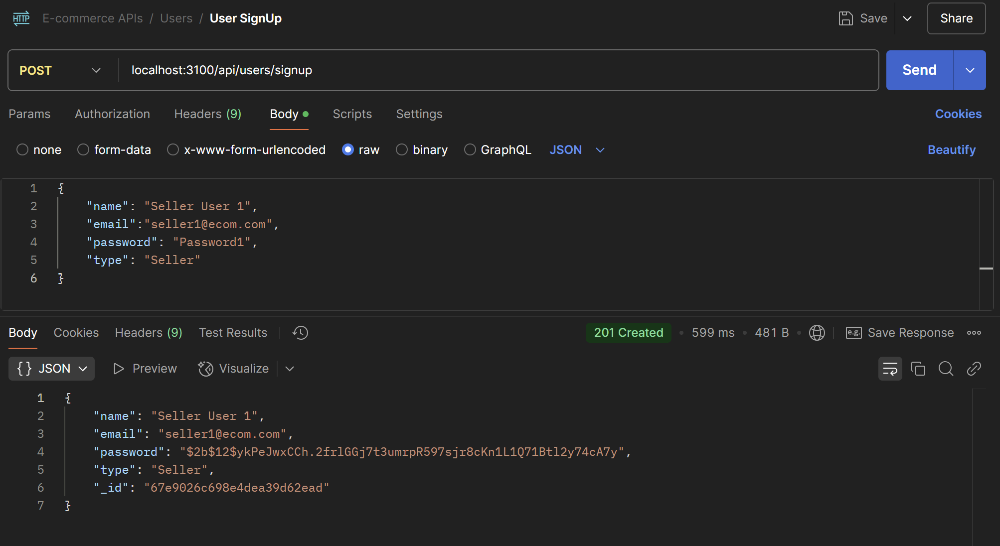
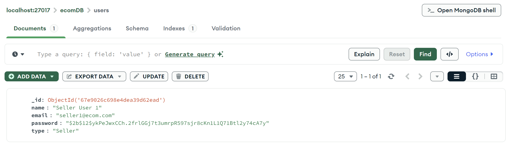

#### User SignIn
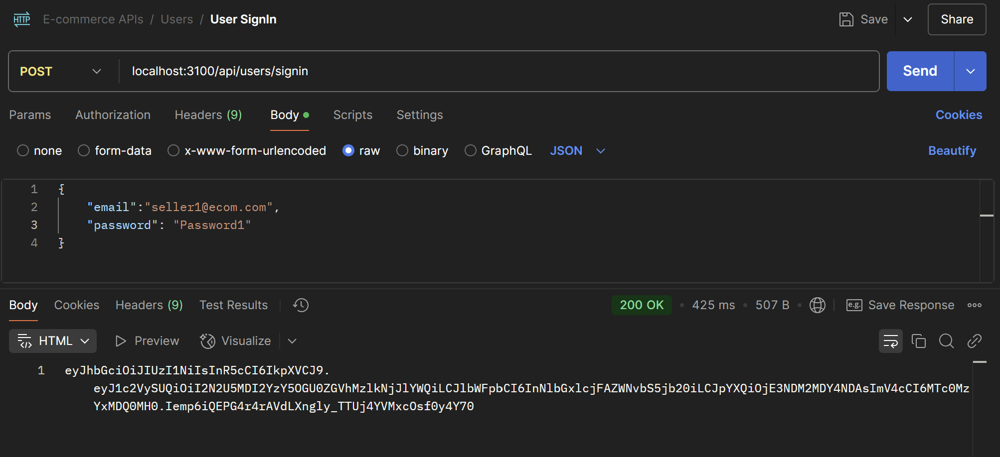
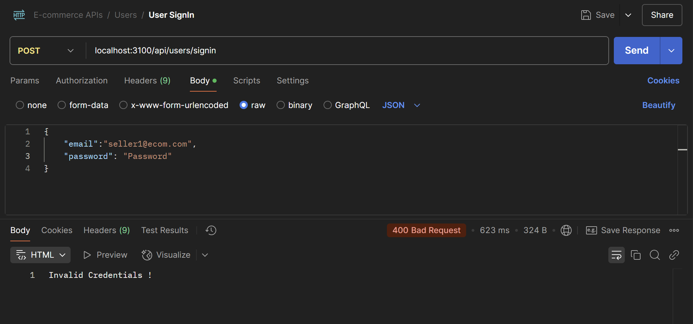


## Understanding dotenv
 1. dotenv is a popular npm package that simplifies the management of
 environment variables in Node.js applications.
 2. It enables developers to store sensitive configuration information, API keys,
 and other settings in a .env file, separate from the source code.
 3. dotenv loads the variables from the .env file into the environment, making
 them accessible via the process.env object.
 
 ### Reasons for using dotenv
 1. Security: Sensitive data is kept outside of the source code, reducing the risk
 of accidental exposure.
 2. Readability: The separation of configuration data from code improves the
 clarity and maintainability of the application.
 3. Ease of Use: dotenv simplifies the process of loading environment variables,
 requiring only a single line of code.
 4. Portability: Developers can easily share the same codebase across different
 environments without changing the source code.
 5. Configuration: dotenv enhances the configuration process by providing a
 standardised method to handle environment-specific variables.
 
 ### Using dotenv to Safely Configure MongoDB URL and JWT SecretKey
 1. Install it using the command: `npm i dotenv`
 2. Create '.env' file in root directory of the app:
 
    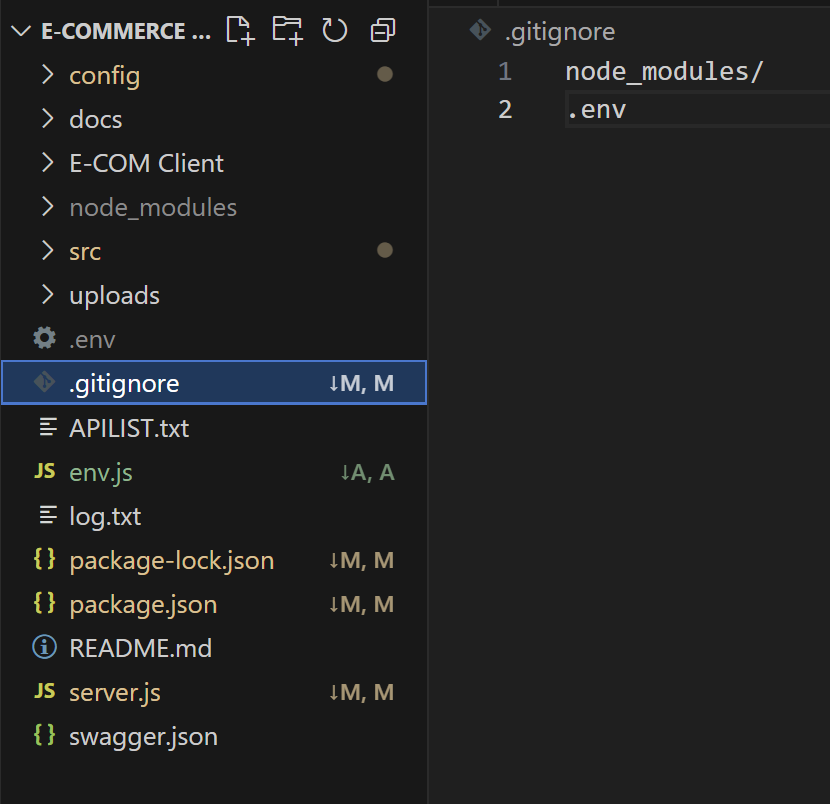
    
    Ensure your .gitignore file includes it to prevent sensitive information and
    configuration data from being accidentally pushed to version control systems like Git.
 
 3. Save the important URLs or keys of passwords in the .env file:
    ```env
    DB_URL = mongodb://localhost:27017/ecommerceDB
    JWT_SECRET = N6BUpqT7VL8cI7VbzLHaaS9txwGJWZMR
    ```
 4. Import dotenv wherever needed and call the .config() method to load environment variables. Here, a separate file env.js is created:
    ```javascript
    import dotenv from "dotenv";
    dotenv.config(); // Load all the environment variables in application
    ```

 5. Import env.js at the top of server.js to ensure environment variables are available throughout the application:
    ```javascript
    import "./env.js";
    import express from "express";
    ```

 5. Using an Environment Variable (process.env.DB_URL) in 'mongodb.js':
    - In the first version, the MongoDB connection URL is hardcoded as:
    ```javascript
    const url = "mongodb://localhost:27017/ecommerceDB";
    ```
    - In the updated version, the connection URL is fetched from an environment variable:     This makes the code more secure and configurable without modifying the source code.
    ```javascript
    const url = process.env.DB_URL;
    ```
    #### Benefits: Flexibility & Security
    1. Using process.env.DB_URL allows different environments (development, production) to use different databases without changing the code.    
    2. Hardcoding credentials is not recommended, as it can expose sensitive information.
6. Using an Environment Variable (process.env.JWT_SECRET) in 'user.controller.js':
    #### Before:
    ```javascript
    jwt.sign(
      { userID: result.id, email: result.email },
      "N6BUpqT7VL8cI7VbzLHaaS9txwGJWZMR", // Hardcoded secret key
      { expiresIn: "1h" }
    );
    ```
    #### After:
    ```javascript
    jwt.sign(
      { userID: result.id, email: result.email },
      process.env.JWT_SECRET, // Using environment variable
      { expiresIn: "1h" }
    );
    ```
    #### Why this change?
    1. ✅ Security: Avoids exposing the secret key in code.
    2. ✅ Flexibility: Allows different environments (dev, production) to use different secrets.
    3. ✅ Best Practice: Credentials should be stored in environment variables, not hardcoded.

## Secure Car Dealership Management with Repository Pattern in Node.js
In this concise guide, we'll build a secure car dealership management system using
Node.js, the Repository Pattern, the bcrypt library for password security, and the
dotenv library for environment variables. Our scenario involves a car dealership
managing its inventory and sales.
#### Scenario:
You are developing a car dealership management system for "Speedy Motors." The
system should securely store user credentials, manage car inventory, and track
sales.

### 1. User Authentication:

#### Step 1: Repository Setup -> In 'user.repository.js'
```javascript
import { getDB } from '../config/mongodb.js';
import bcrypt from 'bcrypt';
import { ApplicationError } from '../../error-handler/applicationError.js';

class UserRepository {
    async signUp(newUser) {
        try {
            const db = await getDB();
            const collection = db.collection("users");
            
            // Hash the password before storing
            const hashedPassword = await bcrypt.hash(newUser.password, 10);
            newUser.password = hashedPassword;
            
            // Insert user into the collection
            await collection.insertOne(newUser);
        } catch (err) {
            throw new ApplicationError("Database Error", 500);
        }
    }

    async signIn(email, password) {
        try {
            const db = await getDB();
            const collection = db.collection("users");
            
            const user = await collection.findOne({ email });
            
            if (user && await bcrypt.compare(password, user.password)) {
                return user;
            } else {
                return null;
            }
        } catch (err) {
            throw new ApplicationError("Database Error", 500);
        }
    }
}

export default UserRepository;
```

#### Step 2: Controller and Routes -> In 'user.controller.js'
```javascript
import UserRepository from './user.repository.js';

export default class UserController {
    constructor() {
        this.userRepository = new UserRepository();
    }

    async signUp(req, res) {
        try {
            const { name, email, password, role } = req.body;
            const user = { name, email, password, role };
            
            const createdUser = await this.userRepository.signUp(user);
            res.status(201).send({ message: "User registered", user: createdUser });
        } catch (error) {
            res.status(500).send({ message: "Error registering user", error: error.message });
        }
    }

    async signIn(req, res) {
        try {
            const { email, password } = req.body;
            const user = await this.userRepository.signIn(email, password);
            
            if (user) {
                res.status(200).send({ message: "Sign in successful", user });
            } else {
                res.status(401).send({ message: "Invalid credentials" });
            }
        } catch (error) {
            res.status(500).send({ message: "Error signing in", error: error.message });
        }
    }
}
```

### 2. Car Inventory Management:
#### Step 1: Repository Setup -> In 'car.repository.js'
```javascript
import { getDB } from '../../config/mongodb.js';
import { ApplicationError } from "../../error-handler/applicationError.js";

class CarRepository {
    async add(newCar) {
        try {
            const db = await getDB();
            const collection = db.collection("cars");
            
            await collection.insertOne(newCar);
            return newCar;
        } catch (err) {
            throw new ApplicationError("Database Error", 500);
        }
    }

    async getAll() {
        try {
            const db = await getDB();
            const collection = db.collection("cars");
            
            const cars = await collection.find().toArray();
            return cars;
        } catch (err) {
            throw new ApplicationError("Database Error", 500);
        }
    }
    // Other methods for updating, filtering, and more...
}

export default CarRepository;
```

#### Step 2: Controller and Routes -> In 'car.controller.js'
```javascript
import CarRepository from './car.repository.js';

export default class CarController {
    constructor() {
        this.carRepository = new CarRepository();
    }

    async addCar(req, res) {
        try {
            const { make, model, year, price } = req.body;
            const newCar = { make, model, year, price };
            
            const createdCar = await this.carRepository.add(newCar);
            res.status(201).send({ message: "Car added", car: createdCar });
        } catch (error) {
            res.status(500).send({ message: "Error adding car", error: error.message });
        }
    }

    async getAllCars(req, res) {
        try {
            const cars = await this.carRepository.getAll();
            res.status(200).send(cars);
        } catch (error) {
            res.status(500).send({ message: "Error retrieving cars", error: error.message });
        }
    }
    // Other methods for managing car inventory...
}
```

### 3. Environment Variables with dotenv:
#### 1. Create a .env file:
```env
DB_CONNECTION_STRING=mongodb://localhost:27017/mydb
SECRET_KEY=mysecretkey
```

#### 2. In config/mongodb.js:
```javascript
import dotenv from 'dotenv';
dotenv.config();
// Use process.env.DB_CONNECTION_STRING in your code
```

### Conclusion:
By implementing the Repository Pattern, secure user authentication using bcrypt,
and utilizing environment variables with dotenv, we've built a robust car dealership
management system. This scenario-based approach covers user registration,
authentication, car inventory, and sales tracking. The approach ensures data
security, integrity, and scalability in your application.

## Product Repository

### 1. Created 'product.repository.js' file 
The ProductRepository class is responsible for managing product-related database operations using MongoDB. It provides methods to add, retrieve, filter, and rate products. The repository pattern ensures a clean separation between database logic and business logic.
```javascript
import { ObjectId } from "mongodb";
import { getDB } from "../../../config/mongodb.js";
import { ApplicationError } from "../../error-handler/applicationError.js";

class ProductRepository {
  constructor() {
    this.collection = "products";
  }
  async add(newProduct) {
    try {
      const db = getDB(); // 1. Get the DB
      const collection = db.collection(this.collection); // 2. Get the collection
      await collection.insertOne(newProduct); // 3. Find the document
      return newProduct;
    } catch (err) {
      console.log(err);
      throw new ApplicationError("Something went wrong with Data", 500);
    }
  }

  async getAll() {
    try {
      const db = getDB();
      const collection = db.collection(this.collection);
      return await collection.find().toArray();
    } catch (err) {
      console.log(err);
      throw new ApplicationError("Something went wrong with Data", 500);
    }
  }

  async get(id) {
    try {
      const db = getDB();
      const collection = db.collection(this.collection);
      return await collection.findOne({ _id: new ObjectId(id) });
    } catch (err) {
      console.log(err);
      throw new ApplicationError("Something went wrong with Data", 500);
    }
  }

  async filter(minPrice, maxPrice, category) {
    try {
      const db = getDB();
      const collection = db.collection(this.collection);
      let filterExpression = {};
      if (minPrice) {
        filterExpression.price = { $gte: parseFloat(minPrice) };
      }
      if (maxPrice) {
        filterExpression.price = {
          ...filterExpression.price,
          $lte: parseFloat(maxPrice),
        };
      }
      if (category) {
        filterExpression.category = category;
      }
      return collection.find(filterExpression).toArray();
    } catch (err) {
      console.log(err);
      throw new ApplicationError("Something went wrong with Data", 500);
    }
  }

  async rate(userID, productID, rating) {
    try {
      const db = getDB();
      const collection = db.collection(this.collection);
      await collection.updateOne(
        {
          _id: new ObjectId(productID),
        },
        {
          $push: { ratings: { userID: new ObjectId(userID), rating } },
        }
      );
    } catch (err) {
      console.log(err);
      throw new ApplicationError("Something went wrong with Data", 500);
    }
  }
}

export default ProductRepository;
```
#### Code Explaination:
1. Constructor
    - Initializes the repository and sets the MongoDB collection name to "products".
    - This ensures all operations are performed on the "products" collection.
2. add(newProduct) → Add a New Product
    - Inserts a Product – Connects to the database and inserts a new product into the "products" collection.
    - Uses insertOne() – Adds a single document (product) to the collection.
    - Returns the Product – After insertion, the same product object is returned.
    - Error Handling – Logs errors and throws a 500 status if something goes wrong.
3. getAll() → Retrieve All Products
    - Fetches All Products – Connects to the database and retrieves all documents from the "products" collection.
    - Uses .find() – retrieves documents but returns a cursor, not actual data.
    - Uses .toArray() – converts the cursor into a JavaScript array for easier use.
    - Error Handling – Logs errors and throws a 500 status if something goes wrong.

    NOTE:
    1. Why Use .toArray()?
        - .find() alone returns a cursor, which is a MongoDB object that allows iteration over documents without loading them all at once.
        - .toArray() fetches all matching documents and stores them in an array, making it easier to work with in JavaScript.
    2. When to Use .toArray()
        - If you need all results at once (e.g., displaying all products in a UI).
    3. When NOT to Use .toArray()
        - If the dataset is very large, using .toArray() can cause high memory usage. Instead, you can iterate over the cursor:
        ```javascript
        const cursor = collection.find();
        for await (const doc of cursor) {
            console.log(doc); // Process each document one by one
        }
        ```
4. get(id) → Retrieve a Product by ID
    - Fetches a Single Product – Finds a product by its unique _id.
    - Uses findOne() – Retrieves a single document matching the provided ID.
    - Converts id to ObjectId – Since MongoDB uses ObjectId for _id, the given id is converted to an ObjectId.
    - Error Handling – Logs errors and throws a 500 status if something goes wrong.
5. filter(minPrice, maxPrice, category) → Filter Products
    - Connects to MongoDB – Retrieves the "products" collection.
    - Filters Products by Criteria – Searches products based on price range and category.
    - Builds a filterExpression Object – Creates a dynamic filter based on provided parameters:
      - minPrice – Includes products with price greater than or equal to minPrice.
      - maxPrice – Includes products with price less than or equal to maxPrice.
      - category – Filters products by category if provided.
    - Uses .find(filterExpression) – Retrieves products matching the filter.
    - Uses .toArray() – Converts the cursor into an array.
    - Error Handling – Logs errors and throws a 500 status if something goes wrong.
6. rate(userID, productID, rating) → Rate a Product
    - Connects to MongoDB – Retrieves the "products" collection.
    - Uses updateOne() – Updates the product document by adding a rating.
    - Uses $push Operator – Adds a new rating inside the ratings array of the product.
    - Converts userID and productID to ObjectId – Ensures the IDs are in MongoDB’s proper format.
    - Error Handling – Catches and logs errors, throwing a 500 error if something goes wrong.

### 2. Updated 'product.controller.js' file 

#### Before Changes:
```javascript
import ProductModel from "./product.model.js";

export default class ProductController {
  getAllProducts(req, res) {
    const products = ProductModel.getAll();
    res.status(200).send(products);
  }

  addProduct(req, res) {
    const { name, desc, price, imageUrl, category, sizes } = req.body;
    const newProduct = {
      name,
      desc: desc || "No description available",
      price: parseFloat(price),
      imageUrl: req.file ? req.file.filename : imageUrl,
      category: category || "Uncategorized",
      sizes: Array.isArray(sizes)
        ? sizes
        : typeof sizes === "string"
        ? sizes.split(",")
        : [],
    };
    const createdRecord = ProductModel.add(newProduct);
    res.status(201).send(createdRecord);
  }


  rateProduct(req, res, next) {
    try {
      console.log(req.query);
      const userID = req.query.userID;
      const productID = req.query.productID;
      const rating = req.query.rating;
      //Intentional error: Accessing 'req.querys' (undefined) will trigger the error handler middleware.
      //const rating = req.querys.rating;
      ProductModel.rateProduct(userID, productID, rating);
      return res.status(200).send("Rating has been added !");
    } catch (err) {
      console.log("Passing error to middleware")
      next(err);
    }
  } 

  getOneProduct(req, res) {
    //const id = req.params.id;
    const { id } = req.params;
    const product = ProductModel.get(id);
    if (!product) {
      res.status(404).send("Product not found !");
    } else {
      res.status(200).send(product);
    }
  }

  filterProducts(req, res) {
    const minPrice = req.query.minPrice;
    const maxPrice = req.query.maxPrice;
    const category = req.query.category;
    const result = ProductModel.filter(minPrice, maxPrice, category);
    res.status(200).send(result);
  }
}
```

#### After Changes:
```javascript
import ProductModel from "./product.model.js";
import ProductRepository from "./product.repository.js";

export default class ProductController {
  constructor() {
    this.productRepository = new ProductRepository();
  }

  async getAllProducts(req, res) {
    try {
      const products = await this.productRepository.getAll();
      res.status(200).send(products);
    } catch (err) {
      console.log(err);
      return res.status(500).send("Something went wrong");
    }
  }

  async addProduct(req, res) {
    try {
      const { name, desc, price, imageUrl, category, sizes } = req.body;
      const newProduct = new ProductModel(
        name,
        desc || "No description available",
        parseFloat(price),
        req.file ? req.file.filename : imageUrl,
        category || "Uncategorized",
        Array.isArray(sizes)
          ? sizes
          : typeof sizes === "string"
          ? sizes.split(",")
          : []
      );
      const createdProduct = await this.productRepository.add(newProduct);
      res.status(201).send(createdProduct);
    } catch (err) {
      console.log(err);
      return res.status(500).send("Something went wrong");
    }
  }

  rateProduct(req, res, next) {
    try {
      console.log(req.query);
      const userID = req.userID;
      const productID = req.query.productID;
      const rating = req.query.rating;
      //Intentional error: Accessing 'req.querys' (undefined) will trigger the error handler middleware.
      //const rating = req.querys.rating;
      this.productRepository.rate(userID, productID, rating);
      return res.status(200).send("Rating has been added !");
    } catch (err) {
      console.log(err);
      console.log("Passing error to middleware");
      next(err);
    }
  }

  async getOneProduct(req, res) {
    try {
      //const id = req.params.id;
      const { id } = req.params;
      const product = await this.productRepository.get(id);
      if (!product) {
        res.status(404).send("Product not found !");
      } else {
        res.status(200).send(product);
      }
    } catch (err) {
      console.log(err);
      return res.status(500).send("Something went wrong");
    }
  }

  async filterProducts(req, res) {
    try {
      const minPrice = req.query.minPrice;
      const maxPrice = req.query.maxPrice;
      const category = req.query.category;
      const result = await this.productRepository.filter(
        minPrice,
        maxPrice,
        category
      );
      res.status(200).send(result);
    } catch (err) {
      console.log(err);
      return res.status(500).send("Something went wrong");
    }
  }
}
```
The updated Product Controller improves error handling, database interaction, and code structure. Below is a detailed breakdown of changes and their impact.
1. Introduced ProductRepository for Better Abstraction
    - 🔄 Change:
      - Introduced ProductRepository (import ProductRepository from "./product.repository.js";).
      - Replaced `ProductModel` direct calls with `this.productRepository`, making the controller more modular and maintainable.
    - ✅ Impact:
      - Decouples business logic from the controller.
      - Easier to modify data access logic in the future (e.g., switching from in-memory storage to a database).
2. Introduced an async/await Pattern
    - 🔄 Change:
      - getAllProducts, addProduct, getOneProduct, and filterProducts are now asynchronous functions.
      - Uses await when calling repository functions.
    - ✅ Impact:
       -  Ensures non-blocking execution (critical when working with databases or APIs).
        - Prevents callback hell and improves readability.
3. Added a Constructor to Initialize ProductRepository
    - 🔄 Change:
      - The class now has a constructor:
      ```javascript
      constructor() {
        this.productRepository = new ProductRepository();
      }
      ```
      - This avoids repeatedly creating new instances of ProductRepository.

    - ✅ Impact:
      - Better efficiency—reuses a single repository instance instead of creating a new one in every method.

4. 4️⃣ Improved Error Handling
    - 🔄 Change:
        - Wrapped API logic inside try-catch blocks.
        - Added error messages:
        ```javascript
        console.log(err);
        return res.status(500).send("Something went wrong");
        ```
        - This was added in: getAllProduct, addProduct, getOneProduct, filterProducts

    - ✅ Impact:
        - Prevents crashes if an exception occurs.
        - Better debugging with console.log(err).
5. Changed addProduct to Use ProductModel Constructor
    - 🔄 Change: 
      - Instead of manually creating an object, it now uses the ProductModel class.
        ```javascript
        const newProduct = new ProductModel(
          name,
          desc || "No description available",
          parseFloat(price),
          req.file ? req.file.filename : imageUrl,
          category || "Uncategorized",
          Array.isArray(sizes)
            ? sizes
            : typeof sizes === "string"
            ? sizes.split(",")
            : []
        );
        ```
    - ✅ Impact:
      - Better object-oriented structure—ensures ProductModel handles validation and formatting.
6. Updated rateProduct for Consistency
    - 🔄 Change:
      - Replaced req.query.userID with req.userID (possibly extracted from authentication middleware).
      - Now calls this.productRepository.rate(...) instead of ProductModel.rateProduct(...).
    - ✅ Impact:
      - Security improvement—fetching userID from req.userID ensures it's authenticated.

#### 🔹 Summary of Key Improvements
1. ✅ Better Code Structure: Moved data-related logic to ProductRepository.
2. ✅ Improved Performance: Uses a single repository instance instead of multiple.
3. ✅ Enhanced Error Handling: Wrapped methods in try-catch for better fault tolerance.
4. ✅ Asynchronous Execution: Used async/await to handle potential database queries efficiently.
5. ✅ Better Object-Oriented Design: Used ProductModel constructor for better data representation.
6. ✅ Security Fixes: Changed req.query.userID to req.userID for authentication consistency.

Updated ProductController is now cleaner, modular, and optimized for real-world scalability! 🚀

### 3. Updated 'product.model.js' file

#### Before Changes:
The id is passed as the first parameter.
```javascript
constructor(id, name, desc, price, imageUrl, category, sizes) {
  this.id = id;
  this.name = name;
  this.desc = desc;
  this.price = price;
  this.imageUrl = imageUrl;
  this.category = category;
  this.sizes = sizes;
}
```

#### After Changes:
```javascript
constructor(name, desc, price, imageUrl, category, sizes, id) {
  this._id = id;
  this.name = name;
  this.desc = desc;
  this.price = price;
  this.imageUrl = imageUrl;
  this.category = category;
  this.sizes = sizes;
}
```
- The order of parameters has changed—id is now the last parameter instead of the first.
- id has been renamed to _id (possibly to indicate a private or internal property).
- This change impacts how instances of ProductModel are created and how they store the id value.

### 4. Updated 'product.routes.js' file
The change is in how controller methods are called:
#### Before Changes:
```javascript
/* Define specific routes first */
productRouter.get("/filter", productController.filterProducts);
productRouter.get("/", productController.getAllProducts);
productRouter.post(
  "/",
  upload.single("imageUrl"),
  productController.addProduct
);
productRouter.post("/rate", productController.rateProduct);

/* Define dynamic route last */
productRouter.get("/:id", productController.getOneProduct);
```
Controller methods were passed directly as references (e.g., productController.getAllProducts).
#### After Changes:
```javascript
/* Define specific routes first */
productRouter.get("/filter", (req, res) => {
  productController.filterProducts(req, res);
});
productRouter.get("/", (req, res) => {
  productController.getAllProducts(req, res);
});
productRouter.post("/", upload.single("imageUrl"), (req, res) => {
  productController.addProduct(req, res);
});
productRouter.post("/rate", (req, res, next) => {
  productController.rateProduct(req, res, next);
});

/* Define dynamic route last */
productRouter.get("/:id", (req, res) => {
  productController.getOneProduct(req, res);
```
Now they’re wrapped in arrow functions (e.g., (req, res) => productController.getAllProducts(req, res)).
#### Why this change?
- The change is needed because when you pass a method directly (e.g., productController.getAllProducts), this can become `undefined` inside the method.
- Wrapping it in an arrow function (e.g., (req, res) => productController.getAllProducts(req, res)) preserves the correct `this` context, ensuring the method works as expected.

### 5. Testing in Postman 

#### 1. Add Products
Use the attached image of an added product as a reference to add five more products to the collection. Once added, confirm their presence in the 'products' collection of the 'e-commerceDB' database in MongoDB.

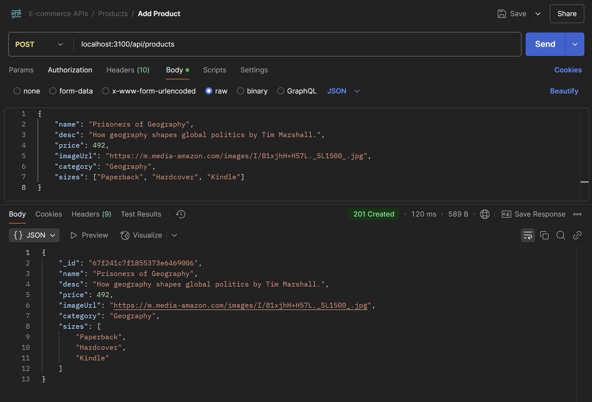

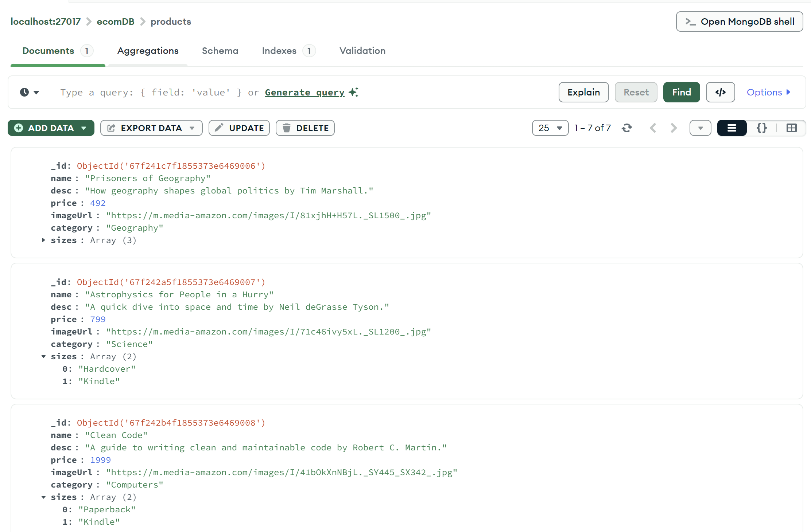
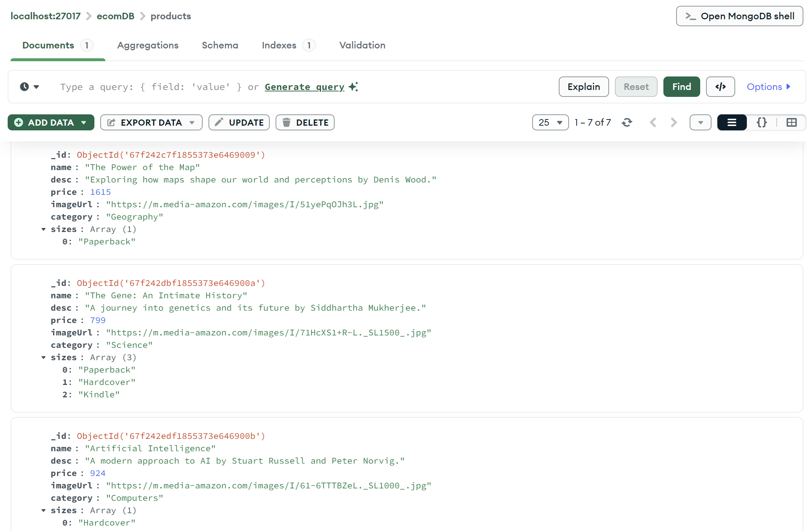


#### 2. Get All Products
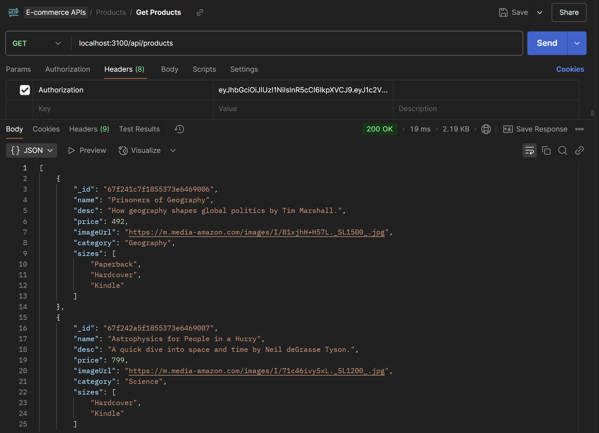
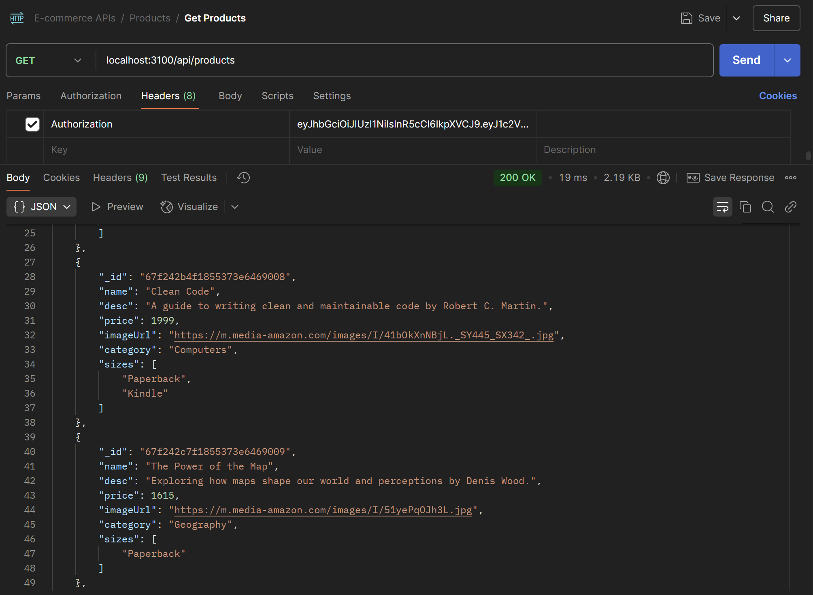
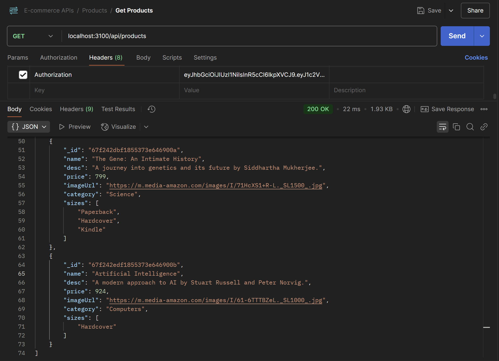

#### 3. Get One Products

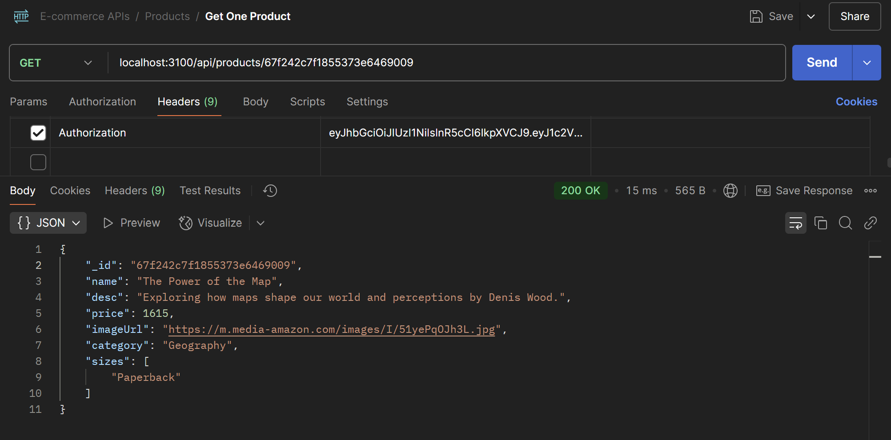

#### 4. Filter Products
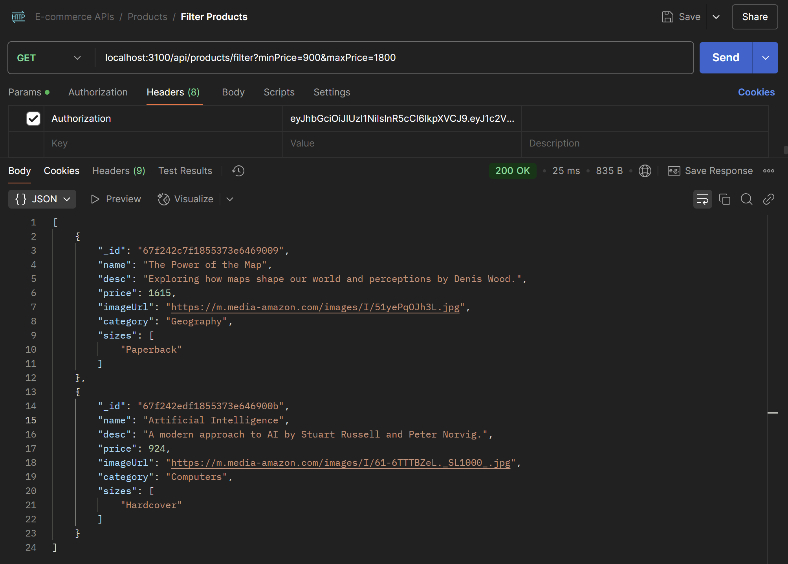
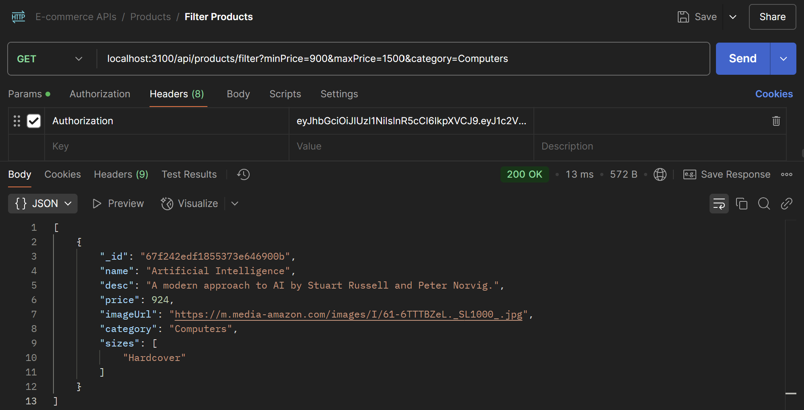
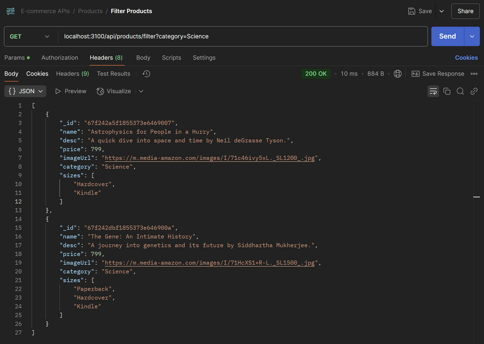
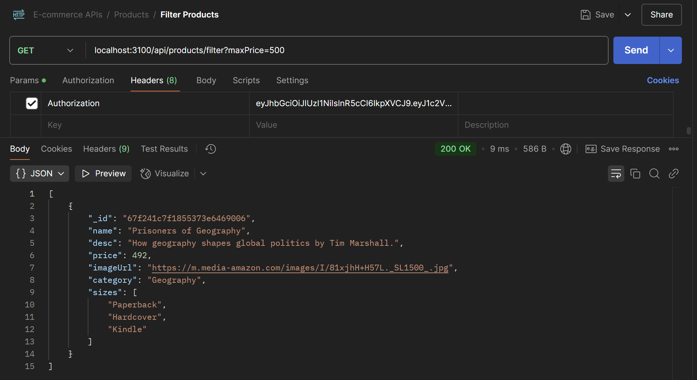

#### 5. Rate Products
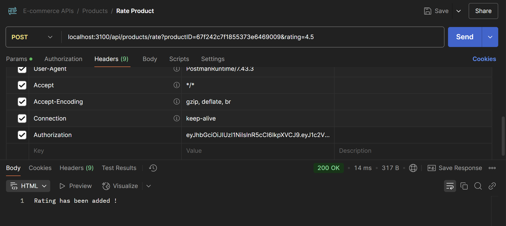
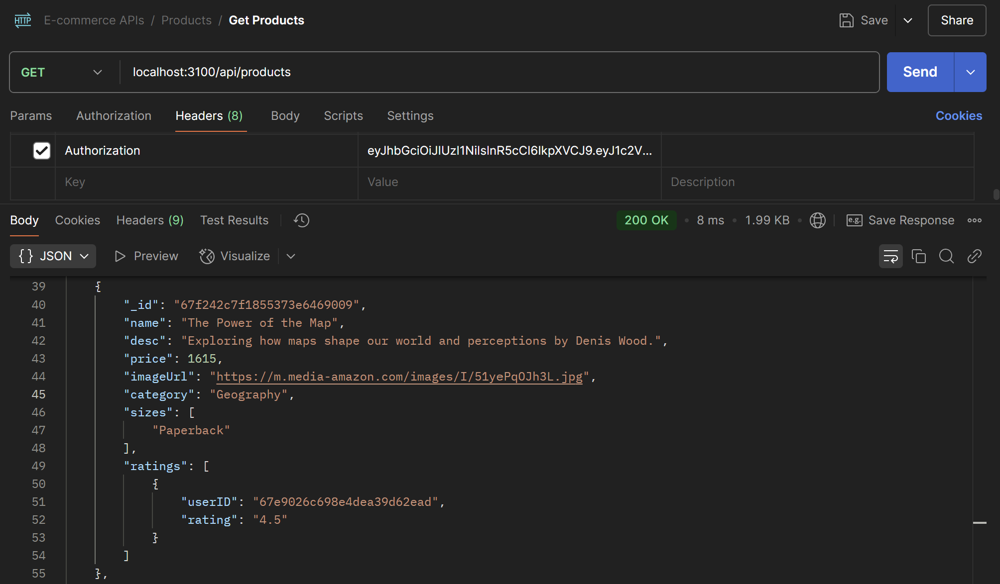
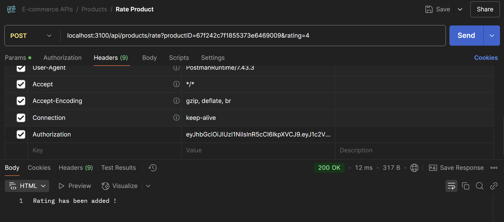

#### Issue: Duplicate rating by the same user is being recorded instead of updating the previous rating for the same product.


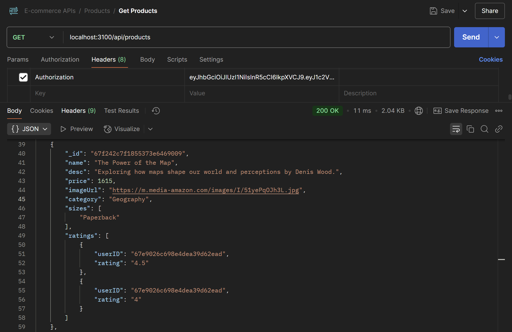
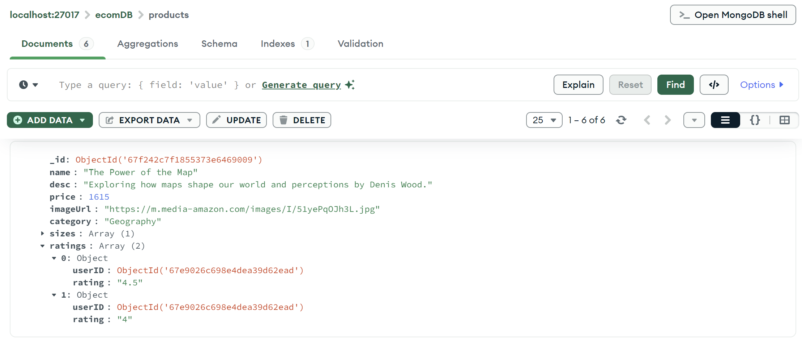

## Fix RateProduct Problem
### Updating with $pull operator
The $pull operator in MongoDB removes elements from an array that match a
specified condition. It's often used to remove specific values from arrays within
documents.

Example:
```javascript
db.collection.updateOne(
  { _id: ObjectId("your_document_id") },
  { $pull: { arrayField: { $in: ["value1", "value2"] } } }
);
```
In this example, elements matching "value1" and "value2" will be removed from the
arrayField.

### 1. Updated 'product.controller.js' file
#### Before Changes:
```javascript
rateProduct(req, res, next) {
  try {
    console.log(req.query);
    const userID = req.userID;
    const productID = req.query.productID;
    const rating = req.query.rating;
    this.productRepository.rate(userID, productID, rating);
    return res.status(200).send("Rating has been added !");
  } catch (err) {
    ...
  }
}
```
- Used req.query to get productID and rating.
- Called this.productRepository.rate() without await (i.e., not waiting for completion).
- Entire function was not async, so no await could be used.

#### After Changes:
```javascript
async rateProduct(req, res, next) {
  try {
    console.log(req.query);
    const userID = req.userID;
    const productID = req.body.productID;
    const rating = req.body.rating;
    await this.productRepository.rate(userID, productID, rating);
    return res.status(200).send("Rating has been added !");
  } catch (err) {
    ...
  }
}
```
- Changed method to **async** to use await properly.
- Switched from req.query → req.body for productID and rating (better for POST/PUT requests).
- Now uses await for rate() to ensure completion before sending response.

#### NOTE
✅ Why use req.body instead of req.query?
1. req.query
    - Used for query parameters in GET requests.
    - Values come from the URL, like: 
      ```json
      GET /rate?productID=123&rating=4
      ```
    - ❌ Not ideal for sending/modifying data (e.g., adding a rating).
2. req.body
    - Used for POST, PUT, or PATCH requests — which are intended to create or update data.
    - Data is sent in the body of the HTTP request, not in the URL.
    - ✅ More secure and flexible — especially for larger or sensitive data.
    - Looks like:
      ```json
      POST /rate
      Body: { "productID": "123", "rating": 4 }
      ```
### 2. Updated 'product.repository.js' file
#### Before Changes:
```javascript
async rate(userID, productID, rating) {
  try {
    const db = getDB();
    const collection = db.collection(this.collection);
    await collection.updateOne(
      {
        _id: new ObjectId(productID),
      },
      {
        $push: { ratings: { userID: new ObjectId(userID), rating } },
      }
    );
  } catch (err) {
    console.log(err);
    throw new ApplicationError("Something went wrong with Data", 500);
  }
}
```
#### 🔍 What it does:
- Simply adds a new rating to the ratings array inside a product document.
- Doesn’t check if the user already rated → so the same user could rate multiple times.
- Each rating is stored like: `{"userID": "123", "rating": 4 }`

#### ⚙️ MongoDB operator:
  - $push: Appends a new element to the ratings array.

#### 1. After Changes Way-One: Check & Update if Exists, Else Push
```javascript
async rate(userID, productID, rating) {
  try {
    const db = getDB(); // Get DB connection
    const collection = db.collection(this.collection); // Get product collection

    const product = await collection.findOne({ _id: new ObjectId(productID) }); // Find product by ID

    const userRating = product?.ratings?.find((r) => r.userID == userID); // Check if user already rated

    if (userRating) {
      // Update existing rating
      await collection.updateOne(
        {
          _id: new ObjectId(productID),
          "ratings.userID": new ObjectId(userID),
        },
        {
          $set: { "ratings.$.rating": rating },
        }
      );
    } else {
      // Add new rating
      await collection.updateOne(
        { _id: new ObjectId(productID) },
        { $push: { ratings: { userID: new ObjectId(userID), rating } } }
      );
    }
  } catch (err) {
    console.log(err); // Log error
    throw new ApplicationError("Something went wrong with Data", 500); // Handle error
  }
}
```
#### 🔍 What it does:
  - First checks if the user has already rated the product.
  - If yes: updates the existing rating using $set.
  - If no: pushes a new rating using $push.
  
#### ✅ Pros:
  - Ensures only one rating per user.
  - Clean and efficient.
  - Avoids duplicate entries.

#### ⚠️ Cons:
  - Extra read: Needs findOne() before update.
  - Race conditions: If two updates happen at the same time, data may conflict.
  - More logic: Requires branching for update vs insert

#### ⚙️ MongoDB operators:
  - $set: Modifies an existing element in an array.
  - Positional $ operator: Automatically refers to the first matching element in ratings.userID.
  - $push: Adds new rating if user hasn’t rated yet.
  - 💡 For Example:
    - Before:
      ```json
      ratings: [{ userID: "123", rating: 3 }]
      ```
    - After:
      ```json
      ratings: [{ userID: "123", rating: 4 }]
      ```

#### 2. After Changes Way-Two: Always Pull Then Push
```javascript
async rate(userID, productID, rating) {
  try {
    const db = getDB(); // Get DB connection
    const collection = db.collection(this.collection); // Get product collection

    // Remove existing rating by the user (if any)
    await collection.updateOne(
      { _id: new ObjectId(productID) },
      { $pull: { ratings: { userID: new ObjectId(userID) } } }
    );

    // Add new rating
    await collection.updateOne(
      { _id: new ObjectId(productID) },
      { $push: { ratings: { userID: new ObjectId(userID), rating } } }
    );
  } catch (err) {
    console.log(err); // Log error
    throw new ApplicationError("Something went wrong with Data", 500); // Handle error
  }
}
```

#### 🔍 What it does:
  - Always removes old rating from the array using $pull.
  - Then adds the new one using $push.

#### ✅ Pros:
  - Simpler logic – no need to check for existing rating.
  - Guarantees only one rating per user.

#### ⚠️ Cons:
  - Double write: Always performs 2 updates ($pull + $push).
  - Slightly slower: More write operations → higher DB load.
  - No history: If tracking when rating was first given, this erases that

#### ⚙️ MongoDB operators:
  - $pull: Removes element(s) matching condition from an array.
  - $push: Adds a new rating afterward.
  - 💡 For Example
    - Before:
      ```json
      ratings: [{ userID: "123", rating: 2 }, { userID: "456", rating: 5 }]
      ```
    - After:
      ```json
      ratings: [{ userID: "456", rating: 5 }, { userID: "123", rating: 4 }]
      ```
### 3. Testing in Postman
#### Updating the existing product rating provided by User-1

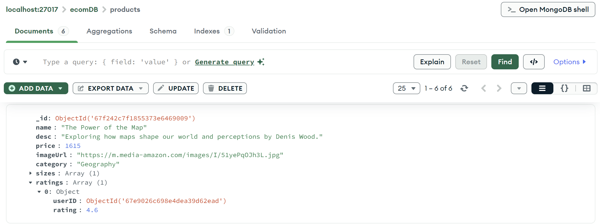

#### New product rating provided by User-2
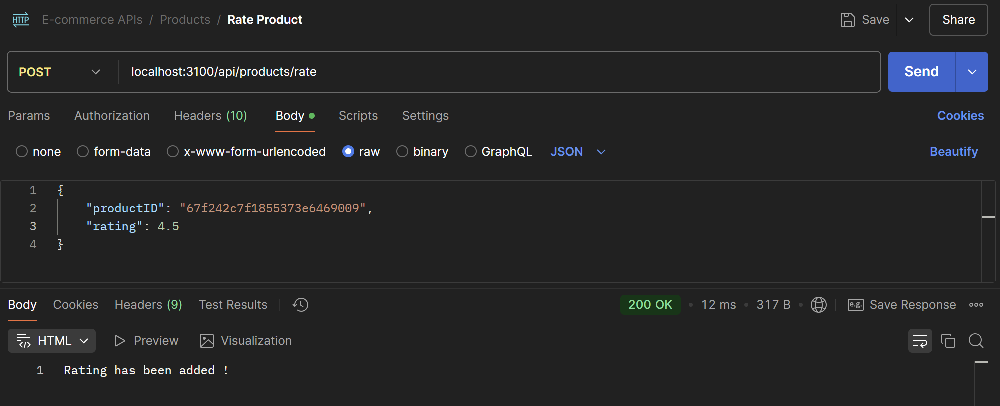
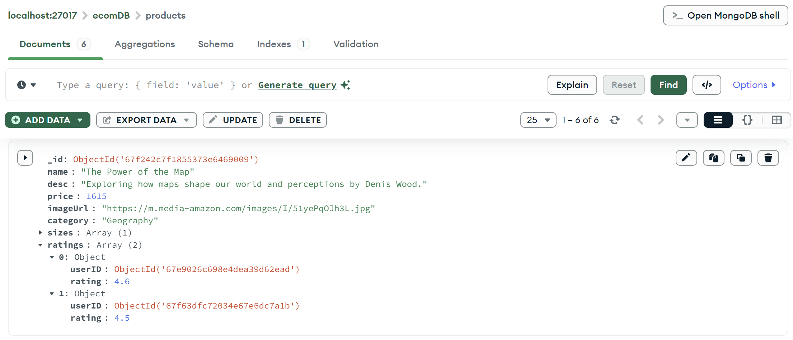

## Summarising it
Let’s summarise what we have learned in this module:
- We learned how to establish a connection to the MongoDB database
from a Node.js application.
- Using MongoClient, we accessed the database, performed CRUD
operations, and interacted with collections to store and retrieve data.
- We explored the repository pattern, a design principle that separates
data access logic from the rest of the application.
- We delved into the crucial aspect of password security by hashing user
passwords using the bcrypt library.
- We also learned about environment variables, which helps in
safeguarding our critical data such as database key.

### Some Additional Resources:
- [MongoDB Node.js Driver](https://www.npmjs.com/package/mongodb)
- [bcrypt](https://www.npmjs.com/package/bcrypt)
- [dotenv](https://www.npmjs.com/package/dotenv)


