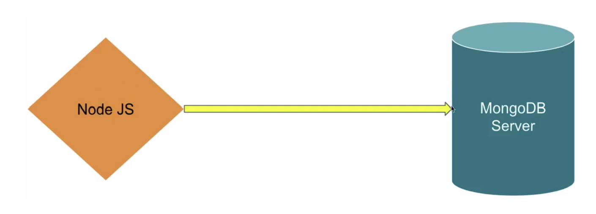
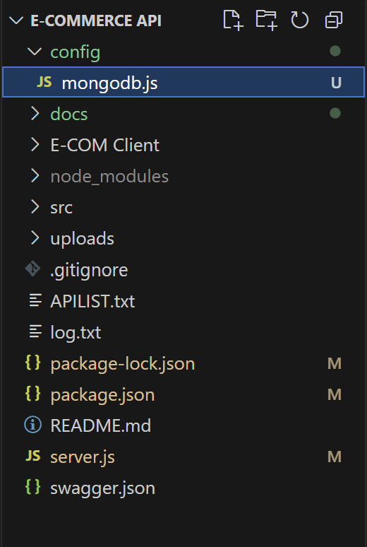

## MONGODB WITH NODEJS PART-I

## MongoDB Driver



The MongoDB driver is a crucial link between your Node.js application and the
MongoDB database.

### Installation of MongoDB Driver
- It provides programming tools and interfaces that empower your application to
interact with MongoDB seamlessly.
- Install MongoDB driver by running the command: `npm i mongodb`


### Implementing MongoDB with NodeJS
Create a 'config' directory to establish a separation of configurations in our
project. Within this directory, create a 'mongodb.js' file to facilitate the
connection to MongoDB:



1. Import MongoClient:
```javascript 
import { MongoClient } from 'mongodb';
```
2. Define Connection URL:
```javascript
const url = 'mongodb://localhost:27017/mydb';
```
- localhost:27017: The hostname and port number of the MongoDB server.
mydb : The name of the specific database you want to connect to.
3. Connection to MongoDB:
- Use the connect method of the MongoClient instance to establish a
connection to the MongoDB server
```javascript
import {MongoClient} from 'mongodb';

const url = "mongodb://localhost:27017/ecomdb";

const connectToMongoDB = () =>{
    MongoClient.connect(url)
    .then(client=>{
        console.log("MongoDB is connected")
    })
    .catch(err=>{
        console.log(err);
    })
}

export default connectToMongoDB;
```
- We have used .connect( ) method of MongoClient that returns a promise and
then we have exported the connecToMongoDB function.

4. Import the above function in server.js
```javascript
import express from "express";
import connectToMongoDB from "./config/mongodb.js";

const server = express();

// 8. Start server
const PORT = 3000;
server.listen(PORT, () => {
  console.log(`Server running at http://localhost:${PORT}`); // Log server start
  connectToMongoDB();
});
```

### Troubleshooting MongoDB Connection Issues with 'localhost'
If you're experiencing problems connecting to your MongoDB database using the
following connection string:
```javascript 
const url = "mongodb://localhost:27017/ecomdb";
```
It's worth noting that this error will not be faced if your PC uses IPv6. However, if
your PC is using IPv4 and the alias name "localhost" isn't assigned to the address
"127.0.0.1".

To resolve this issue, consider directly specifying the address in the connection string
like this:
```javascript
const url = "mongodb://127.0.0.1:27017/ecomdb";
```
This adjustment can help ensure a smoother connection experience.