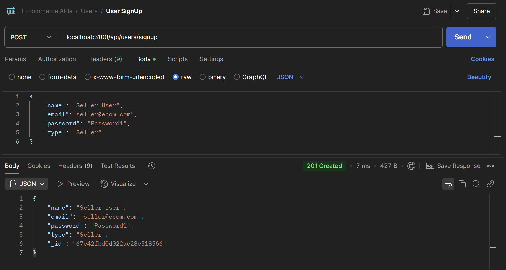
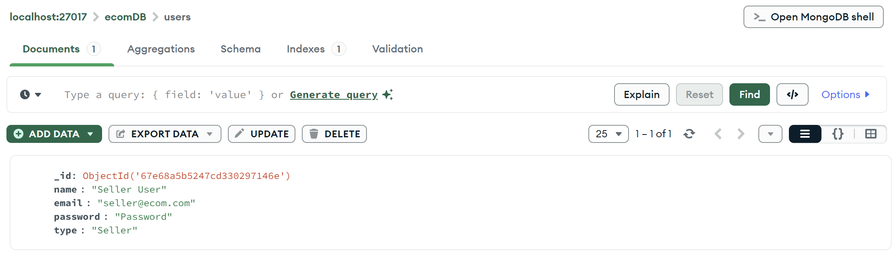
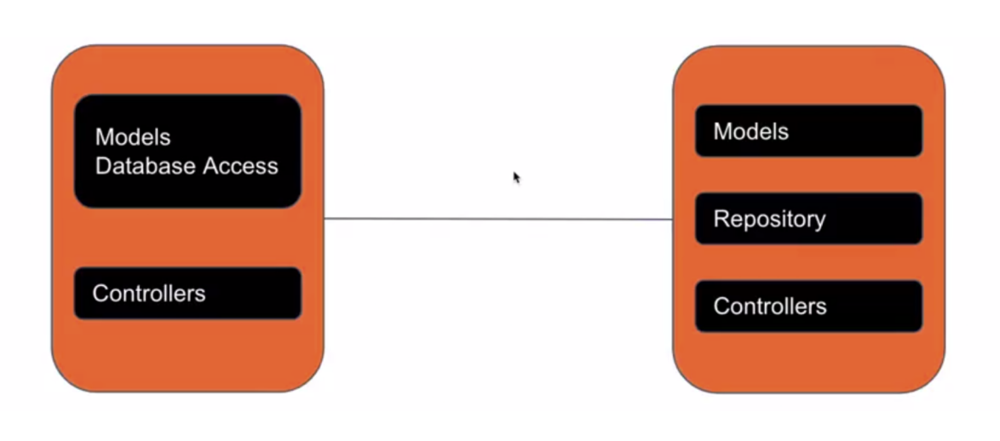

## MONGODB WITH NODEJS PART-I

## MongoDB Driver


The MongoDB driver is a crucial link between your Node.js application and the
MongoDB database.

### Installation of MongoDB Driver
- It provides programming tools and interfaces that empower your application to
interact with MongoDB seamlessly.
- Install MongoDB driver by running the command: `npm i mongodb`


### Implementing MongoDB with NodeJS
Create a 'config' directory to establish a separation of configurations in our
project. Within this directory, create a 'mongodb.js' file to facilitate the
connection to MongoDB:


1. Import MongoClient:
```javascript 
import { MongoClient } from 'mongodb';
```
2. Define Connection URL:
```javascript
const url = 'mongodb://localhost:27017/mydb';
```
- localhost:27017: The hostname and port number of the MongoDB server.
mydb : The name of the specific database you want to connect to.
3. Connection to MongoDB:
- Use the connect method of the MongoClient instance to establish a
connection to the MongoDB server
```javascript
import {MongoClient} from 'mongodb';

const url = "mongodb://localhost:27017/ecomDB";

const connectToMongoDB = () =>{
    MongoClient.connect(url)
    .then(client=>{
        console.log("MongoDB is connected")
    })
    .catch(err=>{
        console.log(err);
    })
}

export default connectToMongoDB;
```
- We have used .connect( ) method of MongoClient that returns a promise and
then we have exported the connecToMongoDB function.

4. Import the above function in server.js
```javascript
import express from "express";
import connectToMongoDB from "./config/mongodb.js";

const server = express();

// 8. Start server
const PORT = 3000;
server.listen(PORT, () => {
  console.log(`Server running at http://localhost:${PORT}`); // Log server start
  connectToMongoDB();
});
```

### Troubleshooting MongoDB Connection Issues with 'localhost'
If you're experiencing problems connecting to your MongoDB database using the
following connection string:
```javascript 
const url = "mongodb://localhost:27017/ecomDB";
```
It's worth noting that this error will not be faced if your PC uses IPv6. However, if
your PC is using IPv4 and the alias name "localhost" isn't assigned to the address
"127.0.0.1".

To resolve this issue, consider directly specifying the address in the connection string
like this:
```javascript
const url = "mongodb://127.0.0.1:27017/ecomDB";
```
This adjustment can help ensure a smoother connection experience.

## User Operations with MongoDB

### 1. Updated 'mongodb.js' file
#### Before Changes:
```javascript
import {MongoClient} from 'mongodb';
const url = "mongodb://localhost:27017/ecomDB";
const connectToMongoDB = () =>{
    MongoClient.connect(url)
    .then(client=>{
        console.log("MongoDB is connected")
    })
    .catch(err=>{
        console.log(err);
    })
}
export default connectToMongoDB;
```
#### After Changes:
```javascript
import { MongoClient } from "mongodb";
const url = "mongodb://localhost:27017/ecomDB";

let client;
export const connectToMongoDB = () => {
  MongoClient.connect(url)
    .then((clientInstance) => {
      client = clientInstance;
      console.log("MongoDB is connected");
    })
    .catch((err) => {
      console.log(err);
    });
};

export const getDB = () => {
  return client.db();
};
```
- Added let client;: Stores the MongoDB client instance for reuse.
- Updated .then() callback: Assigns clientInstance to client before logging the connection message.
- Introduced getDB() function: Returns the database instance using client.db(), enabling access to the database elsewhere in the code.

### 2. Updated 'user.model.js' file
#### Before Changes:
```javascript
export class UserModel {
  constructor(id, name, email, password, type) {
    this.id = id;
    this.name = name;
    this.email = email;
    this.password = password;
    this.type = type;
  }

  static signUp(name, email, password, type) {
    const newUser = new UserModel(
      users.length + 1,
      name,
      email,
      password,
      type
    );
    users.push(newUser);
    return newUser;
  }
  // More code...
}
```
#### After Changes:
```javascript
import { getDB } from "../../../config/mongodb.js";
import { ApplicationError } from "../../error-handler/applicationError.js";

export class UserModel {
  constructor(name, email, password, type) {
    this.name = name;
    this.email = email;
    this.password = password;
    this.type = type;
  }

  static async signUp(name, email, password, type) {
    try {
      const db = getDB(); // 1. Get the database
      const collection = db.collection("users");  // 2. Get the collection
      const newUser = new UserModel(name, email, password, type);
      await collection.insertOne(newUser);  // 3.Insert the document
      return newUser;
    } catch (err) {
      throw new ApplicationError("Something went wrong", 503);
    }
  }
  // More code...
}
```
- Removed id from the constructor: MongoDB automatically generates _id.
- Made signUp() asynchronous: Added async to handle database operations properly.
- Removed manual ID generation: MongoDB automatically assigns a unique _id.
- Replaced in-memory array with MongoDB: Instead of storing users in a local array, it now fetches the database using getDB() and accesses the "users" collection.
- Stored user in MongoDB: Used collection.insertOne(newUser) to save the user persistently.
- Added error handling: Wrapped the code in a try-catch block to catch database errors and return a meaningful ApplicationError.

### 3. Updated 'user.controller.js' file
#### Before Changes:
```javascript
 signUp(req, res) {
    const { name, email, password, type } = req.body;
    const user = UserModel.signUp(name, email, password, type);
    res.status(201).send(user);
}
```

#### After Changes:
```javascript
async signUp(req, res) {
    const { name, email, password, type } = req.body;
    const user = await UserModel.signUp(name, email, password, type);
    res.status(201).send(user);
}
```
- Made signUp() asynchronous: Added await to handle the async database operation properly.
- Ensured proper user creation: Now waits for UserModel.signUp() to complete before sending a response.


### 4. Updated in 'server.js' file
#### Before Changes:
```javascript
import connectToMongoDB from "./config/mongodb.js";
```
#### After Changes:
```javascript
import {connectToMongoDB} from "./config/mongodb.js";
```
Changed from default import to named import because connectToMongoDB is now exported using export const instead of export default

### 5. Testing in Postman 




## Repository Pattern


The repository pattern is a software design concept that promotes the separation of
concerns and enhances the maintainability and scalability of applications by
providing an organised approach to interact with data sources, such as databases

### Benefits of Repository Pattern
1. Abstraction: It abstracts data source details, providing a consistent interface
for data operations across diverse storage mechanisms.
2. Modularity: Repositories encapsulate data logic, enabling modular and
reusable code components.
3. Maintenance: Changes to data source or structure are localised within
repositories, simplifying maintenance efforts.
4. Testing: Repositories facilitate isolated unit testing by allowing mock
implementations.
5. Caching: Data caching can be implemented within repositories for improved
performance.
6. Query Logic: Complex queries and filtering logic are centralised in
repositories.
7. Database Agnosticism: The pattern enables flexibility in switching between
different data sources.
8. Security: Repositories can enhance security through parameterised queries
and validation.

### The Use Case of the Repository Pattern
Scenario: Online Bookstore Management System
Explanation:
In this example, we'll use the mongodb package to interact with MongoDB. The
repository pattern will help us separate the data access logic from the business logic.

#### MongoDB Connection:
```javascript
//databaseConnection.js
import { MongoClient } from "mongodb";
const url = "mongodb://localhost:27017";
const dbName = "bookstore";

let client;
async function connect() {
  client = new MongoClient(url);
  await client.connect();
  console.log("Connected to MongoDB");
}

function getDatabase() {
  return client.db(dbName);
}

export { connect, getDatabase };
```

#### Book Repository:
```javascript
import { ObjectId } from 'mongodb';
import { getDatabase } from './databaseConnection';

class BookRepository {
    async getAll() {
        const db = getDatabase();
        return await db.collection('books').find().toArray();
    }

    async getById(bookId) {
        const db = getDatabase();
        return await db.collection('books').findOne({ _id: ObjectId(bookId) });
    }

    async create(bookData) {
        const db = getDatabase();
        const result = await db.collection('books').insertOne(bookData);
        return result.ops[0];
    }

    async update(bookId, bookData) {
        const db = getDatabase();
        return await db.collection('books').findOneAndUpdate(
            { _id: ObjectId(bookId) },
            { $set: bookData },
            { returnDocument: "after" } 
            /*
            ❌ { returnOriginal: false } is deprecated in MongoDB 4+.
            ✅ Fix: Use { returnDocument: "after" } instead:
            */
        );
    }
    
    async delete(bookId) {
        const db = getDatabase();
        await db.collection('books').deleteOne({ _id: ObjectID(bookId)});
    }
}

export default BookRepository;
```

#### Usage:
Here's what we're going to do:
1. Connect to the Database: We'll start by establishing a connection to the MongoDB
database using the connect function.
2. Create Books: We'll utilise the BookRepository to create two book entries: "The
Great Gatsby" by F. Scott Fitzgerald and "To Kill a Mockingbird" by Harper Lee.
3. Retrieve All Books: We'll fetch and display all the books stored in the collection
using the getAll method.
4. Update a Book Title: We'll demonstrate updating a book's title using the update
method after fetching it by its ID.
5. Delete a Book: We'll delete one of the books from the collection using the delete
method.

```javascript
import { connect } from './databaseConnection';
import BookRepository from './bookRepository';

(async () => {
    try {
        await connect();
        const bookRepo = new BookRepository();

        // Create books
        const book1 = await bookRepo.create({
            title: 'The Great Gatsby',
            author: 'F. Scott Fitzgerald',
        });

        const book2 = await bookRepo.create({
            title: 'To Kill a Mockingbird',
            author: 'Harper Lee',
        });

        console.log('Books created:', book1, book2);

        // Fetch all books
        const allBooks = await bookRepo.getAll();
        console.log('All books:', allBooks);

        // Update a book
        const bookToUpdate = await bookRepo.getById(book1._id);
        if (bookToUpdate) {
            bookToUpdate.title = 'Updated Title';
            const updatedBook = await bookRepo.update(bookToUpdate._id, bookToUpdate);
            console.log('Updated book:', updatedBook);
        }

        // Delete a book
        await bookRepo.delete(book2._id);
        console.log('Book deleted:', book2._id);

    } catch (error) {
        console.error('Error:', error);
    } finally {
        if (client) {
            client.close();
            console.log('Disconnected from MongoDB');
        }
    }
})();
```
In this example, we're using the mongodb package to interact directly with
MongoDB. The databaseConnection.js file handles the database connection, and the
BookRepository class encapsulates the data access logic. This implementation
adheres to the repository pattern and separates data access from business logic.


## User Repository 
### 1. Create 'user.repository.js' file
```javascript
import { getDB } from "../../../config/mongodb.js";
import { ApplicationError } from "../../error-handler/applicationError.js";

class UserRepository {
  async signUp(newUser) {
    try {
      const db = getDB(); // 1. Get the database
      const collection = db.collection("users"); // 2. Get the collection
      await collection.insertOne(newUser); // 3.Insert the document
      return newUser;
    } catch (err) {
      console.log(err);
      throw new ApplicationError("Something went wrong", 500);
    }
  }

  async signIn(email, password) {
    try {
      const db = getDB(); // 1. Get the database
      const collection = db.collection("users"); // 2. Get the collection
      return await collection.findOne({ email, password }); // 3. Find the document
    } catch (err) {
      console.log(err);
      throw new ApplicationError("Something went wrong", 500);
    }
  }
}

export default UserRepository;
```

The UserRepository class handles user authentication operations using MongoDB.
1. signUp(newUser)
    - Connects to the database (getDB()).
    - Inserts the newUser object into the "users" collection.
    - Returns the newly created user.
    - If an error occurs, it throws an ApplicationError with a 500 status code.
2. signIn(email, password)
    - Connects to the database (getDB()).
    - Searches for a user with the given email and password in the "users" collection.
    - Returns the user object if found, otherwise returns null.
    - If an error occurs, it throws an ApplicationError with a 500 status code.

### 2. Updated 'user.model.js' file

#### Before Changes:
```javascript
import { getDB } from "../../../config/mongodb.js";
import { ApplicationError } from "../../error-handler/applicationError.js";

export class UserModel {
  constructor(name, email, password, type) {
    this.name = name;
    this.email = email;
    this.password = password;
    this.type = type;
  }

  static async signUp(name, email, password, type) {
    try {
      const db = getDB(); // 1. Get the database
      const collection = db.collection("users");  // 2. Get the collection
      const newUser = new UserModel(name, email, password, type);
      await collection.insertOne(newUser);  // 3.Insert the document
      return newUser;
    } catch (err) {
      throw new ApplicationError("Something went wrong", 503);
    }
  }

  static signIn(email, password) {
    const user = users.find((u) => u.email == email && u.password == password);
    return user;
  }

  static getAll() {
    return users;
  }
}
```

#### After Changes:
```javascript
export class UserModel {
  constructor(name, email, password, type) {
    this.name = name;
    this.email = email;
    this.password = password;
    this.type = type;
  }

  static getAll() {
    return users;
  }
}
```
#### Key Changes
1. Removed signUp and signIn Methods from UserModel:
    - Previously, UserModel had a signUp method that interacted with the database (MongoDB).
    - The signIn method was also present in UserModel, which searched for a user in a static array.
    - In the updated code, both methods have been removed from UserModel.

2. Now, UserModel Only Contains the Constructor and getAll():
    - The updated version only defines the user schema (constructor) and keeps getAll() for retrieving static user data.
    - This means UserModel is now a pure data model, and all logic related to user authentication is likely moved elsewhere (e.g., UserRepository).

#### Why These Changes?
1. ✔ Separation of Concerns – Now, database interaction is handled separately (possibly in UserRepository).
2. ✔ Cleaner Model – UserModel now only represents a user object rather than handling database operations.
3. ✔ More Scalable – The updated design allows flexibility in managing user-related operations separately.

### 3. Updated 'user.controller.js' file

#### Before Change:
```javascript
import { UserModel } from "./user.model.js";
import jwt from "jsonwebtoken";

export default class UserController {
  async signUp(req, res) {
    const { name, email, password, type } = req.body;
    const user = await UserModel.signUp(name, email, password, type);
    res.status(201).send(user);
  }

  signIn(req, res) {
    const result = UserModel.signIn(req.body.email, req.body.password);
    if (!result) {
      return res.status(400).send("Invalid Credentials !");
    } else {
      //1. Create token
      const token = jwt.sign(
        { userID: result.id, email: result.email },
        "N6BUpqT7VL8cI7VbzLHaaS9txwGJWZMR",
        {
          expiresIn: "1h",
        }
      );
      //2. Send token.
      return res.status(200).send(token);
      //return res.send("Login Successful !");
    }
  }
}
```

After Changes:
```javascript
import { UserModel } from "./user.model.js";
import jwt from "jsonwebtoken";
import UserRepository from "./user.repository.js";

export default class UserController {
  constructor() {
    this.userRepository = new UserRepository();
  }

  async signUp(req, res) {
    const { name, email, password, type } = req.body;
    const user = new UserModel(name, email, password, type);
    await this.userRepository.signUp(user);
    res.status(201).send(user);
  }

  async signIn(req, res, next) {
    try {
      const result = await this.userRepository.signIn(
        req.body.email,
        req.body.password
      );
      if (!result) {
        return res.status(400).send("Invalid Credentials !");
      } else {
        //1. Create token
        const token = jwt.sign(
          { userID: result.id, email: result.email }, // Payload data
          "N6BUpqT7VL8cI7VbzLHaaS9txwGJWZMR", // Secret key for signing
          {
            expiresIn: "1h", // Token expiry set to 1 hour
          }
        );
        //2. Send token.
        return res.status(200).send(token);
        //return res.send("Login Successful !");
      }
    } catch (err) {
      console.log(err);
      return res.status(200).send("Something went wrong");
    }
  }
}
```
#### Key Changes
1. Introduced UserRepository for Database Interaction:
    - Instead of directly using UserModel, the controller now interacts with UserRepository for user-related database operations.
    - A userRepository instance is created in the constructor.

2. Updated signUp Method:
    - Previously, UserModel.signUp() was called directly.
    - Now, a new instance of UserModel is created and passed to this.userRepository.signUp(user).

3. Modified signIn Method:
    - Previously, UserModel.signIn() was used for authentication.
    - Now, it awaits this.userRepository.signIn(email, password), making the function asynchronous.
    - Added a try-catch block for better error handling, returning "Something went wrong" if an error occurs.

### 4. Update 'user.routes.js' file
#### Before Changes:
```javascript
userRouter.post("/signup", userController.signUp); // User registration  
userRouter.post("/signin", userController.signIn); // User login  
```
Here, userController.signUp and userController.signIn are passed directly as route handlers. However, this can cause issues with the this keyword inside class methods.

#### Problem with Direct Method Reference
  - When we pass userController.signUp directly, the function loses the context of the class (this binding).
  - Inside signUp(), this.userRepository might become undefined because the method is not executed in the correct context of UserController.

#### After Changes:
```javascript
userRouter.post("/signup", (req, res) => {
  userController.signUp(req, res);
}); // User registration
userRouter.post("/signin", (req, res) => {
  userController.signIn(req, res); 
}); // User login
```
By wrapping the method inside an arrow function:
- This preserves the context of this, ensuring that this.userRepository remains accessible inside signUp() and signIn().
- Now, the functions execute correctly without losing their class context.

#### Key Takeaways
1. ✔ Prevents loss of this context inside class methods.
2. ✔ Ensures that userController methods work properly.
3. ✔ Better flexibility for adding extra logic in the future (e.g., logging, validation, error handling).