## MONGODB WITH NODEJS PART-II

## Cart Repository

### 1. Created 'cartItems.repository.js' file

```javascript
import { ObjectId } from "mongodb";
import { getDB } from "../../../config/mongodb.js";
import { ApplicationError } from "../../error-handler/applicationError.js";

export default class CartItemsRepository {
  constructor() {
    this.collection = "cartItems";
  }
  async add(productID, userID, quantity) {
    try {
      const db = getDB();
      const collection = db.collection(this.collection);
      await collection.insertOne({
        productID: new ObjectId(productID),
        userID: new ObjectId(userID),
        quantity,
      });
    } catch (err) {
      console.log(err);
      throw new ApplicationError("Something went wrong with Data", 500);
    }
  }

  async get(userID) {
    try {
      const db = getDB();
      const collection = db.collection(this.collection);
      return await collection.find({ userID: new ObjectId(userID) }).toArray();
    } catch (err) {
      console.log(err);
      throw new ApplicationError("Something went wrong with Data", 500);
    }
  }

  async delete(cartItemID, userID) {
    try {
      const db = getDB();
      const collection = db.collection(this.collection);
      const result = await collection.deleteOne({
        _id: new ObjectId(cartItemID),
        userID: new ObjectId(userID),
      });
      return result.deletedCount > 0;
    } catch (err) {
      console.log(err);
      throw new ApplicationError("Something went wrong with Data", 500);
    }
  }
}
```

This code defines a repository class called CartItemsRepository, which is responsible for interacting with the MongoDB database to perform CRUD operations related to items in a user's shopping cart.

#### 1. 🧱 Structure of the Class:

- Class Name: CartItemsRepository
- Purpose: Encapsulate all logic to manage cart items in the database.
- Constructor: Sets the collection name to "cartItems" (the MongoDB collection that stores cart item documents).

#### 2.🔧 Dependencies

```javascript
import { ObjectId } from "mongodb";
```

Used to convert string IDs into MongoDB’s special ObjectId format, which is necessary for querying by ID.

```javascript
import { getDB } from "../../../config/mongodb.js";
```

Function that returns a connected instance of the MongoDB database.

```javascript
import { ApplicationError } from "../../error-handler/applicationError.js";
```

Custom error class to handle application-level errors cleanly and consistently.

#### 3. Methods

1. add(productID, userID, quantity)

   - 📌 Purpose: To add a product to the user's cart.
   - 🧠 Logic:
     - Converts the productID and userID (which are strings) into ObjectId because MongoDB stores IDs in this format.
     - insertOne() inserts a document into the cartItems collection like:
     ```javascript
         {
             "productID": ObjectId("..."),
             "userID": ObjectId("..."),
             "quantity": 2
         }
     ```
   - If any error occurs (e.g., database issue), it's caught and a custom ApplicationError is thrown.

2. get(userID)
   - 📌 Purpose: To retrieve all items in a specific user's cart.
   - 🧠 Logic:
     - Finds all documents in the cartItems collection where the userID matches the given one.
     - Converts the result from a cursor to an array using .toArray() and returns it.
     - This gives you a list of all products the user has added to their cart.
3. delete(cartItemID, userID)
   - 📌 Purpose: To delete a specific item from the user's cart.
   - 🧠 Logic:
     - Deletes a document that matches both:
       - \_id of the cart item (to ensure it’s the right item),
       - userID (to ensure it belongs to that user).
     - deleteOne() returns an object with deletedCount:
       - 1 if deletion was successful,
       - 0 if nothing matched.
     - Returns true if something was deleted, otherwise false.

#### 4. ⚠️ Common Error Handling

In every method, we have:

- Logs the error (for debugging).
- Throws a custom ApplicationError with a 500 HTTP status code to handle the issue gracefully.

### 2. Updated cartItems.controller.js file

#### Before Changes:

```javascript
import CartItemsModel from "./cartItems.model.js";
export class CartItemsController {
  add(req, res) {
    //const { productID, quantity } = req.query;
    /* Query parameters in req.query are always strings */
    const productID = Number(req.query.productID);
    const quantity = Number(req.query.quantity);
    const userID = req.userID;
    CartItemsModel.add(productID, userID, quantity);
    res.status(201).send("Cart is updated !");
  }

  get(req, res) {
    const userID = req.userID;
    const items = CartItemsModel.get(userID);
    return res.status(200).send(items);
  }

  delete(req, res) {
    const userID = req.userID;
    const cartItemID = req.params.id;
    const error = CartItemsModel.delete(cartItemID, userID);
    if (error) {
      return res.status(404).send(error);
    } else {
      return res.status(200).send("Cart Item is removed !");
    }
  }
}
```

#### After Changes:

```javascript
import CartItemsModel from "./cartItems.model.js";
import CartItemsRepository from "./cartItems.repository.js";

export class CartItemsController {
  constructor() {
    this.cartItemsRepository = new CartItemsRepository();
  }

  async add(req, res) {
    try {
      const { productID, quantity } = req.body;
      const userID = req.userID;
      await this.cartItemsRepository.add(productID, userID, quantity);
      res.status(201).send("Cart is updated !");
    } catch (err) {
      console.log(err);
      return res.status(500).send("Something went wrong");
    }
  }

  async get(req, res) {
    try {
      const userID = req.userID;
      const items = await this.cartItemsRepository.get(userID);
      return res.status(200).send(items);
    } catch (err) {
      console.log(err);
      return res.status(500).send("Something went wrong");
    }
  }

  async delete(req, res) {
    try {
      const userID = req.userID;
      const cartItemID = req.params.id;
      const isDeleted = await this.cartItemsRepository.delete(
        cartItemID,
        userID
      );
      if (!isDeleted) {
        return res.status(404).send("Item not found !");
      } else {
        return res.status(200).send("Cart Item is removed !");
      }
    } catch {
      console.log(err);
      return res.status(500).send("Something went wrong");
    }
  }
}
```

1. ✅ Constructor-Based Initialization

   ```javascript
   constructor() {
   this.cartItemsRepository = new CartItemsRepository();
   }
   ```

   - Why:Replaces direct CartItemsModel usage with an instance of CartItemsRepository.
   - Benefit:Makes the controller more modular, testable, and decoupled from the data layer.

2. ⏱️ Async/Await Implementation

   - All controller methods (add, get, delete) are now async.
   - Why: The repository methods return Promises —> await is used to handle asynchronous DB operations cleanly.

3. 📥 Input Source Changed: req.body Instead of req.query

   ```javascript
   const productID = Number(req.body.productID);
   const quantity = Number(req.body.quantity);
   ```

   - Why: Using req.body aligns with standard REST practices (especially for POST or PUT requests).
   - Before: Parameters were parsed from URL query string.
   - After: Parsed from request body (typically JSON).

4. 📦 Switched to Repository for Data Access

   ```javascript
   await this.cartItemsRepository.add(...)
   await this.cartItemsRepository.get(...)
   await this.cartItemsRepository.delete(...)
   ```

   - Why: Shifts responsibility from CartItemsModel to a more robust CartItemsRepository, aligning with repository pattern best practices.

5. ⚠️ Improved Error Handling
   ```javascript
   try {
   ...
   } catch (err) {
   console.log(err);
   return res.status(500).send("Something went wrong");
   }
   ```
   - Why: Wraps logic in try-catch blocks to catch exceptions and respond gracefully.
   - The 500 status code indicates a server-side error, helping clients distinguish between successful responses and failures for proper error handling.

### 3. Updated cartItems.routes.js file

#### Before Changes:

```javascript
cartRouter.post("/", cartItemsController.add);
cartRouter.get("/", cartItemsController.get);
cartRouter.delete("/:id", cartItemsController.delete);
```

#### After Changes:

```javascript
cartRouter.post("/", (req, res, next) => {
  cartItemsController.add(req, res, next);
});
cartRouter.get("/", (req, res, next) => {
  cartItemsController.get(req, res, next);
});
cartRouter.delete("/:id", (req, res, next) => {
  cartItemsController.delete(req, res, next);
});
```

- The update uses explicit middleware functions to pass `req`, `res`, and `next` to controller methods.
- Why Needed:

  - Ensures correct `this` context binding for the controller methods.
  - Allows proper error handling and middleware flow, especially for asynchronous operations.

- If Not Done:
  - `this` might be incorrectly bound, leading to errors.
  - Asynchronous errors may not be handled properly, causing unhandled promise rejections.

### 4. Testing in Postman

#### 1. Add CartItems

User-1: After Sign-In, and added two products to the cart.


User-2: After Sign-In, added a product to the cart.


Collection 'cartItems' in MongoDB


#### 2. Get CartItems

Get CartItems by User-1


Get cartItems by User-2


#### 3. Delete CartItems


## Update Quantity Of CartItem

### 1. Updated 'cartItems.repository.js' file

The only changed part in updated `add` function is the database operation inside the try block.

#### Before Change:

```javascript
await collection.insertOne({
  productID: new ObjectId(productID),
  userID: new ObjectId(userID),
  quantity,
});
```

- What it does: Always inserts a new document into the database.
- Problem: If the same product for the same user is added again, it will create duplicate entries.

#### After Change:

```javascript
// Add a new product to the cart or update quantity if it already exists
await collection.updateOne(
  { productID: new ObjectId(productID), userID: new ObjectId(userID) },
  {
    $inc: {
      quantity: quantity,
    },
  },
  { upsert: true } // Insert new document if no match is found
);
```

What it does:

- Checks if a document exists with the given productID and userID.
- If it exists, it increments the quantity.
- If it does not exist, it inserts a new document (upsert: true).

#### ✅ Why the change was made?

1. To avoid duplicate entries for the same product-user pair.
2. To increase quantity if the item already exists.
3. Makes the add function smarter by handling both insert and update in one step.

### 2. Testing in Postman

#### Added a new product to the cart


#### Updated the quantity of an existing product in the cart

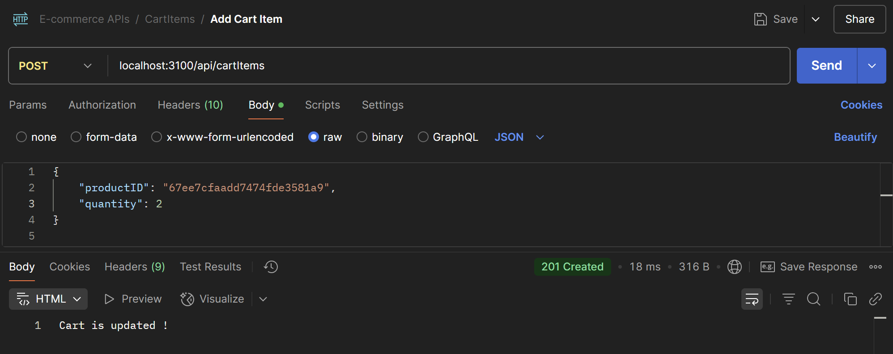


## Modifying '\_id" in CartItems

### 1. Updated 'mongodb.js' file

#### Before Changes:

```javascript
import { MongoClient } from "mongodb";

const url = process.env.DB_URL;

let client;
export const connectToMongoDB = () => {
  MongoClient.connect(url)
    .then((clientInstance) => {
      client = clientInstance;
      console.log("MongoDB is connected");
    })
    .catch((err) => {
      console.log(err);
    });
};

export const getDB = () => {
  return client.db();
};
```

#### After Changes:

```javascript
import { MongoClient } from "mongodb";

const url = process.env.DB_URL;

let client;
export const connectToMongoDB = async () => {
  try {
    const clientInstance = await MongoClient.connect(url);
    client = clientInstance;
    console.log("MongoDB is connected");
    const db = client.db();
    await createCounter(db);
  } catch (err) {
    console.error("Error connecting to MongoDB:", err);
    throw err;
  }
};

export const getDB = () => {
  if (!client) {
    throw new Error("MongoDB client is not connected.");
  }
  return client.db();
};

const createCounter = async (db) => {
  const existingCounter = await db
    .collection("counters")
    .findOne({ _id: "cartItemId" });
  if (!existingCounter) {
    console.log("Counter doesn't exist. Creating it...");
    await db.collection("counters").insertOne({ _id: "cartItemId", value: 0 });
  } else {
    console.log("Counter already exists.");
  }
};
```

The MongoDB connection function connectToMongoDB was updated from a basic version to an enhanced version that includes auto-initialization of a counter document in the counters collection.

1. New Functionality Added: createCounter(db)
   - Purpose: Ensures that the cartItemId counter document exists in the database.
   - What it does:
     - Looks for a document with \_id: "cartItemId" in the counters collection.
     - If it does not exist, it creates one with an initial value of 0.
     - If it already exists, it logs that no action is needed.
2. Where It Was Integrated: The createCounter(db) function is now called immediately after a successful connection to MongoDB inside connectToMongoDB()
   ```javascript
   const db = client.db();
   await createCounter(db);
   ```

#### 🔍 Why This Is Important ?

This change prevents runtime errors when attempting to auto-increment cartItemId values. It ensures the required counter exists before any cart item operations occur in the app.

### 2. Updated 'cartItems.repository.js' file

1. add Method (Updated to Check Existing Item Before Insertion)

#### Before Changes

```javascript
async add(productID, userID, quantity) {
    try {
      const db = getDB();
      const collection = db.collection(this.collection);

      // Add a new product to the cart or update quantity if it already exists
      await collection.updateOne(
        { productID: new ObjectId(productID), userID: new ObjectId(userID) },
        {
          $inc: {
            quantity: quantity,
          },
        },
        { upsert: true } // Insert new document if no match is found
      );
    } catch (err) {
      console.log(err);
      throw new ApplicationError("Something went wrong with Data", 500);
    }
  }
```

#### After Changes

```javascript
async add(productID, userID, quantity) {
    try {
      const db = getDB();
      const collection = db.collection(this.collection);

      // Check if the product already exists in the user's cart
      const existingItem = await collection.findOne({
        productID: new ObjectId(productID),
        userID: new ObjectId(userID),
      });

      if (existingItem) {
        // If it exists, just update the quantity
        await collection.updateOne(
          { _id: existingItem._id },
          { $inc: { quantity: quantity } }
        );
      } else {
        // If not exists, get the next counter and insert the new item
        const id = await this.getNextCounter(db);
        console.log("Generated ID for new item:", id);

        await collection.insertOne({
          _id: id,
          productID: new ObjectId(productID),
          userID: new ObjectId(userID),
          quantity: quantity,
        });
      }
    } catch (err) {
      console.log(err);
      throw new ApplicationError("Something went wrong with database", 500);
    }
  }
```

- Goal: The method now checks if a product already exists in the user's cart.
- Changes:

  - First, a search for an existing cart item is performed using findOne(). The query checks for a matching productID and userID.
  - If the item already exists, instead of inserting a new one, the method updates the quantity of the existing item using the $inc operator.
  - If the item does not exist, the method generates a new counter ID and inserts a new document into the collection with a newly generated \_id.

  This ensures that if a product already exists in the user's cart, only the quantity is updated. If it doesn’t exist, a new entry is inserted with a new ID

2. getNextCounter Method (Newly Added)

```javascript
async getNextCounter(db) {
    const resultDocument = await db
      .collection("counters")
      .findOneAndUpdate(
        { _id: "cartItemId" },
        { $inc: { value: 1 } },
        { returnDocument: "after" }
      );
    console.log("Next counter value:", resultDocument.value);
    return resultDocument.value;
  }
```

- Goal: To generate a unique ID for new cart items by incrementing a counter in the database.
- Changes:

  - The method now interacts with the counters collection to get the next available value for cartItemId.
  - It uses findOneAndUpdate to atomically increment the counter value. The returnDocument: "after" option ensures that the updated value is returned.
  - This updated value is then used as the \_id for new cart items.

  This ensures that each new cart item gets a unique \_id by incrementing a counter.

### 3. Testing in Postman

#### Inserting a Product into the Cart by User-1:


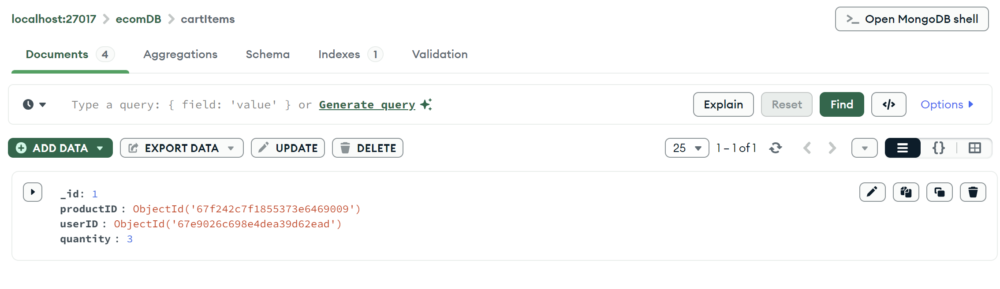


#### Updating Quantity of a Product Already in the Cart by User-1:


#### Inserting a Product into the Cart by User-2:


## Indexes in MongoDB

### Introduction to Indexes

- Indexes are essential for optimizing query performance in MongoDB.
- In MongoDB, indexes enhance the speed of query execution and can
  significantly improve overall database performance.

### When Do We Need Indexes?

1. Indexes are crucial when you're dealing with large collections and want to
   improve the efficiency of queries
2. High Query Volume: If your application frequently queries specific fields,
   indexes can significantly speed up these queries.
3. Sorting and Aggregation: Indexes improve sorting and aggregation
   operations, common in reporting and analytics scenarios.
4. Join Operations: Indexes can enhance join-like operations if you're working
   with related data in different collections.

### Using the createIndex Method

- Step 1: Connect to the MongoDB Server

  - Before creating an index, establish a connection to your MongoDB server
    using the appropriate driver.

- Step 2: Choose a Collection.

  - Select the collection you want to create an index.

- Step 3: Determine the Index Fields - Identify the fields that should be indexed. For example, we have a
  “products” collection with a name field.

- Step 4: Use createIndex.

  - Use the createIndex method to create an index on the chosen field:

  ```javascript
  db.products.createIndex({ name: 1 });
  ```

Note: The number 1 indicates ascending order. Use -1 for descending order.

### Compound Indexes

Compound indexes involve multiple fields. They can significantly enhance query
performance for complex queries that involve multiple fields. Let's create a
compound index for our “products” collection:

- Step 1: Determine Index Fields.

  - Choose the fields that you frequently query or filter together. For instance, let's
    consider the category and price fields.

- Step 2: Create the Compound Index

  ```javascript
  db.products.createIndex({ category: 1, price: -1 });
  ```

### Use Cases for Compound Indexes

Imagine you're building an e-commerce platform. Here are a couple of scenarios
where the compound index we created could be beneficial:

1. **Filtering by Category and Price Range:** If users often search for products
   within a specific category and price range, the compound index will speed up
   these queries.
2. **Sorting by Price Within a Category:** When users want to see products in a
   particular category sorted by price, the compound index will optimize this
   sorting operation.

### 1. Updated 'mongodb.js' file

```javascript
// added
const createIndexes = async (db) => {
  try {
    await db.collection("products").createIndex({ price: 1 });
    await db.collection("products").createIndex({ name: 1, cattegory: -1 });
    await db.collection("products").createIndex({ desc: "text" });
  } catch (err) {
    console.log(err);
  }
  console.log("Indexes are created");
};
```

To ensure that specific indexes are created on the products collection right after the MongoDB connection is established. This improves query performance and enables features like text search.

#### What the `createIndexes` Function Does:

This function creates three indexes on the products collection:

- Single field Index on price field (ascending): Speeds up sorting/filtering by price.
- Compound index on name and cattegory fields: Enhances queries that involve both fields.
  - ⚠️ Note: cattegory may be a typo — consider correcting it to category.
- Text index on desc field: Enables full-text search capabilities on product descriptions.

```javascript
await createIndexes(db);
```

The connectToMongoDB function has been enhanced to include a call to createIndexes(db) alongside the existing createCounter(db) call. This ensures that essential indexes on the products collection are automatically created upon establishing a connection to the database.

### 2. Indexes created in MongoDB


## Understanding Comparison and Logical Operators in MongoDB

Comparison and logical operators are essential tools for querying data in MongoDB.
They allow you to filter, combine, and manipulate data to retrieve the exact
information you need.

### Comparison Operators

Comparison operators help you compare values and retrieve documents that match
specific conditions. Here are some common comparison operators:

- $eq: Equals
- $ne: Not Equals
- $gt: Greater Than
- $lt: Less Than
- $gte: Greater Than or Equal
- $lte: Less Than or Equal

#### Use Case:

Imagine you have an e-commerce database with a ‘products’ collection. You want to
find products with prices between $50 and $100.

```javascript
db.products.find({ price: { $gte: 50, $lte: 100 } });
```

### Logical Operators

Logical operators allow you to combine multiple conditions in your queries. Here are
some common logical operators:

- $and: Logical AND
- $or: Logical OR
- $not: Logical NOT

#### Use Case:

Finding Premium or Discounted Products
Suppose you want to find products that are either premium products (price > $200)
or products on discount (price < $50).

```javascript
db.products.find({
  $or: [
    { price: { $gt: 200 } }, // Premium products
    { price: { $lt: 50 } }, // Discounted products
  ],
});
```

### Combining Comparison and Logical Operators

You can combine comparison and logical operators to create more complex queries.

#### Use Case:

Premium Products with High Ratings
To find premium products (price > $200) with a high rating (rating > 4):

```javascript
db.products.find({
  $and: [
    { price: { $gt: 200 } }, // Premium products
    { rating: { $gt: 4 } }, // High rating
  ],
});
```

### 1. Updated 'product.repository.js' file

The main changed part in updated ProductRepository class is in the `filter` method, specifically how the `category` filtering is handled.

#### Old version

```javascript
let filterExpression = {};
if (minPrice) {
  filterExpression.price = { $gte: parseFloat(minPrice) };
}
if (maxPrice) {
  filterExpression.price = {
    ...filterExpression.price,
    $lte: parseFloat(maxPrice),
  };
}
if (category) {
  filterExpression.category = category;
  // filterExpression = { $and: [{ category: category }, filterExpression] };
}
```

This version assumed `category` is a single string (e.g. "Computers").

#### New version (updated logic):

```javascript
let filterExpression = {};
if (minPrice) {
  filterExpression.price = { $gte: parseFloat(minPrice) };
}
if (maxPrice) {
  filterExpression.price = {
    ...filterExpression.price,
    $lte: parseFloat(maxPrice),
  };
}
if (category) {
  // Replace single quotes with double quotes and parse the JSON string safely
  const parsedCategories = JSON.parse(category.replace(/'/g, '"'));
  filterExpression = {
    $and: [{ category: { $in: parsedCategories } }, filterExpression],
  };
}
```

What This Change Does:

- Allows multiple categories to be passed as a stringified array, e.g. ["Computers", "Geography"].
- Converts any single quotes to double quotes so that JSON.parse can safely parse the string.
- Builds a compound filter using $and:
  - Ensures the product’s category is one of the parsed categories.
  - Applies the existing price filters alongside.
- Now supports multi-category filtering.

### 2. Testing in Postman


## Projection Operators in MongoDB

Projection operators are powerful tools in MongoDB that allow you to control which
fields to include or exclude in query results. They provide flexibility in shaping query
outputs to match your specific needs. Let's delve into how projection operators work
and explore real-world use cases.

### Basic Projection

The basic projection involves specifying which fields you want to retrieve from the
documents in your query results. Here are the key projection operators:

- { field: 1 }: Include the specified field.
- { \_id: 0 }: Exclude the \_id field.

#### Use Case: Retrieving Specific Fields

Imagine you have a ‘users’ collection with various fields, but you only need the
username and email of each user.

```javascript
db.users.find({}, { username: 1, email: 1, _id: 0 });
```

### Nested Fields Projection

Projection operators work with nested fields as well, allowing you to extract specific
subfields from documents.

#### Use Case: Extracting Address Information

Consider a ‘customers’ collection with nested address subdocuments. You're
interested in only the city and state fields.

```javascript
db.customers.find({}, { "address.city": 1, "address.state": 1, _id: 0 });
```

### Conditional Projection

Projection operators can be combined with query conditions to project fields
conditionally.

#### Use Case: Showing Premium Users' Email Addresses

Suppose you have a subscribers collection and want to display email addresses only
for users with premium subscriptions

```javascript
db.subscribers.find({ isPremium: true }, { email: 1, _id: 0 });
```

### 1. Updated 'product.repository.js' file

The only changed part of code is inside the filter method. Specifically, the change involves how the projection is applied to the query result.

#### Old Version:

```javascript
return collection.find(filterExpression).toArray();
```

🚫 What This Meant:

- It returned entire product documents, including:
  - \_id, name, price, category, description, ratings, and any other fields present.
- The full ratings array (possibly large) was also returned for every product

#### New Version:

```javascript
return collection
  .find(filterExpression)
  .project({ name: 1, price: 1, _id: 0, ratings: { $slice: -1 } })
  .toArray();
```

✅ Explanation of Changes:

- .project({ name: 1, price: 1, \_id: 0, ratings: { $slice: -1 } }) is added.
- This line ensures only specific fields are returned from the query:
  - name and price: included (1)
  - \_id: excluded (0)
  - ratings: only the last rating (most recent) is returned using $slice: -1

💡 Why this is useful:

- It reduces the amount of data sent to the client, making the response faster and more efficient.
- Ideal for scenarios like product listing pages where only key details (like name, price, and latest rating) are needed instead of full product data.

### 2. Testing in Postman


## Aggregation Operators in MongoDB

Aggregation operators are a versatile toolset in MongoDB that allows you to process
and transform data to gain insights and perform complex operations. They enable
you to manipulate, reshape, and summarize data within your collections. Let's
explore how aggregation operators work and delve into practical scenarios.

### Basic Aggregation

The basic aggregation operation involves stages that process documents in
sequence. Here's an overview of some key aggregation stages:

- $match: Filters documents based on specified criteria.
- $group: Groups documents by specific fields and performs aggregate
  calculations.
- $project: Shapes the output documents by including or excluding fields.
- $sort: Sorts documents based on specified fields.

#### Use Case: Calculate Average Rating

Consider a ‘products’ collection with name, category, and rating fields. You want to
calculate the average rating for each category.

```javascript
db.products.aggregate([
  {
    $group: {
      _id: "$category",
      avgRating: { $avg: "$rating" },
    },
  },
]);
```

### Combining Aggregation Stages

You can chain multiple aggregation stages to perform more complex operations.

#### Use Case: Find Top Categories by Average Price

Given the same products collection, you want to find the top categories with the
highest average price.

```javascript
db.products.aggregate([
  {
    $group: {
      _id: "$category",
      avgPrice: { $avg: "$price" },
    },
  },
  {
    $sort: { avgPrice: -1 },
  },
  {
    $limit: 5,
  },
]);
```

### Aggregation Expressions

Aggregation expressions enable advanced calculations and transformations.

#### Use Case: Calculating Total Revenue

Assuming you have an ‘orders’ collection with quantity and price fields, you want to
calculate the total revenue.

```javascript
db.orders.aggregate([
  {
    $project: {
      totalRevenue: { $multiply: ["$quantity", "$price"] },
    },
  },
  {
    $group: {
      _id: null,
      total: { $sum: "$totalRevenue" },
    },
  },
]);
```

## Aggregation Pipeline Part-1

### 1. Updated 'product.controller.js' file

A new method averagePrice(req, res, next) was added to the ProductController class.
This method calls productRepository.averageProductPricePerCategory() to calculate average price per category and sends the result with a 200 OK status.

```javascript
// Added
async averagePrice(req, res, next) {
  try {
    const result = await this.productRepository.averageProductPricePerCategory();
    res.status(200).send(result);
  } catch (err) {
    console.log(err);
    return res.status(500).send("Something went wrong");
  }
}
```

### 2. Updated 'product.repository.js' file

The averageProductPricePerCategory() method calculates the average price of products grouped by category.

```javascript
// Added
async averageProductPricePerCategory() {
  try {
    const db = getDB();
    return await db
      .collection(this.collection)
      .aggregate([
        {
          // Get Average price per category
          $group: {
            _id: "$category",
            averagePrice: { $avg: "$price" },
          },
        },
      ])
      .toArray();
  } catch (err) {
    console.log(err);
    throw new ApplicationError("Something went wrong with Data", 500);
  }
}
```

MongoDB’s .aggregate() method processes data records and returns computed results using a pipeline. Each stage transforms the data.

- "\_id": "$category" — Groups all documents by their category field.
- "averagePrice": { $avg: "$price" } — Calculates the average price for each group (category).

### 3. Updated 'product.routes.js' file

Added a new GET route /averagePrice that calls productController.averagePrice() to handle average price calculation.

```javascript
productRouter.get("/averagePrice", (req, res, next) => {
  productController.averagePrice(req, res);
});
```

### 4. Testing in Postman

#### Products Collection


#### Average Price Per Category


## Before Preceeding Add Some Ratings

#### User-3 signed up, then signed in, and subsequently added a rating.


#### Product collection after various users added ratings to different products

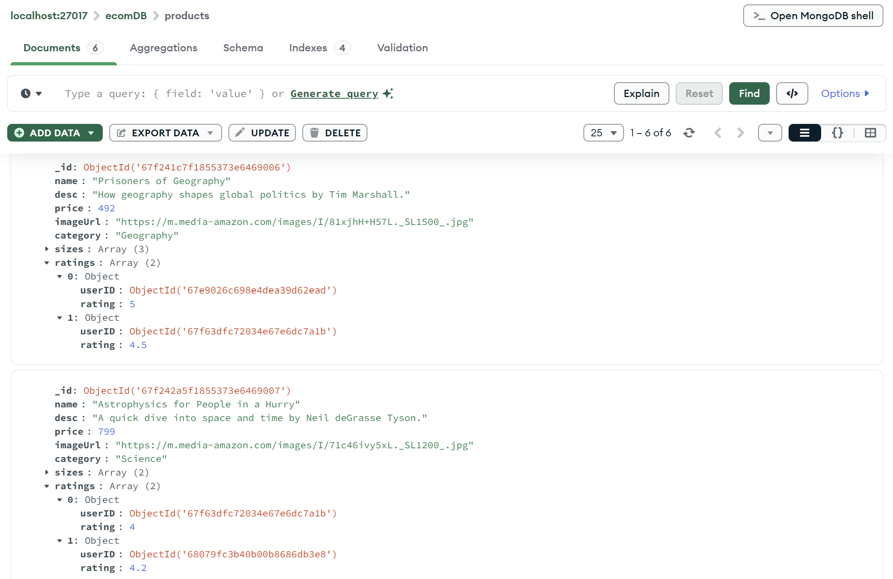


## Aggregation Pipeline Part-2

### Q1: Find the average price per category.

```javascript
db.products.aggregate([
  // Get average price per category
  {
    $group: {
      _id: "$category",
      averagePrice: { $avg: "$price" },
    },
  },
]);
```

- $group: This operator groups documents by the specified field (category) and calculates aggregates (like average, sum, etc.) for each group. Here, it's used to calculate the average price for each category using $avg.


### Q2: Calculate the average rating of a product.

```javascript
db.products.aggregate([
  {
    // 1. Unwind the ratings array
    $unwind: "$ratings",
  },
  {
    // 2. Group by product name and calculate the average rating
    $group: {
      _id: "$name",
      averageRating: { $avg: "$ratings.rating" },
    },
  },
]);
```

- $unwind: Flattens an array (here, the ratings array), creating a separate document for each element inside the array.
- $group: Groups documents by product name and calculates the average of ratings using $avg.


### Q3: Find the count of ratings per product.

```javascript
db.products.aggregate([
  {
    //  Project name of product, and countOfRating
    $project: {
      name: 1,
      countOfRating: {
        $cond: {
          if: { $isArray: "$ratings" },
          then: { $size: "$ratings" },
          else: 0,
        },
      },
    },
  },
]);
```

- $project: This operator reshapes the documents. Here, it keeps the name field and computes the count of ratings for each product.
- $cond: A conditional operator used to check if ratings is an array. If true, it counts the number of ratings using $size; otherwise, it returns 0.


### Q4: Find the product with the highest number of ratings.

```javascript
db.products.aggregate([
  {
    // 1. Project name of product, and countOfRating
    $project: {
      name: 1,
      countOfRating: {
        $cond: {
          if: { $isArray: "$ratings" },
          then: { $size: "$ratings" },
          else: 0,
        },
      },
    },
  },
  {
    // 2. Sort the collection
    $sort: { countOfRating: -1 },
  },
  {
    // 3. Limit to just 1 item in result
    $limit: 1,
  },
]);
```

- $project: Similar to Q3, it includes the name field and calculates the count of ratings.
- $sort: Sorts the products by the countOfRating field in descending order (highest first).
- $limit: Limits the output to only the top product with the most ratings.

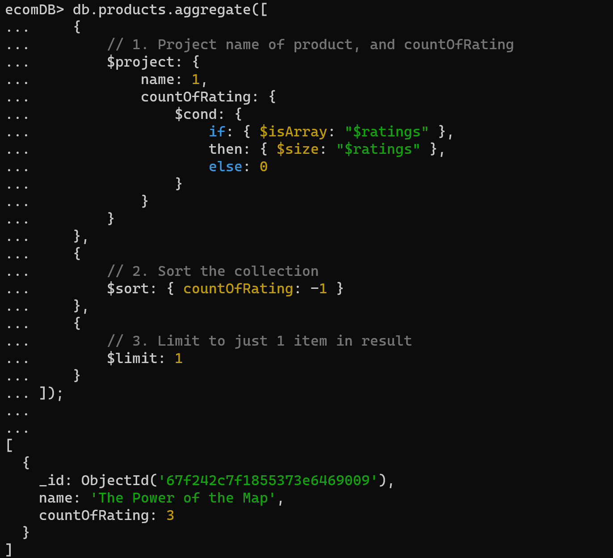

#### Summary of Operators:

1. $group: Groups documents by a specified field and applies aggregate functions like $avg, $sum, etc.
2. $unwind: Flattens an array field, creating separate documents for each array element.
3. $project: Reshapes documents, specifying which fields to include or exclude.
4. $cond: Performs conditional logic.
5. $size: Calculates the size of an array.
6. $sort: Sorts the results based on specified fields.
7. $limit: Limits the result to a specified number of documents.

## Added 'Order' Feature

### 1. Created 'order.model.js' file: (Defines Order Structure / Blueprint)

```javascript
export default class OrderModel {
  constructor(userId, totalAmount, timestamp) {
    this.userId = userId;
    this.totalAmount = totalAmount;
    this.timestamp = timestamp;
  }
}
```

- `OrderModel` is a simple class used to structure an order object.
- It includes:
  - `userId`: Who placed the order.
  - `totalAmount`: Total cost of the order.
  - `timestamp`: When the order was created.
- This class might later be used to save structured orders to the database.

### 2. Created 'order.controller.js' file: (Handles Logic for Routes)

```javascript
import OrderRepository from "./order.repository.js";

export default class OrderController {
  constructor() {
    this.orderRepository = new OrderRepository();
  }

  async placeOrder(req, res, next) {
    try {
      const userId = req.userId;
      await this.orderRepository.placeOrder(userId);
      res.status(201).send("Order is created !");
    } catch (err) {
      console.log(err);
      return res.status(500).send("Something went wrong");
    }
  }
}
```

- `OrderController` encapsulates the business logic.
- It uses `OrderRepository` to handle database operations.
- The `placeOrder` method:
  - Extracts the `userId` from `req` (set by jwtAuth.middleware.js).
  - Calls the repository’s method to handle order placement.
  - Sends a success response or error.

### 3. Created 'order.repository.js' file: (Handles Data Access / DB Operations)

```javascript
export default class OrderRepository {
  constructor() {
    this.collection = "orders";
  }

  async placeOrder(userId) {
    // 1. Get cartitems and calculate total amount.
    // 2. Create an order record.
    // 3. Reduce the stock.
    // 4. Clear the cart items.
  }
}
```

- `OrderRepository` handles the direct interaction with the database.
- In `placeOrder`, the steps mentioned are:
  - Retrieve cart items for the user.
  - Calculate the total.
  - Create and store an order record.
  - Update product stock.
  - Clear the user’s cart.

### 4. Created 'order.routes.js' file: (Defines Routes)

```javascript
import express, { Router } from "express";
import OrderController from "./order.controller.js";

const orderRouter = express.Router();
const orderController = new OrderController();

orderRouter.post("/", (req, res, next) => {
  orderController.placeOrder(req, res, next);
});

export default orderRouter;
```

- `express.Router()` is used to create a router instance specific to order-related routes.
- It defines a `POST` route `/`, which calls the `placeOrder` method from the controller.

The module exports `orderRouter`, allowing it to be integrated into the main app [For Eg: server.use('/orders', orderRouter)].

### 4. Updated 'server.js' file: (Main Request Handling Entry Point)

```javascript
import orderRouter from "./src/features/order/order.routes.js"; //New Import
```

```javascript
server.use("/api/orders", jwtAuth, orderRouter); // Added
```

The Order module (orderRouter) has been integrated into the Express app with JWT authentication, ensuring that only authenticated users can access order-related endpoints. All order operations are now accessible via the /api/orders route.

### File Flow:

```javascript
server.js → jwtAuth.middleware.js → order.routes.js → order.controller.js → order.repository.js → (order.model.js) → Response
```

1. Request → Server (Express)
2. Server → JWT Authentication Middleware
3. JWT Middleware → Verifies Token
4. Token Valid → Route is Triggered (e.g., Order Route)
5. Route → Controller (e.g., OrderController)
6. Controller → Repository (e.g., OrderRepository)
7. Repository → Model (Optional)
8. Repository → Executes Database Operations
9. Controller → Sends Response to Clien

## Transactions in MongoDB

### 1. Updated 'order.repository.js' file

```javascript
import { ObjectId } from "mongodb";
import { getDB } from "../../../config/mongodb.js";

export default class OrderRepository {
  constructor() {
    this.collection = "orders";
  }

  async placeOrder(userId) {
    // 1. Get cartitems and calculate total amount.
    await this.getTotalAmount(userId);
    // 2. Create an order record.
    // 3. Reduce the stock.
    // 4. Clear the cart items.
  }
  async getTotalAmount(userId) {
    const db = getDB();

    const items = await db
      .collection("cartItems")
      .aggregate([
        // 1. Filter cart items for the specific user
        {
          $match: { userID: new ObjectId(userId) },
        },
        // 2. Join with the 'products' collection to get product details
        {
          $lookup: {
            from: "products",
            localField: "productID",
            foreignField: "_id",
            as: "productInfo",
          },
        },
        // 3️. Unwind the productInfo array to make it a flat object
        {
          $unwind: "$productInfo",
        },
        // 4️. Add a new field 'totalAmount' = price * quantity
        {
          $addFields: {
            totalAmount: {
              $multiply: ["$productInfo.price", "$quantity"],
            },
          },
        },
      ])
      .toArray();

    console.log(items);
    // console.log("Individual productInfo objects:");
    // items.forEach((item) => {
    //   console.log(item.productInfo);
    // });

    // Calculate the grand total amount for the entire cart
    const finalTotalAmount = items.reduce(
      (acc, item) => acc + item.totalAmount,
      0
    );
    console.log("Total amount for user's cart:", finalTotalAmount);
  }
}
```

Implemented the `getTotalAmount(userId)` method and invoked it inside the `placeOrder` method. This function:

1. Fetches the cart items for a user.
2. Joins the product details (like price).
3. Calculates the total price per item (price \* quantity).
4. Aggregates the total amount for the order.

#### Note: Why Step-2 ?

In the cart, only the `productID` and `quantity` are stored — not the `price`. So we need to join the products table to get the price.

#### 1. $match

```javascript
{
  $match: {
    userID: new ObjectId(userId);
  }
}
```

- Purpose: Filters the `cartItems` to include only those that belong to the current user.
- Why `ObjectId`: Because MongoDB stores `\_id` and `userID` fields as `ObjectId` types, not strings.
- Analogy: Like `WHERE userID = 'abc123'` in SQL.

#### 2. $lookup

```javascript
{
  $lookup: {
    from: "products",               // collection to join
    localField: "productID",        // field in cartItems
    foreignField: "_id",            // field in products
    as: "productInfo"               // name of the new field (array)
  }
}
```

- Purpose: Joins the `cartItems` collection with the `products` collection.
- How it works:
  - For each cart item, it finds the product whose `\_id` matches the productID in the cart.
  - Adds the matched product as an array in `productInfo`.
- Analogy: Like a LEFT JOIN in SQL, pulls data from products where `products.\_id === cartItems.productID`

#### 3. $unwind

```javascript
{
  $unwind: "$productInfo";
}
```

- Purpose: Flattens the `productInfo` array created by `$lookup`.
- Why needed: `$lookup` returns an array of matching documents, even if there's only one match.

  For Example:

  ```javascript
  {
  "\_id": 1,
  "name": "Shiv",
  "hobbies": ["Cricket", "Coding", "Music"]
  }
  ```

  After applying this stage:

  ```javascript
  {
    $unwind: "$hobbies";
  }
  ```

  It creates 3 separate documents from one:

  ```javascript
  { "_id": 1, "name": "Shiv", "hobbies": "Cricket" }
  { "_id": 1, "name": "Shiv", "hobbies": "Coding" }
  { "_id": 1, "name": "Shiv", "hobbies": "Music" }
  ```

- Analogy: Like normalizing nested data.

#### 4. $addFields with $multiply

```javascript
{
  $addFields: {
    totalAmount: {
      $multiply: ["$productInfo.price", "$quantity"];
    }
  }
}
```

- Purpose: Adds a new field `totalAmount` to each cart item.
- `$multiply`: Multiplies price from `productInfo` with the `quantity` in cartItems.
- Effect:
  ```javascript
  totalAmount: 10 * 2 = 20
  ```
- Why `addFields`: Because we are adding a computed field, not replacing existing ones.

#### Bonus: .toArray() and reduce()

- `.toArray()`: Executes the aggregation and turns the result into a JS array.
- `reduce()`: Adds all totalAmount values to get the final order amount.

### 2. Testing in Postman


## Transactions Operators in MongoDB Part-2

Transaction operators are essential tools in MongoDB for ensuring data consistency
and integrity in multi-step operations. Transactions enable you to group multiple
operations into a single unit of work that either completes entirely or leaves no trace.
Let's explore how to use transaction operators and understand their real-world
applications.

### 1. Starting a Session

Starting a Session
A session is a logical binding for a series of operations. To start a session, you use
the startSession method.

#### Use Case: E-Commerce Order Processing

Imagine you're processing an order, which involves deducting the product quantity
and updating the order status. A session ensures these operations succeed together.

```javascript
const session = client.startSession();
```

### 2. Starting a Transaction

Transactions are used to group multiple operations as a single atomic unit. You start
a transaction using the startTransaction method within a session.

#### Use Case: Money Transfer

Suppose you're transferring money between accounts. You want to deduct from one
account and credit to another, ensuring that both actions are completed or none at
all.

```javascript
session.startTransaction();
```

### 3. Committing a Transaction

To make the changes within a transaction permanent, you commit the transaction
using the commitTransaction method.

#### Use Case: Reservation System

In a reservation system, you're booking seats for a concert. The reservation is only
confirmed when payment is successful and the transaction is committed.

```javascript
session.commitTransaction();
```

### 4. Aborting a Transaction

If a transaction encounters an issue, you can abort it to discard any changes using
the abortTransaction method.

#### Use Case: Online Store Checkout

During checkout, if a user's payment fails, you'd want to abort the transaction to
prevent changes to the order and inventory.

```javascript
session.abortTransaction();
```

### 5. Ending a Session

Once you've completed all necessary operations, you can end the session using the
endSession method.

#### Use Case: User Registration

After a user registers, you might have multiple operations like sending emails,
creating profiles, and more. An ended session ensures these operations conclude.

```javascript
session.endSession();
```

### 6. Closing the Client

To ensure proper resource management, close the client when you're done with all
operations.

#### Use Case: Application Shutdown

When your application is shutting down or no longer needs the MongoDB
connection, closing the client ensures graceful termination.

```javascript
client.close();
```

Example:

```javascript
// Import the necessary MongoDB driver
const { MongoClient } = require("mongodb");

// Connection URL
const url = "mongodb://localhost:27017";

// Create a new MongoClient
const client = new MongoClient(url);

// Define the main function
async function main() {
  try {
    // Connect to the MongoDB server
    await client.connect();
    console.log("Connected to MongoDB");

    // Start a session
    const session = client.startSession();

    // Define the database and collection
    const database = client.db("mydb");
    const collection = database.collection("transactions");

    // Start a transaction
    session.startTransaction();

    try {
      // Insert a document
      await collection.insertOne({ name: "Transaction 1" });
      console.log("Document inserted");

      // Update the document
      await collection.updateOne(
        { name: "Transaction 1" },
        { $set: { status: "completed" } }
      );
      console.log("Document updated");

      // Commit the transaction
      await session.commitTransaction();
      console.log("Transaction committed");
    } catch (error) {
      // If there's an error, abort the transaction
      console.log("Error:", error);
      console.log("Transaction aborted");
      await session.abortTransaction();
    } finally {
      // End the session
      session.endSession();
    }
  } catch (error) {
    console.log("Error:", error);
  } finally {
    // Close the client
    await client.close();
    console.log("MongoDB connection closed");
  }
}

// Call the main function
main();
```

1. We import the necessary MongoClient from the MongoDB driver.
2. Define the connection URL (url) to your MongoDB server.
3. Create a new instance of MongoClient.
4. Define the main function where all the MongoDB operations take place.
5. Inside the main function, we start by connecting to the MongoDB server using
   await `client.connect()`.
6. We start a session using `const session = client.startSession()`.
7. Define the database and collection you want to work with using
   `client.db("mydb") and database.collection("transactions")`.
8. Begin a transaction with `session.startTransaction()`.
9. Inside the transaction, we perform two operations: inserting a document and
   updating its status in the collection.
10. If the operations within the transaction are successful, we commit the
    transaction using `session.commitTransaction()`.
11. If there's an error during the transaction, we handle it by printing the error,
    aborting the transaction with `session.abortTransaction()`, and then finally
    ending the session.
12. After all the transaction handling, we close the MongoDB client connection
    using await `client.close()`.

### 1. Updated 'order.repository.js' file

#### Old Version:

```javascript
import { ObjectId } from "mongodb";
import { getDB } from "../../../config/mongodb.js";

export default class OrderRepository {
  constructor() {
    this.collection = "orders";
  }

  async placeOrder(userId) {
    // 1. Get cartitems and calculate total amount.
    await this.getTotalAmount(userId);
    // 2. Create an order record.
    // 3. Reduce the stock.
    // 4. Clear the cart items.
  }
  async getTotalAmount(userId) {
    const db = getDB();

    const items = await db
      .collection("cartItems")
      .aggregate([
        // 1. Filter cart items for the specific user
        {
          $match: { userID: new ObjectId(userId) },
        },
        // 2. Join with the 'products' collection to get product details
        {
          $lookup: {
            from: "products",
            localField: "productID",
            foreignField: "_id",
            as: "productInfo",
          },
        },
        // 3️. Unwind the productInfo array to make it a flat object
        {
          $unwind: "$productInfo",
        },
        // 4️. Add a new field 'totalAmount' = price * quantity
        {
          $addFields: {
            totalAmount: {
              $multiply: ["$productInfo.price", "$quantity"],
            },
          },
        },
      ])
      .toArray();

    console.log(items);
    // console.log("Individual productInfo objects:");
    // items.forEach((item) => {
    //   console.log(item.productInfo);
    // });

    // Calculate the grand total amount for the entire cart
    const finalTotalAmount = items.reduce(
      (acc, item) => acc + item.totalAmount,
      0
    );
    console.log("Total amount for user's cart:", finalTotalAmount);
  }
}
```

### New Version:

```javascript
import { ObjectId } from "mongodb";
import { getClient, getDB } from "../../../config/mongodb.js";
import OrderModel from "../order/order.model.js";
import { ApplicationError } from "../../error-handler/applicationError.js";

export default class OrderRepository {
  constructor() {
    this.collection = "orders";
  }

  async placeOrder(userId) {
    const client = getClient();
    const session = client.startSession();
    try {
      const db = getDB();
      session.startTransaction();

      // 1. Get cartitems and calculate total amount.
      const items = await this.getTotalAmount(userId, session);
      const finalTotalAmount = items.reduce(
        (acc, item) => acc + item.totalAmount,
        0
      );
      console.log("Final total amount:", finalTotalAmount);

      // 2. Create an order record.
      const newOrder = new OrderModel(
        new ObjectId(userId),
        finalTotalAmount,
        new Date()
      );
      await db.collection(this.collection).insertOne(newOrder, { session });

      // 3. Reduce the stock.
      for (let item of items) {
        await db.collection("products").updateOne(
          {
            _id: item.productID,
          },
          {
            $inc: { stock: -item.quantity },
          },
          { session }
        );
      }
      //throw new Error("Something is wrong in PlaceOrder");

      // 4. Clear the cart items.
      await db.collection("cartItems").deleteMany(
        {
          userID: new ObjectId(userId),
        },
        { session }
      );

      await session.commitTransaction();
      return;
    } catch (err) {
      await session.abortTransaction();
      console.log(err);
      throw new ApplicationError(`Order Failed !`, 500);
    } finally {
      session.endSession();
    }
  }

  async getTotalAmount(userId, session) {
    const db = getDB();

    const items = await db
      .collection("cartItems")
      .aggregate(
        [
          // 1. Filter cart items for the specific user
          {
            $match: { userID: new ObjectId(userId) },
          },
          // 2. Join with the 'products' collection to get product details
          {
            $lookup: {
              from: "products",
              localField: "productID",
              foreignField: "_id",
              as: "productInfo",
            },
          },
          // 3️. Unwind the productInfo array to make it a flat object
          {
            $unwind: "$productInfo",
          },
          // 4️. Add a new field 'totalAmount' = price * quantity
          {
            $addFields: {
              totalAmount: {
                $multiply: ["$productInfo.price", "$quantity"],
              },
            },
          },
        ],
        { session }
      )
      .toArray();

    console.log(items);
    return items;
  }
}
```

1. `placeOrder(userId)` function

   1. Start a MongoDB Session & Transaction

   ```javascript
   const client = getClient();
   const session = client.startSession();
   session.startTransaction();
   ```

   - A session is started to group multiple database operations.
   - A transaction ensures that if one operation fails, all other changes are rolled back — maintaining data integrity.

   2. Get Cart Items and Calculate Total Amount

   ```javascript
   const items = await this.getTotalAmount(userId, session);
   const finalTotalAmount = items.reduce(
     (acc, item) => acc + item.totalAmount,
     0
   );
   ```

   - Calls getTotalAmount() to fetch cart items and their prices.
   - Calculates the total cost of the entire cart.

   3. Create an Order Record

   ```javascript
   const newOrder = new OrderModel(
     new ObjectId(userId),
     finalTotalAmount,
     new Date()
   );
   await db.collection(this.collection).insertOne(newOrder, { session });
   ```

   - Creates an order document with: User ID, Total amount, Timestamp
   - Inserts the order into the orders collection.

   4. Reduce Stock for Each Product

   ```javascript
   for (let item of items) {
     await db
       .collection("products")
       .updateOne(
         { _id: item.productID },
         { $inc: { stock: -item.quantity } },
         { session }
       );
   }
   ```

   - Loops through each cart item.
   - Reduces the stock in the products collection based on the quantity ordered.

   5. Clear Cart Items

   ```javascript
   await db
     .collection("cartItems")
     .deleteMany({ userID: new ObjectId(userId) }, { session });
   ```

   - Deletes all cart items for the user after the order is successfully placed.

   6. Commit or Abort Transaction

   ```javascript
   await session.commitTransaction(); // if all succeeds
   ```

   OR

   ```javascript
   await session.abortTransaction(); // if anything fails
   ```

   - If all the steps are successful, the changes are saved permanently.
   - If an error occurs, all changes are undone (rolled back).

   7. End the Session

   ```javascript
   session.endSession();
   ```

   - Cleans up the session regardless of success or failure.

   8. 🛡️ Error Handling

   ```javascript
   catch (err) {
     await session.abortTransaction();
     throw new ApplicationError(`Order Failed !`, 500);
   }
   ```

   - If something goes wrong (e.g., DB issue or stock mismatch), the order is not placed, and a custom error is thrown.

   This function:

   - Safely processes an order.
   - Ensures data consistency using transactions.
   - Prevents partial updates (e.g., stock reducing without order creation).
   - Is robust against errors.

2. `getTotalAmount(userId)` function

   ```javascript
   async getTotalAmount(userId, session) {
   // aggregate with session passed as an option
    return items;
   }
   ```

   - Session Support Added: New version accepts and uses a session for transactional safety.
   - Return Value Changed: Old version just logs the total; new version returns the items array for further use.

### 2. Updated 'mongodb.js' file

```javascript
export const getClient = () => {
  return client;
};
```

- New Function Added: getClient() is introduced.
  - Purpose: Returns the MongoDB client instance, useful for operations like starting sessions (e.g., for transactions).
- No Changes in Existing Logic: Everything else remains the same, including connectToMongoDB(), getDB(), createCounter(), and createIndexes().

### 3. Testing in Postman Part-1

#### Added Stocks in each Products

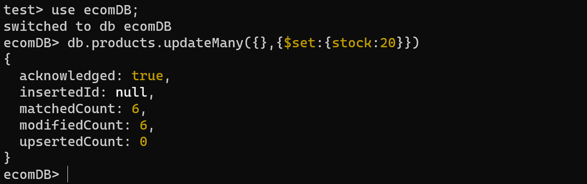
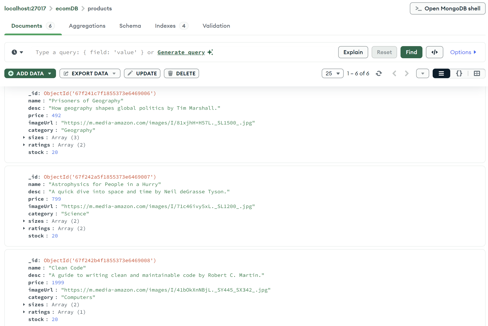

#### PLacing Order in Standalone MongoDB

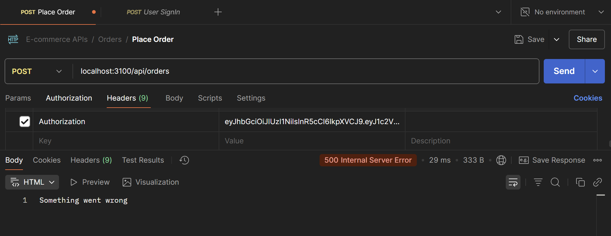
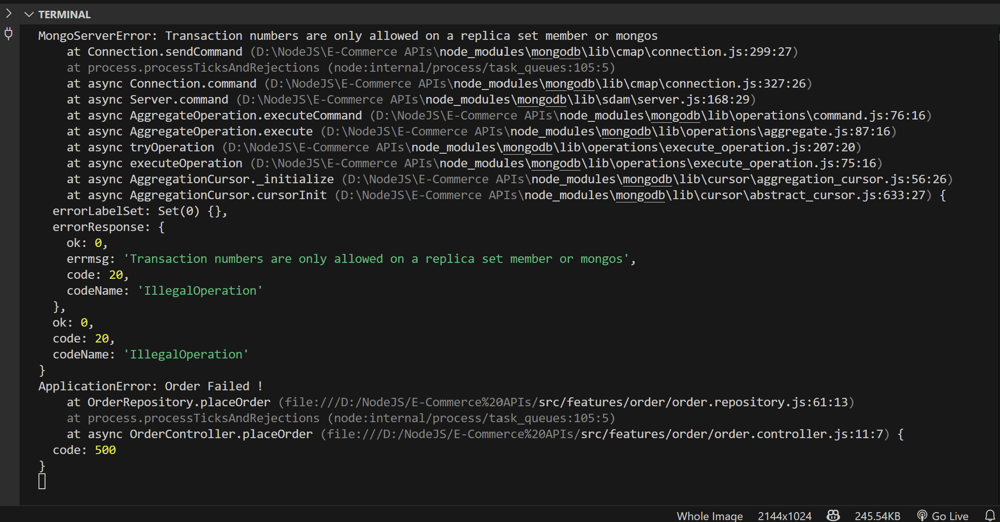

Error:

```sh
MongoServerError: Transaction numbers are only allowed on a replica set member or mongos
```

Happens when trying to use MongoDB transactions (like session.startTransaction()) on a standalone MongoDB server, which does not support transactions.

### 4. Fix: ConcertingExistingMongoDB to ReplicaSet

1. Stop MongoDB if it’s running as a service
   - Press Win + R → type services.msc → Enter.
   - Find MongoDB → Right-click → Stop.
2. Start MongoDB Manually with Replica Set Config
   - Open Command Prompt as Administrator, then run:
   ```bash
   mongod --dbpath "C:\your\existing\data\path" --replSet rs0
   # mongod --dbpath "C:\Program Files\MongoDB\Server\8.0\data" --replSet rs0
   ```
   - NOTE: If if shows a lock file or DBPathInUse error. However, after stopping the MongoDB process from Task Manager, the lock is released, and MongoDB starts successfully.
   - This starts MongoDB with the same data, but with replica set support
     
3. Open a New Command Prompt and Connect Using mongosh

   ```bash
   mongosh
   ```

   Then initiate the replica set:

   ```javascript
   rs.initiate();
   ```

   You should see a success message like:

   ```json
   { "ok": 1 }
   ```

   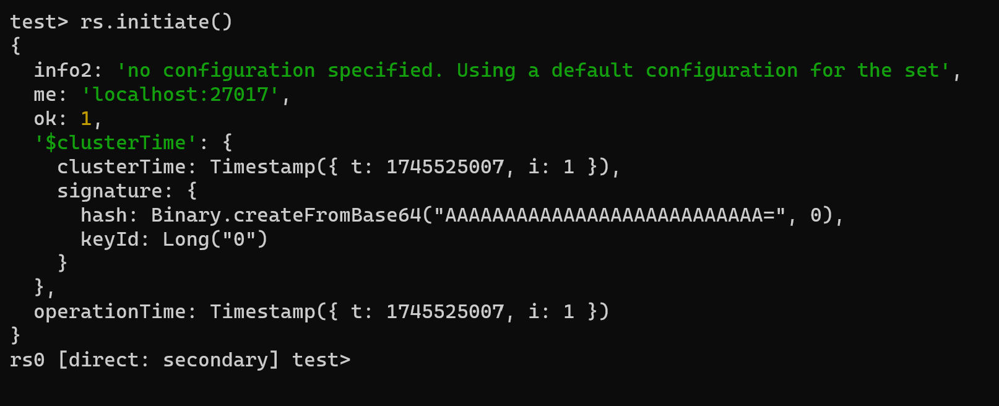

4. Verify the Replica Set is Running
   ```javascript
   rs.status();
   ```
5. Now Transactions Will Work
   - Replica set has been successfully enabled using the existing data.
   - Transactions are now supported in MongoDB Compass and application code.

NOTE:

To find the default data storage path used by MongoDB on Windows:

#### Option 1: Check MongoDB Log File (Best method)

1. Go to: `C:\Program Files\MongoDB\Server\<your version>\log`
2. Open the latest .log file (like mongod.log).
3. Search for dbpath — you’ll find something like:

```sh
[initandlisten] options: { storage: { dbPath: "C:\\data\\db" }, ... }
```

#### Option 2: Check MongoDB Service Configuration (if installed as service)

1. Press Win + R, type services.msc, and press Enter.
2. Find MongoDB in the list.
3. Right-click → Properties → Go to Path to executable.
   Example:

```bash
"C:\Program Files\MongoDB\Server\8.0\bin\mongod.exe" --config "C:\Program Files\MongoDB\Server\8.0\bin\mongod.cfg" --service
```

4. Open that .cfg file (e.g., mongod.cfg) and look for the line:

```bash
"dbPath":"C:/Program Files/MongoDB/Server/8.0/data"
```

That’s your default data path.

### 5. Testing in Postman Part-2

#### Place an Order

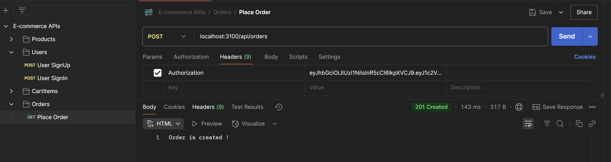

#### Created a new Order Collection

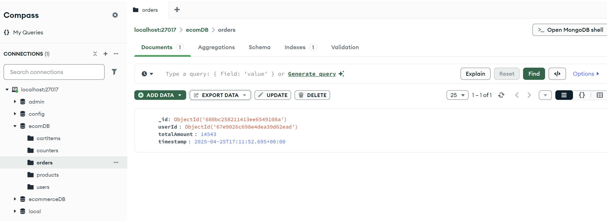

#### Reduced stock for the products

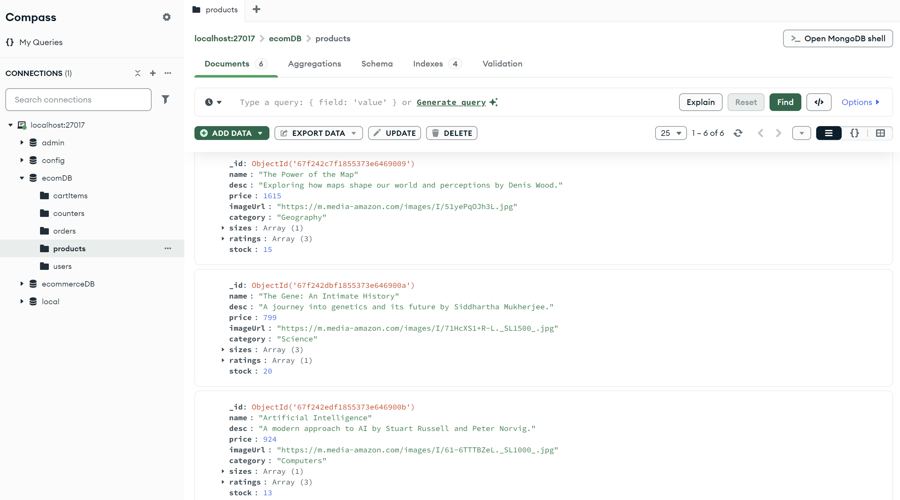

#### Cleared the Cart Items belonging to the specific user

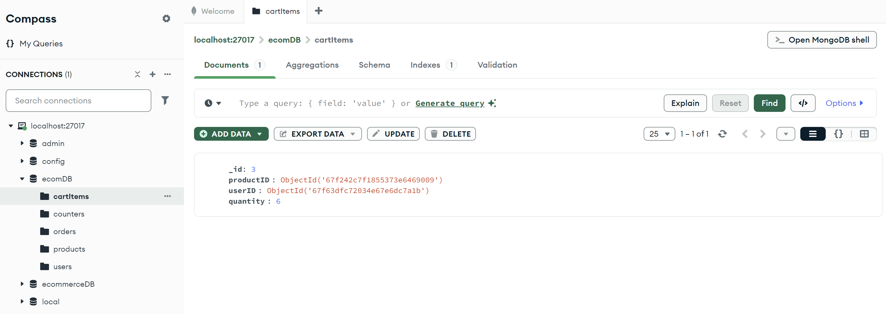
