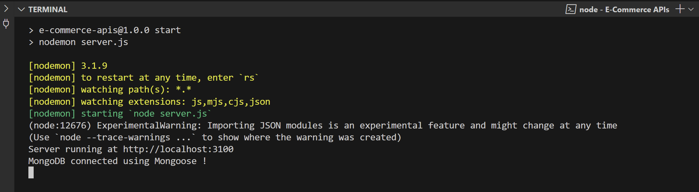
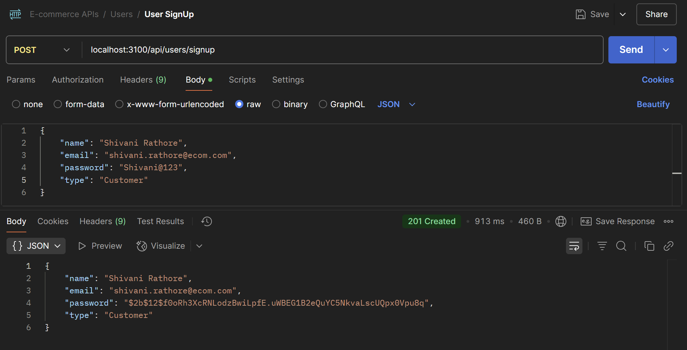
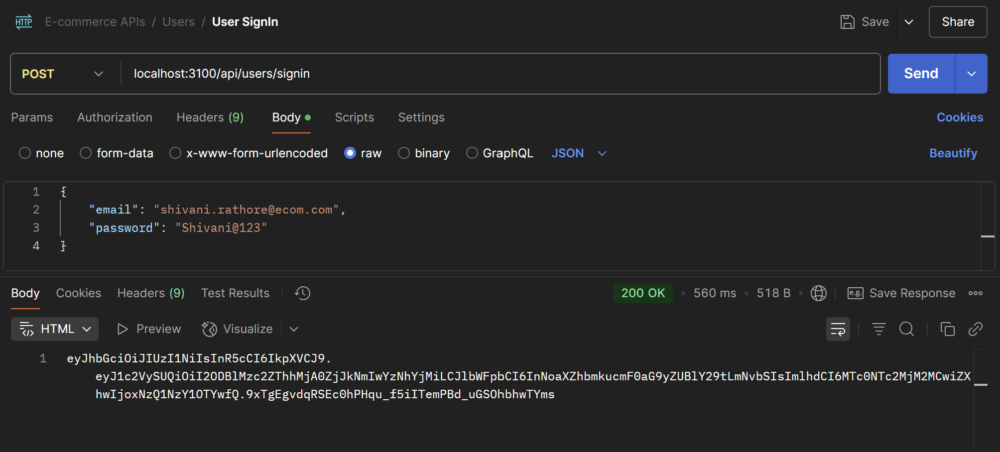
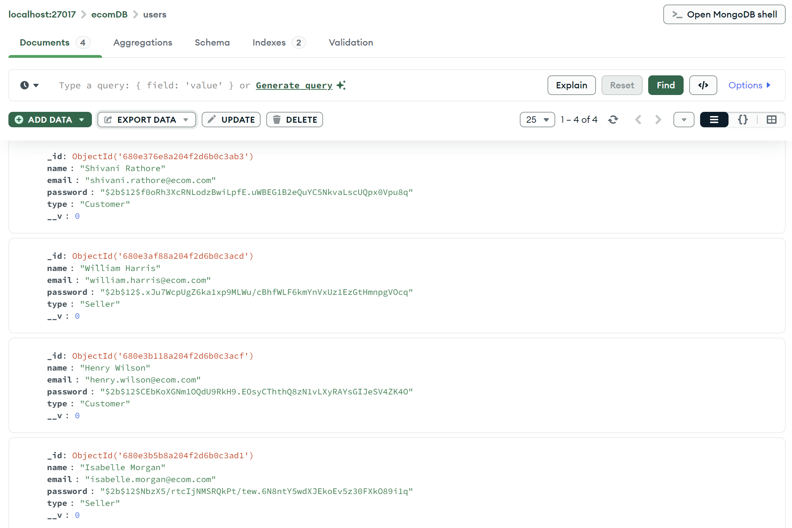

## WORKING WITH MONGOOSE-I

## Understanding Mongoose

Mongoose is a tool that helps you structure and manage MongoDB data easily in Node.js. It provides a schema-based solution to model your application data.

### 🔹 Key Advantages of Mongoose:

1. Schema Validation – Defines structure and data types for documents.
2. Middleware Support – Hooks like pre and post for operations.
3. Built-in Data Casting – Automatically converts data to correct types.
4. Query Helpers – Easy chaining and reusable query logic.
5. Population – Simplifies joining documents (similar to SQL joins).
6. Cleaner Code – Makes MongoDB operations more organized and readable.

## Connecting using Mongoose

### Created 'mongooseConfig.js' file

```javascript
import mongoose from "mongoose";
import dotenv from "dotenv";
dotenv.config();

const url = process.env.DB_URL;
export const connectUsingMongoose = async () => {
  try {
    await mongoose.connect(url);
    console.log("MongoDB connected using Mongoose !");
  } catch (err) {
    console.log("Error while connecting to db !");
    console.log(err);
  }
};
```

#### What Your Code Does:

1. Import libraries
   - `mongoose` → helps you connect to MongoDB easily.
   - `dotenv` → loads environment variables (like DB_URL) from a .env file into your project.
2. Load environment variables
   - `dotenv.config();` → reads .env file so you can use process.env.DB_URL.
3. Get the MongoDB URL
   - `const url = process.env.DB_URL;` → grabs the database connection URL safely.
4. Create an async function to connect
   - `connectUsingMongoose` is an `async` function because connecting to a database takes time (it's an I/O operation).
   - Inside try-catch:
     - `await mongoose.connect(url);` → tries to connect to the MongoDB database using Mongoose.
     - If successful, it prints: "MongoDB connected using Mongoose".
     - If any error happens, it catches it and prints: "Error while connecting to db" and the error details.
5. Export the function
   - `export const connectUsingMongoose = async () => {...}` → allows you to import and call this function from another file (like server.js).



## Creating Schema

### What is a Schema in Mongoose ?

Schema is like a blueprint 🏗️ that defines the structure and rules for documents inside a MongoDB collection.
It tells Mongoose what kind of data your documents should have.

#### 📚 Example:

Imagine you are creating a "Orders" collection for an online shopping app.
Each order should have:

- a customer name (text)
- a product ID (text)
- a quantity (number)
- an order date (date)
- a status (text) like "pending", "shipped", "delivered"

👉 You define a Schema in Mongoose to make sure every order has all these fields correctly filled.

### ✨ Why Schema is Important ?

1. Gives structure to MongoDB data ->
   MongoDB is naturally flexible (schema-less), but Schema adds clear rules about how your data should look.

2. Performs automatic data validation -> It checks if the incoming data matches the correct types and rules before saving it to the database.

3. Adds powerful features like methods, virtual fields, and hooks ->
   You can add custom functions (methods), temporary fields (virtuals), and pre/post actions (hooks) like encrypting passwords before saving.

### 1. Creating Users Schema (user.schema.js)

```javascript
import mongoose from "mongoose";

export const userSchema = new mongoose.Schema({
  name: String,
  email: { type: String, unique: true },
  password: String,
  type: { type: String, enum: ["Customer", "Seller"] },
});
```

This code imports the mongoose library, which allows you to interact with MongoDB using structured models.
Then, it defines and exports a userSchema, which acts like a blueprint for a User document in your database.

The userSchema specifies four fields:

- `name`, which must be a simple text (String),
- `email`, which must be a String and must be unique (no two users can have the same email),
- `password`, which is a String meant to store the user's password (usually hashed before saving),
- `type`, which is a String but restricted to only two values: `"Customer"` or `"Seller"`, using the `enum` property to enforce this rule.

This schema ensures every user document follows a consistent structure, validates data automatically, and prevents errors like duplicate emails or invalid user types.

#### ✨ In very simple words:

"This Schema sets clear rules: Every User must have a name, a unique email, a password, and a role that must be either Customer or Seller ~ nothing extra, nothing missing."

### 2. Products Schema (product.schema.js)

```javascript
import mongoose from "mongoose";

export const productSchema = new mongoose.Schema({
  name: String,
  price: Number,
  categpry: String,
  description: String,
  inStock: Number,
});
```

This code imports the mongoose library, which allows you to work with MongoDB using structured models. Then, it defines and exports a productSchema, which acts as a blueprint for a Product document in your database.

The productSchema specifies five fields:

- `name`, which must be a simple text (String) representing the product's name.
- `description`, which is a String giving a brief description of the product.
- `price`, which must be a Number representing the product's price.
- `category`, which is a String specifying the product's category (e.g., "Electronics").
- `inStock`, which is a Number indicating how many units of the product are available.

This schema ensures that every product document follows a consistent structure, validates the data automatically, and prevents errors like missing information or incorrect product details.

#### ✨ In very simple words:

"This Schema sets clear rules: Every Product must have a name, a price, a category, a description, and a stock count ~ nothing extra, nothing missing."

### 3. Created CartItems Schema (cartItems.schema.js)

```javascript
import mongoose from "mongoose";

export const cartSchema = new Schema({
  productID: {
    type: mongoose.Schema.Types.ObjectId,
    ref: "Product",
  },
  userID: {
    type: mongoose.Schema.Types.ObjectId,
    ref: "User",
  },
  quantity: Number,
});
```

This code defines a cartSchema for storing cart-related information in MongoDB using Mongoose. Here's the breakdown:

The cartSchema specifies three fields:

- `productID`:

  - Type: `mongoose.Schema.Types.ObjectId`
  - Reference: It references the `Product` collection. This means each cart item is linked to a specific product in the `Product` collection. The `ObjectId` is a unique identifier for each product.

- `userID`:

  - Type: `mongoose.Schema.Types.ObjectId`
  - Reference: It references the `User` collection. Each cart is associated with a specific user, identified by their unique `ObjectId` from the `User` collection.

- `quantity`:
  - Type: `Number`
  - This field stores how many units of the product the user has.

This schema ensures every cart document is connected to a product and a user, while also storing how many units of that product the user has.

#### ✨ In simple words:

"This schema defines the cart rules: Each cart contains a product (linked by its ID), belongs to a user (linked by their ID), and includes a quantity for that product ~ nothing extra, nothing missing."

## Models in Mongoose

### 🔹 What is a Model in Mongoose ?

A Model is a direct connection to a MongoDB collection.
It is created using a Schema and provides methods to create, read, update, and delete documents.

- Schema = Defines the structure of the data (blueprint).
- Model = Gives you power to interact with that data in MongoDB.

#### 🎯 In very simple words:

Schema says what the data should look like.
Model lets you actually work with that data ~ like adding, finding, updating, and deleting records inside MongoDB.

### Mongoose Model VS MVC Model

#### 📌 Mongoose Model

1. It is part of the Mongoose library (for MongoDB).
2. It is only responsible for database operations (like saving, finding, deleting).
3. You create it using mongoose.model('Name', schema).
4. It uses a Schema to structure how data should look.
5. Example: A `UserModel` that knows how to save and retrieve users from MongoDB.

#### 📌 MVC Model (Model-View-Controller Model)

1. It is a part of app architecture, not just database.
2. It represents all the business logic and data handling in the application.
3. It may include methods, calculations, rules, and even Mongoose models inside
4. It talks to the database through something like a Mongoose model.
5. Example: A `User` class that handles logic like calculating user age, verifying password, etc.. and also saves/fetches data.

#### 🌟 Quick Example:

Suppose you're building an e-commerce app.

- Mongoose Model: You create a `ProductModel` using Mongoose. It knows how to save products into MongoDB.
- MVC Model: You create a Product class that includes business logic like "apply discount", "check stock" —> and inside it, it may use the `ProductModel` to fetch or save data.

#### 🔥 In Short:

Mongoose Model = deals only with MongoDB.
MVC Model = deals with all the business logic + database + validation in your app.

## Users Operations

### 1. Updated 'user.repository.js' file

Moved existing code from user.repository.js to user.repository_ols.js, and added new code to a fresh user.repository.js file:

```javascript
import mongoose from "mongoose";
import { userSchema } from "./user.schema.js";
import { ApplicationError } from "../../error-handler/applicationError.js";

//Creating Model from Schema
const UserModel = mongoose.model("User", userSchema);

export default class UserRepository {
  async signUp(user) {
    try {
      //create instance of model
      const newUser = new UserModel(user);
      await newUser.save();
      return newUser;
    } catch (err) {
      console.log(err);
      throw new ApplicationError("Something is wrong with database !", 500);
    }
  }

  /*
  async signIn(email, password) {
    try {
      return await UserModel.findOne({ email, password });
    } catch (err) {
      console.log(err);
      throw new ApplicationError("Something is wrong with database !", 500);
    }
  */

  async findByEmail(email) {
    try {
      return await UserModel.findOne({ email });
    } catch (err) {
      console.log(err);
      console.log(err);
      throw new ApplicationError("Something is wrong with database !", 500);
    }
  }
}
```

This file is the **User Repository**, which interacts with the MongoDB database to handle user data. It's built using **Mongoose**, a popular Object Data Modeling (ODM) library for MongoDB and Node.js. Mongoose allows you to define schemas and models for MongoDB collections, making database operations easier.

1. Import Statements

   ```javascript
   import mongoose from "mongoose";
   import { userSchema } from "./user.schema.js";
   import { ApplicationError } from "../../error-handler/applicationError.js";
   ```

   - `mongoose`: A library to interact with MongoDB, providing methods like `.model()`, `.save()`, `.find()`, etc.
   - `userSchema`: A predefined schema (likely in `user.schema.js`) that defines the structure of user documents in MongoDB.
   - `ApplicationError`: A custom error class used to handle application-specific errors, providing structured error management.

2. Creating the User Model from Schema

   ```javascript
   const UserModel = mongoose.model("User", userSchema);
   ```

   - `UserModel` is created from the `userSchema`. The model is a constructor function in Mongoose that represents the collection (`User` in this case) and gives you the ability to perform CRUD (Create, Read, Update, Delete) operations.
   - The first argument `"User"` represents the name of the model and also the name of the collection in MongoDB (Mongoose automatically looks for a lowercase, plural version of the model name, so it'll look for `users` collection).
   - The second argument `userSchema` defines the structure of the documents in the `users` collection.

3. UserRepository Class

   ```javascript
   export default class UserRepository {
     ...
   }
   ```

   - The `UserRepository` class encapsulates the logic for interacting with the `UserModel`. This is a repository pattern, which is useful for organizing code that handles database operations separately from the application logic. It makes it easier to manage and test.

4. signUp Method

   ```javascript
   async signUp(user) {
     try {
       const newUser = new UserModel(user); // create instance of model
       await newUser.save();  // save new user to database
       return newUser;  // return saved user
     } catch (err) {
       console.log(err);
       throw new ApplicationError("Something is wrong with database !", 500);
     }
   }
   ```

   - `async signUp(user)`: This method is asynchronous because database operations are time-consuming. `user` is the input parameter containing the data to be saved for a new user.
   - `new UserModel(user)`: A new instance of `UserModel` is created, which represents a new user document in MongoDB. The `user` object is passed as the data for the new user.
   - `await newUser.save()`: The `save()` method is an asynchronous Mongoose method that saves the document to the database. It's wrapped in `await` because we want to ensure that the document is saved before proceeding further.
   - `return newUser`: After the user is successfully saved, the newUser document (including its MongoDB-generated ID and other auto-generated fields) is returned.
   - `Error Handling`: If an error occurs during the saving process (e.g., a database issue), the `catch` block triggers, throwing a custom `ApplicationError`. This helps manage database-related errors more effectively.

5. findByEmail Method (needed for signUp)

   ```javascript
   async findByEmail(email) {
    try {
      return await UserModel.findOne({ email });  // find a user by email
    } catch (err) {
      console.log(err);
      throw new ApplicationError("Something is wrong with database !", 500);
    }
   }
   ```

   - async findByEmail(email): This method searches for a user by their email. It's also asynchronous because it involves a database query
   - await UserModel.findOne({ email }): The findOne() method is a Mongoose query that searches for the first document that matches the email field. If no match is found, it returns null.
   - Error Handling: As in the signUp method, errors are caught in the catch block and an ApplicationError is thrown with a generic message "Something went wrong with database !" and a status code 500 (Internal Server Error).

The repository class provides methods for user sign-up and finding users by email in MongoDB, with proper error handling. It follows the repository pattern for better scalability and maintainability.

### 2. Testing in Postman

#### User Sign-Up and Sign-In




#### Similarly, add other users to the collection, then review the users collection to check if the users have been added after signup.


