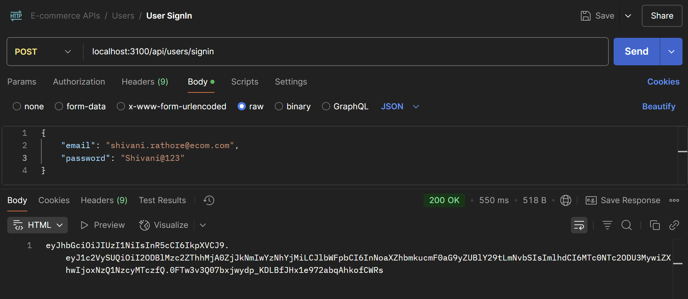
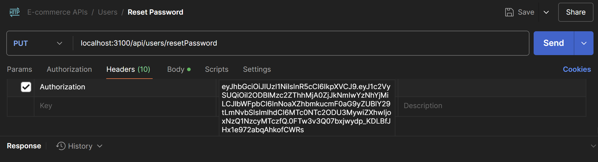
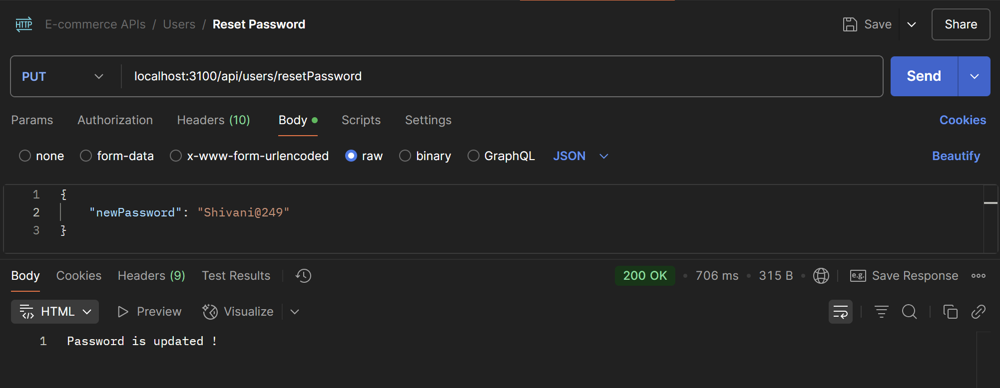
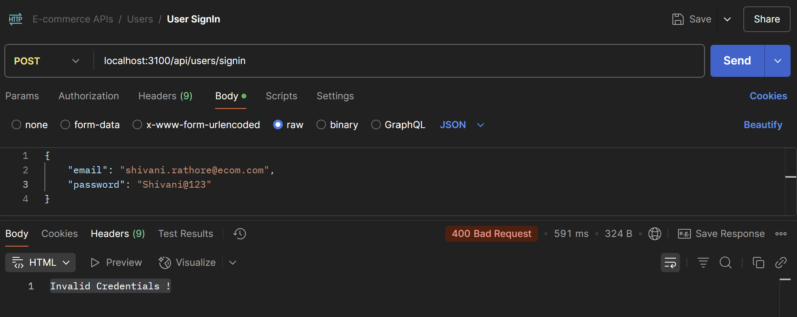
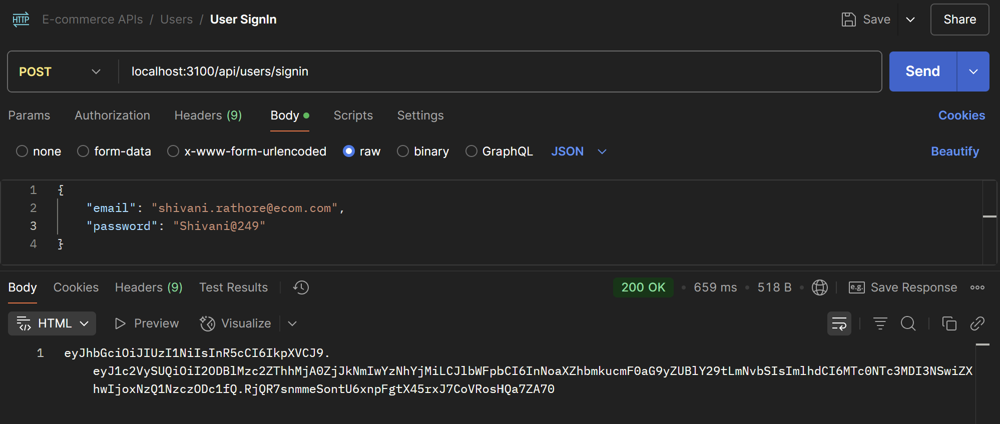
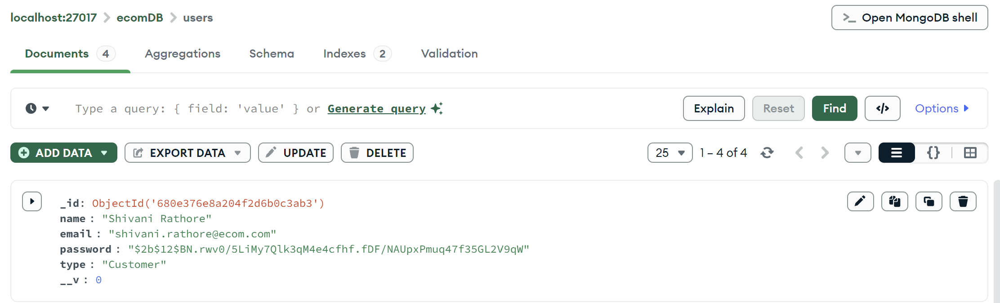
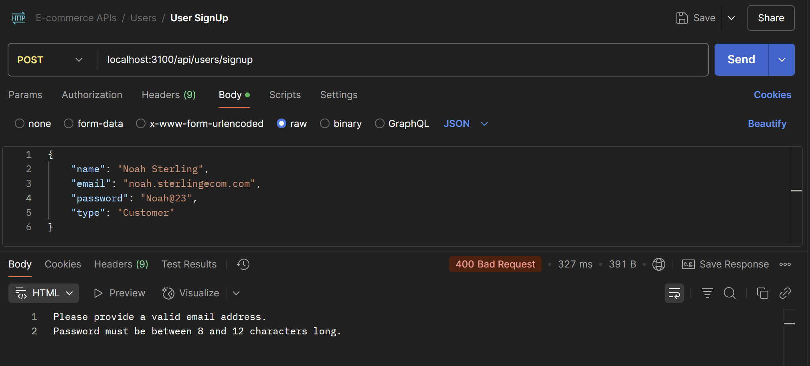
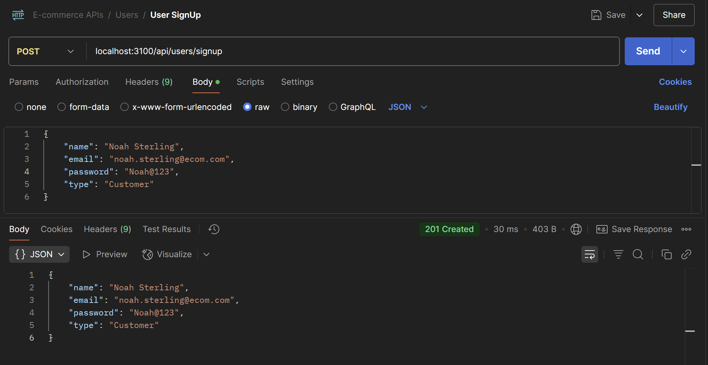
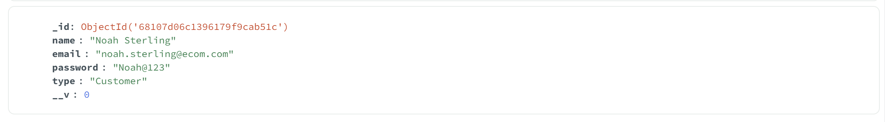

## WORKING WITH MONGOOSE-I

## Understanding Mongoose

Mongoose is a tool that helps you structure and manage MongoDB data easily in Node.js. It provides a schema-based solution to model your application data.

### 🔹 Key Advantages of Mongoose:

1. Schema Validation – Defines structure and data types for documents.
2. Middleware Support – Hooks like pre and post for operations.
3. Built-in Data Casting – Automatically converts data to correct types.
4. Query Helpers – Easy chaining and reusable query logic.
5. Population – Simplifies joining documents (similar to SQL joins).
6. Cleaner Code – Makes MongoDB operations more organized and readable.

## Connecting using Mongoose

### Created 'mongooseConfig.js' file

```javascript
import mongoose from "mongoose";
import dotenv from "dotenv";
dotenv.config();

const url = process.env.DB_URL;
export const connectUsingMongoose = async () => {
  try {
    await mongoose.connect(url);
    console.log("MongoDB connected using Mongoose !");
  } catch (err) {
    console.log("Error while connecting to db !");
    console.log(err);
  }
};
```

#### What Your Code Does:

1. Import libraries
   - `mongoose` → helps you connect to MongoDB easily.
   - `dotenv` → loads environment variables (like DB_URL) from a .env file into your project.
2. Load environment variables
   - `dotenv.config();` → reads .env file so you can use process.env.DB_URL.
3. Get the MongoDB URL
   - `const url = process.env.DB_URL;` → grabs the database connection URL safely.
4. Create an async function to connect
   - `connectUsingMongoose` is an `async` function because connecting to a database takes time (it's an I/O operation).
   - Inside try-catch:
     - `await mongoose.connect(url);` → tries to connect to the MongoDB database using Mongoose.
     - If successful, it prints: "MongoDB connected using Mongoose".
     - If any error happens, it catches it and prints: "Error while connecting to db" and the error details.
5. Export the function
   - `export const connectUsingMongoose = async () => {...}` → allows you to import and call this function from another file (like server.js).


## Creating Schema

### What is a Schema in Mongoose ?

Schema is like a blueprint 🏗️ that defines the structure and rules for documents inside a MongoDB collection.
It tells Mongoose what kind of data your documents should have.

#### 📚 Example:

Imagine you are creating a "Orders" collection for an online shopping app.
Each order should have:

- a customer name (text)
- a product ID (text)
- a quantity (number)
- an order date (date)
- a status (text) like "pending", "shipped", "delivered"

👉 You define a Schema in Mongoose to make sure every order has all these fields correctly filled.

### ✨ Why Schema is Important ?

1. Gives structure to MongoDB data ->
   MongoDB is naturally flexible (schema-less), but Schema adds clear rules about how your data should look.

2. Performs automatic data validation -> It checks if the incoming data matches the correct types and rules before saving it to the database.

3. Adds powerful features like methods, virtual fields, and hooks ->
   You can add custom functions (methods), temporary fields (virtuals), and pre/post actions (hooks) like encrypting passwords before saving.

### 1. Creating Users Schema (user.schema.js)

```javascript
import mongoose from "mongoose";

export const userSchema = new mongoose.Schema({
  name: String,
  email: { type: String, unique: true },
  password: String,
  type: { type: String, enum: ["Customer", "Seller"] },
});
```

This code imports the mongoose library, which allows you to interact with MongoDB using structured models.
Then, it defines and exports a userSchema, which acts like a blueprint for a User document in your database.

The userSchema specifies four fields:

- `name`, which must be a simple text (String),
- `email`, which must be a String and must be unique (no two users can have the same email),
- `password`, which is a String meant to store the user's password (usually hashed before saving),
- `type`, which is a String but restricted to only two values: `"Customer"` or `"Seller"`, using the `enum` property to enforce this rule.

This schema ensures every user document follows a consistent structure, validates data automatically, and prevents errors like duplicate emails or invalid user types.

#### ✨ In very simple words:

"This Schema sets clear rules: Every User must have a name, a unique email, a password, and a role that must be either Customer or Seller ~ nothing extra, nothing missing."

### 2. Products Schema (product.schema.js)

```javascript
import mongoose from "mongoose";

export const productSchema = new mongoose.Schema({
  name: String,
  price: Number,
  categpry: String,
  description: String,
  inStock: Number,
});
```

This code imports the mongoose library, which allows you to work with MongoDB using structured models. Then, it defines and exports a productSchema, which acts as a blueprint for a Product document in your database.

The productSchema specifies five fields:

- `name`, which must be a simple text (String) representing the product's name.
- `description`, which is a String giving a brief description of the product.
- `price`, which must be a Number representing the product's price.
- `category`, which is a String specifying the product's category (e.g., "Electronics").
- `inStock`, which is a Number indicating how many units of the product are available.

This schema ensures that every product document follows a consistent structure, validates the data automatically, and prevents errors like missing information or incorrect product details.

#### ✨ In very simple words:

"This Schema sets clear rules: Every Product must have a name, a price, a category, a description, and a stock count ~ nothing extra, nothing missing."

### 3. Created CartItems Schema (cartItems.schema.js)

```javascript
import mongoose from "mongoose";

export const cartSchema = new Schema({
  productID: {
    type: mongoose.Schema.Types.ObjectId,
    ref: "Product",
  },
  userID: {
    type: mongoose.Schema.Types.ObjectId,
    ref: "User",
  },
  quantity: Number,
});
```

This code defines a cartSchema for storing cart-related information in MongoDB using Mongoose. Here's the breakdown:

The cartSchema specifies three fields:

- `productID`:

  - Type: `mongoose.Schema.Types.ObjectId`
  - Reference: It references the `Product` collection. This means each cart item is linked to a specific product in the `Product` collection. The `ObjectId` is a unique identifier for each product.

- `userID`:

  - Type: `mongoose.Schema.Types.ObjectId`
  - Reference: It references the `User` collection. Each cart is associated with a specific user, identified by their unique `ObjectId` from the `User` collection.

- `quantity`:
  - Type: `Number`
  - This field stores how many units of the product the user has.

This schema ensures every cart document is connected to a product and a user, while also storing how many units of that product the user has.

#### ✨ In simple words:

"This schema defines the cart rules: Each cart contains a product (linked by its ID), belongs to a user (linked by their ID), and includes a quantity for that product ~ nothing extra, nothing missing."

## Models in Mongoose

### 🔹 What is a Model in Mongoose ?

A Model is a direct connection to a MongoDB collection.
It is created using a Schema and provides methods to create, read, update, and delete documents.

- Schema = Defines the structure of the data (blueprint).
- Model = Gives you power to interact with that data in MongoDB.

#### 🎯 In very simple words:

Schema says what the data should look like.
Model lets you actually work with that data ~ like adding, finding, updating, and deleting records inside MongoDB.

### Mongoose Model VS MVC Model

#### 📌 Mongoose Model

1. It is part of the Mongoose library (for MongoDB).
2. It is only responsible for database operations (like saving, finding, deleting).
3. You create it using mongoose.model('Name', schema).
4. It uses a Schema to structure how data should look.
5. Example: A `UserModel` that knows how to save and retrieve users from MongoDB.

#### 📌 MVC Model (Model-View-Controller Model)

1. It is a part of app architecture, not just database.
2. It represents all the business logic and data handling in the application.
3. It may include methods, calculations, rules, and even Mongoose models inside
4. It talks to the database through something like a Mongoose model.
5. Example: A `User` class that handles logic like calculating user age, verifying password, etc.. and also saves/fetches data.

#### 🌟 Quick Example:

Suppose you're building an e-commerce app.

- Mongoose Model: You create a `ProductModel` using Mongoose. It knows how to save products into MongoDB.
- MVC Model: You create a Product class that includes business logic like "apply discount", "check stock" —> and inside it, it may use the `ProductModel` to fetch or save data.

#### 🔥 In Short:

Mongoose Model = deals only with MongoDB.
MVC Model = deals with all the business logic + database + validation in your app.

## Users Operations

### 1. Updated 'user.repository.js' file

Moved existing code from user.repository.js to user.repository_ols.js, and added new code to a fresh user.repository.js file:

```javascript
import mongoose from "mongoose";
import { userSchema } from "./user.schema.js";
import { ApplicationError } from "../../error-handler/applicationError.js";

//Creating Model from Schema
const UserModel = mongoose.model("User", userSchema);

export default class UserRepository {
  async signUp(user) {
    try {
      //create instance of model
      const newUser = new UserModel(user);
      await newUser.save();
      return newUser;
    } catch (err) {
      console.log(err);
      throw new ApplicationError("Something is wrong with database !", 500);
    }
  }

  /*
  async signIn(email, password) {
    try {
      return await UserModel.findOne({ email, password });
    } catch (err) {
      console.log(err);
      throw new ApplicationError("Something is wrong with database !", 500);
    }
  */

  async findByEmail(email) {
    try {
      return await UserModel.findOne({ email });
    } catch (err) {
      console.log(err);
      console.log(err);
      throw new ApplicationError("Something is wrong with database !", 500);
    }
  }
}
```

This file is the **User Repository**, which interacts with the MongoDB database to handle user data. It's built using **Mongoose**, a popular Object Data Modeling (ODM) library for MongoDB and Node.js. Mongoose allows you to define schemas and models for MongoDB collections, making database operations easier.

1. Import Statements

   ```javascript
   import mongoose from "mongoose";
   import { userSchema } from "./user.schema.js";
   import { ApplicationError } from "../../error-handler/applicationError.js";
   ```

   - `mongoose`: A library to interact with MongoDB, providing methods like `.model()`, `.save()`, `.find()`, etc.
   - `userSchema`: A predefined schema (likely in `user.schema.js`) that defines the structure of user documents in MongoDB.
   - `ApplicationError`: A custom error class used to handle application-specific errors, providing structured error management.

2. Creating the User Model from Schema

   ```javascript
   const UserModel = mongoose.model("User", userSchema);
   ```

   - `UserModel` is created from the `userSchema`. The model is a constructor function in Mongoose that represents the collection (`User` in this case) and gives you the ability to perform CRUD (Create, Read, Update, Delete) operations.
   - The first argument `"User"` represents the name of the model and also the name of the collection in MongoDB (Mongoose automatically looks for a lowercase, plural version of the model name, so it'll look for `users` collection).
   - The second argument `userSchema` defines the structure of the documents in the `users` collection.

3. UserRepository Class

   ```javascript
   export default class UserRepository {
     ...
   }
   ```

   - The `UserRepository` class encapsulates the logic for interacting with the `UserModel`. This is a repository pattern, which is useful for organizing code that handles database operations separately from the application logic. It makes it easier to manage and test.

4. signUp Method

   ```javascript
   async signUp(user) {
     try {
       const newUser = new UserModel(user); // create instance of model
       await newUser.save();  // save new user to database
       return newUser;  // return saved user
     } catch (err) {
       console.log(err);
       throw new ApplicationError("Something is wrong with database !", 500);
     }
   }
   ```

   - `async signUp(user)`: This method is asynchronous because database operations are time-consuming. `user` is the input parameter containing the data to be saved for a new user.
   - `new UserModel(user)`: A new instance of `UserModel` is created, which represents a new user document in MongoDB. The `user` object is passed as the data for the new user.
   - `await newUser.save()`: The `save()` method is an asynchronous Mongoose method that saves the document to the database. It's wrapped in `await` because we want to ensure that the document is saved before proceeding further.
   - `return newUser`: After the user is successfully saved, the newUser document (including its MongoDB-generated ID and other auto-generated fields) is returned.
   - `Error Handling`: If an error occurs during the saving process (e.g., a database issue), the `catch` block triggers, throwing a custom `ApplicationError`. This helps manage database-related errors more effectively.

5. findByEmail Method (needed for signUp)

   ```javascript
   async findByEmail(email) {
    try {
      return await UserModel.findOne({ email });  // find a user by email
    } catch (err) {
      console.log(err);
      throw new ApplicationError("Something is wrong with database !", 500);
    }
   }
   ```

   - async findByEmail(email): This method searches for a user by their email. It's also asynchronous because it involves a database query
   - await UserModel.findOne({ email }): The findOne() method is a Mongoose query that searches for the first document that matches the email field. If no match is found, it returns null.
   - Error Handling: As in the signUp method, errors are caught in the catch block and an ApplicationError is thrown with a generic message "Something went wrong with database !" and a status code 500 (Internal Server Error).

The repository class provides methods for user sign-up and finding users by email in MongoDB, with proper error handling. It follows the repository pattern for better scalability and maintainability.

### 2. Testing in Postman

#### User Sign-Up and Sign-In


#### Similarly, add other users to the collection, then review the users collection to check if the users have been added after signup.


## Password Reset

### 1. Updated 'user.controller.js' file

```Javascript
  //added
 async resetPassword(req, res, next) {
    const { newPassword } = req.body;
    const hashedPassword = await bcrypt.hash(newPassword, 12);
    const userID = req.userID;
    try {
      await this.userRepository.resetPassword(userID, hashedPassword);
      res.status(200).send("Password is updated !");
    } catch (err) {
      console.log(err);
      return res.status(500).send("Something went wrong");
  }
```

#### resetPassword Method:

1. Hashing the New Password:

   - The `newPassword` is taken from the request body, and it is hashed using `bcrypt.has`h with a salt rounds of 12. This ensures the password is securely stored in the database.

2. Calling `resetPassword` from the Repository:

   - The hashed password is passed along with the userID to the `resetPassword` method in the `UserRepository`. This method updates the password for the user identified by `userID` in the database.

3. Sending a Response:
   - If the update is successful, it sends a `200` status with a success message ("Password is updated!"). In case of errors, it logs the error and sends a `500` status with a generic error message ("Something went wrong")

This method ensures secure password handling by hashing the new password and updating it in the database, with appropriate error handling and response.

### 2.Updated 'user.repository.js' file

```javascript
//added
async resetPassword(userID, hashedPassword) {
    try {
      let user = await UserModel.findById(userID);
      if (user) {
        user.password = hashedPassword;
        user.save();
      } else {
        throw new Error("No such user found !");
      }
    } catch (err) {
      console.log(err);
      throw new ApplicationError("Something is wrong with database !", 500);
    }
  }
```

The updated part of the code is the addition of the resetPassword method in the UserRepository class.

#### `resetPassword` Method:

1. Purpose: To update the password of a user in the database.
2. Functionality:
   - It takes the `userID` and `hashedPassword` as inputs.
   - Find User: It tries to find the user by `userID` using `UserModel.findById(userID)`.
   - Update Password: If the user is found, the password is updated with the `hashedPassword`, and `user.save()` saves the updated data to the database.
   - Error Handling: If no user is found, an error is thrown with the message "No such user found!". If any other issue occurs during the operation, an `ApplicationError` with a database-related message is thrown.
3. Key Updates:
   - Database Interaction: The `resetPassword` method adds the logic for querying the database, updating the user's password, and saving the changes.
   - Error Handling: Uses custom error handling (`ApplicationError`) for handling database-related issues.

In short, this new method facilitates password updates and ensures proper error handling in case of issues.

### 3. Updated 'user.routes.js' file

```javascript
//added
userRouter.put("/resetPassword", jwtAuth, (req, res, next) => {
  userController.resetPassword(req, res, next);
});
```

The updated code introduces a password reset route (`/resetPassword`) secured with JWT authentication:

1. JWT Authentication Middleware (`jwtAuth`): Ensures that only authenticated users (with a valid JWT token) can access the `/resetPassword` route.
2. New Route:
   - Method: `PUT`
   - Path: `/resetPassword`
   - The request is passed to the resetPassword method in `UserController` only if the token is valid.

This ensures that only logged-in users can reset their password.

### 4. Updated 'winstonLogger.middleware.js' file

```javascript
const winstonLoggerMiddleware = async (req, res, next) => {
  // Exclude logging for /signin and /signup routes
  if (
    !req.url.includes("/signin") &&
    !req.url.includes("/signup") &&
    !req.url.includes("/resetPassword") //added
  ) {
    const logData = `${req.url} - ${JSON.stringify(req.body)}`;
    logger.info(logData);
  }
  next();
};
```

- The updated part of the code focuses on enhancing the logging middleware to exclude the `/resetPassword` route from being logged, in addition to the existing exclusion of `/signin` and `/signup`.
- If the request URL is not one of these, it logs the request URL and body to a `log.txt` file using the `winston` logger.

### 4. Testing in Postman

#### 🔐 User Sign-In (Before Password Reset)



#### 🔑 Using Generated Token for Authorization



#### 🔄 Resetting User Password



#### ❌ Attempt to Sign-In with Old Password (After Reset)



#### ✅ Successful Sign-In with New Password



#### 🗂️ Updated User Password in User's Collection



## Validations in Mongoose

### 1. Updated 'user.schema.js' file

```javascript
//updated
import mongoose from "mongoose";

export const userSchema = new mongoose.Schema({
  name: {
    type: String,
    maxLength: [25, "Name must not exceed 25 characters."],
  },
  email: {
    type: String,
    unique: true,
    required: [true, "Email address is required."],
    match: [/.+\@.+\..+/, "Please provide a valid email address."],
  },
  password: {
    type: String,
    validate: {
      validator: function (value) {
        return /^(?=.*[@$!%*?&])[A-Za-z\d@$!%*?&]{8,12}$/.test(value);
      },
      message: "Password must be between 8 and 12 characters long.",
    },
  },
  type: {
    type: String,
    enum: {
      values: ["Customer", "Seller"],
      message: "User type must be either 'Customer' or 'Seller'.",
    },
  },
});
```

The updated code introduces additional validation and constraints to the userSchema for the fields name, email, password, and type.

1. Name Field:
   - `type: String`: Specifies that the `name` field should be a string.
   - `maxLength: [25, "Name must not exceed 25 characters."]`: This adds a validation rule that the length of the `name` must not exceed 25 characters. If a name is longer, an error with the message `"Name must not exceed 25 characters."` will be thrown.
2. Email Field:

   - `type: String:` Specifies that the `email` field should be a string.
   - `unique: true:` Ensures that the `email` is unique across the database, meaning no two users can have the same email.
   - `required: [true, "Email address is required."]:` Ensures the email field is mandatory, and if missing, it throws an error with the message `"Email address is required."`.
   - `match: [/.+\@.+\..+/, "Please provide a valid email address."]:` Uses a regular expression to validate that the email follows a standard email format (e.g., `example@domain.com)`. If the email is invalid, an error is thrown with the message `"Please provide a valid email address."`.

3. Password Field:

   - `type: String:` Specifies that the `password` field should be a string.
   - `validate:` This introduces a custom validation rule for the `password` field.
     - `validator:` A function that tests the password using a regular expression `(/^(?=.*[@$!%*?&])[A-Za-z\d@$!%*?&]{8,}$/).`
     - This regex ensures that the password:
       - Contains at least one special character (e.g., `@`, `$`, `!`, etc.).
       - Is at least 8 characters long.
       - The regex does not enforce an upper limit for password length, allowing passwords longer than 12 characters (this could be an area of improvement if you want a maximum length too).
   - `message:` The error message `"Password must be between 8 and 12 characters long."` is displayed if the validation fails.

4. Type Field:
   - `type: String:` Specifies that the type field should be a string.
   - `enum: { values: ["Customer", "Seller"], message: "User type must be either 'Customer' or 'Seller'." }:` This restricts the possible values for the `type` field to either `"Customer"` or `"Seller"`. If the value is anything other than these two, an error will be thrown with the message `"User type must be either 'Customer' or 'Seller'."`.
     These additional validations ensure that data entered into the database meets the desired criteria and help in preventing errors or invalid data being stored.

NOTE:

1. `/.+@.+..+/` is a regular expression used to validate emails.
   - `.+` → One or more of any characters (before `@`).
   - `\@` → Matches the literal `@` symbol.
   - `.+` → One or more characters (after `@`, for domain name).
   - `\.` → Matches the literal dot `.` (before domain extension).
   - `.+` → One or more characters (for domain extension like `com`, `org`).

#### Example Matches:

- ✅ user@domain.com → Valid
- ✅ user@domain.co → Valid
- ❌ user@domain → Invalid (missing domain extension)
- ❌ userdomain.com → Invalid (missing @ symbol)

2. `/^(?=.*[@$!%*?&])[A-Za-z\d@$!%*?&]{8,}$/` is a regular expression used to validate passwords.
   - ^ → Start of the string.
   - (?=._[@$!%_?&]) → Must contain at least one special character (@, $, !, %, \*, ?, &).
   - [A-Za-z\d@$!%*?&]{8,} → Must be at least 8 characters long,- using only letters (A-Z, a-z), digits (0-9), and allowed special characters.
   - $ → End of the string.

Example Matches:

- ✅ Shiv@123 → Valid
- ✅ Pass!word9 → Valid
- ❌ password123 → Invalid (missing special character)
- ❌ Shiv1234 → Invalid (missing special character)

### 2. Updated 'user.controller.js' file

The updated part of the code is in the `signUp` method of the `UserController` class.

#### ✅ Before (Old Code):

```javascript
const hashedPassword = await bcrypt.hash(password, 12);
const user = new UserModel(name, email, hashedPassword, type);
```

- The password was hashed inside the controller using `bcrypt.hash(...)`.
- The `UserModel` received the hashed password.

#### 🔁 After (Updated Code):

```javascript
const user = new UserModel(name, email, password, type);
```

- Password is **not hashed** in the controller.
- The **raw password** is directly passed to the `UserModel`.

#### ✅ Also Added:

```javascript
catch (err) {
  next(err);
}
```

Instead of directly sending the error, it now uses next(err) to pass the error to an error-handling middleware in Express.

### 3. Updated 'user.repository.js' file

The updated part of your `UserRepository` code is inside the `signUp()` method.

#### ✅ Before (Old Code):

```javascript
catch (err) {
  console.log(err);
  throw new ApplicationError("Something is wrong with database !", 500);
}
```

All errors were treated the same — logged and wrapped in a generic `ApplicationError`.

#### 🔁 After (Updated Code):

```javascript
catch (err) {
  if (err instanceof mongoose.Error.ValidationError) {
    throw err;
  } else {
    console.log(err);
    throw new ApplicationError("Something is wrong with database !", 500);
  }
}
```

✔️ What's New:

- Now explicitly checks if the error is a Mongoose ValidationError (e.g., for schema rules like required fields, invalid formats).
- If it is a validation error, it is re-thrown as-is so it can be handled differently (e.g., to show meaningful validation messages to the user).
- Other errors are still wrapped in the generic `ApplicationError`.

### 4. Updated 'user.route.js' file

#### 🔄 What's Changed:

The previous version of the route handler for `/signup` only accepted `(req, res)`:

```javascript
userRouter.post("/signup", (req, res) => {
  userController.signUp(req, res);
});
```

✅ Now, it includes `next` as a third parameter and passes it to the controller:

```javascript
userRouter.post("/signup", (req, res, next) => {
  userController.signUp(req, res, next);
});
```

#### 🎯 Why This Update Matters:

- `next` is used to pass control to the Express error-handling middleware.
- Inside `UserController.signUp`, if an error occurs (like a validation error), it's passed to `next(err)`.
- This allows centralized error handling — meaning consistent, clean error responses across the app.

### 6. Updated 'server.js' file

#### ✅ Before (Old Code):

```javascript
// Error handler middleware
server.use((err, req, res, next) => {
  console.log(err);
  if (err instanceof ApplicationError) {
    res.status(err.code).send(err.message);
  }
  //Server Errors.
  res.status(503).send("Something went wrong, please try later");
});
```

#### 🔁 After (Updated Code):

```javascript
// Error handler middleware
server.use((err, req, res, next) => {
  console.log(err);
  if (err instanceof mongoose.Error.ValidationError) {
    const errorMessages = Object.values(err.errors)
      .map((error) => error.message)
      .join("\n");
    res.status(400).send(errorMessages);
    console.log("Mongoose Validation Errors:\n", errorMessages);
  }
  if (err instanceof ApplicationError) {
    res.status(err.code).send(err.message);
  }
  //Server Errors.
  res.status(503).send("Something went wrong, please try later");
});
```

✅ What the Updated Part Does:

1. `err instanceof mongoose.Error.ValidationError`:
   - Checks if the error is a Mongoose validation error.
2. `Object.values(err.errors)`:
   - Converts the `err.errors` object into an array of individual field error objects.
3. `.map((error) => error.message)`:
   - Extracts just the error messages from each error object (e.g., `"Name is required", "Price must be positive"`).
4. `.join("\n")`:
   - Combines all error messages into a single string, separated by new lines (`\n`).
5. `res.status(400).send(errorMessages)`:
   - Sends a `400 Bad Request` response with the combined error messages to the client.
6. `console.log(...)`:
   - Logs the error messages to the server console for debugging purposes.

### 5. Testing in Postman

#### Password Less Than 8 Characters



#### Password Between 8 and 12 Characters



#### User Successfully Added to MongoDB Collection


