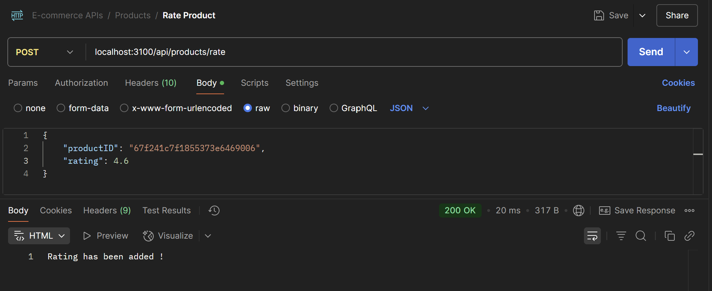
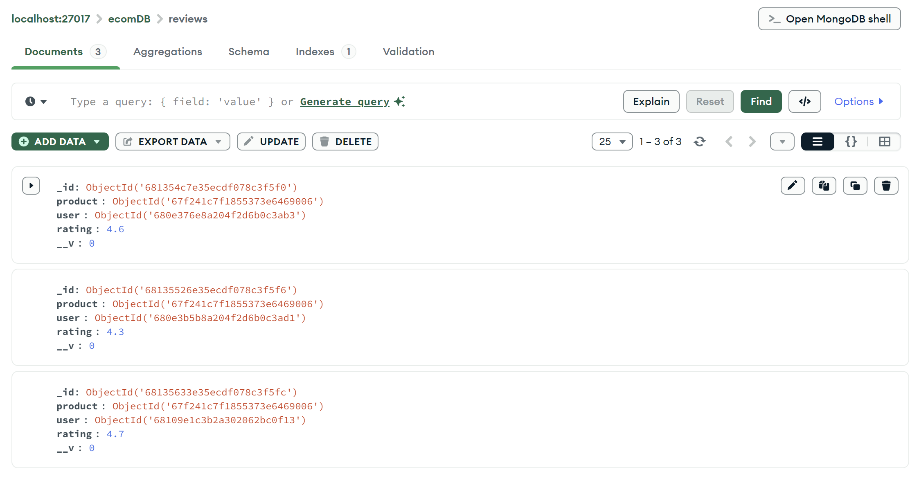
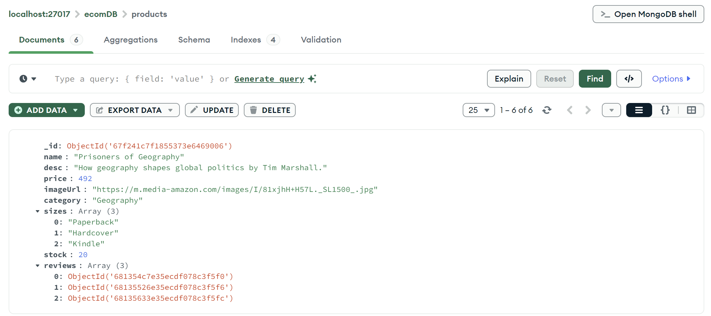
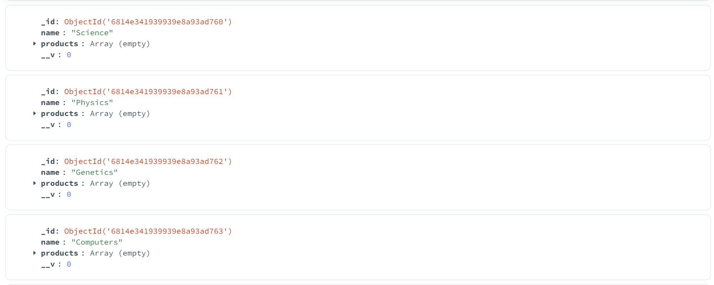
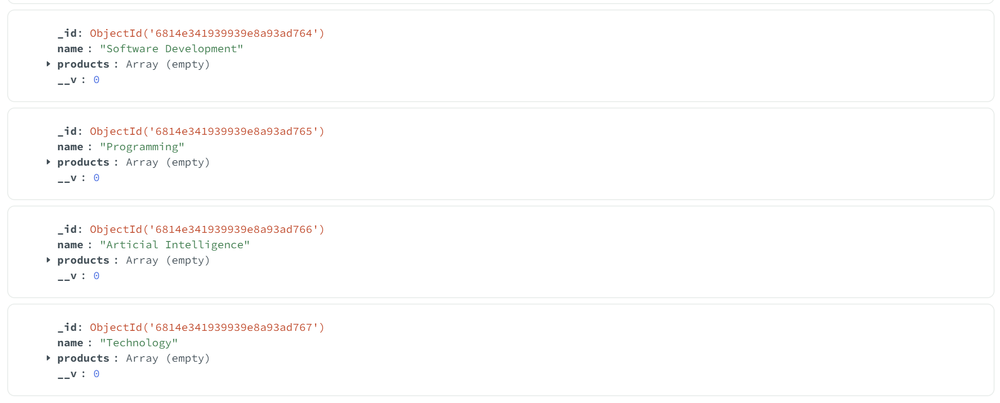
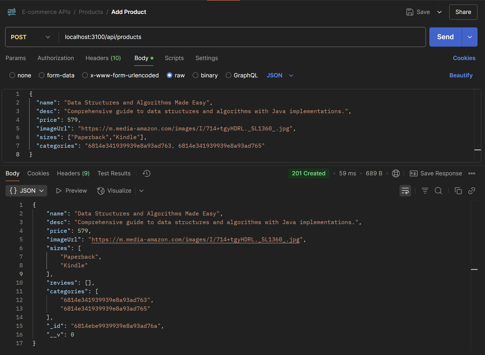
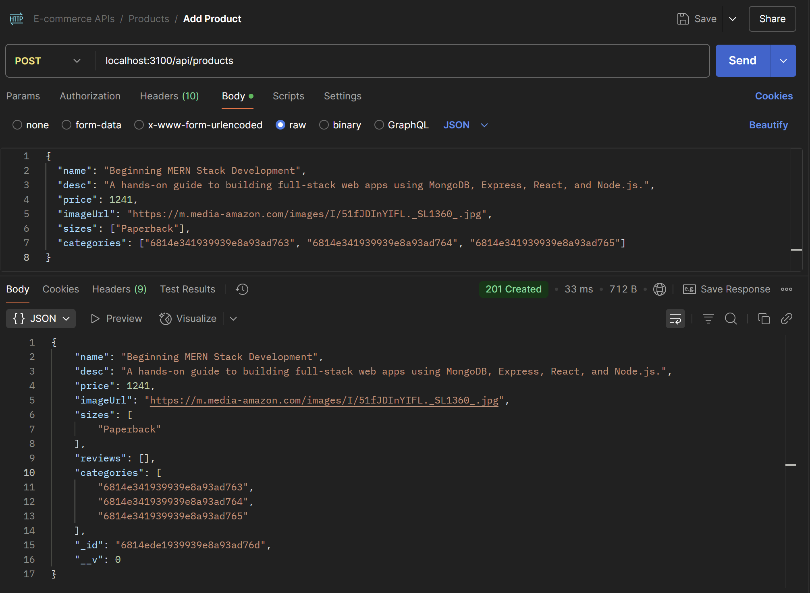
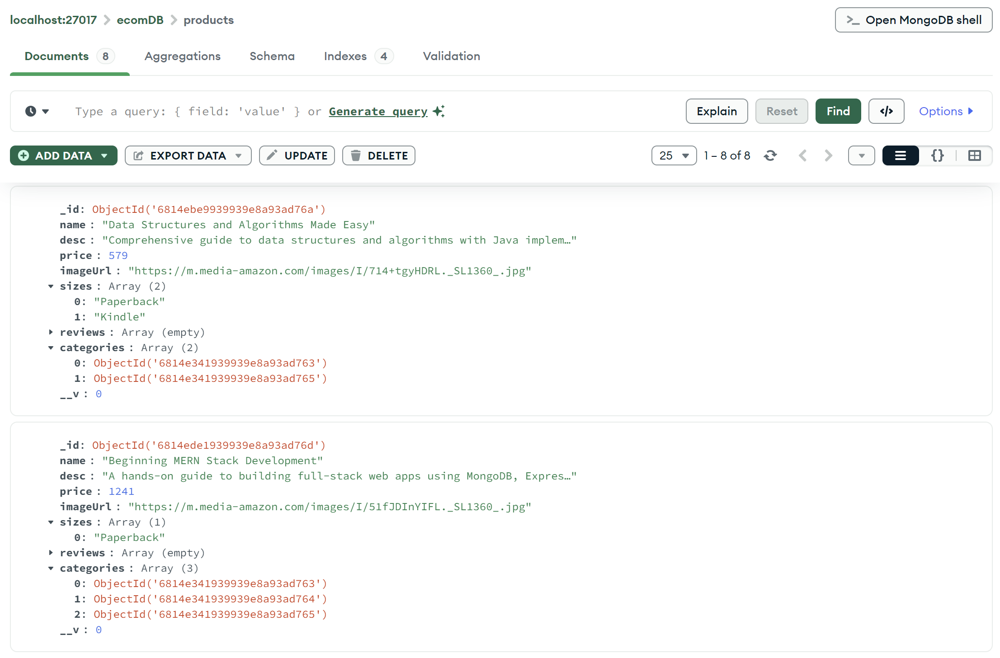
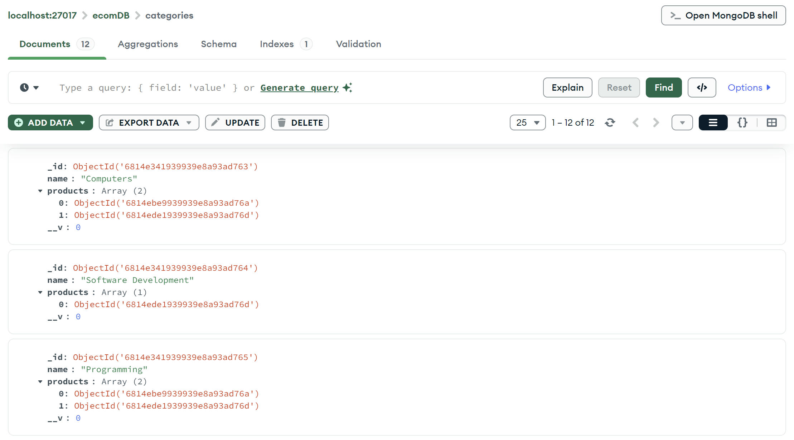

## WORKING WITH MONGOOSE-II

## Relationships in Mongoose

Mongoose is an Object Data Modeling (ODM) library for MongoDB, which allows you
to define data models in a structured manner. Relationships in Mongoose involve
how different data models or collections are related to each other. These
relationships can be one-to-one, one-to-many, or many-to-many, and they help you
organise and query data effectively.

### Importance of Relationships:

Understanding and implementing relationships in Mongoose is crucial for several
reasons:

1. Efficient Data Organization: Relationships help structure data to reflect
   real-world associations, making data retrieval and management more
   efficient.
2. Data Integrity: Relationships maintain data integrity by ensuring that related
   data remains consistent and accurate.
3. Query Optimization: Properly defined relationships enable you to perform
   complex queries without the need for excessive data manipulation.
4. Improved Application Logic: Relationships allow you to represent complex
   application logic, such as users with multiple blog posts or courses with
   multiple students.

### One to Many Relationships

A one-to-many relationship is a fundamental concept in database modeling where
one entity (document) is associated with multiple related entities in another
collection. In MongoDB, this relationship is often implemented by referencing
documents from one collection in another.

#### Use Case:

You have a web application where you need to define data models for
users. Each user can have multiple blog posts associated with them.

```javascript
const userSchema = new mongoose.Schema({
  name: String,
  email: String,
  posts: [{ type: mongoose.Schema.Types.ObjectId, ref: "Post" }],
});
const User = mongoose.model("User", userSchema);
```

Note:

1. `mongoose.Schema.Types.ObjectId` is used to represent MongoDB's
   ObjectIds, and `ref: 'Post'` indicates that this field references documents in the 'Post'
   collection.
2. `ref` attribute helps Mongoose understand the relationship between different
   collections and facilitates population and data retrieval across related documents in a
   MongoDB database. It's a way to provide metadata about the relationship between
   fields in different schemas.

### Many-to-One Relationship

A many-to-one relationship occurs when multiple records in one collection are
associated with a single record in another collection. This type of relationship is
commonly used to represent scenarios where multiple entities share a common
parent entity.
Use Case: Consider an e-commerce platform where you have multiple customer
reviews for each product. Each review (many) is associated with a specific product
(one).

```javascript
// Product schema
const productSchema = new mongoose.Schema({
  name: String,
  price: Number,
});

// Review schema with a reference to Product
const reviewSchema = new mongoose.Schema({
  content: String,
  rating: Number,
  product: { type: mongoose.Schema.Types.ObjectId, ref: "Product" },
});

// Product and Review models
const Product = mongoose.model("Product", productSchema);
const Review = mongoose.model("Review", reviewSchema);
```

### Many to Many Relationships

Many-to-many relationships occur when multiple records in one collection are
associated with multiple records in another collection. In Mongoose, this is
implemented by creating arrays of references to documents from other collections.
For example, in a course management system, a course can have multiple students,
and a student can enrol in multiple courses.

#### Use Case:

You are building a course management system. A course can have multiple students, and a student can enrol in multiple courses.

```javascript
const userSchema = new mongoose.Schema({
  name: String,
  email: String,
  courses: [{ type: mongoose.Schema.Types.ObjectId, ref: "Course" }],
});

const courseSchema = new mongoose.Schema({
  title: String,
  students: [{ type: mongoose.Schema.Types.ObjectId, ref: "User" }],
});

const User = mongoose.model("User", userSchema);
const Course = mongoose.model("Course", courseSchema);
```

## Implement One-to-Many relationship: each Product can have multiple Reviews

### 1. Created 'review.schema.js' file

```javascript
import mongoose from "mongoose";

export const reviewSchema = new mongoose.Schema({
  product: {
    type: mongoose.Schema.Types.ObjectId,
    ref: "Product",
  },
  user: {
    type: mongoose.Schema.Types.ObjectId,
    ref: "User",
  },
  rating: Number,
});
```

This `reviewSchema` defines a Mongoose schema for storing product reviews in a MongoDB database.

1. 📦 reviewSchema Structure:
   - `mongoose.Schema(...)`: Creates a new schema object for the `Review` collection.
   - `export`: Makes it available for use in other files.
2. 🛍️ product Field:
   - `type: mongoose.Schema.Types.ObjectId`: This means `product` stores a reference (ID) to another MongoDB document.
   - `ref: "Product"`: Tells Mongoose this ObjectId refers to the Product collection.
   - 🔗 This creates a relationship (foreign key-like) to a Product document.
3. 👤 user Field:
   - Stores the ID of the user who gave the review.
   - `ref: "User"` creates a link to the User document.
4. ⭐ rating Field:
   - A number field representing how many stars (e.g., 1–5) the user gave the product.
   - You can later add validation here (e.g., min 1, max 5) if needed.

This schema enables storing **which user reviewed which product and what rating they gave**, while maintaining proper references for to **populate full user and product details** when needed.

### 2. Updated 'product.schema.js' file

#### ✅ Before (Old Code):

```javascript
import mongoose from "mongoose";

export const productSchema = new mongoose.Schema({
  name: String,
  description: String,
  price: Number,
  category: String,
  inStock: Number,
});
```

#### 🔁 After (Updated Code):

```javascript
import mongoose from "mongoose";

export const productSchema = new mongoose.Schema({
  name: String,
  desc: String,
  price: Number,
  imageUrl: String,
  category: String,
  sizes: [String],
  stock: Number,
  reviews: [
    {
      type: mongoose.Schema.Types.ObjectId,
      ref: "Review",
    },
  ],
});
```

The updated schema now includes:

1. `imageUrl: String` – Stores the product's image URL.
2. `sizes: [String]` – Holds an array of available sizes for the product (e.g. ["S", "M", "L"]).
3. `stock: Number` – Renamed from inStock to reflect the product's available stock.
4. `desc: String` – Renamed from description to reflect a more concise representation of the product’s details.
5. `reviews: [{ type: mongoose.Schema.Types.ObjectId, ref: "Review" }]`
   - This line adds a new `reviews` field to the product schema. It is an array of references (ObjectIds) that point to documents in the `Review` collection.
   - This setup establishes a **relationship between a product and its reviews**, allowing each product to store multiple associated review IDs.
   - By using the `ref: "Review"` option, you enable Mongoose population, which means:
     - You can easily fetch full review details (like rating, reviewer, etc.) along with the product,
     - Instead of just storing raw data, you link documents across collections, keeping your database normalized and efficient.

These changes provide a richer structure for representing a product, including its image, ratings, and available sizes, while maintaining relationships with reviews.

### 3. 'product.repository.js' file

Moved existing code from user.repository.js to user.repository_old.js, and updated code to a fresh user.repository.js file

#### 🔁 1. Shift from Embedded Ratings to Review Collection

Earlier:

```javascript
ratings: [{ userID, rating }];
```

Stored ratings directly inside the product document, making it harder to manage detailed review data, such as timestamps, comments, etc.

Now:

```javascript
reviews: [{ type: mongoose.Schema.Types.ObjectId, ref: "Review" }];
```

- Ratings are stored in a separate Review model.
- Each review references both the product and the user.
- Allows for more scalable, normalized data (follows MongoDB best practices).

#### 🏗️ 2. Integration of Mongoose Models

✅ Added at the top:

```javascript
import mongoose from "mongoose";
import { productSchema } from "./product.schema.js";
import { reviewSchema } from "./review.schema.js";

const ProductModel = mongoose.model("Product", productSchema);
const ReviewModel = mongoose.model("Review", reviewSchema);
```

➕ Purpose:

- ProductModel is now used to verify if a product exists before rating.
- ReviewModel is now used to create or update user ratings in a separate reviews collection.

This adds:

- Schema validation
- Relationship modeling
- Cleaner separation of concerns

#### 🔁 3. Updated rate Method Logic

```javascript
async rate(userID, productID, rating) {
    try {
      // 1. Check if product exists
      const productToUpdate = await ProductModel.findById(productID);
      if (!productToUpdate) {
        throw new Error("Product not found !");
      }

      let review;
      const existingReview = await ReviewModel.findOne({
        product: new ObjectId(productID),
        user: new ObjectId(userID),
      });

      if (existingReview) {
        existingReview.rating = rating;
        await existingReview.save();
        review = existingReview;
      } else {
        const newReview = new ReviewModel({
          product: new ObjectId(productID),
          user: new ObjectId(userID),
          rating: rating,
        });
        await newReview.save();
        review = newReview;
      }

      // 3. Update the product's reviews array
      await ProductModel.findByIdAndUpdate(productID, {
        $addToSet: { reviews: review._id }, // $addToSet prevents duplicates
      });
    } catch (err) {
      console.log(err);
      throw new ApplicationError("Something went wrong with database", 500);
    }
  }
```

This function is designed to handle a product rating (or review) by a user.

1. Check Product Existence:
   - `ProductModel.findById(productID)` is used to check if the product exists in the database.
   - If the product isn’t found, it throws an error.
2. Handle Existing Review:
   - `ReviewModel.findOne()` is used to find an existing review for the product by the user.
   - If found, the review’s `rating` is updated and saved with `existingReview.save()`.
   - If not found, a new review is created using `new ReviewModel()` and saved with `newReview.save()`.
3. Update Product’s Review List:
   - `ProductModel.findByIdAndUpdate()` is used to update the product’s review array.
   - The `$addToSet` operator ensures that the review’s ID is added without duplicates.
4. Error Handling:
   - If any error occurs during the database operations, it’s caught in the `catch` block.
   - A custom error is thrown using `ApplicationError` to notify the user of database issues.

This function effectively interacts with the database to check product existence, manage reviews, and update the product's review list.

#### 🔍 Comparison: `findById()` vs `findOne()` vs `findByIdAndUpdate()` in Mongoose

1. `findById(id)`
   - Use: Fetches a single document using its `_id` field.
   ```javascript
   const productToUpdate = await ProductModel.findById(productID);
   ```
   - Purpose here: To check whether the product exists before proceeding.
2. `findOne(filter)`

   - Use: Finds a single document that matches the specified filter/criteria.

   ```javascript
   const existingReview = await ReviewModel.findOne({
     product: new ObjectId(productID),
     user: new ObjectId(userID),
   });
   ```

   - Purpose here: To check if the user has already submitted a review for the product.

3. `findByIdAndUpdate(id, update, options?)`
   - Use: Finds a document by `_id` and applies the given update. You can optionally return the updated document or apply other options.
   ```javascript
   await ProductModel.findByIdAndUpdate(productID, {
     $addToSet: { reviews: review._id },
   });
   ```
   - Purpose here: To add the review's ID to the product's `reviews` array, ensuring no duplicates (thanks to `$addToSet`).

### 4. Testing in Postman

#### Rating added by multiple Users, on the same product



#### One-to-Many Relationship: A Single Product with Multiple Reviews





## Many-to-Many Relationship: Products can belong to multiple Categories and vice versa

### 1. Created 'category.schema.js' file

```javascript
import mongoose from "mongoose";

export const categorySchema = new mongoose.Schema({
  name: String,
  products: [
    {
      type: mongoose.Schema.Types.ObjectId,
      ref: "Product",
    },
  ],
});
```

Defines a Mongoose schema for categories, each having a name and a list of associated product references.

1. Imports Mongoose to work with MongoDB in a structured way.
2. Defines and exports a `categorySchema` using `mongoose.Schema`.
3. The schema has two fields:
   - `name`: A string representing the category name (e.g., "Books", "Clothing").
   - `products`: An array of ObjectIds that reference documents in the `Product` collection.
4. Each ObjectId in `products` uses: - `type: mongoose.Schema.Types.ObjectId` – to store MongoDB reference IDs. - `ref: "Product"` – to link it to the Product model for population.
   Enables relationships between categories and their products using Mongoose’s population feature.

### 2. Updated 'product.schema.js' file

#### ✅ Before (Old Code):

```javascript
import mongoose from "mongoose";

export const productSchema = new mongoose.Schema({
  name: String,
  desc: String,
  price: Number,
  imageUrl: String,
  category: String,
  sizes: [String],
  stock: Number,
  reviews: [
    {
      type: mongoose.Schema.Types.ObjectId,
      ref: "Review",
    },
  ],
});
```

#### 🔁 After (Updated Code):

```javascript
import mongoose from "mongoose";

export const productSchema = new mongoose.Schema({
  name: String,
  desc: String,
  price: Number,
  imageUrl: String,
  sizes: [String],
  stock: Number,
  reviews: [
    {
      type: mongoose.Schema.Types.ObjectId,
      ref: "Review",
    },
  ],
  categories: [
    {
      type: mongoose.Schema.Types.ObjectId,
      ref: "Category",
    },
  ],
});
```

Explanation of the updated part of the code:

1. Removed: `category: String`
   - This field for a single category was removed.
2. Added: `categories: [{ type: mongoose.Schema.Types.ObjectId, ref: "Category" }]`
   - Products can now belong to multiple categories.
   - Each category is represented by an ObjectId referencing the `Category` collection.
   - `ref: "Category"` links these ObjectIds to the `Category` model for easy population of category details.

### 3. Updated 'mongooseConfig.js' file

#### ✅ Before (Old Code):

```javascript
import mongoose from "mongoose";
import dotenv from "dotenv";
dotenv.config();

const url = process.env.DB_URL;
export const connectUsingMongoose = async () => {
  try {
    await mongoose.connect(url);
    console.log("MongoDB connected using Mongoose !");
  } catch (err) {
    console.log("Error while connecting to db !");
    console.log(err);
  }
};
```

#### 🔁 After (Updated Code):

```javascript
import mongoose from "mongoose";
import dotenv from "dotenv";
import { categorySchema } from "../src/features/product/category.schema.js";
dotenv.config();

const url = process.env.DB_URL;
export const connectUsingMongoose = async () => {
  try {
    await mongoose.connect(url);
    console.log("MongoDB connected using Mongoose !");
    addCategories();
  } catch (err) {
    console.log("Error while connecting to db !");
    console.log(err);
  }
};

async function addCategories() {
  const CategoryModel = mongoose.model("Category", categorySchema);
  const categories = await CategoryModel.find();
  if (!categories || categories.length == 0) {
    await CategoryModel.insertMany([
      { name: "Geography" },
      { name: "Global Politics" },
      { name: "Map" },
      { name: "Non-Fiction" },
      { name: "Science" },
      { name: "Physics" },
      { name: "Genetics" },
      { name: "Computers" },
      { name: "Software Development" },
      { name: "Programming" },
      { name: "Articial Intelligence" },
      { name: "Technology" },
    ]);
  }
  console.log("Categories are added !");
}
```

Explanation of the updated part of the code:

- **Added `addCategories` function:**
  - The function is called after successfully connecting to the database (`addCategories()`).
  - It checks whether the `Category` collection already contains any categories:
  - If no categories exist (`if (!categories || categories.length == 0)`), it inserts a predefined list of categories using `CategoryModel.insertMany()`.
  - The categories include topics like "Geography", "Science", "Programming", etc.
- **Purpose:**
  - Automatic category creation: Ensures that default categories are added to the database when the connection is successful and if no categories are already present.
  - Database initialization: Helps initialize the `Category` collection with standard categories.
- **Why it's useful:**
  - It ensures the application has a set of default categories for future products to be associated with.
  - Provides a mechanism to populate the `Category` collection automatically if it’s empty, improving the system setup.

### 4. Updated 'product.controller.js' file

#### ✅ Before (Old Code):

```javascript
async addProduct(req, res) {
  try {
    const { name, desc, price, imageUrl, category, sizes } = req.body;

    const newProduct = new ProductModel(
      name,
      desc || "No description available",
      parseFloat(price),
      req.file ? req.file.filename : imageUrl,
      category || "Uncategorized",
      Array.isArray(sizes)
        ? sizes
        : typeof sizes === "string"
        ? sizes.split(",")
        : []
    );

    const createdProduct = await this.productRepository.add(newProduct);
    res.status(201).send(createdProduct);
  } catch (err) {
    console.log(err);
    return res.status(500).send("Something went wrong");
  }
}
```

#### 🔁 After (Updated Code):

```javascript
async addProduct(req, res) {
  try {
    const { name, desc, price, imageUrl, categories, sizes } = req.body;

    // Convert 'categories' to array if string, else keep it as array
    const categoriesArray =
      typeof categories === "string"
        ? categories.split(",").map((c) => c.trim())
        : Array.isArray(categories)
        ? categories.map((c) => c.trim())
        : [];

    // Convert 'sizes' to array if string, else keep it as array
    const sizesArray = Array.isArray(sizes)
      ? sizes
      : typeof sizes === "string"
      ? sizes.split(",")
      : [];

    const newProduct = new ProductModel(
      name,
      desc || "No description available",
      parseFloat(price),
      req.file ? req.file.filename : imageUrl,
      categoriesArray,
      sizesArray
    );

    const createdProduct = await this.productRepository.add(newProduct);
    res.status(201).send(createdProduct);
  } catch (err) {
    console.log(err);
    return res.status(500).send("Something went wrong");
  }
}
```

`addProduct` Method Update:

1. Changed `category` to `categories`:
   - This handles multiple categories as an array or comma-separated string sent in the request body (`req.body.categories`).
2. Updated `categoriesArray`:
   - If `categories` is a string, it is split into an array and each category is trimmed.
   - If `categories` is already an array, it is mapped to remove extra spaces.
3. Updated `sizesArray`:
   - Similar logic applied to `sizes` to ensure that it's either a string split into an array or left as-is if it’s already an array.

These changes ensure that you can handle multiple categories and sizes correctly when adding a product.

### 5. Updated 'product.model.js' file

Moved existing code from product.model.js to product.model_old.js, and added updated code to a fresh product.model.js file:

```javascript
export default class ProductModel {
  constructor(name, desc, price, imageUrl, categories, sizes, id) {
    this._id = id;
    this.name = name;
    this.desc = desc;
    this.price = price;
    this.imageUrl = imageUrl;
    this.categories = categories;
    this.sizes = sizes;
  }
}
```

- Renaming `category` to `categories`: The constructor now accepts `categories` as an array instead of a single string. This allows a product to belong to multiple categories, which makes the model more flexible. The `category` property was replaced because a product may fit into multiple categories (e.g., "Science" and "Geography"), and this change accommodates that.
- The rest of the fields remain the same to maintain existing functionality.

### 6. Updated 'product.repository.js' file

#### 🏗️ 1. Created Mongoose Models

✅ Added at the top:

```javascript
import mongoose from "mongoose";
import { productSchema } from "./product.schema.js";
import { reviewSchema } from "./review.schema.js";
import { categorySchema } from "./category.schema.js";

const ProductModel = mongoose.model("Product", productSchema);
const ReviewModel = mongoose.model("Review", reviewSchema);
const CategoryModel = mongoose.model("Category", categorySchema);
```

In the updated code, only `CategoryModel` is newly added, while ProductModel and ReviewModel remain unchanged.

- `ProductModel` and `ReviewModel` represent the `Product` and `Review` collections, respectively, providing methods for querying and updating MongoDB.
- `CategoryModel` is newly introduced to interact with the `Category` collection. It is used to update the relevant categories by adding the new product's ID to the `products` array in the categories.

#### 🔁 2. Updated add Method Logic

```javascript
async add(productData) {
  try {
    // 1. Add the product.
    const newProduct = new ProductModel(productData);
    console.log(newProduct); // Log the Mongoose Model instance
    const savedProduct = await newProduct.save();

    // 2. Update Categories.
    await CategoryModel.updateMany(
      {
        _id: { $in: productData.categories },
      },
      {
        $push: { products: new ObjectId(savedProduct._id) },
      }
    );
    return savedProduct;
  } catch (err) {
    console.log(err);
    throw new ApplicationError("Something went wrong with Data", 500);
  }
}
```

This code defines an add method that creates a new product, saves it to the database, and updates the related categories with the new product's ID.

1. Creating a New Product Instance:
   - The line `const newProduct = new ProductModel(productData);` creates a new product instance using the `ProductModel` and the data passed in `productData`. This product is created but not yet saved to the database.
   - `ProductModel(productData)`: This is a Mongoose model constructor that uses the schema to validate and create a new product object.
2. Saving the Product to MongoDB:
   - `const savedProduct = await newProduct.save();` saves the newly created product to the MongoDB database. The `.save()` method automatically handles validation (if defined) and assigns an `_id` to the new product.
   - `newProduct.save()`: This persists the document and returns the saved document.
3. Updating Categories:
   - After the product is saved, we update the related categories using `CategoryModel.updateMany()`. This method performs a bulk update on all categories that are associated with the product.
   - CategoryModel.updateMany():
     - `{$in: productData.categories}`: This checks that the category IDs from `productData.categories` match any category in the database.
     - `$push: { products: new ObjectId(savedProduct._id) }`: This adds the product's `_id` to the `products` array of each matching category.

This ensures that the product is saved in the database, and related categories are updated accordingly.

### 7. Testing in Postman

#### Categories Collection (Before Adding Product)





#### Add Product with Multiple Categories (via Postman)




#### Products Collection: Product with Multiple Categories



#### Categories Collection (After Adding Product): Category with Multiple Products


