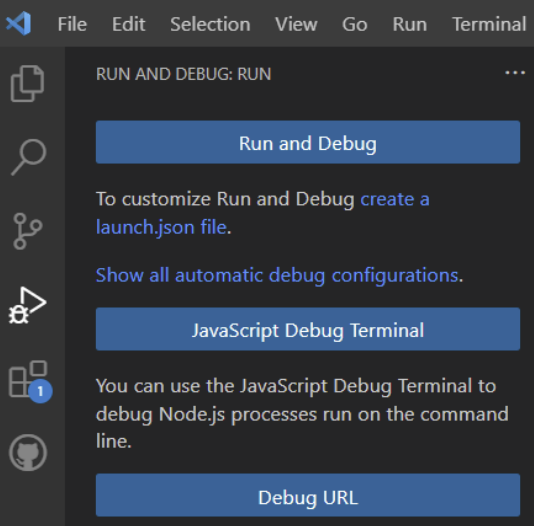
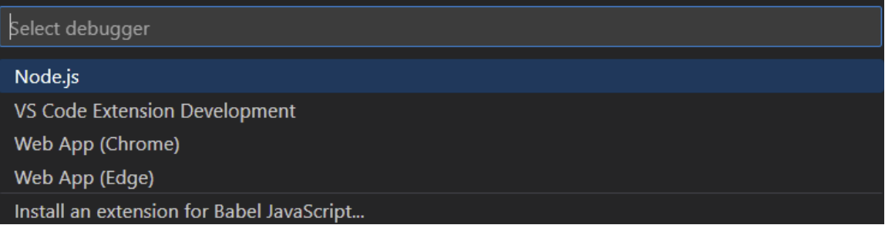
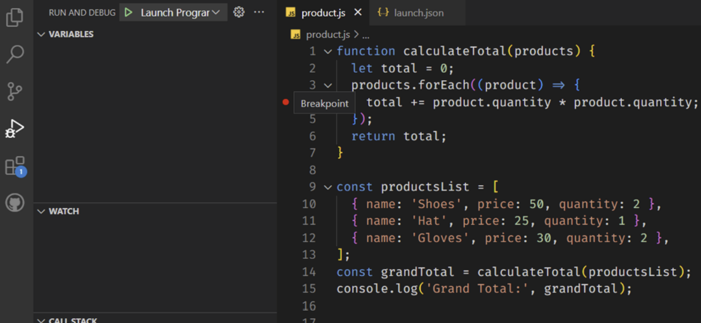
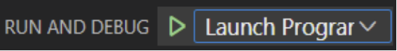
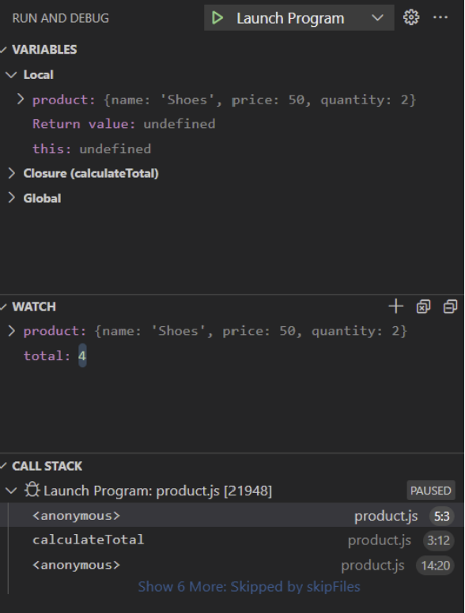
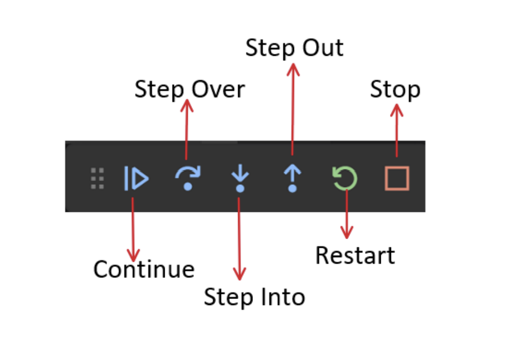

# Exploring More Modules

## Debugging in Node.js

Debugging is the process of finding and fixing errors or issues in your code.
It is essential for understanding and improving the functionality of applications.
Debugging in Node.js differs from JavaScript debugging in the browser.
Now, let's look at an example. Consider the following script, products.js:

```javascript
function calculateTotal(products) {
  let total = 0;
  products.forEach((product) => {
    total += product.quantity * product.quantity;
  });
  return total;
}

const productsList = [
  { name: "Shoes", price: 50, quantity: 2 },
  { name: "Hat", price: 25, quantity: 1 },
  { name: "Gloves", price: 30, quantity: 2 },
];

// expected result = 100+25+60=185
const grandTotal = calculateTotal(productsList);
console.log("Grand Total:", grandTotal);
```

In this example, we have a small typo in the calculateTotal function.
Let's use the Node.js debugger to find the issue:

1. Run the command `node inspect products.js`
   in your terminal.
2. In the debugger, set a breakpoint at line 4 using the command
   `setBreakpoint(4)`
3. Continue the execution using the command `cont`
4. When the breakpoint is hit, add a watch expression for the product variable
   using the command `watch('product')`
5. Also, add a watch expression for the total variable using the command
   `watch('total')`
6. Now, step over the next break point using the command `cont`
7. The watch expressions will now show the values of product and total. It is
   evident that there is an error in the code where product.quantity _
   product.quantity is used instead of product.price _
   product.quantity

### How debugging in Node.js is different than in Browser

As we mentioned earlier, debugging Node.js is different from debugging JavaScript
in the browser. Here are some key differences:

1. Environment: Node.js runs JavaScript in a server-side environment, whereas
   browser typically runs in the client side.
2. Debugging tools: Node.js has its built-in debugger, while browser relies on
   browser-based tools like Chrome DevTools.
3. Access to server-side resources: When debugging Node.js, you have access
   to server-side resources like the file system, databases, and network
   connections.
4. Despite these differences, the core principles of debugging remain the same –
   finding and fixing issues in your code.

## Debugging in VS Code

We have discussed debugging Node.js applications using the built-in Node.js
debugger. Now we'll explore debugging Node.js applications using Visual Studio
Code (VSCode), a powerful code editor.

Debugging Process in VS Code
To debug Node.js applications in VS Code:

1. Open the products.js file in VS Code.
2. Go to the Run and Debug panel or press Ctrl+Shift+D and click "create a
   launch.json file".
   
3. Select "Node.js" from the dropdown to create a basic configuration for
   debugging Node.js applications
   
4. Set a breakpoint at line 4 by clicking on the left side of the line number.
   
5. Click the green "Launch Program" button or press F5 to start the debugger.
   
6. Add the product and total variables to the watch panel to monitor their values.
   
7. The debugger will pause at the breakpoint, allowing you to inspect variables,
   step through code, and observe the call stack.

VS Code offers several debugger options to control the debugging
process:


1. Continue: This option allows the debugger to continue running the code until
   the next breakpoint or the end of the program is reached.
2. Step Over: With this option, the debugger moves to the next line of code,
   skipping over function calls. It is useful for quickly moving through code
   without diving into function details.
3. Step Into: This option allows the debugger to step into the next function call,
   enabling you to examine the details of the function being called.
4. Step Out: If the debugger is currently inside a function, the Step Out option
   will cause it to exit the current function and return to the calling code.
5. Restart: This option restarts the debugging process from the beginning,
   allowing you to re-run the code and analyze it again.
6. Stop: This option terminates the debugging session and exits the debugger.

## Sending Emails in Node.js

Sending emails in Node.js is typically done using third-party libraries or services.
Email functionality is essential for various use cases, such as account confirmation,
password reset, notifications, updates, and personalized recommendations.
Understanding SMTP and Nodemailer

1. SMTP (Simple Mail Transfer Protocol) is the protocol used for sending email
   messages between servers.
2. Nodemailer is a popular package in Node.js used for sending emails.
3. To use Nodemailer, it needs to be installed using the command: `npm install
nodemailer`

### Sending Emails with Nodemailer

Here's the code snippet to demonstrate how to use Nodemailer to send emails in
Node.js:

```javascript
// Import the Nodemailer package
const nodemailer = require("nodemailer");
// Create a transporter object using SMTP
const transporter = nodemailer.createTransport({
  service: "Gmail",
  auth: {
    user: "your-email@gmail.com",
    pass: "your-password",
  },
});
// Define the email configuration
const mailOptions = {
  from: "your-email@gmail.com",
  to: "recipient@example.com",
  subject: "Hello from Node.js",
  text: "This is a test email sent from Node.js using Nodemailer.",
};
// Send the email
transporter.sendMail(mailOptions, (error, info) => {
  if (error) {
    console.error("Error occurred:", error);
  } else {
    console.log("Email sent:", info.response);
  }
});
```

Explanation:

1. First, the Nodemailer package is imported into the script.
2. Then, a transporter object is created using the createTransport method,
   specifying the email service (e.g., Gmail) and providing the email address and
   password for authentication.
3. Next, an email configuration object (mailOptions) is defined, including the
   sender, recipient, subject, and text of the email.
4. Finally, the sendMail method is called on the transporter object, passing the
   mailOptions object. The callback function handles the response, logging any
   errors or the success message.

### Advanced Features in Nodemailer

Nodemailer offers additional features for sending emails, including:

1. Sending HTML emails.
2. Adding attachments to emails.
3. Customizing email templates.

## Events in Node.js

Events in Node.js are actions or occurrences that happen during runtime, such as
button clicks, data updates, or system events. Node.js is an event-driven platform
with built-in support for handling and reacting to events.
Built-in Events in Node.js
Examples of built-in events:

- 'data': Triggered when a readable stream receives new data.
- 'error': Fired when an error occurs in the application.
- 'listening': Emitted when a server starts listening for incoming connections.

Let's take a look at a practical example of using events with Node.js. We'll create a
simple HTTP server that listens for POST requests and reads the body data using
events.

```javascript
const http = require("http");
const server = http.createServer((req, res) => {
  if (req.method === "POST") {
    let body = "";
    req.on("data", (chunk) => {
      body += chunk;
    });
    req.on("end", () => {
      console.log("Data received:", body);
      // Perform further actions with the received data
      res.end("Data received successfully");
    });
  } else {
    res.end("Invalid request");
  }
});
server.listen(3000, () => {
  console.log("Server listening on port 3000");
});
```

Explanation:

1. Created an HTTP server using the http.createServer() method.
2. In the server's request listener callback function, we check if the request
   method is 'POST'.
3. If it is a POST request, we initialize an empty body variable to store the
   incoming data.
4. The request object (req) emits the 'data' event whenever a new chunk of data
   is received. We append the received chunk to the body variable.
5. The request object also emits the 'end' event when all data has been
   received. In the 'end' event handler, we log the received data (body) to the
   console and perform further actions with it.
6. Finally, we send a response to the client (res) indicating that the data has
   been received successfully.
