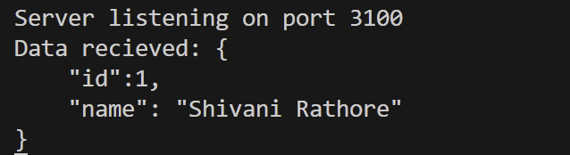

# Exploring More Modules

## Debugging in Node.js

Debugging is the process of finding and fixing errors or issues in your code.
It is essential for understanding and improving the functionality of applications.
Debugging in Node.js differs from JavaScript debugging in the browser.
Now, let's look at an example. Consider the following script, products.js:

```javascript
function calculateTotal(products) {
  let total = 0;
  products.forEach((product) => {
    total += product.quantity * product.quantity;
  });
  return total;
}

const productsList = [
  { name: "Shoes", price: 50, quantity: 2 },
  { name: "Hat", price: 25, quantity: 1 },
  { name: "Gloves", price: 30, quantity: 2 },
];

// expected result = 100+25+60=185
const grandTotal = calculateTotal(productsList);
console.log("Grand Total:", grandTotal);
```

In this example, we have a small typo in the calculateTotal function.
Let's use the Node.js debugger to find the issue:

1. Run the command `node inspect products.js`
   in your terminal.
2. In the debugger, set a breakpoint at line 4 using the command
   `setBreakpoint(4)`
3. Continue the execution using the command `cont`
4. When the breakpoint is hit, add a watch expression for the product variable
   using the command `watch('product')`
5. Also, add a watch expression for the total variable using the command
   `watch('total')`
6. Now, step over the next break point using the command `cont`
7. The watch expressions will now show the values of product and total. It is
   evident that there is an error in the code where product.quantity _
   product.quantity is used instead of product.price _
   product.quantity

### How debugging in Node.js is different than in Browser

As we mentioned earlier, debugging Node.js is different from debugging JavaScript
in the browser. Here are some key differences:

1. Environment: Node.js runs JavaScript in a server-side environment, whereas
   browser typically runs in the client side.
2. Debugging tools: Node.js has its built-in debugger, while browser relies on
   browser-based tools like Chrome DevTools.
3. Access to server-side resources: When debugging Node.js, you have access
   to server-side resources like the file system, databases, and network
   connections.
4. Despite these differences, the core principles of debugging remain the same –
   finding and fixing issues in your code.

## Debugging in VS Code

We have discussed debugging Node.js applications using the built-in Node.js
debugger. Now we'll explore debugging Node.js applications using Visual Studio
Code (VSCode), a powerful code editor.

Debugging Process in VS Code
To debug Node.js applications in VS Code:

1. Open the products.js file in VS Code.
2. Go to the Run and Debug panel or press Ctrl+Shift+D and click "create a
   launch.json file".

    

3. Select "Node.js" from the dropdown to create a basic configuration for
   debugging Node.js applications

    

4. Set a breakpoint at line 4 by clicking on the left side of the line number.

    

5. Click the green "Launch Program" button or press F5 to start the debugger.

    

6. Add the product and total variables to the watch panel to monitor their values.

    

7. The debugger will pause at the breakpoint, allowing you to inspect variables,
   step through code, and observe the call stack.

#### VS Code offers several debugger options to control the debugging process:

  

1. Continue: This option allows the debugger to continue running the code until
   the next breakpoint or the end of the program is reached.
2. Step Over: With this option, the debugger moves to the next line of code,
   skipping over function calls. It is useful for quickly moving through code
   without diving into function details.
3. Step Into: This option allows the debugger to step into the next function call,
   enabling you to examine the details of the function being called.
4. Step Out: If the debugger is currently inside a function, the Step Out option
   will cause it to exit the current function and return to the calling code.
5. Restart: This option restarts the debugging process from the beginning,
   allowing you to re-run the code and analyze it again.
6. Stop: This option terminates the debugging session and exits the debugger.

## Sending Emails in Node.js

Sending emails in Node.js is typically done using third-party libraries or services.
Email functionality is essential for various use cases, such as account confirmation,
password reset, notifications, updates, and personalized recommendations.
Understanding SMTP and Nodemailer

1. SMTP (Simple Mail Transfer Protocol) is the protocol used for sending email
   messages between servers.
2. Nodemailer is a popular package in Node.js used for sending emails.
3. To use Nodemailer, it needs to be installed using the command: `npm install
nodemailer`

### Sending Emails with Nodemailer

Here's the code snippet to demonstrate how to use Nodemailer to send emails in
Node.js:

```javascript
// Import the Nodemailer package
const nodemailer = require("nodemailer");
// Create a transporter object using SMTP
const transporter = nodemailer.createTransport({
  service: "Gmail",
  auth: {
    user: "your-email@gmail.com",
    pass: "your-password",
  },
});
// Define the email configuration
const mailOptions = {
  from: "your-email@gmail.com",
  to: "recipient@example.com",
  subject: "Hello from Node.js",
  text: "This is a test email sent from Node.js using Nodemailer.",
};
// Send the email
transporter.sendMail(mailOptions, (error, info) => {
  if (error) {
    console.error("Error occurred:", error);
  } else {
    console.log("Email sent:", info.response);
  }
});
```

Explanation:

1. First, the Nodemailer package is imported into the script.
2. Then, a transporter object is created using the createTransport method,
   specifying the email service (e.g., Gmail) and providing the email address and
   password for authentication.
3. Next, an email configuration object (mailOptions) is defined, including the
   sender, recipient, subject, and text of the email.
4. Finally, the sendMail method is called on the transporter object, passing the
   mailOptions object. The callback function handles the response, logging any
   errors or the success message.

### Advanced Features in Nodemailer

Nodemailer offers additional features for sending emails, including:

1. Sending HTML emails.
2. Adding attachments to emails.
3. Customizing email templates.

## Events in Node.js

Events in Node.js are actions or occurrences that happen during runtime, such as
button clicks, data updates, or system events. Node.js is an event-driven platform
with built-in support for handling and reacting to events.
Built-in Events in Node.js
Examples of built-in events:

- 'data': Triggered when a readable stream receives new data.
- 'error': Fired when an error occurs in the application.
- 'listening': Emitted when a server starts listening for incoming connections.

Let's take a look at a practical example of using events with Node.js. We'll create a
simple HTTP server that listens for POST requests and reads the body data using
events.

```javascript
const http = require("http");
const server = http.createServer((req, res) => {
  if (req.method === "POST") {
    let body = "";
    req.on("data", (chunk) => {
      body += chunk;
    });
    req.on("end", () => {
      console.log("Data received:", body);
      // Perform further actions with the received data
      res.end("Data received successfully");
    });
  } else {
    res.end("Invalid request");
  }
});
server.listen(3000, () => {
  console.log("Server listening on port 3000");
});
```

Explanation:

1. Created an HTTP server using the http.createServer() method.
2. In the server's request listener callback function, we check if the request
   method is 'POST'.
3. If it is a POST request, we initialize an empty body variable to store the
   incoming data.
4. The request object (req) emits the 'data' event whenever a new chunk of data
   is received. We append the received chunk to the body variable.
5. The request object also emits the 'end' event when all data has been
   received. In the 'end' event handler, we log the received data (body) to the
   console and perform further actions with it.
6. Finally, we send a response to the client (res) indicating that the data has
   been received successfully.

## Testing API using Postman

### Introduction

1. Postman is a popular API development and testing tool used by developers to
   make HTTP requests and analyze the responses.
2. It provides a user-friendly interface for interacting with APIs and simplifies the
   process of testing and debugging API endpoints.
3. POSTMAN supports various HTTP methods, including GET, POST, PUT,
   DELETE, and more, allowing developers to test different aspects of API
   functionality.

### Installing Postman

- Postman is available as a desktop application for Windows, macOS, and
  Linux, as well as a Chrome extension.
- To install the desktop application, visit the official Postman website
  (https://www.postman.com) and download the version compatible with your
  operating system.
- Once downloaded, follow the installation instructions to set up Postman on
  your machine.

### Making a POST Request with Postman

1. Launch Postman and create a new request by clicking the + button.
2. Enter the API endpoint URL in the Enter URL field.
3. Select the HTTP method as "POST" from the dropdown menu.
4. Add the request payload, as JSON data, in the request body.
5. Click the "Send" button to execute the POST request.
6. Postman will display the response and allow you to analyze the API response.


VS Code Terminal after POST request:



Code Example:

```javascript
const http = require("http");
const server = http.createServer((req, res) => {
  if (req.method === "POST") {
    //expecting data from client
    let body = "";
    req.on("data", (chunk) => {
      body += chunk.toString();
    });

    req.on("end", () => {
      console.log("Data recieved:", body);
      //Perform further actions with the recieved data
      res.end("Data recieved succesfully");
    });
  } else {
    res.end("Invalid request");
  }
});
server.listen(3100, () => {
  console.log("Server listening on port 3100");
});
```

In the provided code example, we create an HTTP server using the built-in http
module in Node.js. The server listens for incoming requests and specifically handles
POST requests. When a POST request is received, the server appends the received
data chunks and logs the complete data in the 'end' event callback. Further actions
can be performed with the received data. The server responds back to the client
indicating the successful reception of data.

## Creating Custom Events in Node.js

Custom events in Node.js allow developers to define and use their own events in
applications, providing flexibility and control over event-driven functionality.
To create custom events, the 'events' module in Node.js provides the EventEmitter
class, which serves as the foundation for working with events.
Example: Creating a custom event for an online store:

1. Create a file called order-events.js and add the following code:

```javascript
const EventEmitter = require("events");
class Order extends EventEmitter {
  placeOrder(orderData) {
    // Emit the 'orderPlaced' event
    this.emit("orderPlaced", orderData);
  }
}
module.exports = Order;
```

2. Create a file called index.js and add the following code:

```javascript
const Order = require("./order-events");

// Create an instance of the Order class
const order = new Order();

// Listener for sending a confirmation email
const emailListener = (orderData) => {
  console.log("Confirmation email sent:", orderData);
};

// Listener for updating the inventory
const inventoryListener = (orderData) => {
  console.log("Inventory updated for order:", orderData);
};

// Add listeners to the 'orderPlaced' event using addListener()
order.addListener("orderPlaced", emailListener);
order.addListener("orderPlaced", inventoryListener);

// Simulate placing an order
order.placeOrder({
  orderId: 123,
  products: ["Product A", "Product B"],
  total: 100,
});
```

In this example, we create a custom event by extending the EventEmitter class with
the Order class. The placeOrder method simulates placing an order and emits an
'orderPlaced' event with the order data. We use the addListener() method to add
listeners for the 'orderPlaced' event. We define separate listener functions
emailListener and inventoryListener for sending a confirmation email and updating
the inventory, respectively.

3. When running the index.js file, the output will be:
   

## Event-Driven Architecture in Node.js

- Event-Driven Architecture is a core concept in Node.js that allows the flow of
  a program to be determined by events triggered by external factors or other
  parts of the application. External factors in Event-Driven Architecture could
  include user interactions (such as mouse clicks and keyboard inputs), network
  events (such as receiving a message from a server), or system events (such
  as the creation or modification of a file).
- In this architecture, events are emitted and event listeners react to those
  events, enabling concurrent and asynchronous handling of tasks.
- The main components of Event-Driven Architecture are events, event
  emitters, and event listeners.
- When an event occurs, all registered listeners for that event are executed
  independently

  

- In a social media platform, when a user creates a new post, multiple tasks
  need to be performed concurrently.
- By emitting a "postCreated" event, different listeners can react to the event
  and handle tasks independently.
- Example listeners include sending notifications to followers, updating the
  user's timeline, and saving the post to the database

### Advantages of Event-Driven Architecture:

1. _Scalability:_ Supports handling a large number of simultaneous tasks, making it
   suitable for scalable applications.
2. _Loose coupling:_ Components of the application are less dependent on each
   other, resulting in more maintainable and flexible code.
3. _Better responsiveness:_ Concurrent and asynchronous handling of tasks
   ensures the application remains responsive even with a high volume of
   requests.
4. _Improved performance:_ Efficient resource management and concurrent
   handling of multiple tasks lead to improved overall performance.

#### Other real-world use cases for Event-Driven Architecture

Stock trading application: Events like stock price changes can trigger actions such as
user notifications, updating trading strategies, and logging historical data.

## Best Practices for Working with Modules in Node.js

Best practices are important for working with modules and writing maintainable code
in Node.js. Following these practices ensures a clean and organized codebase,
making development and collaboration more efficient.

#### 1. Organizing Code into Modules:

Identify components in your application that can be modularized, such as user authentication, product management, shopping cart, and order processing.Modularizing code improves maintainability, reusability, and separation of concerns.

#### 2. Naming Conventions:

Use clear and descriptive names for variables, functions, and modules.
Follow a consistent naming convention throughout the codebase for easier
readability and understanding.

#### 3. Documentation:

Document your code with comments to explain the purpose of functions and
complex code blocks. Write a README file for each module, providing information
about its functionality and usage. Documentation helps developers understand the
codebase and facilitates future maintenance and collaboration.

#### 4. Version Control:

Utilize version control systems like Git to track code changes and collaborate
effectively. Use branches and pull requests to maintain a structured development
process and ensure code integrity.

## Summarising it

Let’s summarise what we have learned in this module:

- Learned about debugging in Node.js.
- Learned about debugging in Visual Studio Code.
- Explored sending emails in Node.js.
- Studied events in Node.js and how to work with built-in and custom
  events.
- Learned how to test APIs using Postman.
- Created custom events in Node.js using the events module.
- Explored the advantages of using Event-Driven Architecture in Node.js
  applications.
- Discussed best practices for working with modules and writing
  maintainable code in Node.js

### Some Additional Resources:

[How to debug Node.js with the built-in Debugger?](https://www.digitalocean.com/community/tutorials/how-to-debug-node-js-with-the-built-in-debugger-and-chrome-devtools)

[How to use Nodemailer?](https://www.freecodecamp.org/news/use-nodemailer-to-send-emails-from-your-node-js-server/)

[How to code your own event emitter in Node.js ?](https://www.freecodecamp.org/news/how-to-code-your-own-event-emitter-in-node-js-a-step-by-step-guide-e13b7e7908e1/)

[Postman tutorial - How to use for API testing?](https://www.guru99.com/postman-tutorial.html)
