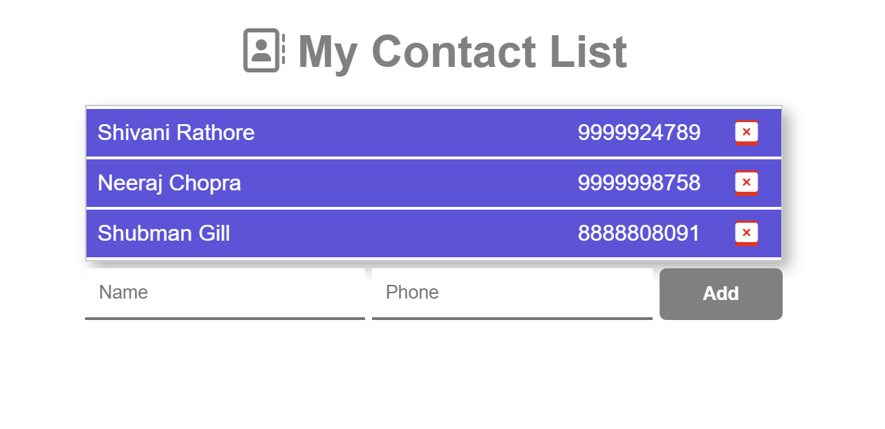
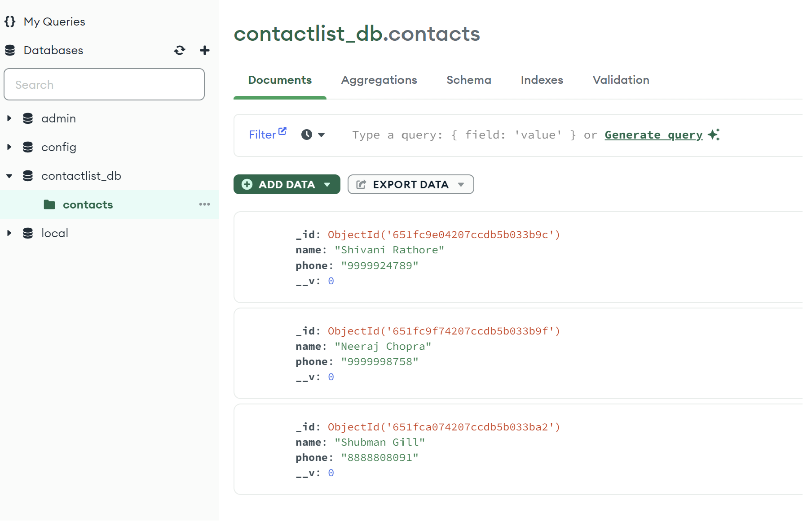
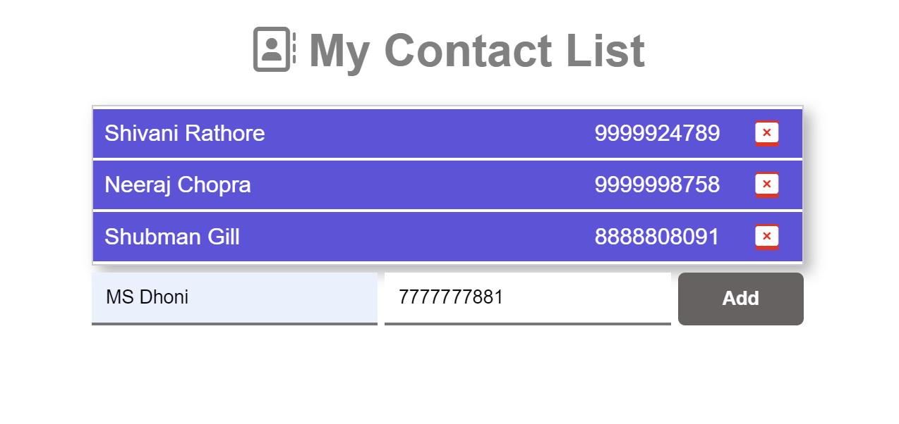
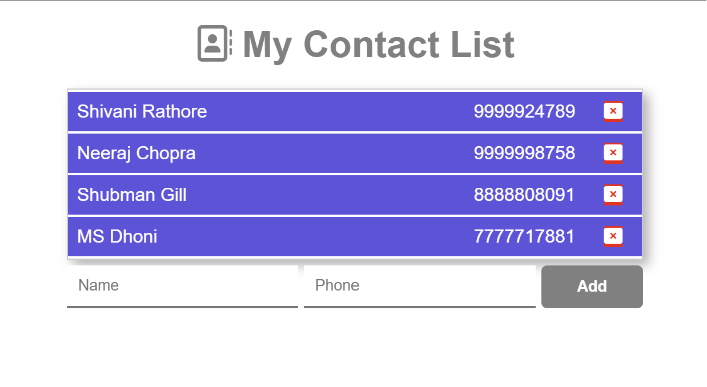
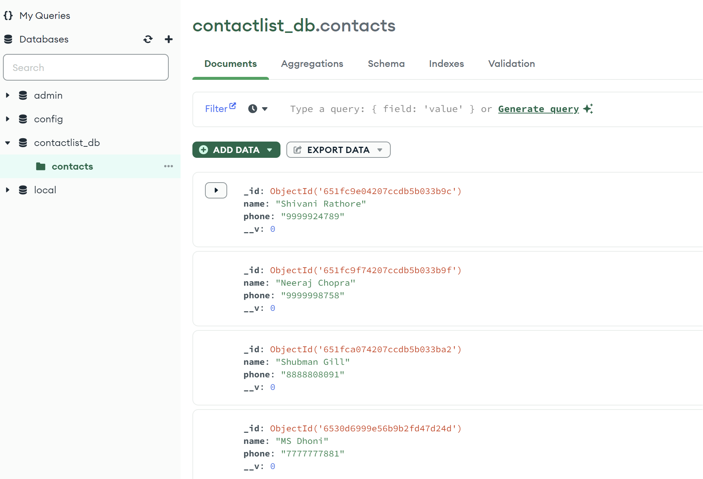
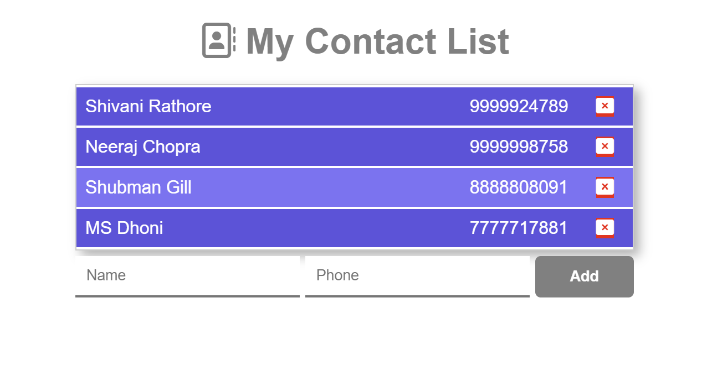
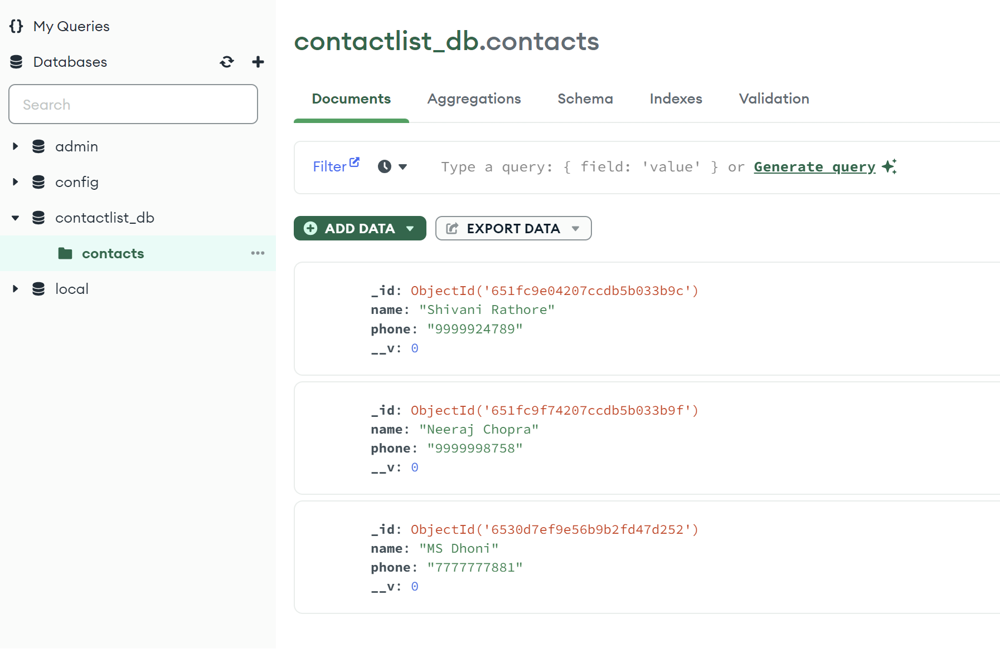

### Contact List App ⭐

- **Description:**

  - The ContactList app is a Node.js application that allows users to manage their contacts using a MongoDB database.

- **Features:**

  - Add contacts: Easily add new contacts with name and phone number.
  - Delete contacts: Remove contacts from the list.
  - View contacts: Display the list of contacts.

- **Technologies Used:**

  - Node.js
  - MongoDB
  - Express.js
  - Mongoose

- **Setup:**

  - Install Node.js and MongoDB.
  - Clone the repository.
  - Run `npm install` to install dependencies.
  - Configure MongoDB connection in the app.
  - Run `npm start` to start the server.

- **Usage:**

  - Open the app in a web browser.
  - Add, delete, and view your contacts.

- **💻 Screen:**

  1. Display Contacts
     
     

  2. Add Contact
     
     
     

  3. Delete Contact
     
     

🔗 Developer

[@shivanirathore24](https://www.github.com/shivanirathore24)

