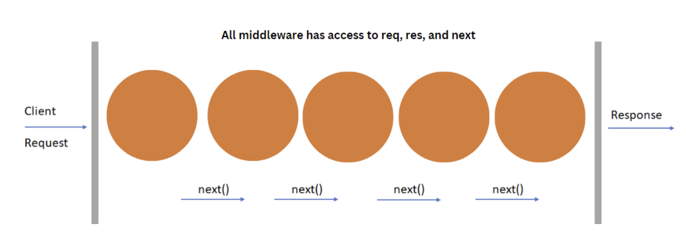

# Getting Started with Express

## What is Express?
Express is a fast, unopinionated, and minimalist web framework for Node.js.
It simplifies the process of building web applications and APIs by providing a
lightweight layer on top of Node.js.

### Problems Solved by Express
1. Routing: Express makes it easy to define routes and handle different types of
HTTP requests.
2. Middleware: It allows adding middleware functions for tasks like
request/response processing and error handling.
3. Template Engines: Express enables the integration of various template
engines like Pug, EJS, and Handlebars for dynamic HTML pages.

### Advantages of Express
1. Easy to learn and use: Familiarity with Node.js and JavaScript makes it easy
to start with Express.
2. High performance: Built on top of Node.js, Express inherits its
high-performance capabilities.
3. Extensibility: Express is highly customizable and can be extended with
middleware, plugins, and modules.

### Use Cases for Express
Social media platforms, e-commerce websites, and online learning platforms can
benefit from using Express as their backend framework.


## Creating a Server using Express
### Installing Express
To start working with Express, we must install it first. To do that, open your terminal
or command prompt and navigate to your project folder. Then, type the following
command: npm install express

### Creating Server using Express and Using GET Method
Now that we have Express installed create a server using it. First, create a new file
called app.js in your project folder. Then, add the following code:

1. Require the Express module in your file
```javascript 
const express = require('express');
```
2. Create an instance of the Express server
```javascript
const server = express();
```
3. In your app.js file, define a route that handles default GET requests to the root
URL (/)
```javascript
server.get('/', (req, res) => {
    res.send('Hello World! This is Express server')
});
```
4. Start the server on specific port:
```javascript
server.listen(3000, () => {
    console.log('Server running on port 3000');
});
```
5. In your terminal, run the node app.js command to start the server.
6. Visit http://localhost:3000 in your web browser to see the response from the
server.

### Explanation:
- The server.get() method defines a route that handles GET requests to a
specific URL.
- Inside the route handler function, the req parameter represents the client's
request, and the res parameter represents the server's response.
- To send a response back to the client, use the res.send() method.
- The server.listen() method is used to start the server and listen for incoming
requests on a specific port.


## Using .gitignore file
If you've added **`node_modules/`** to your **`.gitignore`**, it means you're not tracking the **`node_modules/`** directory in Git, as it typically contains locally installed packages. To know what to install in your project after adding **`node_modules/`** to **`.gitignore`**, follow these steps:

### Step 1: Check the package.json File
Your **`package.json`** file lists all the necessary dependencies for your project under:
- **`dependencies`**: For runtime dependencies (used in production).
- **`devDependencies`**: For development dependencies (used for testing, bundling, etc.).

Example package.json:
```json
{
  "dependencies": {
    "express": "^4.17.1"
  },
  "devDependencies": {
    "webpack": "^5.24.4"
  }
}
```
### Step 2: Install Dependencies
To install all the dependencies listed in your package.json, run:
```bash 
npm install
```

This will install both **`dependencies`** and **`devDependencies`** and generate a new `node_modules/` folder in your project.

### Step 3: Install Specific Packages
If you need to install a specific package that is missing or not installed yet, you can run:
```bash
npm install <package-name>
```
For example, to install express, run:
```bash
npm install express
```

To install a development dependency, use:
```bash
npm install <package-name> --save-dev
```
For example, to install webpack as a dev dependency:
```bash
npm install webpack --save-dev
```

### Step 4: Use npm ci for Exact Versions
If you are working with a team or want to ensure that everyone is using the same versions of dependencies, you can use the npm ci command:
```bash
npm ci
```
This command installs the exact versions of dependencies specified in the **`package-lock.json`** file, ensuring consistency across environments.


## Express Middleware and its Functionality

Middleware functions are a series of functions with access to the request object
(req), the response object (res), and the next function in the application’s
request-response cycle. These functions can execute code, modify request and
response objects, or end the request-response cycle.

### Examples of Middleware Functions
- Logging requests: Middleware function to log information about incoming
requests.
- Parsing request bodies: Middleware function to parse and extract data from
the request body.
- Handling authentication: Middleware function to authenticate and authorize
user requests.

### Example of Using Middleware
Handling GET Requests with Middleware:
```javascript
const express = require("express");
const app = new express();
app.get("/", (req, res, next) => {
  console.log("Middleware 1 executed");
  next();
});
app.get("/", (req, res, next) => {
  res.send("GET request to the homepage from middleware 2");
});
app.listen(3000, () => console.log("Listening on port 3000"));
```
Explanation
- Two route handlers are defined using app.get() both match the root URL (/).
- The first route handler includes a middleware function that logs the message
"Middleware 1 executed" to the console and then calls next() to pass control
to the next middleware or route handler.
- The second route handler includes a middleware function that sends the
response "GET request to the homepage from middleware 2" back to the
client.

### Global Middleware
Global middleware in Express is middleware that is applied to all incoming requests, regardless of the route. It runs for every request before the request reaches the route handler. You use server.use() to apply a middleware globally.

#### Key Uses of server.use():

Global Middleware: To run middleware for every request, regardless of the route. Example:
```javascript
server.use(globalMiddleware);
```
Route-Specific Middleware: To apply middleware to a specific route or group of routes. Example:
```javascript
server.use("/send", specificMiddleware);
```
Static Files: To serve static files like images, CSS, and JavaScript. Example:
```javascript
server.use(express.static('public'));
```
Error Handling: To catch errors in the application. Example:
```javascript
server.use((err, req, res, next) => {
  res.status(500).send("Something went wrong!");
});
```
