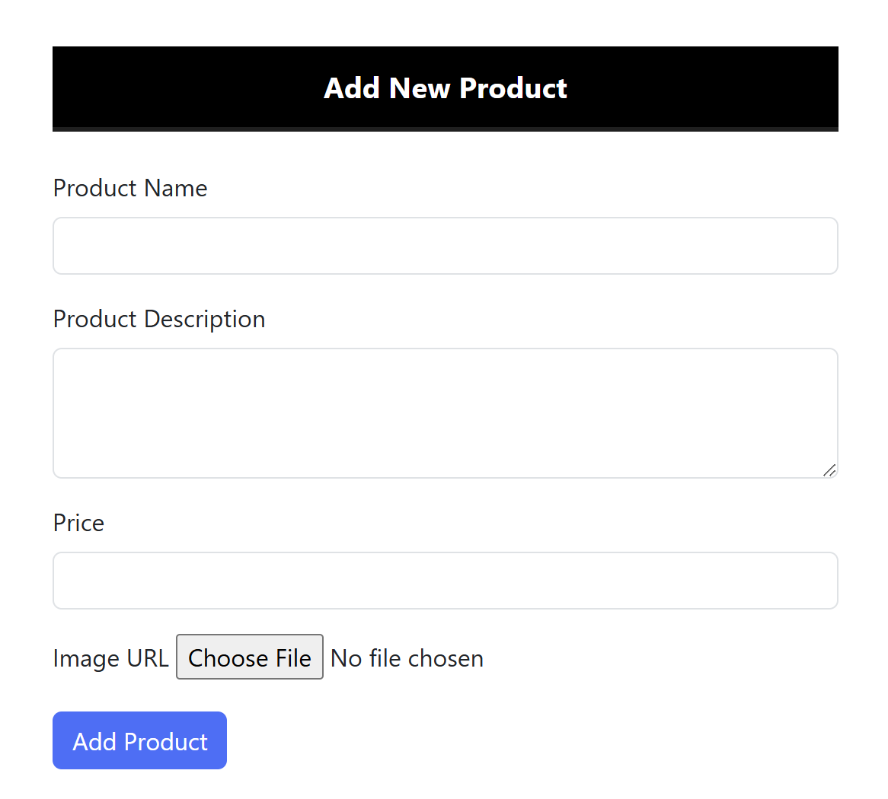
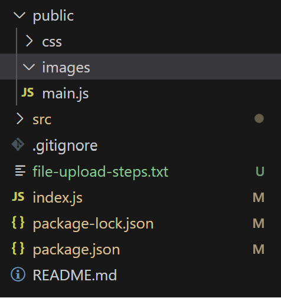
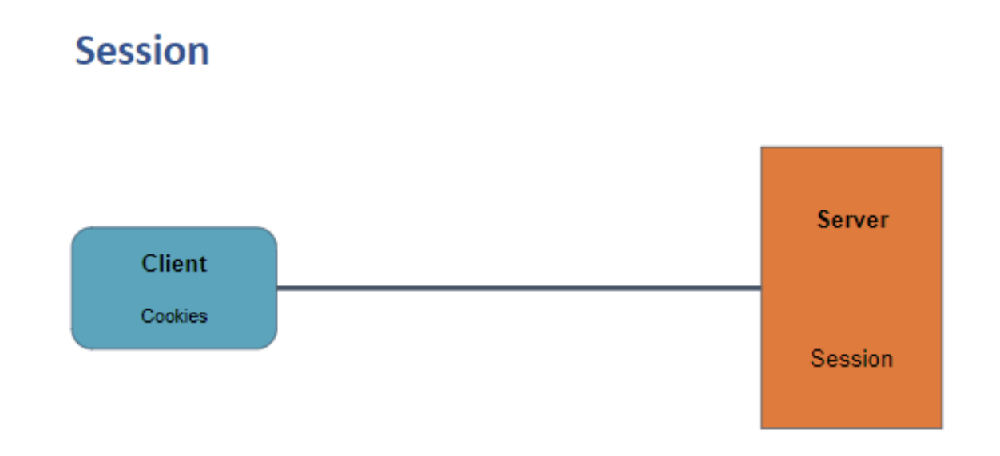

## FILE UPLOAD, SESSIONS AND COOKIES

## File Uploading

To enable the feature of uploading images instead of using image URLs in the inventory
management app, the following steps should be followed:

### 1. Install Multer

- Multer is a Node.js middleware used for handling `multipart/form-data`, primarily for
  file uploads.
- Install Multer by running the command:

```sh
npm i multer
```

### 2. Changes in the 'new-product' view and 'update-product' view

- Replace the input field of type "text" for the imageUrl with an input field of type "file"
  to allow image uploads:

```html
<input type="file" name="imageUrl" id="imageUrl" accept="images/*" />
```

- Set the form's `enctype` attribute to `multipart/form-data` since we are now uploading
  files along with other form data:

```html
<form action="/" method="post" enctype="multipart/form-data">....</form>
```

- Add new-product view:



### 3. Create an "images" folder in the public folder to store the uploaded images.



### 4. Implement a 'file-upload middleware' to handle the rules and processing of uploaded images
Create a file named "file-upload.middleware.js" in the middleware folder.
Use Multer to configure the storage and file naming:

```javascript
import multer from "multer";

const storageConfig = multer.diskStorage({
  destination: (req, file, cb) => {
    cb(null, "public/images/");
  },
  filename: (req, file, cb) => {
    const name = Date.now() + "-" + file.originalname;
    cb(null, name);
  },
});

export const uploadFile = multer({
  storage: storageConfig,
});
```

### 5. Apply the 'file-upload middleware' in the 'index.js' file.

Modify the code in index.js to include the 'file-upload middleware' in the POST route
for adding a product:

```javascript
app.post(
  "/",
  uploadFile.single("imageUrl"),
  validateRequest,
  productsController.postAddProduct
);
```

### 6. Update the 'product.controller.js' file to handle the uploaded image.

- In the 'postAddProduct' method, extract the `name`, `desc`, and `price` from the request
  body, and get the filename of the uploaded image.

```javascript
const { name, desc, price } = req.body;
```

- Modify the imageUrl to use the "images" folder and the filename of the uploaded
  image:

```javascript
const imageUrl = "images/" + req.file.filename;
```

- Update the ProductModel's add method to include the `imageUrl` parameter:

```javascript
ProductModel.add(name, desc, price, imageUrl);
```

Code:

```javascript
postAddProduct(req, res, next) {
    const { name, desc, price } = req.body;
    const imageUrl = "images/" + req.file.filename;
    ProductModel.add(name, desc, price, imageUrl);
    var products = ProductModel.getAll();
    res.render("index", { products });
}
```

### 7. Adjust the 'imageUrl' validation in validation.middleware.js to account for the changes in image handling:

Add a `custom` validation rule to check if the req.file object exists. If not, throw an error
indicating that the image is required:

```javascript
body("imageUrl").custom((value, { req }) => {
  if (!req.file) {
    throw new Error("Image is required!");
  }
  return true;
});
```

## Understanding Session


1. Session is a mechanism that maintains stateful communication between a client
and a server.
2. In a stateless protocol like HTTP, sessions help store and maintain information
about a client.
3. Sessions are used to manage authentication status, preferences, and other
client-specific data.
4. A unique session ID is generated by the server and sent to the client as a cookie.
5. The client includes the session ID with each request, allowing the server to identify
and access the client's session data.
6. Sessions provide secure stateful communication by storing session data on the
server, making it difficult for attackers to tamper with.
7. Sessions play a crucial role in securing applications by allowing the server to
maintain authentication status and other important user data.
8. Sessions help prevent unauthorized access and protect sensitive information.
9. Registration and login features can be implemented to create sessions for users.
10. Sessions enhance application security and enable personalized user experiences.
