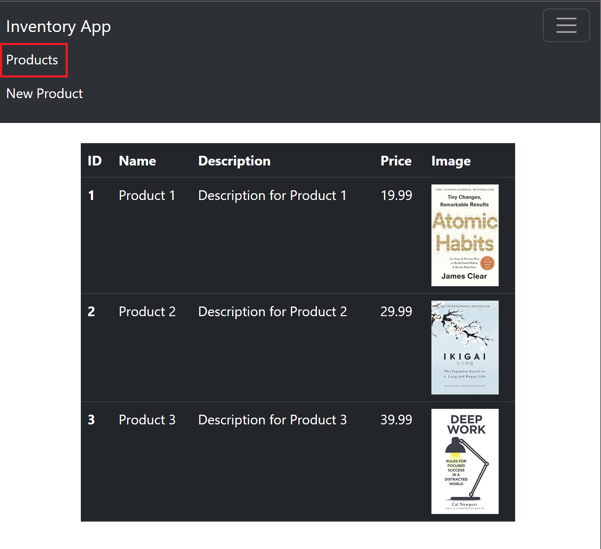
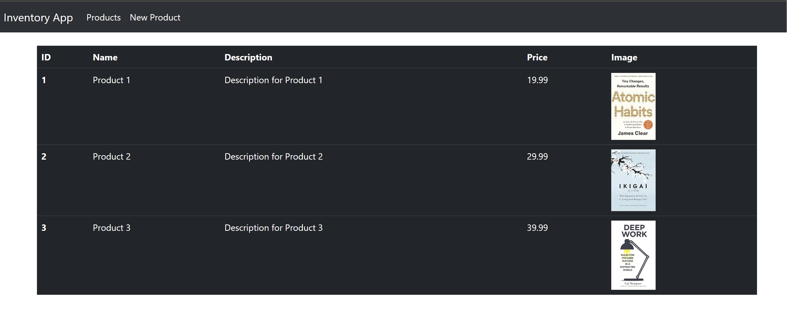
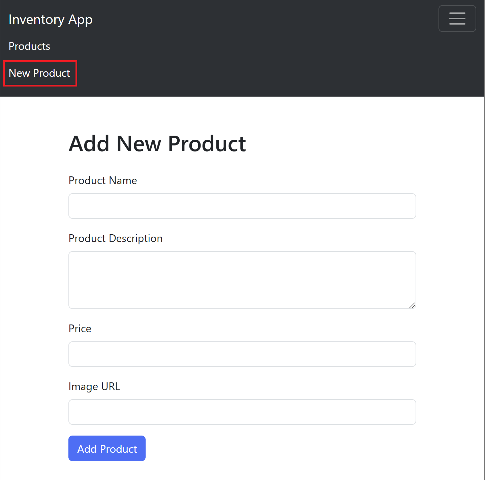

## MODEL VIEW CONTROLLER (MVC) PART-II

## Working with Forms
There are many scenarios where forms can be used, Imagine you're running an
online store, and you want to give your staff the ability to add new products easily. To
do this, you need to create a form that lets them input product information and
submit it to the server.
### Creating the new-product.ejs view
To add a new product, we need to create a new view file called new-product.ejs. We
will use Bootstrap to create the form in this view. Here is the code for the
new-product.ejs file:

```javascript
<!-- views/add-product.ejs -->
<h1 class="mt-5 mb-4">Add New Product</h1>
<form action="/" method="post">
    <div class="mb-3">
        <label for="name" class="form-label">Product Name</label>
        <input type="text" class="form-control" id="name" name="name" required>
    </div>
    <div class="mb-3">
        <label for="desc" class="form-label">Product Description</label>
        <textarea class="form-control" id="desc" name="desc" rows="3" required></textarea>
    </div>
    <div class="mb-3">
        <label for="price" class="form-label">Price</label>
        <input type="number" class="form-control" id="price" name="price" step="0.01" min="0" required>
    </div>
    <div class="mb-3">
        <label for="imageUrl" class="form-label">Image URL</label>
        <input type="url" class="form-control" id="imageUrl" name="imageUrl" required>
    </div>
    <button type="submit" class="btn btn-primary">Add Product</button>
</form>
```

### Updating the product.controller.js file
After creating the view, we need to update our product.controller.js file. We will add a
getAddForm method to get the form, and a postAddProduct method to update the
model with the form data after submission.
Here is the updated product.controller.js file:
```javascript
import ProductModel from "../models/product.model.js";

export default class ProductController {
  getProducts(req, res) {
    let products = ProductModel.get();
    //console.log(products);
    res.render("products", { products: products });
  }

  getAddForm(req, res) {
    return res.render("new-product");
  }

  addNewProduct(req, res) {
    //access data from form
    console.log(req.body);
    let products = ProductModel.get();
    res.render("products", { products: products });
  }
}
```

### Updating the product.ejs file
Finally, we need to update the product.ejs file to add a "New Product" nav item that
redirects to '/new'
Here is how updated layout looks:
#### Products view



#### New Product View


Note: 'req.body' value will be `undefined` we will see how to overcome this problem
next.

