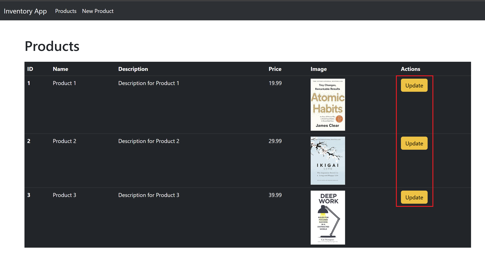

## MODEL VIEW CONTROLLER (MVC) PART-II

## Working with Forms
There are many scenarios where forms can be used, Imagine you're running an
online store, and you want to give your staff the ability to add new products easily. To
do this, you need to create a form that lets them input product information and
submit it to the server.
### Creating the new-product.ejs view
To add a new product, we need to create a new view file called new-product.ejs. We
will use Bootstrap to create the form in this view. Here is the code for the
new-product.ejs file:

```javascript
<!-- views/add-product.ejs -->
<h1 class="mt-5 mb-4">Add New Product</h1>
<form action="/" method="post">
    <div class="mb-3">
        <label for="name" class="form-label">Product Name</label>
        <input type="text" class="form-control" id="name" name="name" required>
    </div>
    <div class="mb-3">
        <label for="desc" class="form-label">Product Description</label>
        <textarea class="form-control" id="desc" name="desc" rows="3" required></textarea>
    </div>
    <div class="mb-3">
        <label for="price" class="form-label">Price</label>
        <input type="number" class="form-control" id="price" name="price" step="0.01" min="0" required>
    </div>
    <div class="mb-3">
        <label for="imageUrl" class="form-label">Image URL</label>
        <input type="url" class="form-control" id="imageUrl" name="imageUrl" required>
    </div>
    <button type="submit" class="btn btn-primary">Add Product</button>
</form>
```

### Updating the product.controller.js file
After creating the view, we need to update our product.controller.js file. We will add a
getAddForm method to get the form, and a postAddProduct method to update the
model with the form data after submission.
Here is the updated product.controller.js file:
```javascript
import ProductModel from "../models/product.model.js";

export default class ProductController {
  getProducts(req, res) {
    let products = ProductModel.get();
    //console.log(products);
    res.render("products", { products: products });
  }

  getAddForm(req, res) {
    return res.render("new-product");
  }

  addNewProduct(req, res) {
    //access data from form
    console.log(req.body);
    let products = ProductModel.get();
    res.render("products", { products: products });
  }
}
```

### Updating the product.ejs file
Finally, we need to update the product.ejs file to add a "New Product" nav item that
redirects to '/new'
Here is how updated layout looks:
#### Products view


#### New Product View


Note: 'req.body' value will be `undefined` we will see how to overcome this problem
next.


## Parsing Data
Express's internal body parser express.urlencoded is used to parse form data. It is
a middleware that helps us access form data in the request body.

This middleware is a built-in middleware function in Express. It parses incoming
requests with JSON payloads and is based on body-parser. It returns middleware
that only parses JSON and only looks at requests where the Content-Type header
matches the type option. A new body object containing the parsed data is populated
on the request object after the middleware (i.e. req.body), or an empty object ({}) if
there was no body to parse, the Content-Type was not matched, or an error
occurred.

To use the `express.urlencoded` middleware in the project, we need to add the
following line of code in our index.js file:
```javascript
import express from "express";
import ProductController from "./src/controllers/product.controller.js";
import ejsLayouts from "express-ejs-layouts";
import path from "path";

const server = express();
const PORT = 3100;

//Parse from data
server.use(express.urlencoded({ extended: true }));

//Setup view engine settings
server.set("view engine", "ejs");
server.set("views", path.join(path.resolve(), "src", "views"));

server.use(ejsLayouts);

//Serves the static files from the views directory to the browser
server.use(express.static("src/views"));

//Create an instance of ProductController
const productController = new ProductController();
server.get("/", productController.getProducts);
server.get("/new", productController.getAddForm);
server.post("/", productController.addNewProduct);

server.listen(PORT, () => {
  console.log(`Server is running on http://localhost:${PORT}`);
});
```


In the product.controller.js file, we can use `req.body` to get the form data that is
submitted. To add this data to the products array in 'products.model.js', we need to
add an `addProduct` method in the 'ProductModel' class.
```javascript
export default class ProductModel {
  constructor(_id, _name, _desc, _price, _imageUrl) {
    this.id = _id;
    this.name = _name;
    this.desc = _desc;
    this.price = _price;
    this.imageUrl = _imageUrl;
  }
  static get() {
    return products;
  }

  static add(productObj) {
    let newProduct = new ProductModel(
      products.length + 1,
      productObj.name,
      productObj.desc,
      productObj.price,
      productObj.imageUrl
    );
    products.push(newProduct);
  }
}

var products = [
  new ProductModel(
    1,
    "Product 1",
    "Description for Product 1",
    19.99,
    "https://m.media-amazon.com/images/I/51-nXsSRfZL._SX328_BO1,204,203,200_.jpg"
  )
];
```

In the 'product.controller.js' file, add a post request on the `/new` endpoint to access
the form data and call the `addProduct` method to add the product to the products
array.

Here is the updated code for the product.controller.js file:
```javascript
import ProductModel from "../models/product.model.js";

export default class ProductController {
  getProducts(req, res) {
    let products = ProductModel.get();
    //console.log(products);
    res.render("products", { products: products });
  }

  getAddForm(req, res) {
    return res.render("new-product");
  }

  addNewProduct(req, res) {
    //access data from form
    console.log(req.body);
    ProductModel.add(req.body);
    let products = ProductModel.get();
    return res.render("products", { products });
  }
}
```

## Additonal: Restructured Code 

### 1. Entry file: 'index.js'

1. Variable Name Change: server → app
2. Controller Name Change: ProductController → ProductsController
3. Method Name Changes in Routes:
    - getAddForm → getAddProduct
    - addNewProduct → postAddProduct

4. Route Change for New Product Form: "/new" → "/new-product"

#### Before Changes

```javascript
import express from "express";
import ProductController from "./src/controllers/product.controller.js";
import ejsLayouts from "express-ejs-layouts";
import path from "path";

const server = express();
const PORT = 3100;

//Parse from data
server.use(express.urlencoded({ extended: true }));

//Setup view engine settings
server.set("view engine", "ejs");
server.set("views", path.join(path.resolve(), "src", "views"));

server.use(ejsLayouts);

//Serves the static files from the views directory to the browser
server.use(express.static("src/views"));

//Create an instance of ProductController
const productController = new ProductController();
server.get("/", productController.getProducts);
server.get("/new", productController.getAddForm);
server.post("/", productController.addNewProduct);

server.listen(PORT, () => {
  console.log(`Server is running on http://localhost:${PORT}`);
});
```

#### After Changes

```javascript
import express from "express";
import ProductsController from "./src/controllers/product.controller.js";
import ejsLayouts from "express-ejs-layouts";
import path from "path";

const app = express();
const PORT = 3100;

app.use(ejsLayouts);
//app.use(express.json());
app.use(express.urlencoded({ extended: true }));

//Setup view engine settings
app.set("view engine", "ejs");
app.set("views", path.join(path.resolve(), "src", "views"));

//Serves the static files from the views directory to the browser
app.use(express.static("src/views"));

//Create an instance of ProductController
const productsController = new ProductsController();
app.get("/", productsController.getProducts);
app.get("/new-product", productsController.getAddProduct);
app.post("/", productsController.postAddProduct);

app.listen(PORT, () => {
  console.log(`Server is running on http://localhost:${PORT}`);
});
```

### 2. Controller: 'product.controller.js'

1. Class Name Change: ProductController → ProductsController
2. Method Name Changes:
   - getAddForm → getAddProduct
   - addNewProduct → postAddProduct
3. Model Method Change: ProductModel.get() → ProductModel.getAll()
4. Rendered View Change: "products" → "index"
5. Added next Parameter in Methods:
   - getProducts(req, res) → getProducts(req, res, next)
   - getAddProduct(req, res) → getAddProduct(req, res, next)
   - postAddProduct(req, res) → postAddProduct(req, res, next)

#### Before Changes

```javascript
import ProductModel from "../models/product.model.js";

export default class ProductController {
  getProducts(req, res) {
    let products = ProductModel.get();
    //console.log(products);
    res.render("products", { products: products });
  }

  getAddForm(req, res) {
    return res.render("new-product");
  }

  addNewProduct(req, res) {
    //access data from form
    console.log(req.body);
    ProductModel.add(req.body);
    let products = ProductModel.get();
    return res.render("products", { products });
  }
}
```

#### After Changes

```javascript
import ProductModel from "../models/product.model.js";

class ProductsController {
  getProducts(req, res, next) {
    let products = ProductModel.getAll();
    res.render("index", { products: products });
  }

  getAddProduct(req, res, next) {
    return res.render("new-product");
  }

  postAddProduct(req, res, next) {
    //access data from form
    console.log(req.body);
    ProductModel.add(req.body);
    let products = ProductModel.getAll();
    return res.render("index", { products });
  }
}

export default ProductsController;
```

### 3. Model: `product.model.js'

1. Method Name Change: get() → getAll()
2. Constructor Parameter Naming Simplified: \_id, \_name, \_desc, \_price, \_imageUrl → id, name, desc, price, imageUrl

#### Before Changes

```javascript
export default class ProductModel {
  constructor(_id, _name, _desc, _price, _imageUrl) {
    this.id = _id;
    this.name = _name;
    this.desc = _desc;
    this.price = _price;
    this.imageUrl = _imageUrl;
  }
  static get() {
    return products;
  }

  static add(productObj) {
    let newProduct = new ProductModel(
      products.length + 1,
      productObj.name,
      productObj.desc,
      productObj.price,
      productObj.imageUrl
    );
    products.push(newProduct);
  }
}

var products = [
  new ProductModel(
    1,
    "Product 1",
    "Description for Product 1",
    19.99,
    "https://m.media-amazon.com/images/I/51-nXsSRfZL._SX328_BO1,204,203,200_.jpg"
  ),
];
```

#### After Changes

```javascript
export default class ProductModel {
  constructor(id, name, desc, price, imageUrl) {
    this.id = id;
    this.name = name;
    this.desc = desc;
    this.price = price;
    this.imageUrl = imageUrl;
  }

  static getAll() {
    return products;
  }

  static add(productObj) {
    let newProduct = new ProductModel(
      products.length + 1,
      productObj.name,
      productObj.desc,
      productObj.price,
      productObj.imageUrl
    );
    products.push(newProduct);
  }
}

var products = [
  new ProductModel(
    1,
    "Product 1",
    "Description for Product 1",
    19.99,
    "https://m.media-amazon.com/images/I/51-nXsSRfZL._SX328_BO1,204,203,200_.jpg"
  ),
];
```

### 4. View: 'product.js' name changes to 'index.js'

```javascript
<h1 class="mt-5 mb-4">Products</h1>
<table class="table table-dark">
    <thead>
        <tr>
            <th scope="col">ID</th>
            <th scope="col">Name</th>
            <th scope="col">Description</th>
            <th scope="col">Price</th>
            <th scope="col">Image</th>
        </tr>
    </thead>
    <tbody>
        <% products.forEach(product=> { %>
            <tr>
                <th scope="row"><%= product.id %></th>
                <td><%= product.name %></td>
                <td><%= product.desc %></td>
                <td><%= product.price %></td>
                <td>
                    " alt="<%= product.name %>" style="max-width: 100px;">
                </td>
            </tr>
            <% }) %>
    </tbody>
</table>
</div>
```
### 5. View: 'product.css' name changes to 'index.css'
```javascript
.container{
    margin: 24px;
}

img{
    width: 80px;
}
```

### 6. View: 'layout.ejs'
Updated the href for the "New Product" link in the navbar:
```javascript
<!-- Before -->
<a class="nav-link active" aria-current="page" href="/new">New Product</a>

<!-- After -->
<a class="nav-link active" aria-current="page" href="/new-product">New Product</a>
```

## Validating Data
Data validation is an important process of ensuring that the input data is correct,
accurate, and secure. In the context of web development, data validation is crucial to
prevent potential security risks and to ensure that the application runs smoothly.
Here is some information and code snippets about data validation in the
product.controller.js and new-product.ejs files:

### Changes in product.controller.js file
To validate the incoming form data, the conditions to check for errors are added in
the postAddProduct method in product.controller.js file. The updated code adds a
new variable called validURL which uses the URL constructor to check if the
imageUrl provided in the form is a valid URL. If there are any errors, they are pushed
into the errors array.

If the errors array is not empty, it means that there are errors in the form data, so the
new-product.ejs view is rendered with the first error message from the errors array
using the errorMsg variable. If there are no errors, the index.ejs view is rendered
with the products variable containing the updated list of products.

#### Code for postAddProduct method:
```javascript
postAddProduct(req, res, next) {
    //validate data
    const { name, price, imageUrl } = req.body;
    let errors = [];
    if (!name || name.trim() == "") {
      errors.push("Name is required");
    }
    if (!price || parseFloat(price) < 1) {
      errors.push("Price must be a positive value");
    }
    try {
      const validUrl = URL(imageUrl);
    } catch (err) {
      errors.push("URL is invalid");
    }
    // if(errors.length>0){
    //   return res.render('new-product', {errorMessage:errors[0],})
    // } 
    if (errors.length != 0) {
      res.render('new-product', { errorMessage: errors[0] })
    } else {
      res.render('products', { products: products })
    }

    //access data from form
    console.log(req.body);
    ProductModel.add(req.body);
    let products = ProductModel.getAll();
    return res.render("index", { products });
  }
```
### Changes in new-product.ejs file
The new-product.ejs file can incorporate a conditional statement to determine
whether to display the the form view with error message or without error message
based on the validity of the data. The following is the revised code snippet:
```javascript
<%if(errorMessage){ %>
<div class="alert alert-danger" role="alert">
    <%= errorMessage %>
</div>
<%}%>
```
### Here is what form view with invalid data input looks like:


## Validation Middleware
In the current implementation, the validation code for form data is placed in the
`postAddProduct` method in `product.controller.js`. This is problematic as it violates
the Single Responsibility Principle. We can also add the validation code in a
separate method and call it form 'postAddProduct' but this lead to the problem of tight
coupling. To overcome this issue, we can create a separate middleware function for
validation.

### Here are the steps to implement Validation Middleware:
1. Create a new folder named `middleware` in the `src` folder.


2.Create a file named `validation.middleware.js` in the middleware folder and
add a function named `validateRequest` and export it. Move the validation
code from the `postAddProduct` method to this function.

Here is the `validation.middleware.js` file:
```javascript
const validateRequest = (req, res, next) => {
  // validate data
  const { name, price, imageUrl } = req.body;
  let errors = [];
  if (!name || name.trim() == "") {
    errors.push("Name is required");
  }
  if (!price || parseFloat(price) < 1) {
    errors.push("Price must be a positive value");
  }
  try {
    const validUrl = new URL(imageUrl);
  } catch (err) {
    errors.push("URL is invalid");
  }

  if (errors.length > 0) {
    return res.render("new-product", {
      errorMessage: errors[0],
    });
  }
  next();
};
export default validateRequest;
```

3. In the `index.js file`, import the `validateRequest` function from
`validation.middleware.js` and pass it as middleware in the `/` route of the
`server.post` method.

```javascript
import express from "express";
import ProductsController from "./src/controllers/product.controller.js";
import ejsLayouts from "express-ejs-layouts";
import path from "path";
import validateRequest from "./src/middlewares/validation.middleware.js";

const app = express();
const PORT = 3100;

app.use(ejsLayouts);
app.use(express.urlencoded({ extended: true }));

//Setup view engine settings
app.set("view engine", "ejs");
app.set("views", path.join(path.resolve(), "src", "views"));

//Serves the static files from the views directory to the browser
app.use(express.static("src/views"));

//Create an instance of ProductController
const productsController = new ProductsController();
app.get("/", productsController.getProducts);
app.get("/new-product", productsController.getAddProduct);
app.post("/", validateRequest, productsController.postAddProduct);

app.listen(PORT, () => {
  console.log(`Server is running on http://localhost:${PORT}`);
});
```

By implementing the Validation Middleware, we have separated the validation logic
from the controller, and achieved a better adherence to the Single Responsibility
Principle.


## Using Express Valdiator
Express-validator is a middleware used for data validation in Node.js applications
built with the Express framework. It is used to validate data coming from HTTP
requests, such as form data, query parameters, or JSON payloads.

To use express-validator, we need to follow three steps:
1. Setup rules for validation
2. Run those rules
3. Check if there was any validation error

The code in the validateRequest middleware has been updated to use
express-validator for data validation.
```javascript
import { body, validationResult } from "express-validator";

const validateRequest = async (req, res, next) => {
  console.log(req.body);
  //1. Setup rules for validation
  const rules = [
    body("name").notEmpty().withMessage("Name is required"),
    body("price")
      .isFloat({ gt: 0 })
      .withMessage("Price should be postive value"),
    body("imageUrl").isURL().withMessage("Invalid url"),
  ];

  //2. Run those rules
  await Promise.all(rules.map((rule) => rule.run(req)));

  //3. Check if there are any errors after running the rules
  var validationErrors = validationResult(req);
  console.log(validationErrors);

  //4. If errors, return the error message
  if (!validationErrors.isEmpty()) {
    return res.render("new-product", {
      errorMessage: validationErrors.array()[0].msg,
    });
  }

  next();
};

export default validateRequest;
```

#### The following methods and imports are used in the code:
- `body`: This method is used to extract the value of a field from the request
body for validation.
- `isLength`: This method is used to check the length of a field.
- `withMessage`: This method is used to specify an error message if the
validation fails.
- `isURL`: This method is used to check if a field value is a valid URL.
- `isInt`: This method is used to check if a field value is an integer.
- `validationResult`: This method is used to check if there were any validation
errors after running the validation rules.
- `notEmpty`: This method is used  to ensures the field is not empty
- `isFloat({ gt: 0 })`: This method is used checks if it is a number greater than zero.

The updated code uses the body method to extract the name, price, and imageUrl
fields from the request body. The rules array is then set up using the isLength,
isURL, and isInt methods. The Promise.all method is used to run all the validation
rules, and the validationResult method is used to check if there were any validation
errors.

If there are any validation errors, the code renders the new-product view with the first
error message. If there are no errors, the code calls the next function to proceed to
the next middleware.

## Updating Product
To implement the functionality of updating a product's details, the following steps
need to be taken:
1. Add an "Update Product" link in the `index.ejs` view to enable updating the
product information.

2. In the `ProductsController` class of the `product.controller.js` file, add the
`getUpdateProductView` method. This method retrieves the product details
based on the provided ID and renders the `update-product` view. If the product
is not found, it sends a "Product Not Found" message.

```javascript
 getUpdateProductView(req, res, next) {
    // 1. if product exists then return view
    const id = req.params.id;
    const productFound = ProductModel.getById(id);
    if (productFound) {
      res.render("update-product", {
        product: productFound,
        errorMessage: null,
      });
    }
    // 2. else return errors.
    else {
      res.status(401).send("Product not found");
    }
  }
```

3. Add the `postUpdateProduct` method in the `ProductsController` class. This
method receives the updated product details through the request body and
sends them to the ProductModel for updating. Finally, it renders the `index.ejs`
view to display the updated product list.
```javascript
 postUpdateProduct(req, res) {
    ProductModel.update(req.body);
    var products = ProductModel.getAll();
    res.render("index", { products });
  }
```
4. Create a new file named `update-product.ejs` in the views folder. Use the
product object sent from the `getUpdateProductView` method to autofill the
`update-product` view with the existing product details.

5. In the `index.js` file, make the following changes to the routing:
```javascript
app.get("/update-product/:id", productsController.getUpdateProductView);
app.post("/update-product", productsController.postUpdateProduct);
```

  - `app.post("/update-product", productsController.postUpdateProduct)`: This route is responsible for handling the POST request to update the product. It calls the postUpdateProduct method of the ProductsController when this route is
accessed.

  - `app.get("/update-product/:id", productsController.getUpdateProductView)`: This route handles the GET request to retrieve the update-product view. It includes a route parameter :id, representing the ID of the product to be updated. It calls the getUpdateProductView method of the ProductsController to render the update-product view.

6. In the `products.model.js` file, add the following changes to the ProductModel class:
```javascript
static getById(id) {
  return products.find((p) => p.id == id);
}

static update(productObj) {
  const index = products.findIndex((p) => p.id == productObj.id);
  products[index] = productObj;
}
```
  - `getByID(id)`: This method is added to retrieve a product by its ID. It takes the
`id` parameter, representing the ID of the product to be retrieved. The method
performs the following steps:
    - It uses the `find` function on the products array to find the product that
matches the provided id.
    - If a matching product is found, it is returned by the method.
- `update(productObj)`: This method is added to update the product details. It
takes the `productObj` parameter, which represents the updated product object
containing the new details. The method performs the following steps:
    - It uses the `findIndex` function on the products array to locate the index
of the product that matches the provided id.
    - Once the `index` is found, the method replaces the existing product at
that index with the updated productObj, effectively updating the details
of the product in the array.

## Deleting Data
To add the delete product feature, a `delete` link needs to be added to each product in
the `index.ejs` file. This link should redirect to the URL "/delete-product/" followed by
the product's ID


1. In the product.controller.js file, the following changes are made to add the
deleteProduct() middleware:
```javascript
deleteProduct(req, res) {
    const id = req.params.id;
    const productFound = ProductModel.getById(id);
    if (!productFound) {
      res.status(401).send("Product not found");
    }
    ProductModel.delete(id);
    var products = ProductModel.getAll();
    res.render("index", { products });
}
```
  - `deleteProduct(req, res)`: This middleware is responsible for handling
the deletion of a product. It extracts the id parameter from the request's
URL parameters using `req.params.id`, representing the ID of the
product to be deleted.
  - It calls the `delete()` method of ProductModel, passing the id parameter
to delete the product from the model.
  - After deleting the product, it retrieves the updated list of products using
the `getAll()` method of ProductModel.
  - Finally, it renders the products view, passing the updated list of
products to be displayed.

2. In the product.model.js file, the following changes are made to the
ProductModel class:
```javascript
static delete(id) {
  const index = products.findIndex((p) => (p.id = id));
  products.splice(index, 1);
}
```
  - `static delete(id)`: This static method is added to delete a product from
the model based on its ID. It takes the `id` as a parameter.
  - Inside the method, it uses the `findIndex()` method on the products array
to locate the index of the product with the matching ID (id).
  - If a matching product is found (index is not -1), it uses the `splice()`
method to remove the product from the products array at the identified
index.

### Confirmation before deletion
1. To add a confirmation message before deleting a product, the anchor tag used for
deletion in the index.ejs file is replaced with a delete button. Modify the code in
index.ejs as follows:
```javascript
<button class="btn btn-danger" onclick="deleteProduct('<%= product.id %>')">Delete</button>
<!-- <a href="/delete-product/<%= product.id %>" class="btn btn-danger">Delete</a> -->
```

2. In the main.js file, add the following code for the deleteProduct method:
```javascript
function deleteProduct(id) {
    const result = confirm(
      'Are you sure you want to delete this product ?'
    );
    if (result) {
      fetch('/delete-product/' + id, {
        method: 'POST',
      }).then((res) => {
        if (res.ok) {
            location.reload();
            // window.location.href = "/";
        }
      });
    }
  }
```
3. Create a `public` folder in the root directory of the project, which will contain a main.js
file. This file will handle the frontend JavaScript code for the delete functionality.
```javascript
server.use(express.static('public'));
```


4. Add the main.js file in script tag in layout.ejs view.
```javascript
<script src="main.js"></script>
```
5. Lastly, update the route in index.js to handle the POST request for deleting a
product. Add the following line of code:
```javascript
app.post('/delete-product/:id', productsController.deleteProduct);
```
This route maps to the deleteProduct method in the productsController, which
handles the deletion of the product.


By implementing these changes, a confirmation message will be displayed before
deleting a product, and the deletion will be handled by the deleteProduct method in
the productsController.


