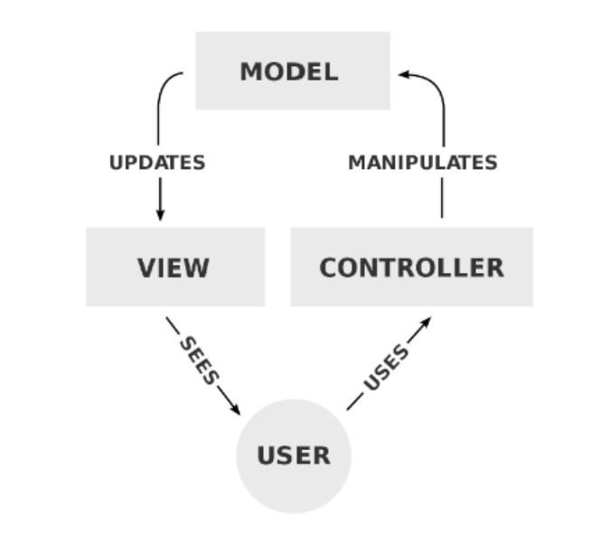
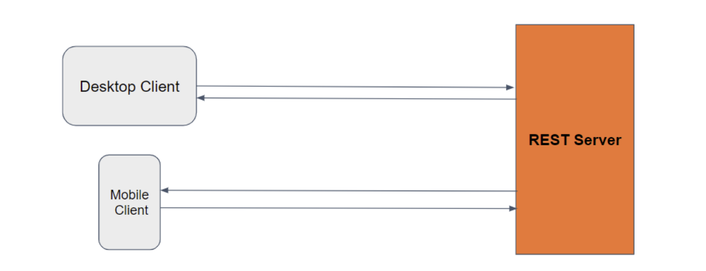
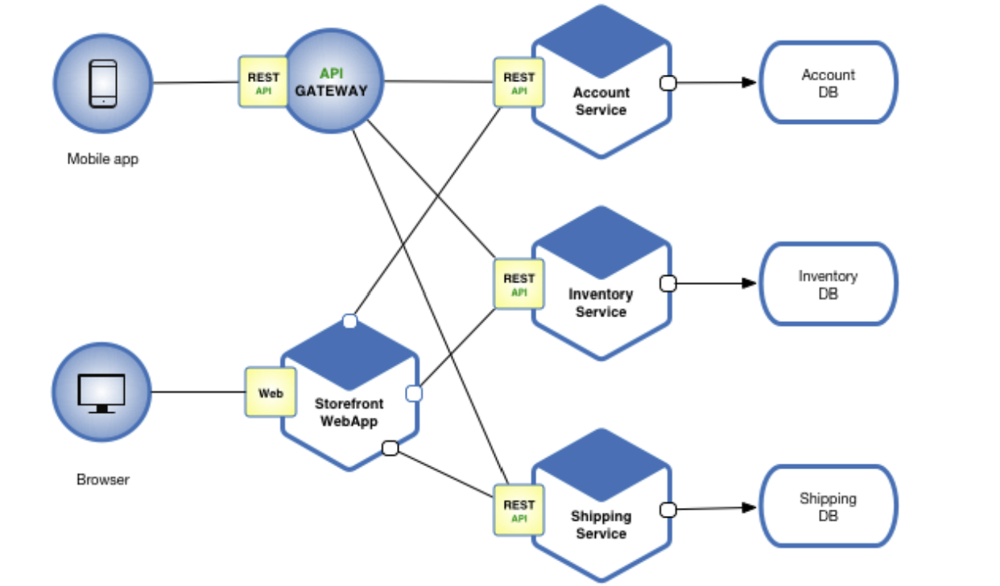

## MODEL VIEW CONTROLLER (MVC)
## Getting Started with Web Development
Large-scale web applications use architectures and design patterns to structure code
and maintain a clear separation of concerns.

### Different Architectures and Patterns
#### **`1. Model-View-Controller (MVC)`**: 
A widely-used design pattern that separates
data (Model), user interface (View), and control logic (Controller). Promotes a
clear separation of concerns, making the code more modular, maintainable,
and scalable.

- Model: Represents the data and business logic of the application. It
interacts with the database and performs data operations.
- View: Displays the user interface and presents the data to the user. It
receives input from the user and sends it to the Controller.
- Controller: Handles user requests, interacts with the Model and View,
and processes the application's logic. It updates the Model based on
user input and updates the View accordingly

#### **`2. REST API (Representational State Transfer)`**

- It provides cross-platform support.
- Popular architectural style for designing networked applications.
- Enables scalability, maintainability, and stateless web services.

#### **`3. Microservices Architecture`**

- Breaks down the application into smaller, independent services that
communicate with each other.
- Each microservice focuses on a specific business capability or
functionality.
- Services are loosely coupled, allowing independent development,
deployment, and scalability.
- Microservices enable scalability and maintainability, as changes in one
service do not impact the entire application.

## Understanding the Model-View-Controller (MVC) Pattern
The MVC pattern is a popular design pattern used in web development to organize
and manage code effectively. It helps separate the concerns of an application,
making it easier to maintain and extend.

### Components of the MVC Pattern
1. **Model:**
    - Represents the data and business logic of the application.
    - Responsible for retrieving, storing, and processing data.
    - Examples include handling CRUD operations, database interactions,
and data validation.
2. **View:**
    - The user interface of the application.
    - Displays data provided by the model to the user.
    - Receives user inputs and forwards them to the controller.
    - Examples include HTML templates, UI components, and user forms.
3. **Controller:**
    - Acts as a bridge between the model and the view.
    - Processes user inputs received from the view.
    - Updates the model based on user actions.
    - Examples include handling user actions, updating data, and
coordinating between the model and view.

### Benefits of the MVC Pattern
1. **`Organization and Maintainability:`** MVC separates concerns, making code
more organized and easier to maintain.
2. **`Code Reusability:`** With clear separation of concerns, components can be
reused in different contexts or scenarios.
3. **`Scalability:`** The separation of responsibilities allows for independent
development and scaling of each component.
4. **`Testability:`** Each component can be tested separately, facilitating unit testing
and improving overall code quality.
5. **`Collaboration:`** MVC promotes a modular architecture, enabling multiple
developers to work on different components concurrently.

### Real-World Examples of MVC Usage
- E-commerce websites: MVC helps manage product data, shopping cart
functionality, and user interfaces.
- Social media platforms: MVC handles user profiles, posts, comments, and
interactions.

