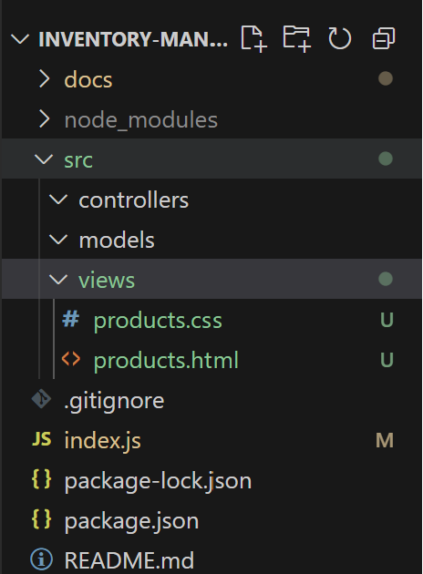

## MODEL VIEW CONTROLLER (MVC)

## Getting Started with Web Development

Large-scale web applications use architectures and design patterns to structure code
and maintain a clear separation of concerns.

### Different Architectures and Patterns

#### **`1. Model-View-Controller (MVC)`**:

A widely-used design pattern that separates
data (Model), user interface (View), and control logic (Controller). Promotes a
clear separation of concerns, making the code more modular, maintainable,
and scalable.


- Model: Represents the data and business logic of the application. It
  interacts with the database and performs data operations.
- View: Displays the user interface and presents the data to the user. It
  receives input from the user and sends it to the Controller.
- Controller: Handles user requests, interacts with the Model and View,
  and processes the application's logic. It updates the Model based on
  user input and updates the View accordingly

#### **`2. REST API (Representational State Transfer)`**


- It provides cross-platform support.
- Popular architectural style for designing networked applications.
- Enables scalability, maintainability, and stateless web services.

#### **`3. Microservices Architecture`**


- Breaks down the application into smaller, independent services that
  communicate with each other.
- Each microservice focuses on a specific business capability or
  functionality.
- Services are loosely coupled, allowing independent development,
  deployment, and scalability.
- Microservices enable scalability and maintainability, as changes in one
  service do not impact the entire application.

## Understanding the Model-View-Controller (MVC) Pattern

The MVC pattern is a popular design pattern used in web development to organize
and manage code effectively. It helps separate the concerns of an application,
making it easier to maintain and extend.


### Components of the MVC Pattern

1. **Model:** - Represents the data and business logic of the application. - Responsible for retrieving, storing, and processing data. - Examples include handling CRUD operations, database interactions,
   and data validation.
2. **View:**
   - The user interface of the application.
   - Displays data provided by the model to the user.
   - Receives user inputs and forwards them to the controller.
   - Examples include HTML templates, UI components, and user forms.
3. **Controller:** - Acts as a bridge between the model and the view. - Processes user inputs received from the view. - Updates the model based on user actions. - Examples include handling user actions, updating data, and
   coordinating between the model and view.

### Benefits of the MVC Pattern

1. **`Organization and Maintainability:`** MVC separates concerns, making code
   more organized and easier to maintain.
2. **`Code Reusability:`** With clear separation of concerns, components can be
   reused in different contexts or scenarios.
3. **`Scalability:`** The separation of responsibilities allows for independent
   development and scaling of each component.
4. **`Testability:`** Each component can be tested separately, facilitating unit testing
   and improving overall code quality.
5. **`Collaboration:`** MVC promotes a modular architecture, enabling multiple
   developers to work on different components concurrently.

### Real-World Examples of MVC Usage

- E-commerce websites: MVC helps manage product data, shopping cart
  functionality, and user interfaces.
- Social media platforms: MVC handles user profiles, posts, comments, and
  interactions.

## Project Set-Up

### 1. Initialize Node.js Project

```bash
npm init
```

This creates `package.json` for managing dependencies.

### 2. Create Directory Structure

Create the main source directory (src/) inside your project directory:

```bash
mkdir src
```

Inside src/, create three subdirectories for structured project organization:

1. 📁 models/ → Contains database models and schemas.
2. 🎨 views/ → Stores frontend templates (if applicable).
3. 🛠️ controllers/ → Manages business logic and request handling.

### 3. Install Express.js:

Express.js is required to set up a web server. Install it using:

```bash
npm install express.
```

### 4. Create index.js (Entry Point)

The index.js file serves as the main entry point for your application. Create it and add the following basic server setup:

```javascript
const express = require("express");
const server = express();
const PORT = 3100;

server.get("/", (req, res) => {
  res.send("Welcome to Inventory App");
});

server.listen(PORT, () => {
  console.log(`Server is running on http://localhost:${PORT}`);
});
```

### 5. Configure .gitignore

Create a `.gitignore file` and add `node_modules/` to exclude unnecessary files from Git tracking, keeping your repository clean.

### 6. Run Server

#### Way-1: Run the server manually:

```bash
node index.js
```

#### Way-2: Automatically restart server on changes:

Install nodemon globally:

```bash
npm install -g nodemon
```

- Installs nodemon system-wide.
- Not tied to any specific project.
- Doesn't appear in package.json.
- You can run nodemon from anywhere in the terminal.

OR

Install nodemon locally (--save-dev flag):

```bash
npm i -D nodemon (or npm install --save-dev nodemon)
```

- Installs nodemon only for the current project.
- Gets added under devDependencies in package.json; as only needed during development, not in production.
- To run it, you must use npx nodemon or configure it in package.json.

Update package.json → Add this inside the "scripts" section:

```json
"scripts": {
  "start": "nodemon index.js"
}
```

Run the server with:

```bash
npm start
```

## Creating View

The first step is to create a folder structure for our MVC project. We'll have separate
folders for our models, views, and controllers. Here are the steps to create a basic
MVC application folder structure:

1. Create a new folder for your project and name inventory-management-app. This will be
   the root directory of your project.
2. Inside the root directory, create a new file called index.js. This will be the
   entry point for your application and will contain the server code.
3. Inside the root directory, create a new folder called `src`. This will be the main
   source directory for your project.
4. Inside the src directory, create three new folders called `models`, `views`, and
   `controllers`. These will be the main components of your MVC architecture.
5. Inside the views directory, create a new file called `products.html`. This will be
   the products page for your web application.
6. Inside the views directory, create a new file called `products.css`. This will be
   the stylesheet for your web application.
   
7. In index.js, you will need to import and use the Express framework to handle
   HTTP requests and serve your HTML and CSS files. Here's a basic example
   of how to do this:

```javascript
import express from "express";
import path from "path";

const server = express();
server.use(express.static("src/views"));

server.get("/", (req, res) => {
  res.sendFile(path.join(path.resolve(), "src", "views", "products.html"));
});
server.listen(3100);
```

Here we were sending html file directly, next we will use controller as an
intermediate.
