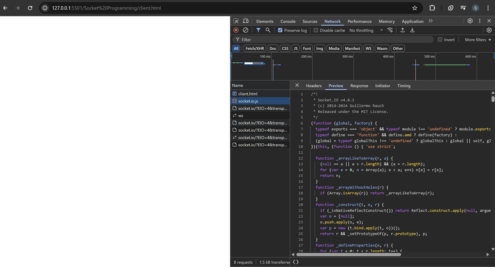
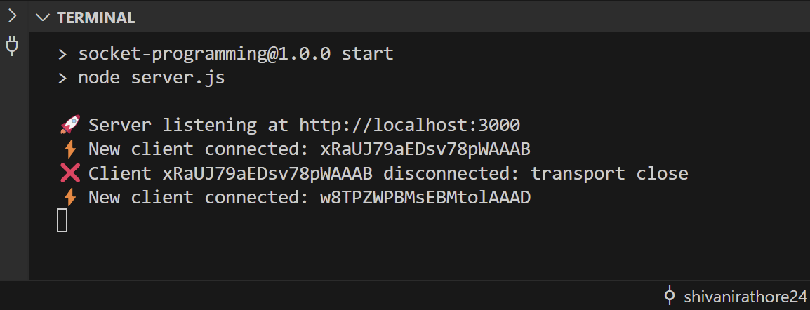

## SOCKET PROGRAMMING

## What is Socket Programming ?

Socket programming is a technique that enables communication between computers
over a network using sockets, which are endpoints for sending and receiving data.

### Needs of Socket Programming

- **Real-time Communication**: Socket programming is crucial for enabling real-time communication between devices and applications.
- **Client-Server Model**: It allows multiple clients to connect to a server, enabling efficient sharing of resources and data.
- **Cross-Platform**: It works across different platforms and programming languages, making it versatile for diverse applications.

### Socket Programming Working

1. **Socket Creation**: Sockets are created using programming libraries or APIs. They are identified by an IP address and port number.
2. **Server Setup**: In a client-server model, a server socket listens for incoming client connections on a specific port.
3. **Client Connection**: Clients create socket connections to the server's IP address and port.
4. **Data Exchange**: Once connected, data can be sent and received between clients and the server.
5. **Protocols**: Sockets often use protocols like TCP (reliable, connection-oriented) or UDP (fast, connectionless) for data transmission.
6. **Bi-Directional**: Sockets support bidirectional communication, allowing both sending and receiving data simultaneously.

### Applications of Socket Programming

1. **Chat Applications**: Sockets power real-time chat apps like WhatsApp, Slack, and IRC.
2. **Online Gaming**: Multiplayer online games use sockets for real-time player interaction.
3. **Web Applications**: WebSockets enable real-time updates in web applications, such as stock tickers or social media notifications.
4. **Video Streaming**: Sockets are used for live video and audio streaming services.
5. **IoT Devices**: Internet of Things (IoT) devices use sockets to send data to servers or other devices.
6. **Remote Control**: Remote desktops and remote control applications utilise sockets for data transmission.
7. **Network Services**: Network services like FTP, SMTP, and HTTP rely on socket programming for data transfer.

## Setup server using socket.io

Setting up a server using Socket.IO is a crucial step in building real-time applications
that require instant communication between clients and the server. Here's a brief
overview of how to set up a server using Socket.IO:

### Step 1: Setting Up the Backend Server
```javascript
import express from 'express';
import http from 'http';
import { Server } from 'socket.io';
import cors from 'cors';

// Create an Express app
const app = express();
app.use(cors());

// Create an HTTP server
const server = http.createServer(app);

// Initialize Socket.io
const io = new Server(server, {
  cors: {
    origin: '*',
    methods: ['GET', 'POST'],
  },
});

// Handle client connections
io.on('connection', (socket) => {
  console.log('Connection made.');

  // Handle events and interactions here

  // Handle disconnects
  socket.on('disconnect', () => {
    console.log('Connection disconnected.');
  });
});

// Start the server on port 3000
server.listen(3000, () => {
  console.log('Listening on port 3000');
});
```
Explanation:
- We import modules such as express, http, socket.io, and cors.
- We create an Express app and enable Cross-Origin Resource Sharing
(CORS) to allow client-side connections from any origin.
- An HTTP server is created using Express.
- We initialise Socket.io on the server, specifying CORS options to allow
connections from any origin.
- The io.on("connection", ...) block handles incoming socket connections. When
a client connects, it logs a message.
- You can implement event handling and interactions within this connection
block.
- We also handle client disconnects by listening to the "disconnect" event.

### Step 2: Setting Up the Client-Side HTML
```html
<!DOCTYPE html>
<html lang="en">
<head>
  <meta charset="UTF-8">
  <title>Socket.io Example</title>
</head>
<body>
  <!-- Include the Socket.io client library script -->
  <script src="http://localhost:3000/socket.io/socket.io.js"></script>
  
  <script>
    // Initialize a connection to the server
    const socket = io.connect('http://localhost:3000');
    
    // Implement client-side logic here
    // Handle events and interactions
    socket.on('message', (data) => {
      console.log('Received message from server:', data);
    });
    
    // Emit an event to the server
    // For example:
    document
      .querySelector('#sendMessageBtn')
      .addEventListener('click', () => {
        const message = document.querySelector('#messageInput').value;
        socket.emit('sendMessage', message);
      });
  </script>
</body>
</html>
```
Explanation:
- In the client-side HTML, we include the Socket.io client library script, which
connects to the server.
- We initialise a connection to the server by creating a socket object and
connecting it to the server URL (http://localhost:3000 in this example).
- Inside the `<script>` tag, you can implement client-side logic.
- We listen for the "message" event from the server using socket.on(). When a
message is received, we log it to the console.
- We also demonstrate how to emit an event to the server when clicking a
button with the ID sendMessageBtn. The emitted event is named
"sendMessage," and it sends a message from the client to the server.

### Step 3: Implementing Client-Side Logic
The client-side logic can be extended to handle various events and
interactions based on your application's requirements. You can listen for
server-sent events and emit events to the server to create real-time
functionality.

### Step 4: Running the Application
- Start the server by running node server.js in your terminal.
- Access the client page by opening the index.html file in a web browser.
- Interact with the client-side application by sending messages or triggering
events. You'll see logs in the server console when clients connect or
disconnect and when messages are received.


## Implementation: Establishing Connection
### 1. Created 'server.js' file
```javascript
import express from "express";
import http from "http";
import { Server } from "socket.io";
import cors from "cors";

// Create an Express application
const app = express();
app.use(cors()); // Enable CORS for all routes

// 1. Create an HTTP server wrapping the Express app
const server = http.createServer(app);

// 2️. Initialize a Socket.io server, allowing CORS from any origin
const io = new Server(server, {
  cors: {
    origin: "*",
    methods: ["GET", "POST"],
  },
});

// 3️. Listen for client connections
io.on("connection", (socket) => {
  console.log("⚡️ New client connected:", socket.id);

  // — You can register custom socket events here —
  // e.g. socket.on("chat message", msg => { /* … */ });

  // Handle client disconnect
  socket.on("disconnect", (reason) => {
    console.log(`❌ Client ${socket.id} disconnected:`, reason);
  });
});

// Start listening on port 3000
const PORT = 3000;
server.listen(PORT, () => {
  console.log(`🚀 Server listening at http://localhost:${PORT}`);
});
```
#### Explanation of Code: 
1. Module Imports
   ```javascript
   import express from "express";
   import http from "http";
   import { Server } from "socket.io";
   import cors from "cors";
   ```
   - express: Simplifies building HTTP servers and routing.
   - http: The core Node.js module to create an HTTP server.
   - socket.io: Enables real-time, bi-directional communication over WebSockets (and fallbacks).
   - cors: Middleware to allow or restrict cross-origin HTTP requests.
2. Express App & CORS
   ```javascript
   const app = express();
   app.use(cors());
   ```
   - Initializes Express.
   - Applies the CORS middleware so browsers on any origin can connect.
3. HTTP Server Creation
   ```javascript
   const server = http.createServer(app);
   ```
   - Wraps the Express app inside a standard Node HTTP server, which Socket.io will attach to.
4. Socket.io Initialization
   ```javascript
   const io = new Server(server, {
     cors: { origin: "*", methods: ["GET", "POST"] },
   });
   ```
   - Binds Socket.io to the HTTP server.
   - Configures CORS specifically for WebSocket (and polling) connections, allowing any origin.
5. Handling New Connections
   ```javascript
   io.on("connection", (socket) => {
     console.log("⚡️ New client connected:", socket.id);
     // … event handlers go here …
   });
   ```
   - `io.on("connection", callback)` fires when a client successfully opens a Socket.io connection.
   - The callback receives a `socket` object, which uniquely represents that client.
6. Registering Custom Events
   ```javascript
   // example placeholder
   socket.on("chat message", (msg) => {
     io.emit("chat message", msg);
   });
   ```
   - Inside the connection block you can listen for custom events from that client (e.g. "chat message") and respond or broadcast.
7. Handling Disconnections
   ```javascript
   socket.on("disconnect", (reason) => {
     console.log(`❌ Client ${socket.id} disconnected:`, reason);
   });
   ```
   - Listens for a client disconnect.
   - Logs the client’s socket ID and the reason (e.g. network loss, client closed).
8. Starting the Server
   ```javascript
    const PORT = 3000;
    server.listen(PORT, () => {
    console.log(`🚀 Server listening at http://localhost:${PORT}`);
    });
    ``` 
     - Tells the HTTP (and Socket.io) server to start on port 3000. - Once up, prints a confirmation message.

Express and Socket.io share one HTTP server to handle both REST and real-time, bi-directional WebSocket traffic with CORS enabled, using io.on("connection") to manage each client’s events—all on a single port for easy deployment.

### 2. Created 'client.html' file
```html
<!DOCTYPE html>
<html lang="en">
<head>
    <meta charset="UTF-8">
    <meta name="viewport" content="width=device-width, initial-scale=1.0">
    <title>Chat App</title>
</head>
<body>
    <!-- Load Socket.io client library -->
    <script src="http://localhost:3000/socket.io/socket.io.js"></script>
    <script>
        // Connect to Socket.io server
        const socket = io.connect('http://localhost:3000');
    </script>
</body>
</html>
```
#### Explaination of Code:
1. Load the Socket.io client library
    - `<script src="http://localhost:3000/socket.io/socket.io.js"></script>`
    - Fetches and runs the Socket.io code in your browser, creating the global `io` object.
2. Establish the socket connection
    - `const socket = io.connect('http://localhost:3000');`
    - Initiates an HTTP “handshake” request to `http://localhost:3000/socket.io/`.
    - On success, upgrades to a persistent WebSocket (or falls back to long polling).
    - The returned `socket` object represents the live, bi-directional channel.
3. Using the socket
    - Send data to the server: `socket.emit('eventName', data)`
    - Receive data from the server: `socket.on('eventName', callback)`




#### Why different IDs?
- Each connection is distinct.
    - Even if the same user reloads the page, closes & re-opens a tab, or you have multiple users, each “socket” gets a brand-new identifier.
- IDs are random strings.
    - Socket.io generates these for you (using a secure random generator) to keep every connection unambiguous.

#### How you use them:
1. Targeted messaging: You can do io.to(socket.id).emit(...) to send data back to exactly that one client.
2. Tracking connections: If you need to maintain user state (e.g., which room they’re in), you might map socket.id to your own user-oriented data structures.
#### What “transport close” means:
That disconnect reason simply means the underlying network transport (WebSocket or polling) was closed—e.g. the user navigated away, refreshed, or lost connectivity.

In short: different ID's = different live connections.