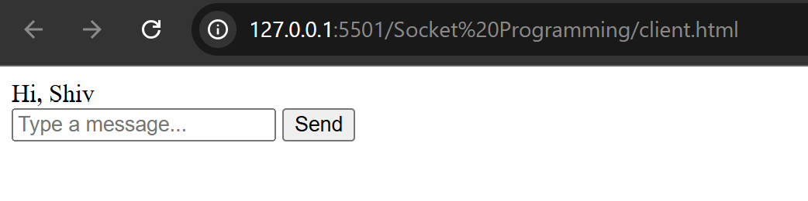
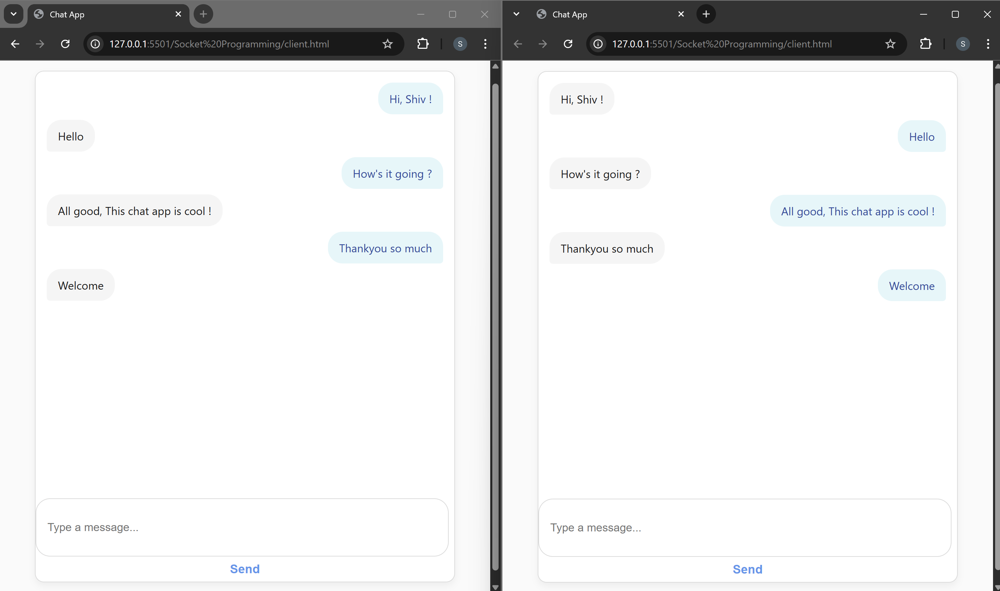
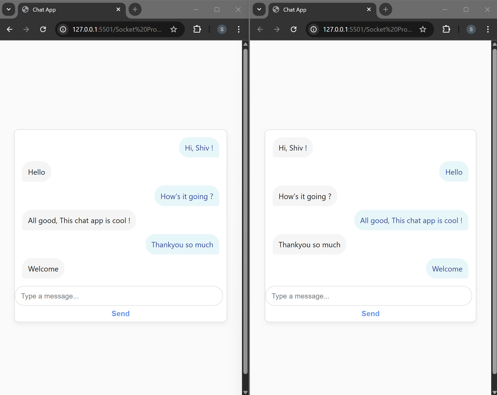
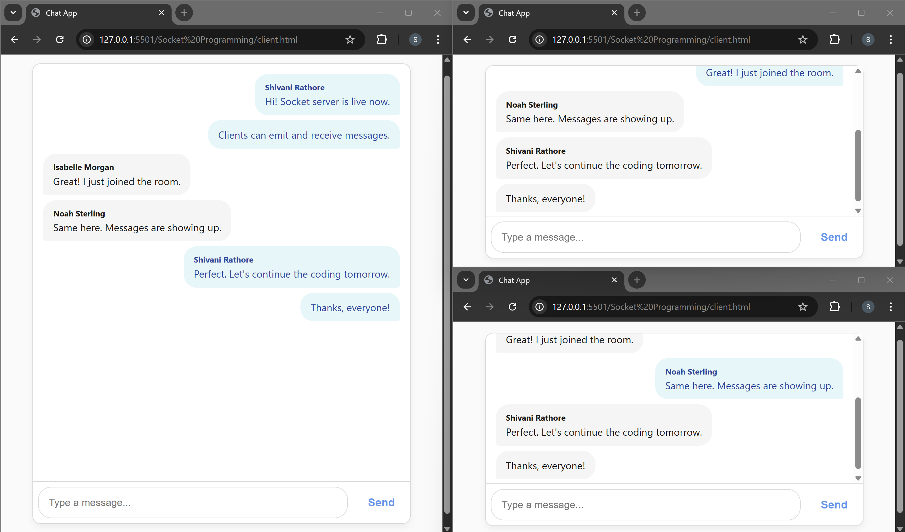
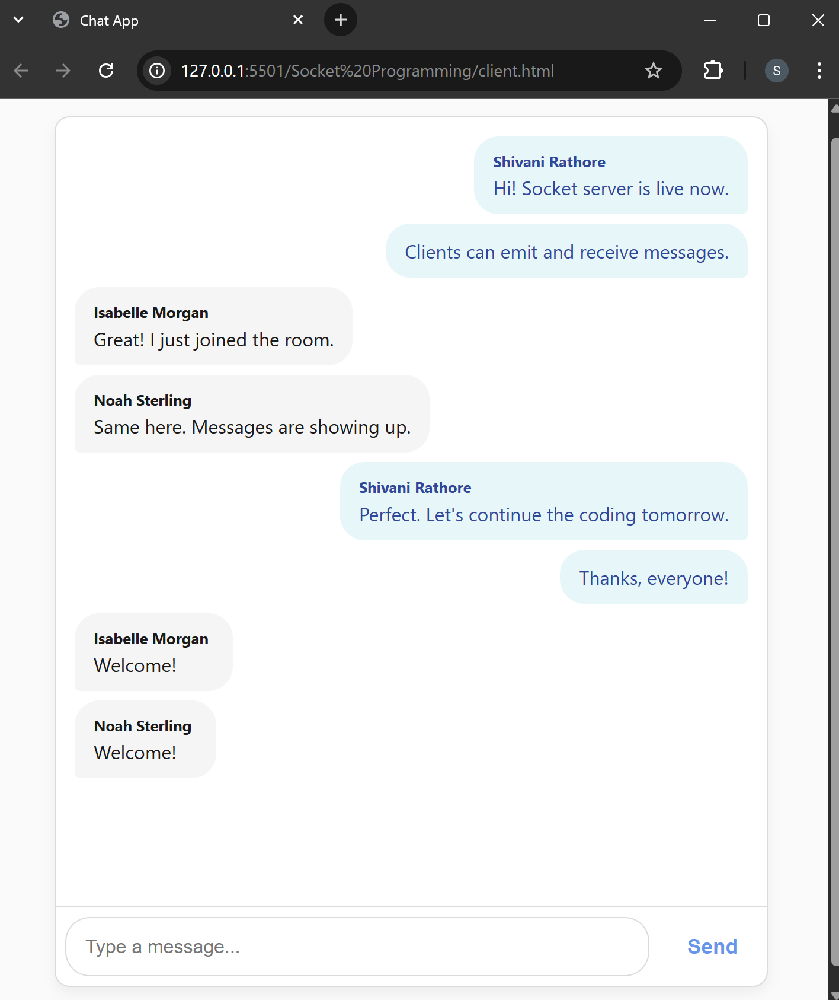
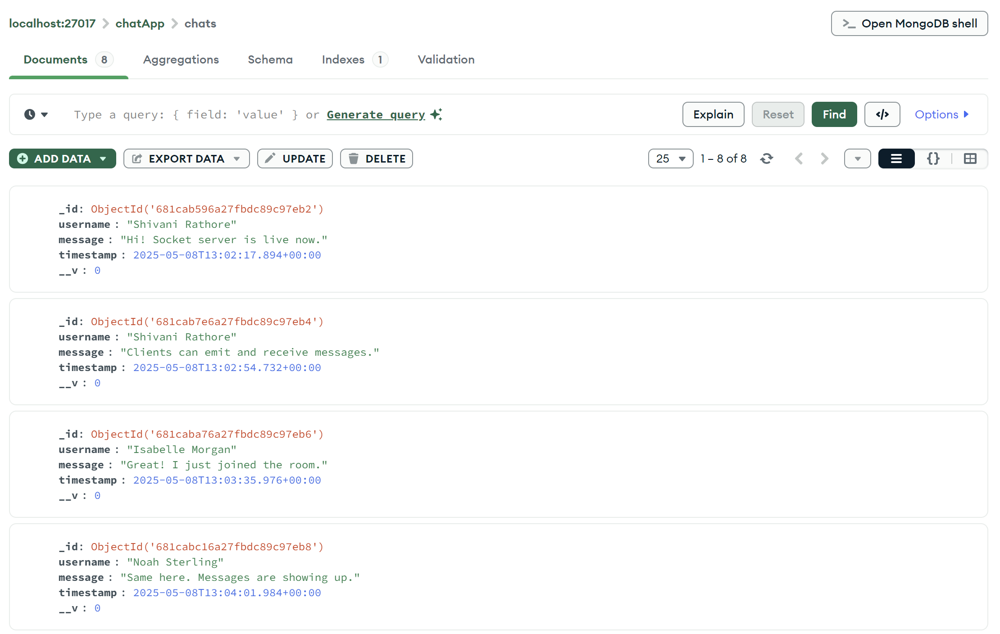
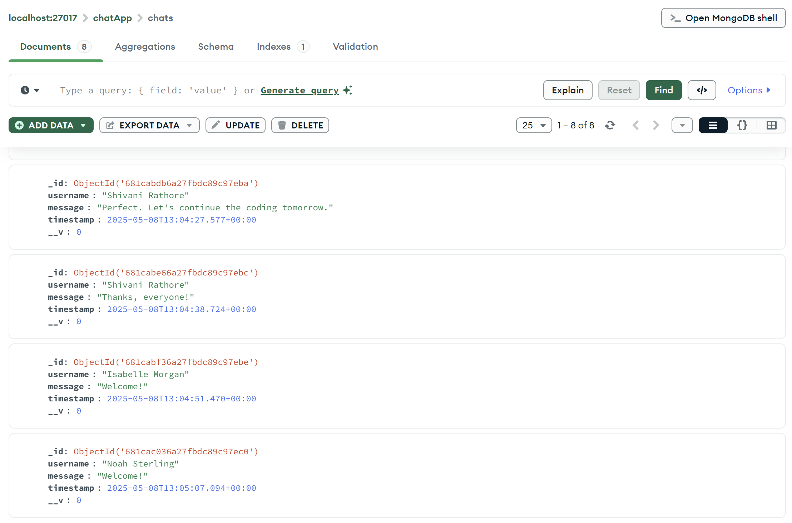
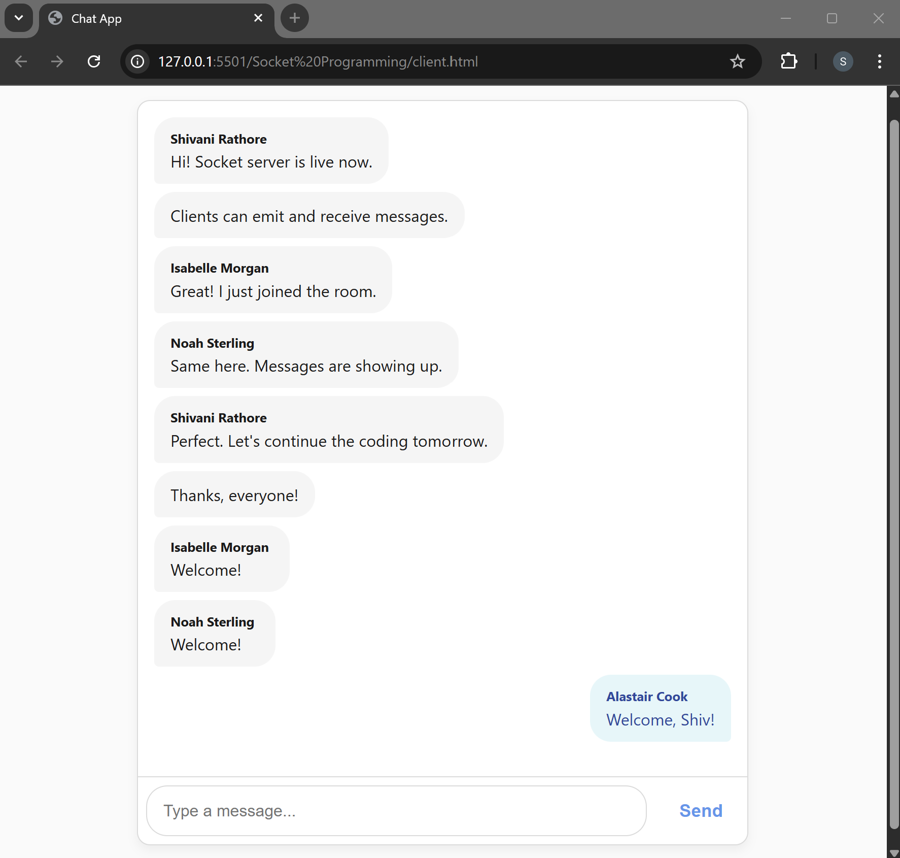
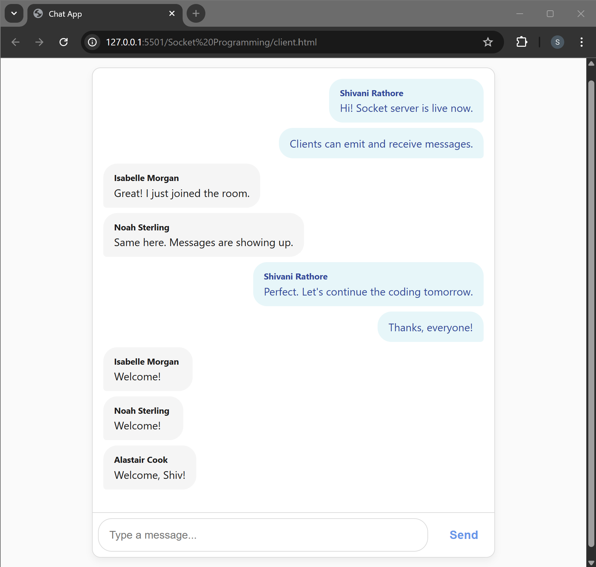

## SOCKET PROGRAMMING

## What is Socket Programming ?

Socket programming is a technique that enables communication between computers
over a network using sockets, which are endpoints for sending and receiving data.

### Needs of Socket Programming

- **Real-time Communication**: Socket programming is crucial for enabling real-time communication between devices and applications.
- **Client-Server Model**: It allows multiple clients to connect to a server, enabling efficient sharing of resources and data.
- **Cross-Platform**: It works across different platforms and programming languages, making it versatile for diverse applications.

### Socket Programming Working

1. **Socket Creation**: Sockets are created using programming libraries or APIs. They are identified by an IP address and port number.
2. **Server Setup**: In a client-server model, a server socket listens for incoming client connections on a specific port.
3. **Client Connection**: Clients create socket connections to the server's IP address and port.
4. **Data Exchange**: Once connected, data can be sent and received between clients and the server.
5. **Protocols**: Sockets often use protocols like TCP (reliable, connection-oriented) or UDP (fast, connectionless) for data transmission.
6. **Bi-Directional**: Sockets support bidirectional communication, allowing both sending and receiving data simultaneously.

### Applications of Socket Programming

1. **Chat Applications**: Sockets power real-time chat apps like WhatsApp, Slack, and IRC.
2. **Online Gaming**: Multiplayer online games use sockets for real-time player interaction.
3. **Web Applications**: WebSockets enable real-time updates in web applications, such as stock tickers or social media notifications.
4. **Video Streaming**: Sockets are used for live video and audio streaming services.
5. **IoT Devices**: Internet of Things (IoT) devices use sockets to send data to servers or other devices.
6. **Remote Control**: Remote desktops and remote control applications utilise sockets for data transmission.
7. **Network Services**: Network services like FTP, SMTP, and HTTP rely on socket programming for data transfer.

## Setup server using socket.io

Setting up a server using Socket.IO is a crucial step in building real-time applications
that require instant communication between clients and the server. Here's a brief
overview of how to set up a server using Socket.IO:

### Step 1: Setting Up the Backend Server

```javascript
import express from "express";
import http from "http";
import { Server } from "socket.io";
import cors from "cors";

// Create an Express app
const app = express();
app.use(cors());

// Create an HTTP server
const server = http.createServer(app);

// Initialize Socket.io
const io = new Server(server, {
  cors: {
    origin: "*",
    methods: ["GET", "POST"],
  },
});

// Handle client connections
io.on("connection", (socket) => {
  console.log("Connection made.");

  // Handle events and interactions here

  // Handle disconnects
  socket.on("disconnect", () => {
    console.log("Connection disconnected.");
  });
});

// Start the server on port 3000
server.listen(3000, () => {
  console.log("Listening on port 3000");
});
```

Explanation:

- We import modules such as express, http, socket.io, and cors.
- We create an Express app and enable Cross-Origin Resource Sharing
  (CORS) to allow client-side connections from any origin.
- An HTTP server is created using Express.
- We initialise Socket.io on the server, specifying CORS options to allow
  connections from any origin.
- The io.on("connection", ...) block handles incoming socket connections. When
  a client connects, it logs a message.
- You can implement event handling and interactions within this connection
  block.
- We also handle client disconnects by listening to the "disconnect" event.

### Step 2: Setting Up the Client-Side HTML

```html
<!DOCTYPE html>
<html lang="en">
  <head>
    <meta charset="UTF-8" />
    <title>Socket.io Example</title>
  </head>
  <body>
    <!-- Include the Socket.io client library script -->
    <script src="http://localhost:3000/socket.io/socket.io.js"></script>

    <script>
      // Initialize a connection to the server
      const socket = io.connect("http://localhost:3000");

      // Implement client-side logic here
      // Handle events and interactions
      socket.on("message", (data) => {
        console.log("Received message from server:", data);
      });

      // Emit an event to the server
      // For example:
      document
        .querySelector("#sendMessageBtn")
        .addEventListener("click", () => {
          const message = document.querySelector("#messageInput").value;
          socket.emit("sendMessage", message);
        });
    </script>
  </body>
</html>
```

Explanation:

- In the client-side HTML, we include the Socket.io client library script, which
  connects to the server.
- We initialise a connection to the server by creating a socket object and
  connecting it to the server URL (http://localhost:3000 in this example).
- Inside the `<script>` tag, you can implement client-side logic.
- We listen for the "message" event from the server using socket.on(). When a
  message is received, we log it to the console.
- We also demonstrate how to emit an event to the server when clicking a
  button with the ID sendMessageBtn. The emitted event is named
  "sendMessage," and it sends a message from the client to the server.

### Step 3: Implementing Client-Side Logic

The client-side logic can be extended to handle various events and
interactions based on your application's requirements. You can listen for
server-sent events and emit events to the server to create real-time
functionality.

### Step 4: Running the Application

- Start the server by running node server.js in your terminal.
- Access the client page by opening the index.html file in a web browser.
- Interact with the client-side application by sending messages or triggering
  events. You'll see logs in the server console when clients connect or
  disconnect and when messages are received.

## Implementation: Establishing Connection

### 1. Created 'server.js' file

```javascript
import express from "express";
import http from "http";
import { Server } from "socket.io";
import cors from "cors";

// Create an Express application
const app = express();
app.use(cors()); // Enable CORS for all routes

// 1. Create an HTTP server wrapping the Express app
const server = http.createServer(app);

// 2️. Initialize a Socket.io server, allowing CORS from any origin
const io = new Server(server, {
  cors: {
    origin: "*",
    methods: ["GET", "POST"],
  },
});

// 3️. Listen for client connections
io.on("connection", (socket) => {
  console.log("⚡️ New client connected:", socket.id);

  // — You can register custom socket events here —
  // e.g. socket.on("chat message", msg => { /* … */ });

  // Handle client disconnect
  socket.on("disconnect", (reason) => {
    console.log(`❌ Client ${socket.id} disconnected:`, reason);
  });
});

// Start listening on port 3000
const PORT = 3000;
server.listen(PORT, () => {
  console.log(`🚀 Server listening at http://localhost:${PORT}`);
});
```

#### Explanation of Code:

1. Module Imports
   ```javascript
   import express from "express";
   import http from "http";
   import { Server } from "socket.io";
   import cors from "cors";
   ```
   - express: Simplifies building HTTP servers and routing.
   - http: The core Node.js module to create an HTTP server.
   - socket.io: Enables real-time, bi-directional communication over WebSockets (and fallbacks).
   - cors: Middleware to allow or restrict cross-origin HTTP requests.
2. Express App & CORS
   ```javascript
   const app = express();
   app.use(cors());
   ```
   - Initializes Express.
   - Applies the CORS middleware so browsers on any origin can connect.
3. HTTP Server Creation
   ```javascript
   const server = http.createServer(app);
   ```
   - Wraps the Express app inside a standard Node HTTP server, which Socket.io will attach to.
4. Socket.io Initialization
   ```javascript
   const io = new Server(server, {
     cors: { origin: "*", methods: ["GET", "POST"] },
   });
   ```
   - Binds Socket.io to the HTTP server.
   - Configures CORS specifically for WebSocket (and polling) connections, allowing any origin.
5. Handling New Connections
   ```javascript
   io.on("connection", (socket) => {
     console.log("⚡️ New client connected:", socket.id);
     // … event handlers go here …
   });
   ```
   - `io.on("connection", callback)` fires when a client successfully opens a Socket.io connection.
   - The callback receives a `socket` object, which uniquely represents that client.
6. Registering Custom Events
   ```javascript
   // example placeholder
   socket.on("chat message", (msg) => {
     io.emit("chat message", msg);
   });
   ```
   - Inside the connection block you can listen for custom events from that client (e.g. "chat message") and respond or broadcast.
7. Handling Disconnections
   ```javascript
   socket.on("disconnect", (reason) => {
     console.log(`❌ Client ${socket.id} disconnected:`, reason);
   });
   ```
   - Listens for a client disconnect.
   - Logs the client’s socket ID and the reason (e.g. network loss, client closed).
8. Starting the Server
   ```javascript
   const PORT = 3000;
   server.listen(PORT, () => {
     console.log(`🚀 Server listening at http://localhost:${PORT}`);
   });
   ```
   - Tells the HTTP (and Socket.io) server to start on port 3000. - Once up, prints a confirmation message.

Express and Socket.io share one HTTP server to handle both REST and real-time, bi-directional WebSocket traffic with CORS enabled, using io.on("connection") to manage each client’s events—all on a single port for easy deployment.

### 2. Created 'client.html' file

```html
<!DOCTYPE html>
<html lang="en">
  <head>
    <meta charset="UTF-8" />
    <meta name="viewport" content="width=device-width, initial-scale=1.0" />
    <title>Chat App</title>
  </head>
  <body>
    <!-- Load Socket.io client library -->
    <script src="http://localhost:3000/socket.io/socket.io.js"></script>
    <script>
      // Connect to Socket.io server
      const socket = io.connect("http://localhost:3000");
    </script>
  </body>
</html>
```

#### Explaination of Code:

1. Load the Socket.io client library
   - `<script src="http://localhost:3000/socket.io/socket.io.js"></script>`
   - This script imports the Socket.io client library which allows your app to communicate with a Socket.io server.
2. Establish the socket connection
   - `const socket = io.connect('http://localhost:3000');`
   - This establishes a connection to the Socket.io server running on localhost:3000. This connection enables real-time, bidirectional communication between the client (your chat app) and the server.
3. Using the socket
   - Send data to the server: `socket.emit('eventName', data)`
   - Receive data from the server: `socket.on('eventName', callback)`


#### Why different IDs?

- Each connection is distinct.
  - Even if the same user reloads the page, closes & re-opens a tab, or you have multiple users, each “socket” gets a brand-new identifier.
- IDs are random strings.
  - Socket.io generates these for you (using a secure random generator) to keep every connection unambiguous.

#### How you use them:

1. Targeted messaging: You can do io.to(socket.id).emit(...) to send data back to exactly that one client.
2. Tracking connections: If you need to maintain user state (e.g., which room they’re in), you might map socket.id to your own user-oriented data structures.

#### What “transport close” means:

That disconnect reason simply means the underlying network transport (WebSocket or polling) was closed—e.g. the user navigated away, refreshed, or lost connectivity.

In short: different ID's = different live connections.

## Socket.io's Basic Events

Socket.IO provides several basic events that you can use to implement real-time
communication between clients and the server.

### 1. Listening for Events with on

In Socket.io, you can listen for events sent from the server or other clients using the
on method.

#### Server-side (server.js):

```javascript
io.on("connection", (socket) => {
  console.log("Connection made.");

  // Listen for a custom event named "chatMessage"
  socket.on("chatMessage", (message) => {
    console.log(`Received message from client: ${message}`);

    // Broadcast the message to all connected clients, including the sender
    io.emit("chatMessage", message);
  });

  // Additional event handlers can go here...
});
```

Code Explanation:

1. `io.on("connection", (socket) => {...})`:
   - This listens for new client connections to the server. When a client connects, a new `socket` object is created for that client.
   - The server logs "Connection made." every time a new client connects.
2. `socket.on("chatMessage", (message) => {...})`:
   - The server listens for the `"chatMessage"` event, which the client will send (for example, when the user types and sends a message).
   - `message`: This is the data (the chat message) the server receives from the client.
3. `console.log("Received message from client:", message)`:
   - This logs the received message to the server's console for debugging purposes.
4. `io.emit("chatMessage", message)`:
   - This broadcasts the received message to all connected clients, including the sender.
   - Every client that is connected will receive the message in real time.

SUMMARY:

- Client sends a message using `socket.emit("chatMessage", message)`.
- Server receives the message with `socket.on("chatMessage", (message) => {...})`.
- Server broadcasts the message to all clients using `io.emit("chatMessage", message)`.

This enables real-time communication between all connected clients in a chat application.

#### Client-side (index.html):

```javascript
// Listen for the "chatMessage" event from the server
socket.on("chatMessage", (message) => {
  console.log(`Received message from server: ${message}`);
});
```

Explaination:

1. `socket.on("chatMessage", (message) => {...})`: Listens for the `"chatMessage"` event from the server when it broadcasts a message using `io.emit`.
2. `message`: The actual chat message sent from the server.
3. `console.log(...)`:Logs the received message in the browser's console.

SUMMARY:

- On the server, we use `socket.on("chatMessage", ...)` to listen for the
  "chatMessage" event from clients.
- On the client, we use `socket.on("chatMessage", ...)` to listen for the same
  event from the server.

### 2. Sending Events with emit

Using the emit method, you can send custom events from the server to clients or
from clients to the server

#### Server-side (server.js):

```javascript
// Sending a custom event named "serverMessage" to a specific client
socket.emit("serverMessage", "Hello from the server!");

// Sending a custom event to all connected clients, including the sender
io.emit("serverMessage", "Hello everyone!");
```

- `socket.emit(...)`: Sends a message only to the connected client (private message).

- `io.emit(...)`: Broadcasts a message to all connected clients, including the sender.

This allows the server to send targeted or public messages depending on the use case.

#### Client-side (index.html):

```javascript
// Sending a custom event named "clientMessage" to the server
socket.emit("clientMessage", "Hello from the client!");
```

- `socket.emit(...)`: Sends a custom event ("clientMessage") from the client to the server with a message ("Hello from the client!").

This lets the client communicate with the server, triggering a server-side listener for "clientMessage"

SUMMARY:

- On the server, we use `socket.emit(...)` or `io.emit(...)` to send custom events to
  clients.
- On the client, we use `socket.emit(...)` to send custom events to the server.

### 3. Broadcasting Events

Socket.io allows you to broadcast events to all connected clients or to all clients except the sender.

#### Server-side (server.js):

```javascript
// Broadcast a custom event to all connected clients except the sender
socket.broadcast.emit("notification", "A new user has joined!");

// Broadcast a custom event to all clients in a specific room except the sender
socket.to("room1").emit("roomMessage", "A message for room 1!");

// Explanation:
// socket.broadcast.emit(...) sends an event to all clients except the sender.
// socket.to("room").emit(...) sends an event to all clients in a specific room except the sender.
```

1. `socket.broadcast.emit("event", data)`

   - Sends a message to every connected client except the one who sent it.
   - Useful for global notifications, like: `"A new user has joined!"` – others see it, but the new user doesn’t.

2. `socket.to("room").emit("event", data)`
   - Sends a message to all users in a specific room except the sender.
   - Useful in group chats or rooms, like: `"A message for room 1!"` – everyone in "room1" sees it, except the sender.

#### Client-side (index.html):

```javascript
// Listen for a "notification" event from the server
socket.on("notification", (message) => {
  // When the "notification" event is received, log the message to the console
  console.log(`Notification: ${message}`);
});
```

- `socket.on("notification", ...)`: Listens for an event named "notification" sent by the server.
- `(message) => { ... }`: A callback function that runs when the event is received.
- `console.log(...)`: Displays the received message in the browser's console.

Clients can listen for broadcasted events from the server using `socket.on(...)`.
In this example, clients will receive the "notification" event if a new user joins.

## Creating Chat UI

### Updated 'client.html' file

```html
<body>
  <div class="chat-container">
    <div id="message-list">
      <!-- List will contain messages -->
    </div>
    <input type="text" id="message-input" placeholder="Type a message..." />
    <button id="send-message">Send</button>
  </div>

  <!-- Load Socket.io client library -->
  <script src="http://localhost:3000/socket.io/socket.io.js"></script>
  <script>
    // Connect to Socket.io server
    const socket = io.connect("http://localhost:3000");

    //Get the elements
    const messageInput = document.getElementById("message-input");
    const messageList = document.getElementById("message-list");
    const sendButton = document.getElementById("send-message");

    sendButton.addEventListener("click", function () {
      // Read the message from input and send to server.
      const message = messageInput.value;
      if (message) {
        socket.emit("new_message", message);

        // Add message to the list.
        const messageElement = document.createElement("div");
        messageElement.innerText = message;
        messageList.appendChild(messageElement);

        messageInput.value = "";
      }
    });
  </script>
</body>
```

Handling User Input and Emitting Messages:

1. Get the DOM Elements:
   - `const messageInput = document.getElementById("message-input");`: Gets the input field where users type their messages.
   - `const messageList = document.getElementById("message-list");`: Gets the div where messages will be displayed.
   - `const sendButton = document.getElementById('send-message');`: Gets the Send button.
2. Event Listener for Send Button:
   - `sendButton.addEventListener("click", function(){...});`: When the Send button is clicked, the function inside the event listener is triggered.
3. Send Message:
   - `const message = messageInput.value;`: Grabs the text entered in the message input field.
   - `if (message) { ... }`: Checks if the message is not empty.
   - `socket.emit('new_message', message);`: Emits the 'new_message' event to the server with the message data. The server can then broadcast this to all connected clients.
4. Add Message to Chat:
   - `const messageElement = document.createElement("div");`: Creates a new div element for displaying the message.
   - `messageElement.innerText = message;`: Sets the content of the new div to the message that was typed.
   - `messageList.appendChild(messageElement);`: Appends the message div to the message list so it appears in the chat window.
5. Clear Input Field:
   - `messageInput.value = "";`: Clears the input field after sending the message.

This approach updates the chat UI with the sent message, emits the message to the server, and keeps the app interactive.



## Broadcasting Message

### 1. Updated 'server.js' file:

The added part of code is this section inside the io.on("connection") block:

```javascript
socket.on("new_message", (message) => {
  // broadcast this message to all the clients.
  socket.broadcast.emit("broadcast_message", message);
});
```

Explanation:

- `socket.on("new_message", ...)`: This listens for a custom event called "new_message" sent from a client.
- `socket.broadcast.emit("broadcast_message", message)`:
  - This sends the received message to all other connected clients except the sender.
  - It emits a new event called `"broadcast_message"` with the message payload.

Purpose:
This addition enables a **real-time messaging system** where any client's message is instantly delivered to all others, creating a basic chat-like broadcast functionality.

### 2. Updated 'client.html' file

The added part of HTML/JavaScript code is this block:

```javascript
// Listen for broadcast message, and add it to the list.
socket.on("broadcast_message", (message) => {
  const messageElement = document.createElement("div");
  messageElement.innerText = message;
  messageElement.classList.add("message", "received");
  messageList.appendChild(messageElement);
});
```

Explanation:

- `socket.on('broadcast_message', ...)`: This listens for `"broadcast_message"` events sent by the server (i.e. messages from other users).
- When such a message is received, it:
  - Creates a new `<div>` element.
  - Sets its text to the message content.
  - Adds CSS classes `message` and `received` (to differentiate styling from sent messages).
  - Appends it to the `message-list` div, displaying it in the chat window.

Purpose: This enables the client to **display messages sent by other users** in real time.

### Output Preview

<!-- [▶️ Watch Real-Time Chat Demo](/Socket%20Programming/videos/realtime_chatscreen.mp4) -->

[▶️ Download the Real-Time Chat Demo Video from Release](https://github.com/shivanirathore24/Learn-NodeJS/releases/download/v1.0/realtime_chatscreen.mp4)



Responsive Design Preview: Chat UI on Small Devices



## User Identification

### 1. Updated 'client.html' file

#### Before Changes (Old Code):

```html
<body>
  <div class="chat-container">
    <div id="message-list">
      <!-- List will contain messages -->
    </div>
    <input type="text" id="message-input" placeholder="Type a message..." />
    <button id="send-message">Send</button>
  </div>

  <!-- Load Socket.io client library -->
  <script src="http://localhost:3000/socket.io/socket.io.js"></script>
  <script>
    // Connect to Socket.io server
    const socket = io.connect("http://localhost:3000");

    //Get the elements
    const messageInput = document.getElementById("message-input");
    const messageList = document.getElementById("message-list");
    const sendButton = document.getElementById("send-message");

    sendButton.addEventListener("click", function () {
      // Read the message from input and send to server.
      const message = messageInput.value;
      if (message) {
        socket.emit("new_message", message);

        // Add message to the list.
        const messageElement = document.createElement("div");
        messageElement.innerText = message;
        messageElement.classList.add("message", "sent");
        messageList.appendChild(messageElement);

        messageInput.value = "";
        messageList.scrollTop = messageList.scrollHeight; // Auto-scroll to bottom
      }
    });

    // Listen for broadcast message, and add it to the list.
    socket.on("broadcast_message", (message) => {
      const messageElement = document.createElement("div");
      messageElement.innerText = message;
      messageElement.classList.add("message", "received");
      messageList.appendChild(messageElement);
    });
  </script>
</body>
```

#### After Changes (New Code):

```html
<body>
  <!-- Chat interface container -->
  <div class="chat-container">
    <!-- Container for displaying chat messages -->
    <div id="message-list"></div>

    <!-- Message input section -->
    <div class="message-input-container">
      <input type="text" id="message-input" placeholder="Type a message..." />
      <button id="send-message">Send</button>
    </div>
  </div>

  <!-- Load Socket.IO client script from local server -->
  <script src="http://localhost:3000/socket.io/socket.io.js"></script>

  <script>
    // Establish connection with Socket.IO server
    const socket = io.connect("http://localhost:3000");

    // Prompt user for a username (keeps prompting if blank)
    let username = prompt("Enter your name");
    while (!username) {
      username = prompt("Please enter your name:");
    }

    // Notify server of new user joining the chat
    socket.emit("join", username);

    // DOM elements for interaction
    const messageInput = document.getElementById("message-input");
    const messageList = document.getElementById("message-list");
    const sendButton = document.getElementById("send-message");

    // Track the last sender to avoid repeating usernames
    let previousSender = null;

    // Event listener for sending a message when "Send" button is clicked
    sendButton.addEventListener("click", function () {
      const message = messageInput.value.trim();

      if (message) {
        // Emit message to server
        socket.emit("new_message", message);

        // Display own message in chat
        const messageElement = document.createElement("div");
        const messageContent =
          previousSender !== username
            ? `<div class="user-name">${username}</div>${message}`
            : message;

        messageElement.innerHTML = messageContent;
        messageElement.classList.add("message", "sent");
        messageList.appendChild(messageElement);

        // Reset input and scroll to bottom
        messageInput.value = "";
        messageList.scrollTop = messageList.scrollHeight;
        previousSender = username;
      }
    });

    // Listen for incoming messages from other users
    socket.on("broadcast_message", (userMessage) => {
      const messageElement = document.createElement("div");
      messageElement.classList.add("message", "received");

      // Show username only if sender has changed
      const messageContent =
        previousSender !== userMessage.username
          ? `<div class="user-name">${userMessage.username}</div>${userMessage.message}`
          : userMessage.message;

      messageElement.innerHTML = messageContent;
      messageList.appendChild(messageElement);

      // Scroll to the latest message
      messageList.scrollTop = messageList.scrollHeight;
      previousSender = userMessage.username;
    });
  </script>
</body>
```

The updated code adds username prompts, shows names only when the sender changes, and improves layout for a cleaner, user-friendly chat experience.

1. Prompt for Username

   ```javascript
   let username = prompt("Enter your name");
   while (!username) {
     username = prompt("Please enter your name:");
   }
   socket.emit("join", username);
   ```

   🔍 What’s new:

   - Prompts the user to enter a name on page load.
   - Uses a while loop to ensure the user doesn't proceed with a blank name.
   - Sends this name to the server using socket.emit("join", username);

   💡 Purpose:

   - Associates a name with the user's socket connection on the server.
   - Enables the chat to identify the sender of each message.

2. Track Last Message Sender

   ```javascript
   let previousSender = null;
   ```

   🔍 What’s new:

   - A variable to remember who sent the previous message.

   💡 Purpose:

   - Helps determine whether to display the sender's name again.
   - Avoids repeating the same name for consecutive messages from the same user.
   - Keeps the chat interface clean and less cluttered.

3. Updated Message Sending Logic

   ```javascript
   sendButton.addEventListener("click", function () {
     const message = messageInput.value.trim();

     if (message) {
       socket.emit("new_message", message);

       const messageElement = document.createElement("div");
       const messageContent =
         previousSender !== username
           ? `<div class="user-name">${username}</div>${message}`
           : message;

       messageElement.innerHTML = messageContent;
       messageElement.classList.add("message", "sent");
       messageList.appendChild(messageElement);

       messageInput.value = "";
       messageList.scrollTop = messageList.scrollHeight;
       previousSender = username;
     }
   });
   ```

   🔍 What’s new:

   - Displays the username only if the last message wasn't from the same sender.
   - Uses innerHTML to insert a username div + message if needed.

   💡 Purpose:

   - Makes the chat feel more like modern apps (e.g., WhatsApp, Slack), where the sender's name is shown only when it changes.
   - Adds cleaner formatting.

4. Improved Message Receiving Logic

   ```javascript
   socket.on("broadcast_message", (userMessage) => {
     const messageElement = document.createElement("div");
     messageElement.classList.add("message", "received");

     const messageContent =
       previousSender !== userMessage.username
         ? `<div class="user-name">${userMessage.username}</div>${userMessage.message}`
         : userMessage.message;

     messageElement.innerHTML = messageContent;
     messageList.appendChild(messageElement);

     messageList.scrollTop = messageList.scrollHeight;
     previousSender = userMessage.username;
   });
   ```

   🔍 What’s new:

   - Listens for messages from others.
   - Same name-check logic to show/hide usernames.
   - Automatically scrolls to the newest message.

   💡 Purpose:

   - Keeps the interface clean while maintaining clarity about who is speaking.
   - Enhances the user experience.

5. HTML Structure Update:
   ```html
   <div class="message-input-container">
     <input type="text" id="message-input" placeholder="Type a message..." />
     <button id="send-message">Send</button>
   </div>
   ```
   - The input and send button are now grouped inside a container (message-input-container) for better layout control.
   - This wrapper allows easier styling and customization through CSS.

### 2. Updated 'server.js' file

#### Before Changes (Old Code):

```javascript
// Listen for client connections
io.on("connection", (socket) => {
  console.log("⚡️ New client connected:", socket.id);

  // — You can register custom socket events here —
  socket.on("new_message", (message) => {
    //broadcast this message to all the clients.
    socket.broadcast.emit("broadcast_message", message);
  });

  // Handle client disconnect
  socket.on("disconnect", (reason) => {
    console.log(`❌ Client ${socket.id} disconnected:`, reason);
  });
});
```

#### After Changes (New Code):

```javascript
// Listen for client connections
io.on("connection", (socket) => {
  console.log("⚡️ New client connected:", socket.id);

  socket.on("join", (data) => {
    socket.username = data;
  });

  socket.on("new_message", (message) => {
    let userMessage = {
      username: socket.username,
      message: message,
    };
    //broadcast this message to all the clients.
    socket.broadcast.emit("broadcast_message", userMessage);
  });

  // Handle client disconnect
  socket.on("disconnect", (reason) => {
    console.log(`❌ Client ${socket.id} disconnected:`, reason);
  });
});
```

The updated server code introduces username handling for each connected client.

1. New join Event Listener:

   ```javascript
   socket.on("join", (data) => {
     socket.username = data;
   });
   ```

   - **Purpose:** When a client connects, it sends a "join" event with the user's name.
   - **What it does:**Stores the username in the socket object (e.g., socket.username = "Alice"), allowing it to be used later when sending messages.

2. Modified new_message Handler:
   ```javascript
   socket.on("new_message", (message) => {
     let userMessage = {
       username: socket.username,
       message: message,
     };
     socket.broadcast.emit("broadcast_message", userMessage);
   });
   ```
   - **Before**: Only the raw message was broadcasted.
   - **Now**: A structured object containing both the username and message is broadcasted.
   - **Benefit**: This allows clients to identify and display who sent the message, enabling cleaner and more organized chats.

The updated code personalizes the chat experience by capturing the sender’s name and broadcasting both name and message to others, supporting user-specific message displays on the frontend.

### Output Preview

<!-- [▶️ Watch Real-Time Group Chat Demo](/Socket%20Programming/videos/realtime_chatgroup.mp4) -->

[▶️ Download the Real-Time Group Chat Demo Video from Release](https://github.com/shivanirathore24/Learn-NodeJS/releases/download/v2.0/realtime_chatgroup.mp4)



## Storing chats in MongoDB

Install Mongoose and set up your MongoDB connection using ES6 modules.

### 1. Created a separate module for database connection: 'config.js'

```javascript
import mongoose from "mongoose";

export const connect = async () => {
  try {
    await mongoose.connect("mongodb://127.0.0.1:27017/chatApp");
    console.log("DB is connected!");
  } catch (err) {
    console.error("DB connection error:", err.message);
  }
};
```

This code connects your app to a local MongoDB database named `chatApp` using Mongoose:

- `mongoose.connect(...)` tries to connect to MongoDB.
- If successful, it logs "DB is connected!".
- If it fails, it logs the error.

🔗 It ensures your app can store and retrieve chat messages from the database.

### 2. Define a Schema and Model: 'chat.schema.js'

Define a Mongoose schema and model for the data you want to save

```javascript
import mongoose from "mongoose";
const chatSchema = new mongoose.Schema({
  username: String,
  message: String,
  timestamp: Date,
});

export const chatModel = mongoose.model("Chat", chatSchema);
```

This code defines a **Mongoose schema and model** for storing chat messages in MongoDB:

- `chatSchema` defines the structure:
  - `username`: who sent the message
  - `message`: the message content
  - `timestamp`: when it was sent
- `chatModel` creates a model named **"Chat"** based on that schema, which allows you to interact with the `chats` collection in the database (e.g., save, find, update messages).

🧠 In short: It sets up how chat messages are saved and used in MongoDB.

### 3. Updated 'server.js'

```javascript
import express from "express";
import http from "http";
import { Server } from "socket.io";
import cors from "cors";
import { connect } from "./config.js";
import { chatModel } from "./chat.schema.js";

// Create an Express application
const app = express();
app.use(cors()); // Enable CORS for all routes

// 1. Create an HTTP server wrapping the Express app
const server = http.createServer(app);

// 2️. Initialize a Socket.io server, allowing CORS from any origin
const io = new Server(server, {
  cors: {
    origin: "*",
    methods: ["GET", "POST"],
  },
});

// 3️. Listen for client connections
io.on("connection", (socket) => {
  console.log("⚡️ New client connected:", socket.id);

  socket.on("join", (data) => {
    socket.username = data;
  });

  socket.on("new_message", (message) => {
    let userMessage = {
      username: socket.username,
      message: message,
    };

    const newChat = new chatModel({
      username: socket.username,
      message: message,
      timestamp: new Date(),
    });
    newChat.save();

    //broadcast this message to all the clients.
    socket.broadcast.emit("broadcast_message", userMessage);
  });

  // Handle client disconnect
  socket.on("disconnect", (reason) => {
    console.log(`❌ Client ${socket.id} disconnected:`, reason);
  });
});

// Start listening on port 3000
const PORT = 3000;
server.listen(PORT, () => {
  console.log(`🚀 Server listening at http://localhost:${PORT}`);
  connect();
});
```

Updated Part Explanation (with MongoDB Integration):

1. Import database utilities:

   ```javascript
   import { connect } from "./config.js";
   import { chatModel } from "./chat.schema.js";
   ```

   - `connect()` connects to MongoDB.
   - `chatModel` is the Mongoose model for saving chat messages.

2. Save message to MongoDB:

   ```javascript
   const newChat = new chatModel({
     username: socket.username,
     message: message,
     timestamp: new Date(),
   });
   newChat.save();
   ```

   When a new message is received, it’s saved to MongoDB with timestamp.

3. Connect to DB when server starts:
   ```javascript
   connect();
   ```
   Ensures DB is connected when the server begins.

🧠 In short:
This update saves chat messages to MongoDB and connects the server to the database when it starts.

### Output Preview

#### 💬 Group Chat Interface Preview



#### 🗃️ Chat Data Stored in MongoDB




## Loading previous messages

### 1. Updated 'server.js' file

```javascript
socket.on("join", (data) => {
  socket.username = data;
  // send old messages to the clients.
  chatModel
    .find()
    .sort({ timestamp: 1 })
    .limit(100)
    .then((messages) => {
      socket.emit("load_messages", messages);
    })
    .catch((err) => {
      console.log(err);
    });
});
```

ChatGPT said:
The `load_messages` feature is implemented to send old chat messages to a new user when they join the chat.

1. Finding Old Messages:

   - When a new user connects and emits the `"join"` event, the server queries the database to retrieve the last 100 messages, sorted by their timestamp in ascending order:
     ```javascript
     chatModel.find().sort({ timestamp: 1 }).limit(50);
     ```
   - This ensures that the user gets the latest 50 messages in chronological order.

2. Sending Messages to the Client:
   - After retrieving the messages, the server emits them to the client using `socket.emit("load_messages", messages)`. This sends the chat history to the client who just joined, allowing them to view previous messages.

SUMMARY:

- When a new user joins, they receive the last 50 messages from the database.
- This ensures the user can see previous messages before they start sending their own.

### 2. Updated 'client.html' file

```javascript
// Display messages on UI
socket.on("load_messages", (messages) => {
  messages.forEach((message) => {
    const messageElement = document.createElement("div");
    messageElement.classList.add("message");

    const isSentByMe = message.username === username;
    messageElement.classList.add(isSentByMe ? "sent" : "received");

    const messageContent =
      previousSender !== message.username
        ? `<div class="user-name">${message.username}</div>${message.message}`
        : message.message;

    messageElement.innerHTML = messageContent;
    messageList.appendChild(messageElement);
    previousSender = message.username; // Update previousSender as you process loaded messages
    messageList.scrollTop = messageList.scrollHeight; // Scroll to the latest loaded message
  });
});
```

The updated part of the code handles the loading of previous messages when a new user joins the chat.

1. Loading Old Messages:

- When a user joins, the server sends the last 100 messages via the "load_messages" event:

```javascript
socket.on("load_messages", (messages) => {
  messages.forEach((message) => {
    // Processing each message
  });
});
```

- **Messages** are displayed on the screen by creating a new `div` for each message.
- If the message is sent by the current user, it is styled as `"sent"`, otherwise as `"received"`.

2. Displaying Messages:
   - Each message is checked if the sender is different from the previous message's sender to display the username.
   - After displaying the messages, it scrolls to the most recent message, ensuring the chat remains at the bottom

SUMMARY:

- On `"load_messages"`, it processes and displays the chat history.
- It maintains the sender's username and dynamically updates the message display, improving the user experience.

### Output Preview

  <!-- [▶️ Watch "Real-Time Group Chat with Previous Message Loading Demo" Video](/Socket%20Programming/videos/loadPreviousMessage_newUser.mp4) -->

[▶️ Download the "Real-Time Group Chat with Loading Previous Message" Demo Video from Release (New User)](https://github.com/shivanirathore24/Learn-NodeJS/releases/download/v3.0/loadPreviousMessage_newUser.mp4)

  

  <!-- [▶️ Watch "Real-Time Group Chat with Previous Message Loading Demo" Video](/Socket%20Programming/videos/loadPreviousMessage_existingUser.mp4) -->

[▶️ Download the "Real-Time Group Chat with Loading Previous Message" Demo Video from Release (Existing User)](https://github.com/shivanirathore24/Learn-NodeJS/releases/download/v3.0/loadPreviousMessage_existingUser.mp4)

  
