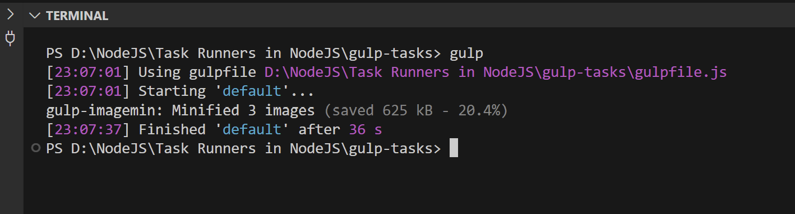
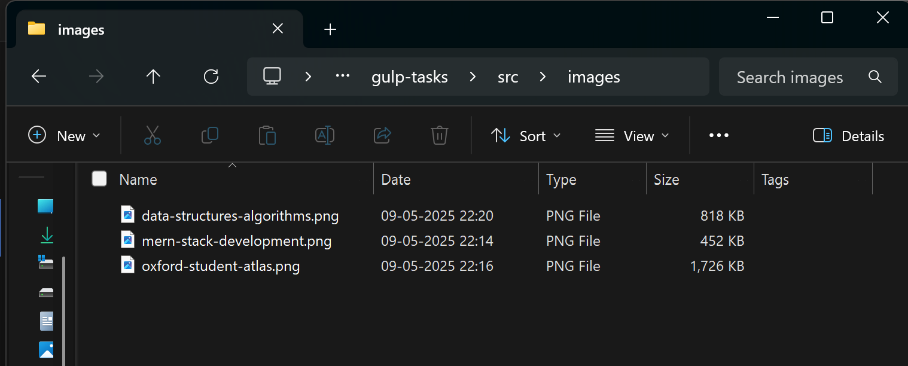
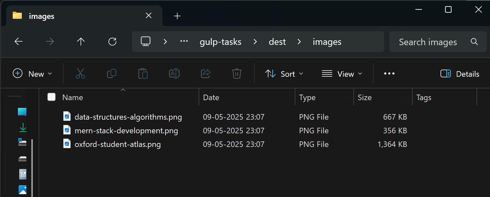

## TASK-RUNNERS IN NODEJS

## TaskRunner

- A TaskRunner is a software component or tool designed to manage and execute
  tasks or jobs in a systematic and organized manner.
- It plays a crucial role in automating and streamlining various processes, making it an
  essential part of many applications and systems.

### Need of TaskRunner

1. **Task Management**: Organizes and executes tasks systematically.
2. **Automation**: Reduces manual effort by automating repetitive tasks.
3. **Parallel Processing**: Enhances efficiency by executing tasks in parallel.
4. **Dependency Resolution**: Ensures tasks run when prerequisites are met.
5. **Monitoring and Logging**: Tracks task progress and logs status.
6. **Scalability**: Handles tasks across multiple servers for scalability.

### How it Works:

1. **Task Definition**: Tasks are defined with attributes like name, code, and
   dependencies.
2. **Task Queue**: Tasks are added to a queue for execution.
3. **Scheduling**: Tasks are scheduled based on dependencies and priority.
4. **Execution**: Tasks are executed, and results are monitored.
5. **Logging**: Task execution details and errors are logged.
6. **Notification**: Alerts can be sent upon completion or specific events.
7. **Scaling**: Distributes tasks across multiple servers as needed.

### Applications:

1. **Batch Processing**: Used for processing large volumes of data, such as data ETL (Extract, Transform, Load) jobs and image processing.
2. **Workflow Automation**: TaskRunners automate workflows in various domains, including finance, healthcare, and manufacturing, to improve efficiency.
3. **Continuous Integration/Continuous Deployment (CI/CD)**: They are integral to CI/CD pipelines, running tests, building and deploying code automatically.
4. **Server Maintenance**: TaskRunners help manage server maintenance tasks like backups, software updates, and security scans.
5. **Job Schedulers**: In operating systems, they serve as job schedulers to manage system-level tasks and user-defined scripts.
6. **Data Pipelines**: TaskRunners are used in creating and managing data pipelines for data analysis and reporting.
7. **IoT Device Management**: TaskRunners can manage and update software on IoT devices.
8. **Content Publishing**: For blogs and websites, they can automate content publishing and updates.
9. **Game Servers**: In online gaming, TaskRunners can manage game server instances and matchmakings.

## Task-Runner: Grunt

Grunt is a popular JavaScript task runner that automates repetitive tasks in web development.

### Installation:

To install Grunt, follow these steps:

- Install Node.js if not already installed. Grunt runs on Node.js.
- Install Grunt's command-line interface (CLI) globally using npm (Node Package Manager) with the following command:

  ```sh
  npm install -g grunt-cli
  ```

### Gruntfile Setup:

The Gruntfile is a configuration file used to define and configure tasks in Grunt.

#### Steps:

1. Create a Grunt Project Directory:
   - Start by creating a new directory for your Grunt project.
   - Open your command line or terminal and navigate to this directory.
2. Initialize a Node.js Project:
   - Run the following command to create a package.json file, which stores project metadata and dependencies:
     ```sh
     npm init
     ```
3. Install Grunt Locally:
   - Install Grunt as a project dependency in the project directory using npm. This
     allows you to manage Grunt versions specific to your project:
     ```sh
     npm install grunt --save-dev
     ```
4. Create a Gruntfile:
   - Create a JavaScript file named "Gruntfile.js" in your project directory. This is
     where you define your Grunt tasks and configuration.

## Task Configuration in Gruntfile

Inside the Gruntfile, you'll configure and define tasks. A basic Gruntfile structure looks like this:

```javascript
module.exports = function (grunt) {
  grunt.initConfig({
    // Define tasks and configurations here
  });

  // Load Grunt plugins and tasks
  grunt.loadNpmTasks("plugin-name");

  grunt.registerTask("custom-task", ["task1", "task2"]);
};
```

1.  Load Grunt Plugins: - To use specific Grunt plugins, you need to load them using
    `grunt.loadNpmTasks('plugin-name')` in the Gruntfile.
2.  Task Registration:
    - You can register custom tasks using `grunt.registerTask()` to define the order in which tasks are executed.
3.  Run Grunt:
    - To execute Grunt tasks defined in the Gruntfile, simply run grunt in your project directory:
      ```sh
      grunt
      ```

## Grunt Task-1: JavaScript Minification

### 1. Install Required Grunt Plugin

- Install Grunt CLI globally to access the grunt command from anywhere:

  ```sh
  npm install -g grunt-cli
  ```

- Then, install **Grunt and the Uglify plugin locally** in your project:

  ```sh
  npm install --save-dev grunt grunt-contrib-uglify
  ```

This ensures both Grunt and the Uglify plugin are available for your project’s build tasks.

### 2. Set Up Project Directory Structure

Create the following folder structure:

```
your-project/
├── src/
│   └── js/
│       └── input1.js   ← Write your JavaScript code here
├── dest/
├── Gruntfile.js
└── package.json
```

Example content of input1.js:

```javascript
function greet(name) {
  console.log("Hello, " + name + "!");
}
greet("Shivani");
```

### 3. Configure and Register Tasks in Gruntfile.js

```javascript
module.exports = function (grunt) {
  // Configure the tasks.
  grunt.initConfig({
    //Specify tasks.
    uglify: {
      target: {
        files: {
          // "dest/js/main.min.js": ["src/js/input1.js", "src/js/input2.js"]
          "dest/js/main.min.js": ["src/js/*.js"],
        },
      },
    },
  });

  // Load libraries.
  grunt.loadNpmTasks("grunt-contrib-uglify");

  // Setting up Tasks.
  grunt.registerTask("default", ["uglify"]);
};
```

Explaination:

1. Configuring Grunt Tasks (`grunt.initConfig`)

   - `grunt.initConfig` is used to configure the tasks for Grunt.
   - The `uglify` task is configured here to minify all `.js` files in the `src/js/` folder.
     - Destination: `"dest/js/main.min.js"` specifies where the minified file will be saved.
     - Source: `"src/js/*.js"` targets all JavaScript files in the `src/js/` folder for minification.
     - The comment `// "dest/js/main.min.js": ["src/js/input1.js", "src/js/input2.js"]` is an example showing how you can specify individual files if needed

2. Loading Grunt Plugin (`grunt.loadNpmTasks`)
   - `grunt.loadNpmTasks` loads the required Grunt plugin (`grunt-contrib-uglify`), which provides the uglify task for JavaScript minification.
3. Registering the Default Task (grunt.registerTask)

   - `grunt.registerTask` registers the default task. Here, it tells Grunt to run the `uglify` task when you execute `grunt` without specifying a task name.

   The configuration minifies all .js files in the src/js/ folder and outputs the result as main.min.js in the dest/js/ folder.

### 4. Run Grunt Task

Run Grunt from the project root to execute the minification tasks:

```sh
grunt
```


This will create a minified version of `input1.js` at `dest/js/main.min.js.`

```
project-root/
├── src/
│   └── js/
│       └── input1.js
├── dest/
│   └── js/
│       └── main.min.js  ← (generated after running Grunt)
├── Gruntfile.js
├── package.json
```

#### NOTE:

When you run the CSS minification task, Grunt will reduce the file size. For example:

```sh
Running "cssmin:target" (cssmin) task
>> 1 file created. 658 B → 454 B
```

- Before minification: The file size was 658 B.
- After minification: The file size was reduced to 454 B, indicating successful minification by removing unnecessary characters like spaces, comments, and line breaks.

## Grunt Task-2: Minify CSS

### 1. Install the CSSMin plugin

```sh
npm install grunt-contrib-cssmin --save-dev
```

### 2. Prepare the source file

- Create a folder structure like: src/css/input1.css
- Add some CSS code inside input1.css

### 3. Update Gruntfile.js to include CSS minification

```javascript
module.exports = function (grunt) {
  // Task configuration
  grunt.initConfig({
    // Minify JS files
    uglify: {
      target: {
        files: {
          "dest/js/main.min.js": ["src/js/*.js"],
        },
      },
    },

    // Minify CSS files
    cssmin: {
      target: {
        files: [
          {
            expand: true,
            cwd: "src/css",
            src: ["*css", "!*.min.css"],
            dest: "dest/css",
            ext: ".min.css",
          },
        ],
      },
    },
  });

  // Load plugins
  grunt.loadNpmTasks("grunt-contrib-uglify");
  grunt.loadNpmTasks("grunt-contrib-cssmin");

  // Default tasks
  grunt.registerTask("default", ["uglify", "cssmin"]);
};
```

Explaination:

1. Added cssmin task in grunt.initConfig
   - Purpose: This task will minify all `.css` files in `src/css/` and output them as .min.css into `dest/css/`.
     - `expand: true:` Enables dynamic file mapping.
     - `cwd:` Sets the source folder (Current Working Directory).
     - `src:` Selects all `.css` files, excluding already minified ones.
     - `dest:` Output destination folder.
     - `ext:` Adds `.min.css` extension to the output.
2. Loaded the CSSMin plugin
   - Loads the `grunt-contrib-cssmin` plugin so Grunt can use the `cssmin` task.
3. Updated the default task
   - Runs both `uglify` (for JS) and `cssmin` (for CSS) when you execute `grunt` in the terminal.

### 4. Run Grunt Task

Run Grunt from the project root to execute the minification tasks:

```sh
grunt
```


This will generate a minified version of `input1.css` and place it at `dest/css/input1.min.css`.

```
project-root/
├── src/
│   ├── js/
│   │   └── input1.js
│   └── css/
│       └── input1.css
├── dest/
│   ├── js/
│   │   └── main.min.js       ← (generated after JS minification)
│   └── css/
│       └── input1.min.css    ← (generated after CSS minification)
├── Gruntfile.js
├── package.json
```

#### NOTE:

When you run the CSS minification task, Grunt will reduce the file size.

```sh
Running "cssmin:target" (cssmin) task
>> 1 file created. 658 B → 454 B
```

- Before minification: The file size is 658 B.
- After minification: The file size is reduced to 454 B, indicating successful minification.

### ⚡ Major Update

Move all Grunt-related code into a newly created `grunt-tasks` folder, except for the `.gitignore` and `README.md` files.
Additionally, the update includes adding `grunt-tasks/node_modules/` to the `.gitignore file`, ensuring that the `node_modules` directory within the `grunt-tasks` folder is also ignore

## Task-Runner: Gulp

Gulp is a JavaScript task runner that automates repetitive tasks in web development.

### Installation:

- To install Gulp, follow these steps:
  - Install Node.js if not already installed. Gulp runs on Node.js.
  - Install Gulp's command-line interface (CLI) globally using npm (Node Package Manager) with the following command:
    ```sh
    npm install --global gulp-cli
    ```
  - Verify the installation by checking the Gulp version:
    ```sh
    gulp --version
    ```

### Gulpfile Setup:

The Gulpfile is a configuration file used to define and configure tasks in Gulp.

#### Steps:

1. Create a Gulp Project Directory:
   - Start by creating a new directory for your Gulp project.
   - Open your command line or terminal and navigate to this directory.
2. Initialize a Node.js Project:
   - Run the following command to create a package.json file, which stores project metadata and dependencies:
     ```sh
     npm init
     ```
3. Install Gulp Locally:
   - Install Gulp as a project dependency in the project directory using npm. This allows you to manage Gulp versions specific to your project:
     ```sh
     npm install gulp --save-dev
     ```
4. Create a Gulpfile: - Create a JavaScript file named "gulpfile.js" in your project directory. This is
   where you define your Gulp tasks and configuration.

5. Task Configuration in Gulpfile:

   Inside the Gulpfile, you'll configure and define tasks. A basic Gulpfile structure
   looks like this:

   ```javascript
   import gulp from "gulp";
   import pluginName from "gulp-plugin-name";

   gulp.task("task-name", function () {
     return gulp
       .src("source-files")
       .pipe(pluginName(/* plugin options */))
       .pipe(gulp.dest("destination"));
   });
   ```

   - Load Gulp Plugins:
     - To use specific Gulp plugins, you need to load them using
       `'gulp-plugin-name'` in the Gulpfile
   - Task Execution:
     - Gulp tasks are executed using the `gulp.task()` and `gulp.src()` functions. The
       task definition includes source files, plugins, and destination paths.

6. Run Gulp:
   - To execute Gulp tasks defined in the Gulpfile, simply run gulp in your project
     directory:
     ```sh
     gulp
     ```

## Image Optimization using Gulp

### 1. Setting up Gulp for Image Optimization:

- First, set up Gulp and create a Gulpfile (as discussed in a previous response).
- Image Optimization Plugin: You'll need an image optimization plugin for Gulp.
  Popular choices include `gulp-imagemin` and `gulp-image-optimization`. Install it
  as a project dependency.

  ```sh
  npm install --save-dev gulp-imagemin
  ```

### 2. Create Folder Structure for Images

- Inside your project directory:

  - Create a `src/images` folder and place 3 sample images in it.
  - Create a corresponding `dest/images` folder where the optimized images will be saved.

  ```
  project/
  ├── src/
  │   └── images/
  │       ├── data-structures-algorithms.png
  │       ├── mern-stack-development.png
  │       └── oxford-student-atlas.ong
  ├── dest/
  │   └── images/
  ├── gulpfile.js
  ├── package.json
  ├── package-lock.json
  └── node_modules/
  ```

### 3. 'gulpfile.js': Define a Gulp Task

In Gulpfile, define a task for image optimization.

```javascript
import gulp from "gulp";
import imagemin from "gulp-imagemin";

gulp.task("default", () => {
  //Define Task
  return gulp
    .src("src/images/*", { encoding: false })
    .pipe(imagemin())
    .pipe(gulp.dest("dest/images/"));
});
```

Explaination:

1. `import gulp from "gulp";`
   - Imports the core Gulp module used for automating tasks.
2. `import imagemin from "gulp-imagemin";`
   - Imports the image optimization plugin which compresses images (JPEG, PNG, etc.) without losing quality.
3. `gulp.task("default", () => { ... });`
   - Defines the default Gulp task. This task will run when you execute just gulp in the terminal.
4. `.src("src/images/*")`
   - Selects all image files in the `src/images` directory as input.
   - { encoding: false } ensures that the images are treated as binary files, not text files. This is important for images to avoid potential issues with encoding during the task.
5. `.pipe(imagemin())`
   - Passes the selected images through the `imagemin` plugin to optimize/compress them.
6. `.pipe(gulp.dest("dest/images/"));`
   - Outputs the optimized images into the `dest/images` directory.

#### What This Task Does:

It reads all images from `src/images/`, optimizes them using `gulp-imagemin`, and saves the optimized versions in `dest/images/`.

### 4. Run Gulp to Optimize Image

Run the default Gulp task from your project directory using the following command:

```sh
gulp
```



This will automatically compress all images from the `src/images/` folder and save the optimized versions to the `dest/images/` folder.

```
project/
├── dest/
│   └── images/
│       ├── data-structures-algorithms.png  (optimized)
│       ├── mern-stack-development.png     (optimized)
│       └── oxford-student-atlas.png       (optimized)
├── gulpfile.js
├── node_modules/
├── package-lock.json
├── package.json
└── src/
    └── images/
        ├── data-structures-algorithms.png  (original)
        ├── mern-stack-development.png     (original)
        └── oxford-student-atlas.png       (original)
```

#### Image Size Comparison: Before and After Optimization





## Summarising it

Let’s summarise what we have learned in this module:

- We discussed TaskRunners and their importance, needs, and applications.
- We explored the Grunt task runner, including its basic setup and operation.
- We also examined another significant TaskRunner, Gulp, its functionality, and
  use cases.
- Furthermore, we implemented image optimization using gulp-imagemin.

### Some Additional Resources:

[Grunt Plugins](https://gruntjs.com/plugins)

[Gulp Plugins](https://gulpjs.com/plugins/)
